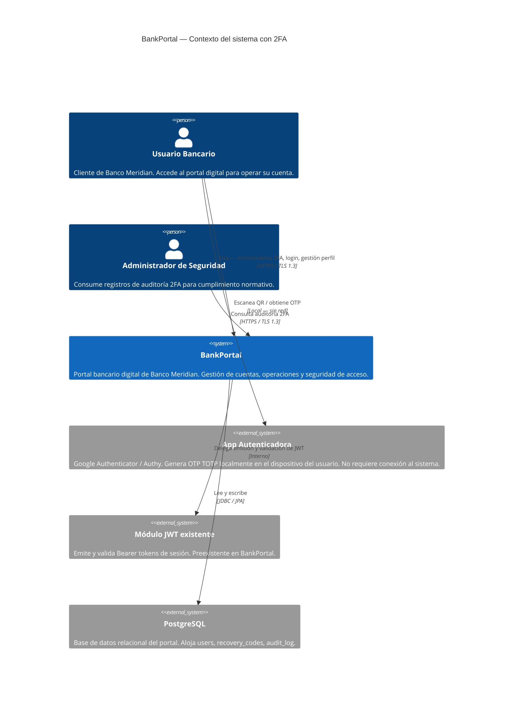
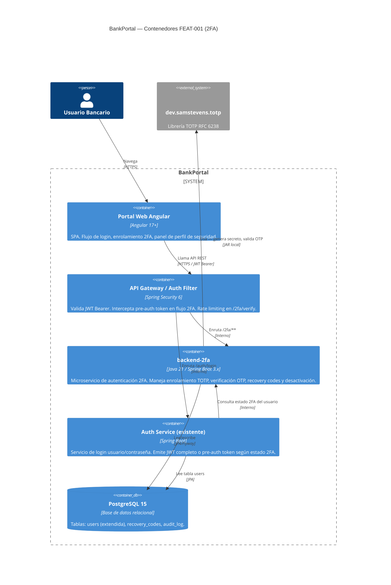

# HLD — Autenticación de Doble Factor (2FA / TOTP)

## Metadata

| Campo           | Valor                                                    |
|-----------------|----------------------------------------------------------|
| Feature         | FEAT-001                                                 |
| Proyecto        | BankPortal                                               |
| Cliente         | Banco Meridian                                           |
| Stack           | Java 21 / Spring Boot 3.x · Angular 17+                 |
| Tipo de trabajo | new-feature                                              |
| Sprint          | 01 (2026-03-11 → 2026-03-25)                            |
| Versión         | 1.0                                                      |
| Estado          | DRAFT                                                    |
| Autor           | SOFIA — Architect Agent                                  |
| Fecha           | 2026-03-12                                               |

---

## 1. Análisis de impacto en monorepo

| Servicio / Módulo        | Tipo de impacto                  | Acción requerida                                               |
|--------------------------|----------------------------------|----------------------------------------------------------------|
| `apps/backend-2fa`       | NUEVO servicio                   | Crear desde cero bajo estructura hexagonal Spring Boot         |
| `apps/frontend-portal`   | Modificación de módulo existente | Añadir feature `two-factor` + modificar flujo de login         |
| `POST /api/v1/auth/login`| Cambio de comportamiento interno | Respuesta condicional según `two_factor_enabled` — no hay cambio de contrato de entrada; la respuesta puede retornar `pre_auth_token` en lugar de JWT completo. Consumidores existentes sin 2FA activo no se ven afectados |
| Tabla `users`            | Additive schema change           | Migración Flyway agrega 5 columnas nullable — compatible hacia adelante |
| Tablas nuevas            | `recovery_codes`, `audit_log`    | Creación pura, sin impacto en otros servicios                  |

**Decisión:** impacto controlado. El único cambio en contrato existente es la respuesta condicional de `/auth/login`; se documenta en ADR-002. Sin impacto en otros servicios del monorepo.

---

## 2. Contexto del sistema — C4 Nivel 1



---

## 3. Componentes involucrados — C4 Nivel 2



---

## 4. Servicios nuevos o modificados

| Servicio              | Acción       | Responsabilidad (Bounded Context)              | Puerto | Protocolo |
|-----------------------|--------------|------------------------------------------------|--------|-----------|
| `backend-2fa`         | NUEVO        | Ciclo de vida completo del segundo factor: enrolamiento, verificación OTP, recovery codes, auditoría, desactivación | 8081   | REST/HTTPS |
| `frontend-portal`     | MODIFICADO   | Añade feature `two-factor`: componentes de setup, verificación OTP, recovery codes. Modifica flujo de login para step-up | —      | HTTPS SPA |
| Auth Service (login)  | MODIFICADO   | Respuesta condicional en `/auth/login`: JWT completo (sin 2FA) o `pre_auth_token` (con 2FA) | 8080   | REST/HTTPS |

---

## 5. Flujos de alto nivel

### Flujo A — Enrolamiento 2FA
```
Usuario → Angular (Perfil > Seguridad > Activar 2FA)
  → POST /api/v1/2fa/enroll       [backend-2fa: genera secreto TOTP + URI QR]
  → Angular muestra QR
  → Usuario escanea QR con app autenticadora
  → POST /api/v1/2fa/enroll/confirm  [backend-2fa: valida primer OTP, persiste secreto cifrado AES-256]
  → backend-2fa genera 10 recovery codes (bcrypt) + guarda en recovery_codes
  → Angular muestra recovery codes (una sola vez)
  → audit_log: TWO_FACTOR_ENROLLED / SUCCESS
```

### Flujo B — Login con 2FA activo
```
Usuario → POST /api/v1/auth/login (usuario + contraseña)
  → Auth Service: credenciales OK + two_factor_enabled = true
  → Auth Service emite pre_auth_token (JWT firmado, TTL 5 min, claim: pre_auth=true)
  → Angular redirige a pantalla OTP
  → POST /api/v1/2fa/verify (pre_auth_token + otp)
  → backend-2fa: valida pre_auth_token, valida OTP vs secreto TOTP descifrado
  → backend-2fa: emite JWT de acceso completo (delega a Auth Service)
  → audit_log: OTP_VERIFICATION_SUCCESS / SUCCESS
  → Angular redirige a dashboard
```

### Flujo C — Recuperación de acceso (recovery code)
```
Usuario → POST /api/v1/2fa/verify (pre_auth_token + recovery_code)
  → backend-2fa: bcrypt compare vs recovery_codes table
  → Si válido: marca code used=true, emite JWT completo
  → audit_log: LOGIN_RECOVERY_CODE / SUCCESS
```

---

## 6. Contrato de integración backend ↔ frontend

**Base URL:** `https://api.bankmeridian.com/v1`
**Auth:** Bearer JWT en header `Authorization` (excepto `/auth/login` y `/2fa/verify` que usan `pre_auth_token`)
**Formato:** JSON · Content-Type: application/json
**TLS:** 1.3 obligatorio

| Método   | Ruta                              | Auth requerida        | Descripción                                     |
|----------|-----------------------------------|-----------------------|-------------------------------------------------|
| `POST`   | `/auth/login`                     | Ninguna               | Login. Retorna JWT completo o `pre_auth_token`  |
| `POST`   | `/2fa/enroll`                     | Bearer JWT (sesión)   | Genera secreto TOTP + URI QR                    |
| `POST`   | `/2fa/enroll/confirm`             | Bearer JWT (sesión)   | Confirma primer OTP, activa 2FA                 |
| `POST`   | `/2fa/verify`                     | `pre_auth_token`      | Valida OTP o recovery code, emite JWT completo  |
| `GET`    | `/2fa/recovery-codes/status`      | Bearer JWT (sesión)   | Cantidad de recovery codes disponibles          |
| `POST`   | `/2fa/recovery-codes/generate`    | Bearer JWT (sesión)   | Regenera 10 recovery codes (invalida anteriores)|
| `DELETE` | `/2fa/disable`                    | Bearer JWT (sesión)   | Desactiva 2FA (requiere contraseña + OTP)        |

> **Nota frontend:** La discriminación entre flujo normal y flujo 2FA se hace por la presencia del campo `pre_auth_token` en la respuesta de `/auth/login`. Si existe → redirigir a pantalla OTP. Si hay `access_token` completo → redirigir a dashboard.

---

## 7. Decisiones técnicas — ver ADRs

| ADR       | Título                                                         |
|-----------|----------------------------------------------------------------|
| ADR-001   | Librería TOTP: dev.samstevens.totp vs implementación manual    |
| ADR-002   | Patrón pre-auth token para flujo login 2FA step-up             |
| ADR-003   | AES-256 para secretos TOTP en reposo                           |
| ADR-004   | Inmutabilidad del audit_log a nivel DDL                        |

---

## 8. RNF reflejados en el diseño

| RNF       | Cómo se aborda en el HLD                                                       |
|-----------|--------------------------------------------------------------------------------|
| RNF-D01   | AES-256 en `backend-2fa` — `TotpEncryptionService` · clave en variable de entorno |
| RNF-D02   | Bcrypt coste ≥ 10 en `RecoveryCodeService`                                     |
| RNF-D03   | Rate limiter en API Gateway (Spring Security) — máx 5 req / 10 min por user en `/2fa/verify` |
| RNF-D04   | `dev.samstevens.totp` configura período=30s y tolerancia=1 en `TotpConfig`     |
| RNF-D05   | SLA p95 < 300ms en `/2fa/verify` — objetivo cubierto por PostgreSQL local + validación in-memory |
| RNF-D06   | `audit_log` con retención 12 meses — política de backup en infra (ver DevOps)  |
| RNF-001   | Rate limiting + conexión pool PgBouncer en infra — p95 < 200ms endpoints generales |
| RR-001    | Flujo 2FA obligatorio para usuarios con `two_factor_enabled=true` — no bypass posible |

---

*Generado por SOFIA Architect Agent · BankPortal · Sprint 01 · 2026-03-12*
