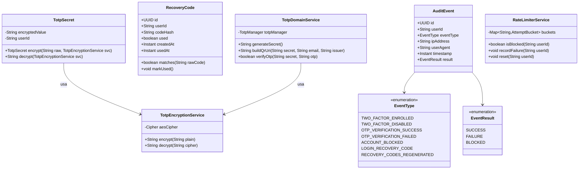
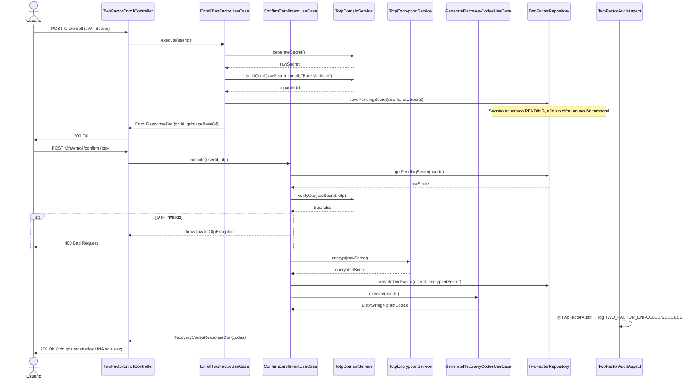
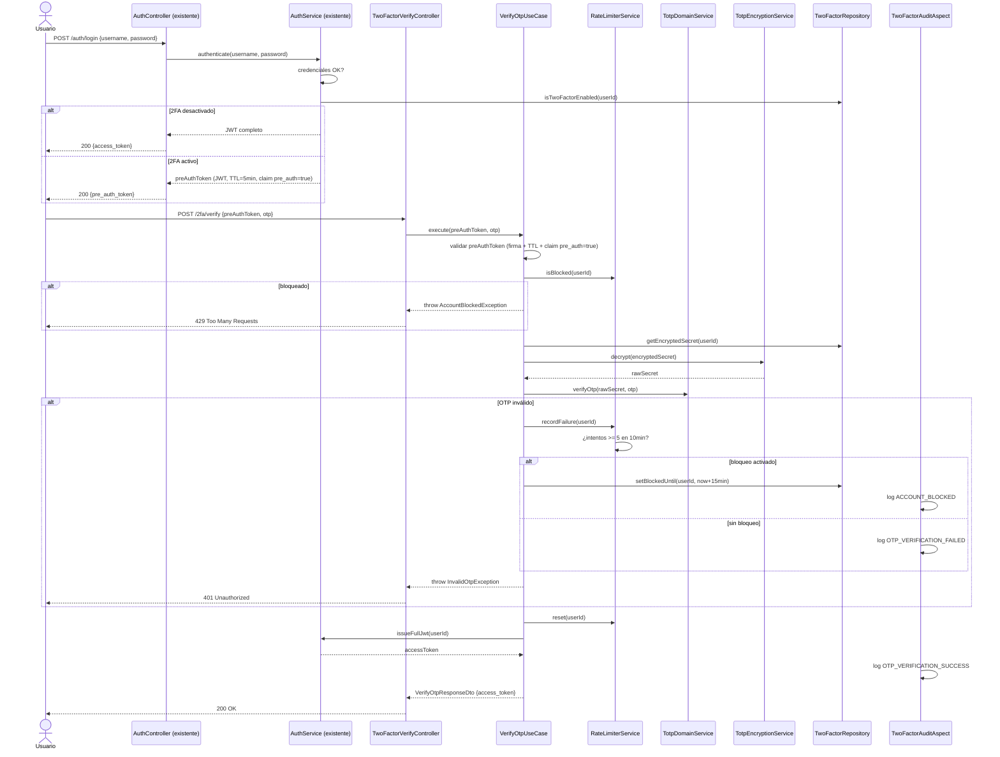
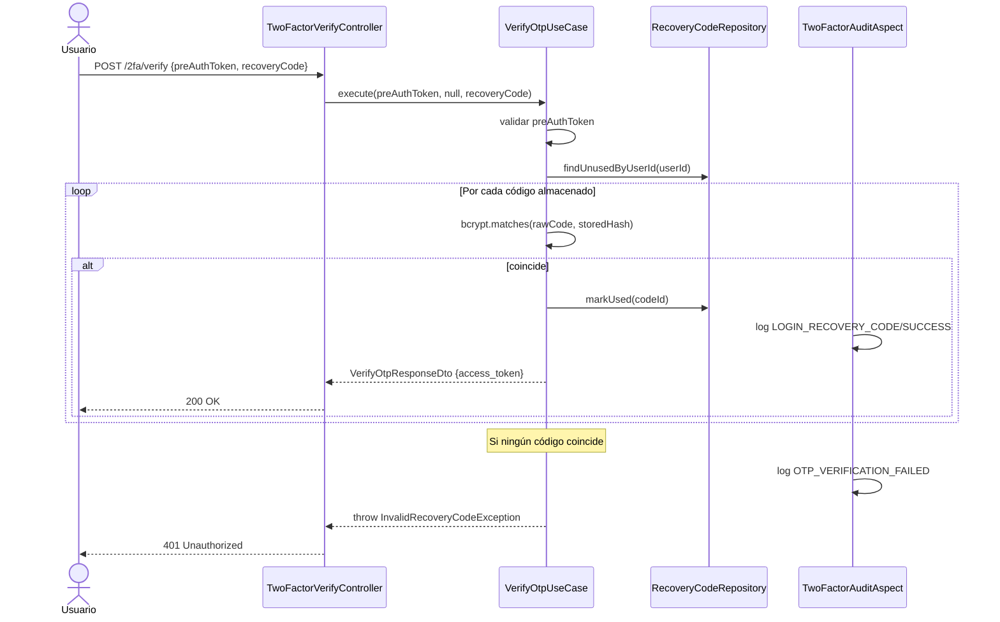

# LLD — backend-2fa (Java / Spring Boot 3.x)

## Metadata

| Campo           | Valor                                        |
|-----------------|----------------------------------------------|
| Servicio        | `backend-2fa`                                |
| Stack           | Java 21 / Spring Boot 3.x / PostgreSQL 15    |
| Feature         | FEAT-001 — Autenticación 2FA / TOTP          |
| Proyecto        | BankPortal — Banco Meridian                  |
| Sprint          | 01                                           |
| Versión         | 1.0                                          |
| Estado          | DRAFT                                        |
| Autor           | SOFIA — Architect Agent                      |
| Fecha           | 2026-03-12                                   |

---

## 1. Estructura de módulo (Arquitectura hexagonal)

```
apps/backend-2fa/
├── src/
│   ├── main/
│   │   ├── java/com/experis/sofia/bankportal/twofa/
│   │   │   │
│   │   │   ├── domain/
│   │   │   │   ├── model/
│   │   │   │   │   ├── TotpSecret.java          # Value Object — secreto TOTP cifrado
│   │   │   │   │   ├── RecoveryCode.java         # Entidad — código de recuperación
│   │   │   │   │   ├── AuditEvent.java           # Entidad — registro de auditoría
│   │   │   │   │   └── TwoFactorStatus.java      # Enum: DISABLED, PENDING, ENABLED
│   │   │   │   ├── repository/
│   │   │   │   │   ├── TwoFactorRepository.java  # Puerto: operaciones en tabla users (cols 2FA)
│   │   │   │   │   ├── RecoveryCodeRepository.java
│   │   │   │   │   └── AuditLogRepository.java
│   │   │   │   └── service/
│   │   │   │       ├── TotpDomainService.java    # Genera/valida OTP (wraps librería)
│   │   │   │       ├── TotpEncryptionService.java# AES-256 encrypt/decrypt secreto TOTP
│   │   │   │       └── RateLimiterService.java   # Conteo de intentos fallidos por usuario
│   │   │   │
│   │   │   ├── application/
│   │   │   │   ├── usecase/
│   │   │   │   │   ├── EnrollTwoFactorUseCase.java       # US-001: genera secreto + QR URI
│   │   │   │   │   ├── ConfirmEnrollmentUseCase.java     # US-001: valida primer OTP, activa
│   │   │   │   │   ├── VerifyOtpUseCase.java             # US-002: valida OTP/recovery, emite JWT
│   │   │   │   │   ├── GenerateRecoveryCodesUseCase.java # US-003: genera/regenera recovery codes
│   │   │   │   │   ├── DisableTwoFactorUseCase.java      # US-004: desactiva 2FA
│   │   │   │   │   └── GetRecoveryCodesStatusUseCase.java
│   │   │   │   └── dto/
│   │   │   │       ├── EnrollResponseDto.java    # { secret, qrUri, qrImageBase64 }
│   │   │   │       ├── ConfirmEnrollRequestDto.java  # { otp }
│   │   │   │       ├── VerifyOtpRequestDto.java      # { preAuthToken, otp, recoveryCode }
│   │   │   │       ├── VerifyOtpResponseDto.java     # { accessToken, tokenType, expiresIn }
│   │   │   │       ├── RecoveryCodesResponseDto.java # { codes: List<String> }
│   │   │   │       ├── RecoveryCodesStatusDto.java   # { available: int, total: int }
│   │   │   │       └── DisableTwoFactorRequestDto.java # { password, otp }
│   │   │   │
│   │   │   ├── infrastructure/
│   │   │   │   ├── persistence/
│   │   │   │   │   ├── TwoFactorJpaRepository.java    # Spring Data JPA
│   │   │   │   │   ├── RecoveryCodeJpaRepository.java
│   │   │   │   │   ├── AuditLogJpaRepository.java
│   │   │   │   │   ├── entity/
│   │   │   │   │   │   ├── UserTwoFactorEntity.java   # Proyección de cols 2FA en tabla users
│   │   │   │   │   │   ├── RecoveryCodeEntity.java
│   │   │   │   │   │   └── AuditLogEntity.java
│   │   │   │   │   └── adapter/
│   │   │   │   │       ├── TwoFactorRepositoryAdapter.java
│   │   │   │   │       ├── RecoveryCodeRepositoryAdapter.java
│   │   │   │   │       └── AuditLogRepositoryAdapter.java
│   │   │   │   ├── config/
│   │   │   │   │   ├── TotpConfig.java           # Bean TotpManager (período=30s, tolerancia=1)
│   │   │   │   │   ├── SecurityConfig.java       # Spring Security: JWT filter + rate limit
│   │   │   │   │   └── AesEncryptionConfig.java  # Bean AES cipher clave desde env var
│   │   │   │   └── aop/
│   │   │   │       └── TwoFactorAuditAspect.java # @TwoFactorAudit — intercepta use cases
│   │   │   │
│   │   │   └── api/
│   │   │       ├── controller/
│   │   │       │   ├── TwoFactorEnrollController.java  # POST /2fa/enroll, POST /2fa/enroll/confirm
│   │   │       │   ├── TwoFactorVerifyController.java  # POST /2fa/verify
│   │   │       │   └── RecoveryCodesController.java    # GET /status, POST /generate
│   │   │       └── advice/
│   │   │           └── TwoFactorExceptionHandler.java  # @ControllerAdvice
│   │   │
│   │   └── resources/
│   │       ├── application.yml
│   │       └── db/migration/
│   │           ├── V2__add_two_factor_columns_users.sql
│   │           ├── V3__create_recovery_codes.sql
│   │           └── V4__create_audit_log.sql
│   │
│   └── test/
│       ├── java/com/experis/sofia/bankportal/twofa/
│       │   ├── domain/service/TotpDomainServiceTest.java
│       │   ├── application/usecase/EnrollTwoFactorUseCaseTest.java
│       │   ├── application/usecase/VerifyOtpUseCaseTest.java
│       │   ├── integration/TwoFactorFlowIntegrationTest.java  # SpringBootTest + Testcontainers
│       │   └── integration/AuditLogImmutabilityTest.java
│       └── resources/
│           └── application-test.yml
│
└── pom.xml
```

---

## 2. Diagrama de clases — dominio principal



---

## 3. Diagramas de secuencia

### 3.1 Flujo de enrolamiento (US-001)



### 3.2 Flujo de login con 2FA (US-002)



### 3.3 Uso de recovery code (US-003 / US-002)



---

## 4. Modelo de datos (ER Diagram)

```mermaid
erDiagram

  USERS {
    uuid id PK
    string email NOT_NULL
    string password_hash NOT_NULL
    boolean two_factor_enabled DEFAULT_false
    string totp_secret_enc "AES-256 cifrado — NULL si 2FA inactivo"
    timestamp two_factor_enrolled_at
    int totp_failed_attempts DEFAULT_0
    timestamp totp_blocked_until
  }

  RECOVERY_CODES {
    uuid id PK
    uuid user_id FK
    string code_hash NOT_NULL "bcrypt coste >= 10"
    boolean used DEFAULT_false
    timestamp created_at NOT_NULL
    timestamp used_at
  }

  AUDIT_LOG {
    uuid id PK
    uuid user_id NOT_NULL
    string event_type NOT_NULL "Ver EventType enum"
    string ip_address NOT_NULL
    string user_agent
    timestamp timestamp NOT_NULL
    string result NOT_NULL "SUCCESS | FAILURE | BLOCKED"
  }

  USERS ||--o{ RECOVERY_CODES : "tiene"
  USERS ||--o{ AUDIT_LOG : "genera"
```

---

## 5. Estrategia de datos

| Aspecto          | Decisión                                                                        |
|------------------|---------------------------------------------------------------------------------|
| Motor            | PostgreSQL 15                                                                   |
| Migraciones      | Flyway — versionado secuencial `V{n}__descripcion.sql`                          |
| Secreto TOTP     | Columna `totp_secret_enc` en tabla `users` — AES-256 CBC, IV aleatorio por registro |
| Recovery codes   | Tabla `recovery_codes` — hash bcrypt (coste=12) — nunca texto plano             |
| Audit log        | Sin UPDATE ni DELETE a nivel de aplicación — constraint DDL `REVOKE UPDATE, DELETE ON audit_log FROM bankportal_app` |
| Índices          | `recovery_codes(user_id, used)` — consulta frecuente de códigos disponibles; `audit_log(user_id, timestamp)` — consultas de auditoría por período |
| Retención        | `audit_log`: política de archivo a tabla histórica cada 12 meses (DevOps)       |

### Migraciones Flyway

**V2__add_two_factor_columns_users.sql**
```sql
ALTER TABLE users
  ADD COLUMN IF NOT EXISTS two_factor_enabled    BOOLEAN   NOT NULL DEFAULT FALSE,
  ADD COLUMN IF NOT EXISTS totp_secret_enc       TEXT,
  ADD COLUMN IF NOT EXISTS two_factor_enrolled_at TIMESTAMPTZ,
  ADD COLUMN IF NOT EXISTS totp_failed_attempts  INTEGER   NOT NULL DEFAULT 0,
  ADD COLUMN IF NOT EXISTS totp_blocked_until    TIMESTAMPTZ;
```

**V3__create_recovery_codes.sql**
```sql
CREATE TABLE recovery_codes (
  id          UUID        PRIMARY KEY DEFAULT gen_random_uuid(),
  user_id     UUID        NOT NULL REFERENCES users(id) ON DELETE CASCADE,
  code_hash   TEXT        NOT NULL,
  used        BOOLEAN     NOT NULL DEFAULT FALSE,
  created_at  TIMESTAMPTZ NOT NULL DEFAULT NOW(),
  used_at     TIMESTAMPTZ
);
CREATE INDEX idx_recovery_codes_user_used ON recovery_codes(user_id, used);
```

**V4__create_audit_log.sql**
```sql
CREATE TABLE audit_log (
  id          UUID        PRIMARY KEY DEFAULT gen_random_uuid(),
  user_id     UUID        NOT NULL,
  event_type  VARCHAR(50) NOT NULL,
  ip_address  VARCHAR(45) NOT NULL,
  user_agent  TEXT,
  timestamp   TIMESTAMPTZ NOT NULL DEFAULT NOW(),
  result      VARCHAR(10) NOT NULL CHECK (result IN ('SUCCESS','FAILURE','BLOCKED'))
);
CREATE INDEX idx_audit_log_user_ts ON audit_log(user_id, timestamp);

-- Inmutabilidad a nivel DDL
REVOKE UPDATE, DELETE, TRUNCATE ON audit_log FROM bankportal_app;
```

---

## 6. Contrato OpenAPI (definido por Architect)

> El Developer implementa este contrato. Puede proponer ajustes al Architect si detecta inconsistencias durante la implementación.

---

### POST /api/v1/2fa/enroll
**Descripción:** Genera secreto TOTP y devuelve URI QR para enrolamiento. No activa 2FA aún.
**Auth:** Bearer JWT de sesión completa.

**Response 200:**
```json
{
  "secret": "BASE32_ENCODED_SECRET",
  "qr_uri": "otpauth://totp/BankMeridian:user@bank.com?secret=...&issuer=BankMeridian",
  "qr_image_base64": "data:image/png;base64,..."
}
```
**Errores:** 401 (sin JWT), 409 (2FA ya activo)

---

### POST /api/v1/2fa/enroll/confirm
**Descripción:** Valida el primer OTP, activa 2FA y genera recovery codes.
**Auth:** Bearer JWT de sesión completa.

**Request:**
```json
{ "otp": "123456" }
```
**Response 200:**
```json
{
  "codes": [
    "A1B2-C3D4-E5F6", "G7H8-I9J0-K1L2"
    // ... 10 códigos en total — mostrar UNA sola vez
  ]
}
```
**Errores:** 400 (OTP inválido), 401 (sin JWT), 409 (2FA ya activo)

---

### POST /api/v1/2fa/verify
**Descripción:** Verifica OTP o recovery code. Emite JWT de acceso completo.
**Auth:** Header `Authorization: PreAuth <pre_auth_token>`

**Request:**
```json
{
  "otp": "123456",
  "recovery_code": null
}
```
*(Enviar `otp` o `recovery_code`, no ambos)*

**Response 200:**
```json
{
  "access_token": "eyJhbGci...",
  "token_type": "Bearer",
  "expires_in": 3600
}
```
**Errores:** 401 (pre_auth_token inválido/expirado o OTP incorrecto), 429 (rate limit — bloqueado 15min)

---

### GET /api/v1/2fa/recovery-codes/status
**Descripción:** Retorna cuántos recovery codes quedan disponibles.
**Auth:** Bearer JWT de sesión completa.

**Response 200:**
```json
{ "available": 7, "total": 10 }
```

---

### POST /api/v1/2fa/recovery-codes/generate
**Descripción:** Regenera los 10 recovery codes. Invalida los anteriores.
**Auth:** Bearer JWT de sesión completa.

**Request:**
```json
{ "password": "contraseña_actual" }
```
**Response 200:**
```json
{
  "codes": ["...", "..."]
}
```
**Errores:** 400 (contraseña incorrecta), 401 (sin JWT), 403 (2FA no activo)

---

### DELETE /api/v1/2fa/disable
**Descripción:** Desactiva 2FA. Elimina secreto TOTP e invalida todos los recovery codes.
**Auth:** Bearer JWT de sesión completa.

**Request:**
```json
{ "password": "contraseña_actual", "otp": "123456" }
```
**Response 200:**
```json
{ "message": "2FA desactivado correctamente." }
```
**Errores:** 400 (contraseña u OTP incorrecto), 401 (sin JWT), 403 (2FA no activo)

---

## 7. Variables de entorno requeridas

| Variable                  | Descripción                                         | Ejemplo / Formato                         |
|---------------------------|-----------------------------------------------------|-------------------------------------------|
| `TOTP_ISSUER`             | Nombre mostrado en la app autenticadora             | `BankMeridian`                            |
| `TOTP_AES_KEY`            | Clave AES-256 en Base64 (32 bytes → 44 chars Base64)| `(generada con openssl rand -base64 32)`  |
| `TOTP_AES_IV_SALT`        | Salt para derivar IV por registro                   | `(generada con openssl rand -base64 16)`  |
| `JWT_SECRET`              | Clave HMAC-SHA256 para firmar JWT                   | `(secret — no hardcodear)`               |
| `PRE_AUTH_TOKEN_TTL_MIN`  | TTL del pre-auth token en minutos                   | `5`                                       |
| `DB_URL`                  | URL de conexión PostgreSQL                          | `jdbc:postgresql://localhost:5432/bankdb` |
| `DB_USERNAME`             | Usuario DB                                          | `bankportal_app`                          |
| `DB_PASSWORD`             | Contraseña DB                                       | `(secret)`                                |
| `RATE_LIMIT_MAX_ATTEMPTS` | Intentos OTP antes de bloqueo                       | `5`                                       |
| `RATE_LIMIT_WINDOW_MIN`   | Ventana de tiempo para el rate limit (minutos)      | `10`                                      |
| `RATE_LIMIT_BLOCK_MIN`    | Duración del bloqueo en minutos                     | `15`                                      |

> ⚠️ `TOTP_AES_KEY` y `JWT_SECRET` **nunca** deben aparecer en código fuente ni en git. Inyectar desde Vault o variables de entorno del servidor CI/CD.

---

*Generado por SOFIA Architect Agent · BankPortal · Sprint 01 · 2026-03-12*
