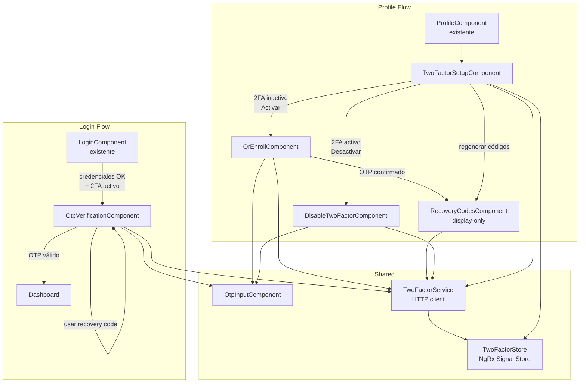
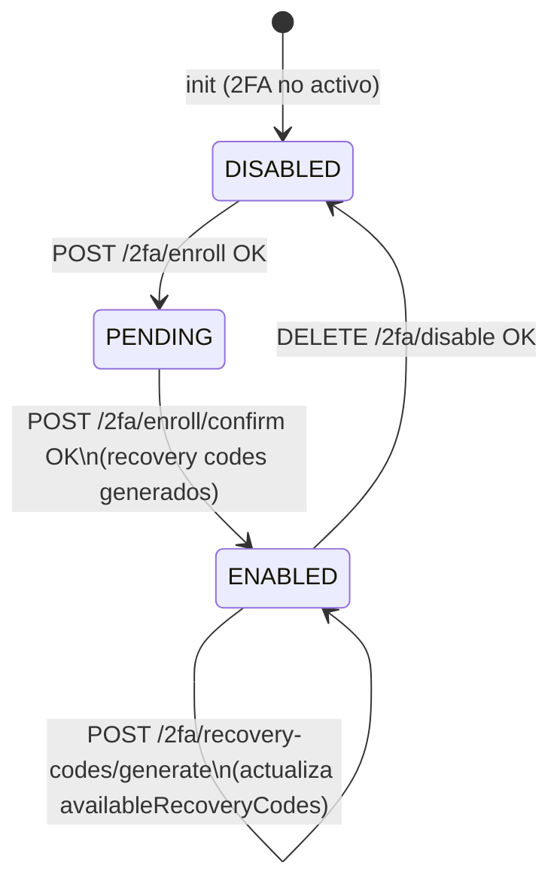
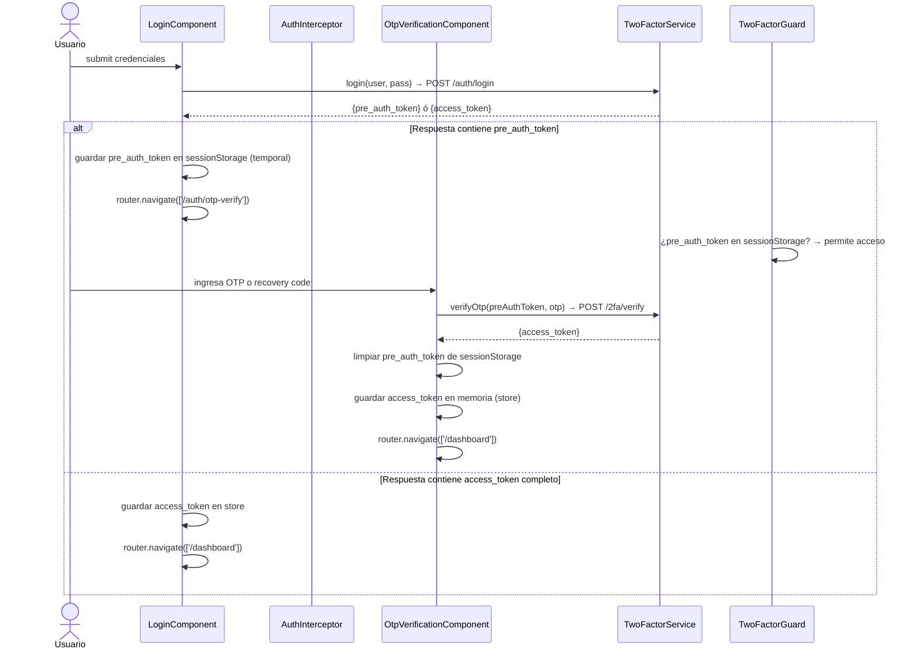

# LLD — frontend-portal / feature two-factor (Angular 17+)

## Metadata

| Campo           | Valor                                        |
|-----------------|----------------------------------------------|
| Módulo          | `apps/frontend-portal` → feature `two-factor`|
| Stack           | Angular 17+ / NgRx Signal Store / TypeScript |
| Feature         | FEAT-001 — Autenticación 2FA / TOTP          |
| Proyecto        | BankPortal — Banco Meridian                  |
| Sprint          | 01                                           |
| Versión         | 1.0                                          |
| Estado          | DRAFT                                        |
| Autor           | SOFIA — Architect Agent                      |
| Fecha           | 2026-03-12                                   |

---

## 1. Estructura del módulo Angular

```
apps/frontend-portal/src/app/
│
├── core/
│   ├── guards/
│   │   └── two-factor.guard.ts          # Redirige a /2fa/verify si pre_auth_token presente
│   └── interceptors/
│       └── auth.interceptor.ts          # Inyecta Bearer JWT o PreAuth header según contexto
│
├── shared/
│   └── components/
│       └── otp-input/
│           ├── otp-input.component.ts   # Input de 6 dígitos reutilizable (campo único con auto-split)
│           └── otp-input.component.html
│
└── features/
    └── two-factor/
        ├── two-factor.routes.ts         # Lazy routes: /security/2fa, /auth/otp-verify
        │
        ├── models/
        │   ├── enroll.model.ts          # EnrollResponse, ConfirmEnrollRequest
        │   ├── verify.model.ts          # VerifyOtpRequest, VerifyOtpResponse
        │   └── recovery-codes.model.ts  # RecoveryCodesResponse, RecoveryCodesStatus
        │
        ├── services/
        │   └── two-factor.service.ts    # HttpClient calls a /2fa/**
        │
        ├── store/
        │   └── two-factor.store.ts      # NgRx Signal Store — estado 2FA del usuario
        │
        └── components/
            ├── two-factor-setup/
            │   ├── two-factor-setup.component.ts    # Contenedor: activa/desactiva 2FA, muestra estado
            │   ├── two-factor-setup.component.html
            │   ├── qr-enroll/
            │   │   ├── qr-enroll.component.ts       # Muestra QR + campo OTP para confirmar enrolamiento
            │   │   └── qr-enroll.component.html
            │   └── disable-two-factor/
            │       ├── disable-two-factor.component.ts   # Formulario desactivación (pwd + OTP)
            │       └── disable-two-factor.component.html
            │
            ├── otp-verification/
            │   ├── otp-verification.component.ts    # Pantalla OTP en flujo de login (pre_auth_token)
            │   └── otp-verification.component.html
            │
            └── recovery-codes/
                ├── recovery-codes.component.ts      # Muestra/descarga códigos (post-enrolamiento o regeneración)
                └── recovery-codes.component.html
```

---

## 2. Diagrama de componentes



---

## 3. NgRx Signal Store — Estado 2FA

```typescript
// two-factor.store.ts
interface TwoFactorState {
  status: 'DISABLED' | 'PENDING' | 'ENABLED';
  availableRecoveryCodes: number;
  isLoading: boolean;
  error: string | null;
  // Solo en memoria durante enrolamiento — nunca persistido
  pendingQrUri: string | null;
  pendingRecoveryCodes: string[] | null; // limpiado tras mostrar al usuario
}
```

**Transiciones de estado:**



---

## 4. Flujo de navegación — Login con 2FA



---

## 5. Contratos de integración con backend

Referencia: `docs/architecture/FEAT-001-LLD-backend.md` § 6.

El `TwoFactorService` Angular mapea directamente los endpoints definidos por el Architect backend:

```typescript
// Tipado de modelos (models/)

export interface EnrollResponse {
  secret: string;
  qr_uri: string;
  qr_image_base64: string;
}

export interface VerifyOtpRequest {
  otp?: string;
  recovery_code?: string;
}

export interface VerifyOtpResponse {
  access_token: string;
  token_type: string;
  expires_in: number;
}

export interface RecoveryCodesResponse {
  codes: string[];
}

export interface RecoveryCodesStatus {
  available: number;
  total: number;
}
```

---

## 6. Comportamientos críticos de seguridad en frontend

| Regla                                           | Implementación                                             |
|-------------------------------------------------|------------------------------------------------------------|
| `access_token` nunca en localStorage            | Almacenar en NgRx Signal Store en memoria                  |
| `pre_auth_token` solo en sessionStorage         | Se limpia inmediatamente tras verificación exitosa o error |
| Recovery codes nunca cacheados                  | `pendingRecoveryCodes` en store se limpia al navegar fuera |
| OTP input no permite copiar/pegar en producción | Atributo `autocomplete="one-time-code"` + sin clipboard API |
| QR no cacheado                                  | Imagen `qr_image_base64` solo en estado local del componente; limpiada al salir |
| Header correcto por contexto                    | `AuthInterceptor`: si hay `pre_auth_token` → `Authorization: PreAuth <token>`; si hay `access_token` → `Authorization: Bearer <token>` |

---

## 7. Variables de entorno Angular (environment.ts)

| Variable                    | Descripción                                | Ejemplo                                     |
|-----------------------------|--------------------------------------------|---------------------------------------------|
| `apiBaseUrl`                | Base URL del API Gateway                   | `https://api.bankmeridian.com/v1`           |
| `otpInputLength`            | Longitud del código OTP                    | `6`                                         |
| `preAuthTokenSessionKey`    | Clave sessionStorage del pre-auth token    | `bank_pre_auth`                             |

---

*Generado por SOFIA Architect Agent · BankPortal · Sprint 01 · 2026-03-12*
