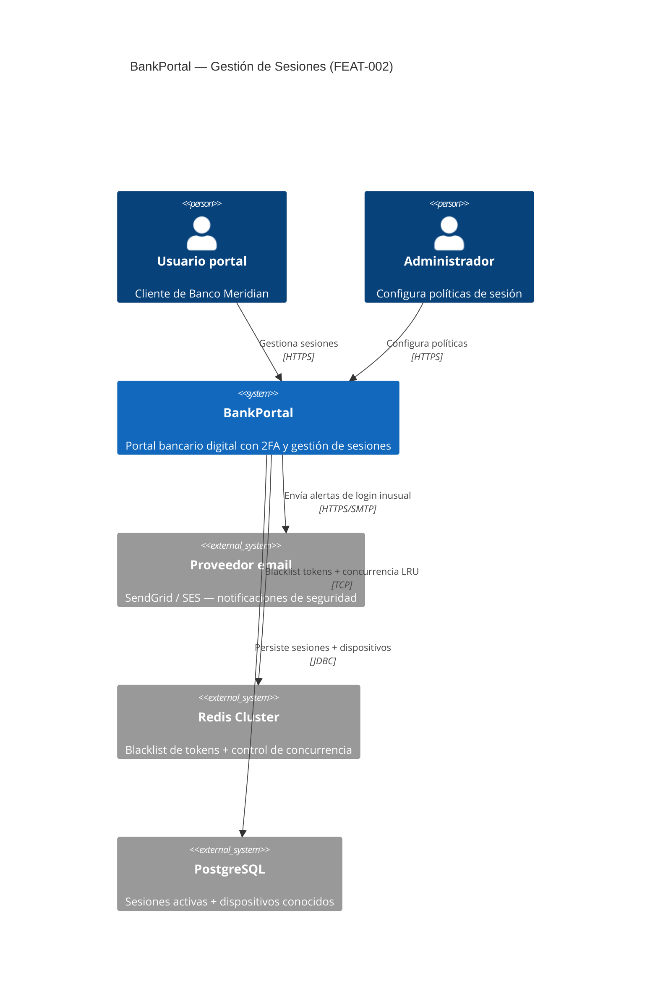
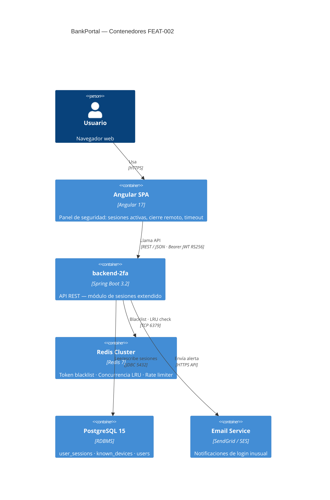
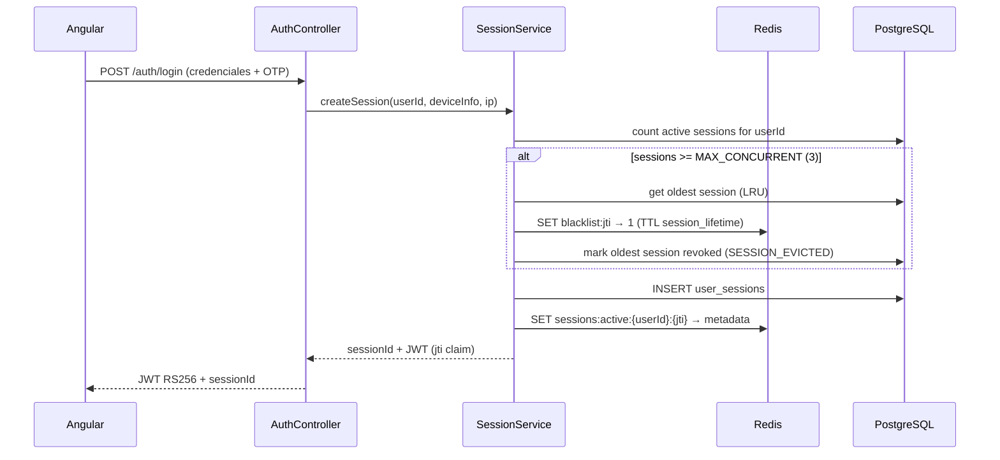
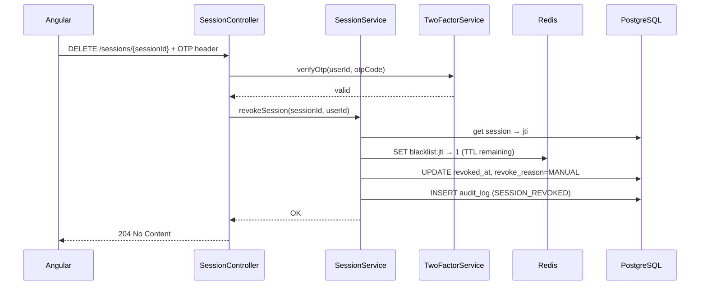
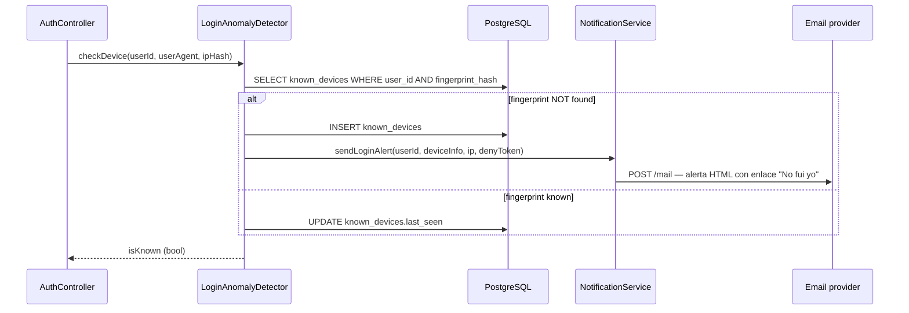

# HLD — FEAT-002: Gestión Avanzada de Sesiones

## Metadata

| Campo | Valor |
|---|---|
| **Feature** | FEAT-002 |
| **Proyecto** | BankPortal — Banco Meridian |
| **Cliente** | Banco Meridian |
| **Stack** | Java/Spring Boot (backend) + Angular (frontend) |
| **Tipo** | new-feature |
| **Sprint** | 3 · Período 2026-04-14 → 2026-04-25 |
| **Versión** | 1.0 |
| **Estado** | DRAFT — 🔒 Pendiente aprobación Tech Lead |

---

## Análisis de impacto en servicios existentes

| Servicio / Módulo | Tipo de impacto | Acción requerida |
|---|---|---|
| `AuthService` (login flow) | Modificación — añadir registro de sesión y check de concurrencia | Extender sin cambiar contrato externo |
| `JwtService` | Modificación — añadir `jti` (JWT ID) a claims para hashing en blacklist | ADR-006 |
| `TwoFactorService` | Sin impacto | — |
| Tabla `users` | Extensión — nueva columna `session_timeout_minutes` | Migración compatible (default=30) |
| OpenAPI v1.1.0 | Extensión — nuevos endpoints bajo `/api/v1/sessions` | Versionar a v1.2.0 |
| Redis (rate limiter) | Extensión — nuevos namespaces para blacklist y concurrencia | Sin impacto en rate limiter existente |

**Decisión:** impacto acotado y compatible hacia atrás. Se procede con el diseño.

---

## Contexto del sistema — C4 Nivel 1



---

## Componentes involucrados — C4 Nivel 2



---

## Servicios nuevos o modificados

| Servicio | Acción | Responsabilidad | Puerto |
|---|---|---|---|
| `backend-2fa` | MODIFICADO | Añade módulo `session` (US-101/102/103/104/105) y `DEBT-003` | 8081 |
| Redis | MODIFICADO | Nuevo namespace `sessions:blacklist:{userId}` y `sessions:active:{userId}` | 6379 |
| PostgreSQL | MODIFICADO | Nuevas tablas `user_sessions` + `known_devices`, columna en `users` | 5432 |
| Email provider | NUEVO (integración) | Envío de alertas transaccionales de seguridad | HTTPS |

---

## Flujos principales

### Flujo 1 — Login con registro de sesión y check de concurrencia



### Flujo 2 — Cierre remoto de sesión con OTP



### Flujo 3 — Login desde dispositivo nuevo → notificación



---

## Contrato de integración backend ↔ frontend

**Base URL:** `https://api.bankportal.meridian.com/v1`
**Auth:** `Authorization: Bearer <JWT RS256>`

| Método | Ruta | Descripción |
|---|---|---|
| `GET` | `/api/v1/sessions` | Lista sesiones activas del usuario |
| `DELETE` | `/api/v1/sessions/{sessionId}` | Revoca sesión individual (requiere OTP) |
| `DELETE` | `/api/v1/sessions` | Revoca todas excepto la actual (requiere OTP) |
| `PUT` | `/api/v1/sessions/timeout` | Actualiza preferencia de timeout |
| `GET` | `/api/v1/sessions/deny/{token}` | Deniega sesión desde enlace email (sin auth) |

---

## Decisiones técnicas — ADRs

- **ADR-006:** Redis como token blacklist + estructura de concurrencia LRU
- **ADR-007:** HMAC firmado para enlace "No fui yo" en email de alerta

---

## Checklist de completitud

```
COMPLETITUD
✅ HLD con diagramas C4 Nivel 1 y Nivel 2 en Mermaid
✅ Flujos críticos documentados con diagramas de secuencia
✅ Impacto en servicios existentes analizado
✅ Contrato de integración backend ↔ frontend definido
✅ ADRs identificados (ADR-006, ADR-007)

TRAZABILIDAD CMMI
✅ Metadata completa (feature, sprint, stack, tipo)
✅ Servicios existentes analizados en tabla de impacto
```

---

*Generado por SOFIA Architect Agent · BankPortal · FEAT-002 · Sprint 3 · 2026-04-14*
*🔒 GATE: aprobación Tech Lead requerida antes de iniciar desarrollo*
