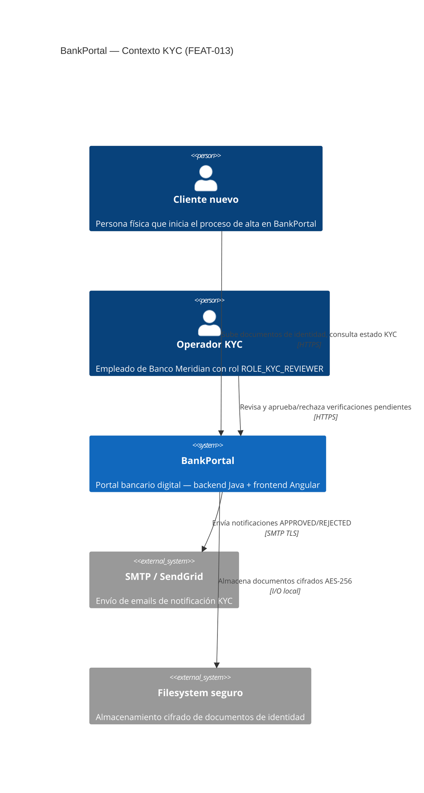
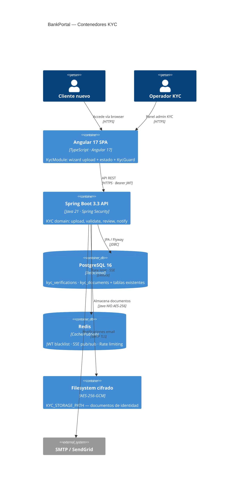
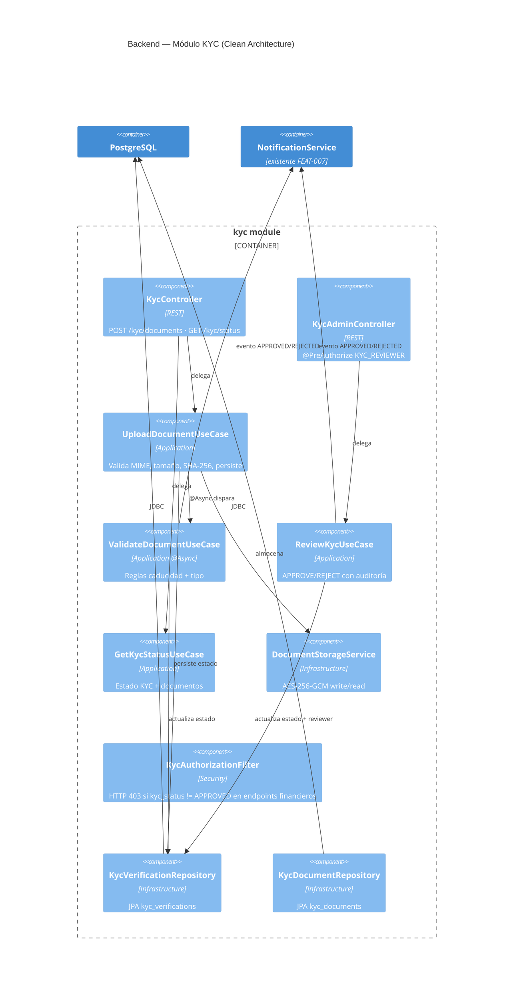
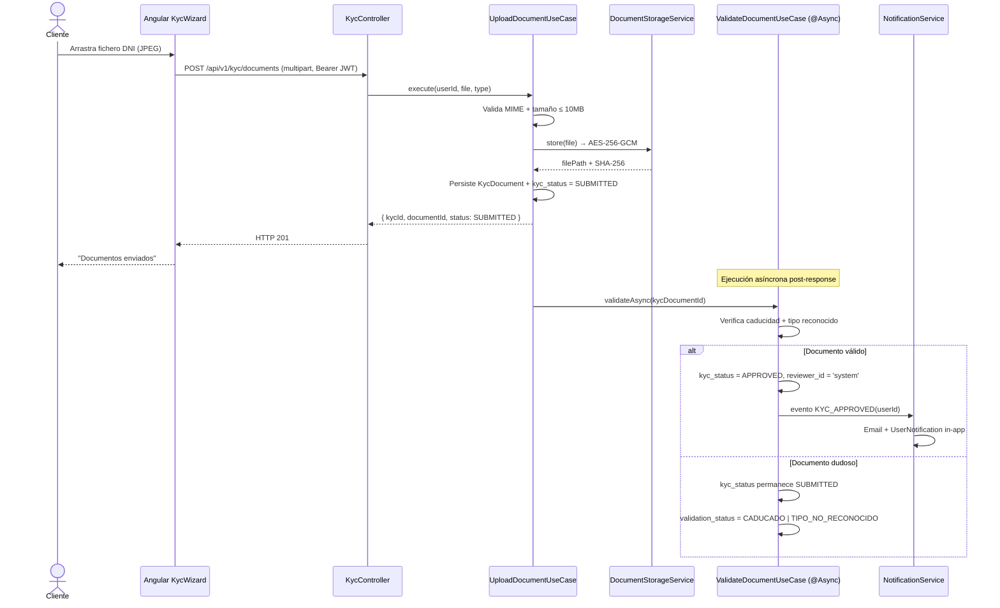
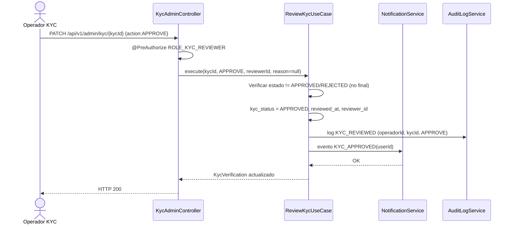
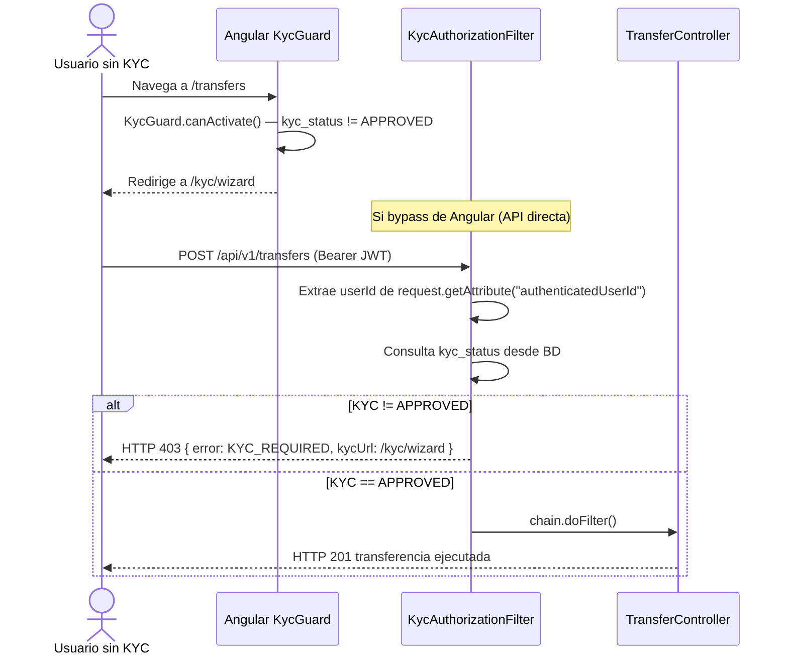
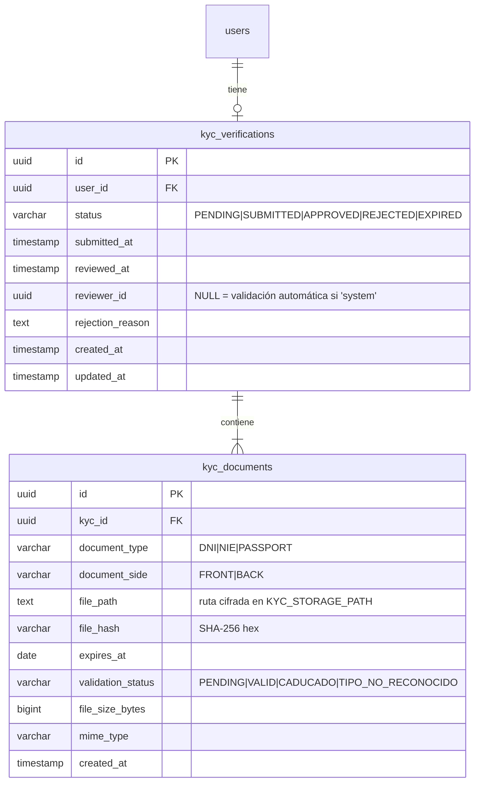

# HLD — FEAT-013: Onboarding KYC / Verificación de Identidad

**BankPortal · Banco Meridian · Sprint 15**

| Campo | Valor |
|---|---|
| Feature | FEAT-013 |
| Sprint | 15 · 2026-03-24 → 2026-04-06 |
| Versión | 1.0 |
| Estado | ✅ Aprobado Tech Lead |
| ADRs | ADR-023 (almacenamiento documentos KYC) · ADR-024 (validación asíncrona) |
| SRS | docs/srs/SRS-FEAT-013.md |
| Normativa | PSD2 · AML EU 2018/843 · RGPD Art.9 |

---

## Análisis de impacto en monorepo

| Servicio/Módulo | Tipo de impacto | Cambios |
|---|---|---|
| `SecurityConfig` | Modificación | Añade `KycAuthorizationFilter` tras `RevokedTokenFilter` |
| `NotificationService` | Reutilización | Disparado por eventos KYC_APPROVED / KYC_REJECTED |
| `SseEmitterRegistry` | Reutilización | Notificaciones in-app estado KYC |
| `AuditLogService` | Extensión | Nuevos eventos KYC_SUBMITTED / KYC_APPROVED / KYC_REJECTED |
| `ProfileController` | Sin cambios | Ya tiene `authenticatedUserId` en request attribute |
| Frontend Angular routes | Modificación | Nuevas rutas `/kyc/**` + `KycGuard` en rutas financieras |
| Flyway | Extensión | V15__kyc_onboarding.sql (nuevas tablas, no altera existentes) |

**Contratos existentes no rotos:** ninguno. Todos los cambios son aditivos.

---

## C4 Nivel 1 — Contexto del sistema



---

## C4 Nivel 2 — Contenedores



---

## C4 Nivel 3 — Componentes del backend (módulo KYC)



---

## Diagrama de secuencia — Flujo subida y validación automática



---

## Diagrama de secuencia — Revisión manual por operador



---

## Diagrama de secuencia — Guard de bloqueo financiero



---

## Modelo de datos — Flyway V15



**Índices:**
- `idx_kyc_verifications_user_id` → `kyc_verifications(user_id)`
- `idx_kyc_verifications_status` → `kyc_verifications(status)`
- `idx_kyc_documents_kyc_id` → `kyc_documents(kyc_id)`
- `UNIQUE (user_id, status='SUBMITTED')` — previene duplicados activos

---

## Estructura de paquetes — Backend

```
kyc/
├── api/
│   ├── KycController.java          # POST /api/v1/kyc/documents · GET /api/v1/kyc/status
│   └── KycAdminController.java     # PATCH /api/v1/admin/kyc/{id} — ROLE_KYC_REVIEWER
├── application/
│   ├── UploadDocumentUseCase.java
│   ├── ValidateDocumentUseCase.java # @Async
│   ├── GetKycStatusUseCase.java
│   ├── ReviewKycUseCase.java
│   └── dto/
│       ├── DocumentUploadResponse.java
│       ├── KycStatusResponse.java
│       ├── KycReviewRequest.java
│       └── KycReviewResponse.java
├── domain/
│   ├── KycVerification.java         # JPA Entity
│   ├── KycDocument.java             # JPA Entity
│   ├── KycStatus.java               # Enum
│   ├── DocumentType.java            # Enum
│   ├── ValidationStatus.java        # Enum
│   ├── KycVerificationRepository.java
│   └── KycDocumentRepository.java
├── infrastructure/
│   └── DocumentStorageService.java  # AES-256-GCM R/W
└── security/
    └── KycAuthorizationFilter.java  # OncePerRequestFilter

resources/db/migration/
└── V15__kyc_onboarding.sql
```

---

## Estructura de paquetes — Frontend Angular

```
features/kyc/
├── kyc.module.ts                   # Lazy-loaded
├── kyc-routing.module.ts           # /kyc/wizard · /kyc/status
├── kyc.guard.ts                    # KycGuard (CanActivateFn)
├── kyc.service.ts                  # HTTP calls al backend KYC
├── components/
│   ├── kyc-wizard/
│   │   ├── kyc-wizard.component.ts
│   │   ├── kyc-wizard.component.html
│   │   └── kyc-wizard.component.spec.ts
│   ├── kyc-upload/
│   │   ├── kyc-upload.component.ts  # Drag & drop + previsualización
│   │   └── kyc-upload.component.html
│   └── kyc-status/
│       ├── kyc-status.component.ts
│       └── kyc-status.component.html
└── models/
    └── kyc.model.ts                # KycStatus · KycDocument interfaces
```

---

## Contrato OpenAPI — FEAT-013

### POST /api/v1/kyc/documents
**Auth:** Bearer JWT · **Content-Type:** multipart/form-data

**Request:**
```
file:         binary  — imagen o PDF del documento (≤ 10MB)
documentType: string  — DNI | NIE | PASSPORT
documentSide: string  — FRONT | BACK
```

**Response 201:**
```json
{ "kycId": "uuid", "documentId": "uuid", "status": "SUBMITTED" }
```

**Errores:** 400 `FILE_TOO_LARGE` | 400 `INVALID_FILE_TYPE` | 409 `KYC_ALREADY_APPROVED` | 401 | 500

---

### GET /api/v1/kyc/status
**Auth:** Bearer JWT

**Response 200:**
```json
{
  "kycId": "uuid",
  "status": "SUBMITTED",
  "submittedAt": "2026-03-24T09:00:00Z",
  "reviewedAt": null,
  "rejectionReason": null,
  "documents": [
    { "documentId": "uuid", "type": "DNI", "side": "FRONT", "validationStatus": "PENDING" }
  ]
}
```

---

### PATCH /api/v1/admin/kyc/{kycId}
**Auth:** Bearer JWT · **Role:** ROLE_KYC_REVIEWER

**Request:**
```json
{ "action": "APPROVE | REJECT", "reason": "string — obligatorio si REJECT" }
```

**Response 200:**
```json
{ "kycId": "uuid", "status": "APPROVED", "reviewedAt": "2026-03-24T10:00:00Z", "reviewerId": "uuid" }
```

**Errores:** 400 `REASON_REQUIRED` | 403 (sin rol) | 409 `KYC_ALREADY_IN_FINAL_STATE` | 404

---

## Variables de entorno requeridas

| Variable | Descripción | Ejemplo |
|---|---|---|
| `KYC_STORAGE_PATH` | Ruta base almacenamiento documentos | `/var/data/kyc-docs` |
| `KYC_ENCRYPTION_KEY` | Clave AES-256 para cifrado documentos (32 bytes hex) | `(secret)` |
| `KYC_STORAGE_MAX_FILE_MB` | Tamaño máximo por fichero en MB | `10` |
| `KYC_AUTO_VALIDATION_ENABLED` | Activar/desactivar validación automática | `true` |

---

## RTM actualizada — Columna Arquitectura

| US | Componente Arquitectura |
|---|---|
| US-1301 | `kyc_verifications` · `kyc_documents` · `V15__kyc_onboarding.sql` |
| US-1302 | `KycController` · `UploadDocumentUseCase` · `DocumentStorageService` |
| US-1303 | `ValidateDocumentUseCase` @Async · `KycVerificationRepository` |
| US-1304 | `GetKycStatusUseCase` · `NotificationService` (reutilizado) |
| US-1305 | `KycAuthorizationFilter` · `KycGuard` Angular |
| US-1306 | `KycModule` · `KycWizardComponent` · `KycUploadComponent` · `KycStatusComponent` |
| US-1307 | `KycAdminController` · `ReviewKycUseCase` · `AuditLogService` |

---

*SOFIA Architect Agent — Step 3 | Sprint 15 · FEAT-013*
*CMMI Level 3 — TS SP 1.1 · TS SP 2.1 · TS SP 2.2*
*BankPortal — Banco Meridian — 2026-03-24*
