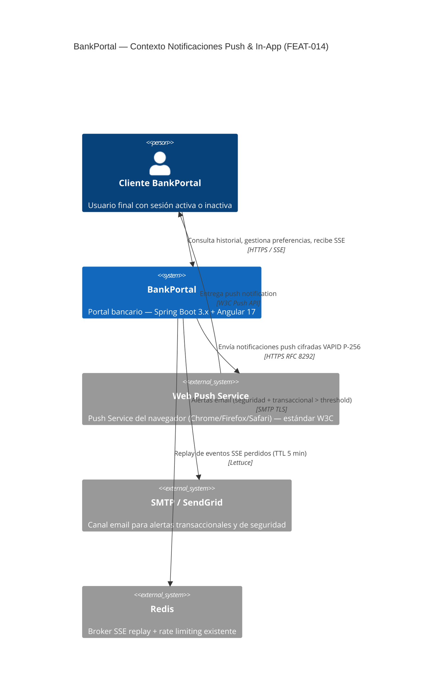
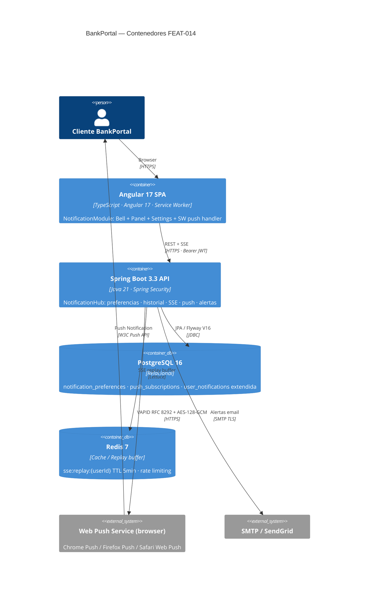
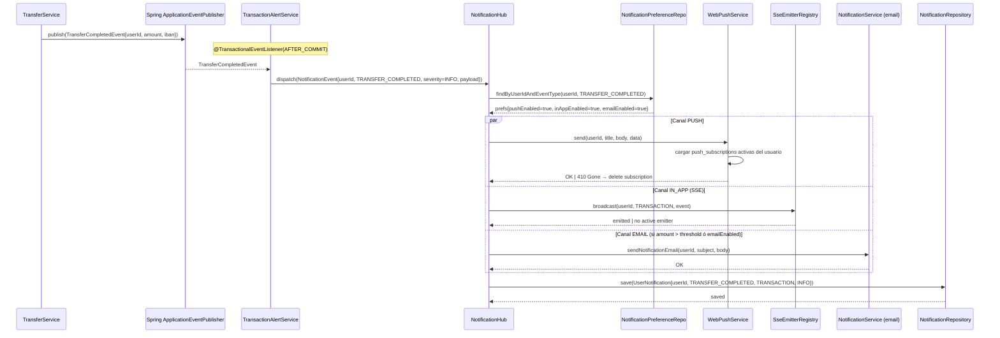
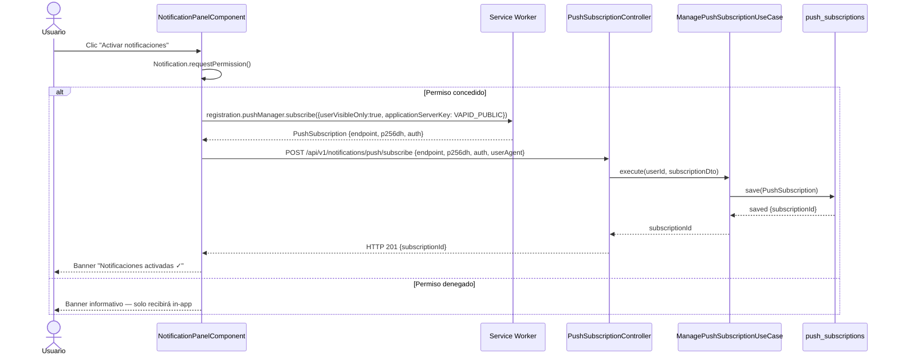
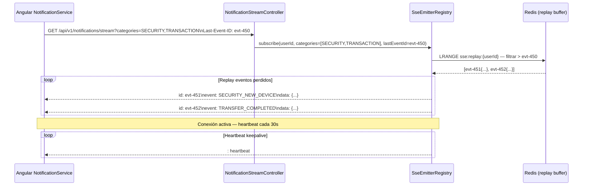

# HLD — FEAT-014: Notificaciones Push & In-App

**BankPortal · Banco Meridian · Sprint 16**

| Campo | Valor |
|---|---|
| Feature | FEAT-014 |
| Sprint | 16 · 2026-03-25 → 2026-04-08 |
| Versión | 1.0 |
| Estado | DRAFT — Gate 3 pendiente Tech Lead |
| ADRs | ADR-025 (VAPID vs FCM) |
| SRS | docs/requirements/SRS-FEAT-014.md |
| Normativa | RGPD Art.7 · RGPD Art.32 · PSD2 RTS Art.97 |

---

## Análisis de impacto en monorepo

| Servicio/Módulo | Tipo de impacto | Cambios |
|---|---|---|
| `NotificationService` (FEAT-007) | Extensión | Nuevo `NotificationHub` orquesta todos los canales; `NotificationService` legacy reutilizado como canal email |
| `SseEmitterRegistry` (FEAT-007) | Extensión | Filtro por categoría + soporte `Last-Event-ID` con replay Redis |
| `user_notifications` (FEAT-007) | Extensión | Flyway V16 añade columnas `category`, `severity`, `metadata`, `read_at` (aditivo, sin breaking change) |
| `SecurityConfig` | Modificación mínima | Whitelist `/api/v1/notifications/stream` (SSE no compatible con CSRF token) |
| `TransferService` (FEAT-008) | Reutilización | Escucha `TransferCompletedEvent` vía `@TransactionalEventListener` |
| `AuditLogService` | Reutilización | Nuevos eventos `PUSH_SENT` · `PUSH_SUBSCRIPTION_CREATED` |
| `Redis` | Extensión | Nuevo bucket `sse:replay:{userId}` para eventos pendientes (TTL 5 min) |
| Frontend `DashboardModule` | Extensión | `NotificationBellComponent` en header + lazy `NotificationModule` |
| Flyway | Extensión | V16__notification_preferences.sql (nuevas tablas, columnas aditivas) |

**Contratos existentes no rotos:** ninguno. Todos los cambios son aditivos o extensiones backward-compatible.

---

## C4 Nivel 1 — Contexto del sistema



---

## C4 Nivel 2 — Contenedores



---

## C4 Nivel 3 — Componentes del backend (módulo Notifications)

```mermaid
C4Component
  title Backend — Módulo Notifications Hub (Clean Architecture)

  Container_Boundary(notif, "notifications module") {
    Component(prefCtrl, "NotificationPreferenceController", "REST", "GET/PATCH /preferences")
    Component(histCtrl, "NotificationHistoryController", "REST", "GET /notifications · PATCH read · POST mark-all-read")
    Component(streamCtrl, "NotificationStreamController", "REST/SSE", "GET /stream?categories=")
    Component(pushCtrl, "PushSubscriptionController", "REST", "POST/DELETE /push/subscribe")

    Component(hub, "NotificationHub", "Application — Orchestrator", "@Async despacha a cada canal según preferencias y severidad")
    Component(prefUC, "ManagePreferencesUseCase", "Application", "CRUD preferencias usuario")
    Component(histUC, "GetNotificationsUseCase", "Application", "Historial paginado con filtros + unread-count")
    Component(markUC, "MarkReadUseCase", "Application", "Marcar leída / mark-all-read")
    Component(pushUC, "ManagePushSubscriptionUseCase", "Application", "Register · Unregister · cleanup 410 Gone")

    Component(webpushSvc, "WebPushService", "Infrastructure", "nl.martijndwars:web-push · VAPID · limpieza 410")
    Component(sseReg, "SseEmitterRegistry", "Infrastructure EXTENDIDO", "filtro categorías + Last-Event-ID + heartbeat 30s")
    Component(txAlert, "TransactionAlertService", "Application", "@TransactionalEventListener AFTER_COMMIT")
    Component(secAlert, "SecurityAlertService", "Application", "DeviceRegisteredEvent · PasswordChangedEvent · TwoFactorFailedEvent")
    Component(prefRepo, "NotificationPreferenceRepository", "Infrastructure", "JPA notification_preferences")
    Component(pushRepo, "PushSubscriptionRepository", "Infrastructure", "JPA push_subscriptions")
    Component(notifRepo, "NotificationRepository", "Infrastructure", "JPA user_notifications extendida")
  }

  Container(pg, "PostgreSQL")
  Container(redis, "Redis")
  Component(legacyNS, "NotificationService", "existente FEAT-007 — canal email")

  Rel(prefCtrl, prefUC, "delega")
  Rel(histCtrl, histUC, "delega")
  Rel(histCtrl, markUC, "delega")
  Rel(streamCtrl, sseReg, "suscribe emitter filtrado")
  Rel(pushCtrl, pushUC, "delega")
  Rel(txAlert, hub, "dispatch(NotificationEvent)")
  Rel(secAlert, hub, "dispatch(NotificationEvent severity=HIGH)")
  Rel(hub, prefRepo, "consulta preferencias")
  Rel(hub, webpushSvc, "canal PUSH si pushEnabled")
  Rel(hub, sseReg, "canal IN_APP si inAppEnabled")
  Rel(hub, legacyNS, "canal EMAIL si emailEnabled")
  Rel(hub, notifRepo, "persiste en user_notifications")
  Rel(webpushSvc, pushRepo, "lee suscripciones activas · elimina 410")
  Rel(sseReg, redis, "replay buffer Last-Event-ID")
  Rel(prefRepo, pg, "JDBC")
  Rel(pushRepo, pg, "JDBC")
  Rel(notifRepo, pg, "JDBC")
```



---

## Diagrama de secuencia — Flujo alerta transaccional (transfer COMPLETED)



---

## Diagrama de secuencia — Suscripción Web Push (Angular → Backend)



---

## Diagrama de secuencia — Reconexión SSE con Last-Event-ID



---

## Contrato de integración Backend ↔ Frontend

**Base URL:** `/api/v1/notifications`
**Auth:** Bearer JWT (header `Authorization`)

| Método | Ruta | Descripción |
|---|---|---|
| `GET` | `/preferences` | Obtiene preferencias por canal del usuario autenticado |
| `PATCH` | `/preferences` | Actualiza preferencia para un tipo de evento |
| `GET` | `/` | Historial paginado con filtro por categoría |
| `GET` | `/unread-count` | Contador de no leídas |
| `PATCH` | `/{id}/read` | Marca notificación individual como leída |
| `POST` | `/mark-all-read` | Marca todas como leídas |
| `DELETE` | `/{id}` | Elimina notificación del historial |
| `GET` | `/stream` | SSE — query param `categories` (opcional), header `Last-Event-ID` |
| `POST` | `/push/subscribe` | Registra suscripción Web Push |
| `DELETE` | `/push/subscribe/{id}` | Cancela suscripción Web Push |

**Eventos SSE (formato `text/event-stream`):**
```
id: {eventId}
event: {TRANSFER_COMPLETED|SECURITY_NEW_DEVICE|KYC_APPROVED|...}
data: {"notificationId":"uuid","title":"...","body":"...","severity":"INFO|HIGH","category":"TRANSACTION|SECURITY|KYC|SYSTEM"}
```

---

## Decisiones técnicas — ver ADRs

- **ADR-025:** VAPID puro vs Firebase Cloud Messaging (FCM)

---

*SOFIA Architect Agent — Step 3 | Sprint 16 · FEAT-014*
*CMMI Level 3 — TS SP 1.1 · TS SP 2.1 · TS SP 2.2*
*BankPortal — Banco Meridian — 2026-03-24*
