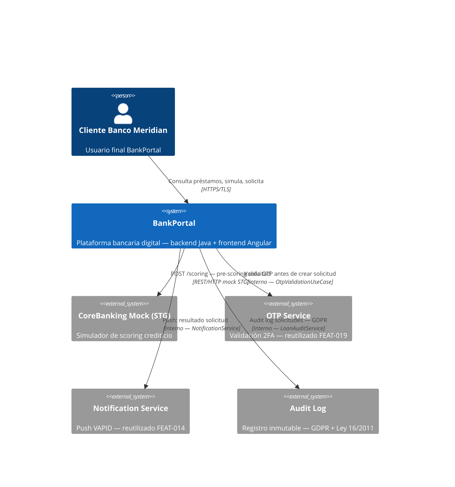
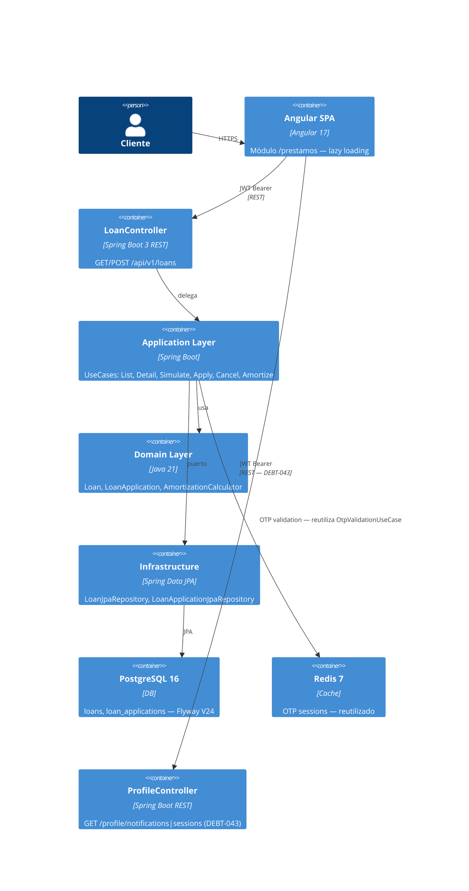
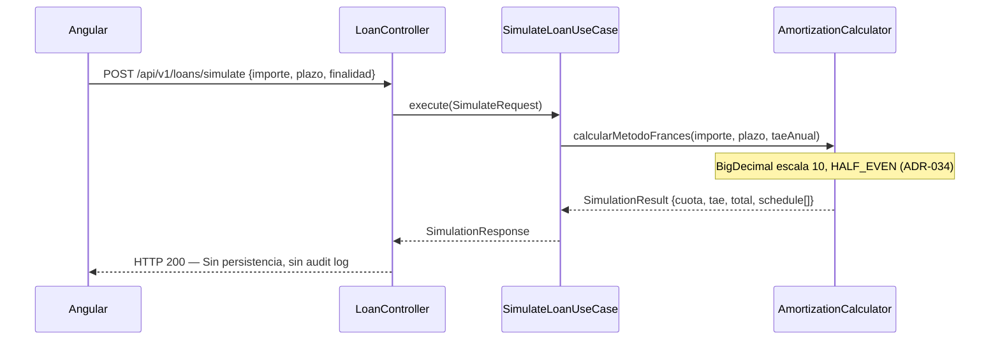
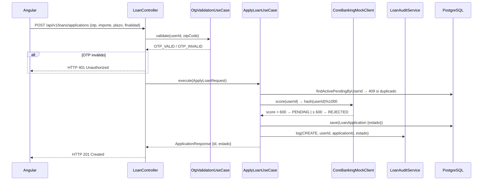

# HLD — FEAT-020 Gestión de Préstamos Personales
## BankPortal · Banco Meridian · Sprint 22

**Feature:** FEAT-020 | **Proyecto:** BankPortal | **Cliente:** Banco Meridian  
**Stack:** Java 21 / Spring Boot 3.3.4 + Angular 17  
**Tipo:** new-feature  
**Sprint:** 22 | **Versión:** 1.0 | **Estado:** APPROVED  
**Jira:** SCRUM-114..121 | **SOFIA:** v2.6

---

## 1. Análisis de impacto en monorepo

| Servicio/Módulo | Tipo de impacto | Acción |
|---|---|---|
| `backend-2fa` | MODIFICADO — nuevos paquetes `loan/` | Añadir dominio loans sin afectar existentes |
| `frontend` Angular | MODIFICADO — nuevo módulo lazy `loans/` | Registrar ruta + nav item (LA-FRONT-001) |
| `ProfileController` | MODIFICADO — endpoints notif+sessions | Cierre DEBT-043 en paquete `profile/` |
| `ExportAuditService` | MODIFICADO — IBAN real | Cierre DEBT-036: inyectar AccountRepository |
| `CardMaskingService` | MODIFICADO — regex PAN Maestro 19d | Cierre DEBT-037: ampliar regex |
| `AuthService / OtpValidationUseCase` | REUTILIZADO sin cambios | Préstamo reutiliza OTP de FEAT-019 |
| Otros módulos (account, transfer, cards...) | SIN IMPACTO | — |

**Decisión:** sin breaking changes en contratos existentes. Nuevos endpoints en namespace `/api/v1/loans`.

---

## 2. Contexto del sistema — C4 Nivel 1



---

## 3. Componentes involucrados — C4 Nivel 2



---

## 4. Flujos críticos

### 4.1 Simulación de préstamo (stateless)



### 4.2 Solicitud de préstamo con 2FA



---

## 5. Flyway — Migraciones

### V24__loans_and_applications.sql
```sql
-- Tabla principal de préstamos
CREATE TABLE loans (
  id             UUID PRIMARY KEY DEFAULT gen_random_uuid(),
  user_id        UUID NOT NULL,
  tipo           VARCHAR(20) NOT NULL,           -- PERSONAL, VEHICULO, REFORMA
  importe_original NUMERIC(15,2) NOT NULL,
  importe_pendiente NUMERIC(15,2) NOT NULL,
  plazo          INTEGER NOT NULL,               -- meses
  tae            NUMERIC(10,6) NOT NULL,         -- escala 6 decimales
  cuota_mensual  NUMERIC(15,2) NOT NULL,
  estado         VARCHAR(20) NOT NULL DEFAULT 'ACTIVE',
  fecha_inicio   DATE NOT NULL,
  fecha_fin      DATE,
  created_at     TIMESTAMPTZ NOT NULL DEFAULT NOW(),
  updated_at     TIMESTAMPTZ NOT NULL DEFAULT NOW()
);

CREATE INDEX idx_loans_user_id ON loans(user_id);
CREATE INDEX idx_loans_estado  ON loans(estado);

-- Tabla de solicitudes de préstamo
CREATE TABLE loan_applications (
  id             UUID PRIMARY KEY DEFAULT gen_random_uuid(),
  user_id        UUID NOT NULL,
  importe        NUMERIC(15,2) NOT NULL,
  plazo          INTEGER NOT NULL,
  finalidad      VARCHAR(20) NOT NULL,           -- CONSUMO, VEHICULO, REFORMA, OTROS
  estado         VARCHAR(20) NOT NULL DEFAULT 'PENDING',
  scoring_result INTEGER,
  otp_verified   BOOLEAN NOT NULL DEFAULT FALSE,
  created_at     TIMESTAMPTZ NOT NULL DEFAULT NOW(),
  updated_at     TIMESTAMPTZ NOT NULL DEFAULT NOW()
);

CREATE INDEX idx_loan_apps_user_id ON loan_applications(user_id);
CREATE INDEX idx_loan_apps_estado  ON loan_applications(estado);
-- RN-F020-11: índice parcial para detectar solicitudes PENDING duplicadas
CREATE UNIQUE INDEX idx_loan_apps_user_pending
  ON loan_applications(user_id)
  WHERE estado = 'PENDING';

-- Audit log de operaciones sobre solicitudes (RN-F020-14, GDPR)
CREATE TABLE loan_audit_log (
  id             UUID PRIMARY KEY DEFAULT gen_random_uuid(),
  user_id        UUID NOT NULL,
  application_id UUID,
  accion         VARCHAR(30) NOT NULL,           -- CREATE, APPROVE, REJECT, CANCEL
  estado_anterior VARCHAR(20),
  estado_nuevo   VARCHAR(20),
  ip_origen      INET,
  created_at     TIMESTAMPTZ NOT NULL DEFAULT NOW()
);
```

---

## 6. Decisiones técnicas — ver ADRs

- **ADR-034:** Cálculo de cuota y TAE con BigDecimal escala 10 (método francés)
- **ADR-035:** Pre-scoring mock determinista `hash(userId) % 1000` para STG

---

## 7. Variables de entorno nuevas

Ninguna nueva. El módulo reutiliza: `DB_URL`, `DB_USER`, `DB_PASSWORD`, `JWT_SECRET`, `REDIS_URL`.

---

*Architect Agent · SOFIA v2.6 · BankPortal — Banco Meridian · Sprint 22 · 2026-04-02*
