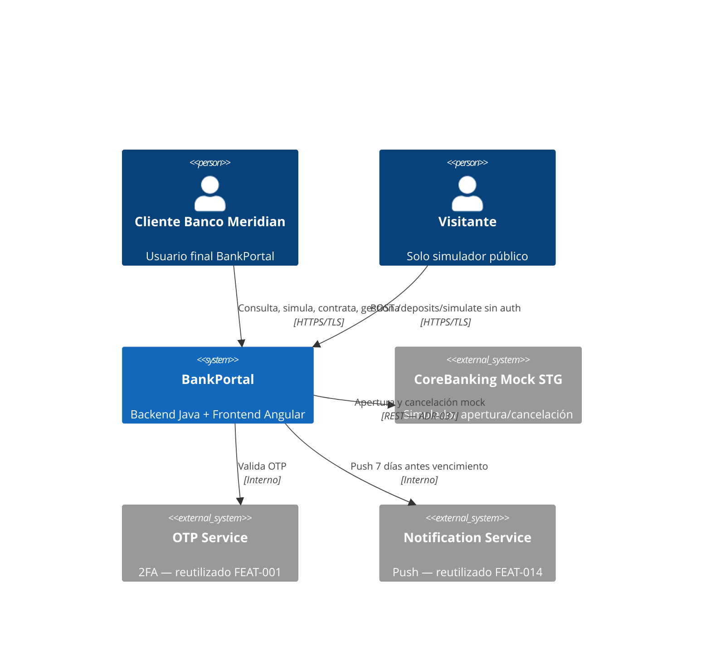
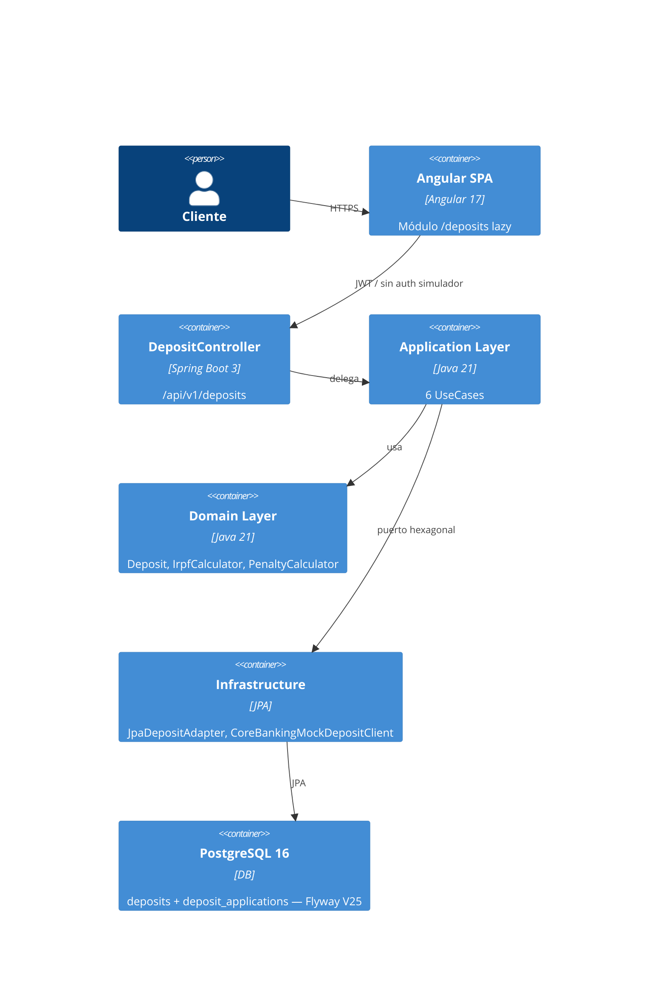

# HLD — FEAT-021 Depósitos a Plazo Fijo
## BankPortal · Banco Meridian · Sprint 23

**Feature:** FEAT-021 | **Stack:** Java 21 / Spring Boot 3.3.4 + Angular 17
**Sprint:** 23 | **Estado:** APPROVED | **Jira:** SCRUM-123..131 | **SOFIA:** v2.7

---

## 1. Análisis de impacto en monorepo

| Servicio/Módulo | Tipo de impacto | Acción |
|---|---|---|
| `backend-2fa` | MODIFICADO — nuevo paquete `deposit/` | Añadir dominio depósitos sin afectar existentes |
| `frontend` Angular | MODIFICADO — nuevo módulo lazy `deposits/` | Registrar ruta /deposits + nav item (LA-FRONT-001) |
| `AmortizationCalculator` | MODIFICADO — DEBT-044 | TAE/TIN externalizados a application.properties |
| `OtpValidationUseCase` | REUTILIZADO sin cambios | Apertura y cancelación reutilizan OTP de FEAT-001 |
| `ExportAuditService` | MODIFICADO — DEBT-036 | Inyectar AccountRepository — IBAN real |
| `CardValidationService` | MODIFICADO — DEBT-037 | Regex PAN Maestro 19 dígitos + Luhn |
| Otros módulos | SIN IMPACTO | — |

**Decisión:** sin breaking changes. Nuevos endpoints en `/api/v1/deposits`.

---

## 2. C4 Nivel 1 — Contexto



---

## 3. C4 Nivel 2 — Contenedores



---

## 4. Flujos críticos

### 4.1 Simulación (stateless, sin autenticación)
```
POST /api/v1/deposits/simulate
→ SimulateDepositUseCase → DepositSimulatorService
→ BigDecimal HALF_EVEN (ADR-036)
→ IrpfRetentionCalculator — tramos Art.25 Ley 35/2006
→ 200 {tin, tae, interesesBrutos, retencionIrpf, interesesNetos, totalVencimiento}
```

### 4.2 Apertura (SCA/PSD2)
```
POST /api/v1/deposits {importe, plazo, cuentaOrigenId, otpCode}
→ OtpValidationUseCase.validate()     [OTP inválido → 401]
→ verificar saldo cuenta origen        [Insuficiente → 422]
→ CoreBankingMockDepositClient.register()
→ INSERT deposits + deposit_applications (Flyway V25)
→ débito cuenta origen
→ 201 {depositId, estado: ACTIVE, fechaVencimiento}
```

### 4.3 Cancelación anticipada (SCA/PSD2)
```
POST /api/v1/deposits/{id}/cancel {otpCode}
→ OtpValidationUseCase.validate()
→ PenaltyCalculator: devengados × penaltyRate (desde application.properties)
→ UPDATE deposits SET estado=CANCELLED
→ abono cuenta origen
→ 200 {importeAbonado, penalizacion, interesesDevengados}
```

---

## 5. Modelo de datos — Flyway V25

```sql
CREATE TABLE deposits (
  id                  UUID PRIMARY KEY DEFAULT gen_random_uuid(),
  user_id             UUID NOT NULL,
  account_origin_id   UUID NOT NULL,
  importe             NUMERIC(15,2) NOT NULL,
  tin                 NUMERIC(6,4) NOT NULL,
  tae                 NUMERIC(6,4) NOT NULL,
  plazo_meses         INT NOT NULL,
  fecha_apertura      DATE NOT NULL,
  fecha_vencimiento   DATE NOT NULL,
  estado              VARCHAR(20) NOT NULL DEFAULT 'ACTIVE',
  renewal_instruction VARCHAR(30) NOT NULL DEFAULT 'RENEW_MANUAL',
  created_at          TIMESTAMPTZ NOT NULL DEFAULT NOW(),
  updated_at          TIMESTAMPTZ NOT NULL DEFAULT NOW()
);

CREATE TABLE deposit_applications (
  id           UUID PRIMARY KEY DEFAULT gen_random_uuid(),
  deposit_id   UUID NOT NULL REFERENCES deposits(id),
  user_id      UUID NOT NULL,
  tipo         VARCHAR(20) NOT NULL,
  estado       VARCHAR(20) NOT NULL,
  importe      NUMERIC(15,2),
  otp_verified BOOLEAN NOT NULL DEFAULT FALSE,
  created_at   TIMESTAMPTZ NOT NULL DEFAULT NOW()
);

CREATE INDEX idx_deposits_user_id ON deposits(user_id);
CREATE INDEX idx_deposits_estado  ON deposits(estado);
CREATE INDEX idx_dep_app_deposit  ON deposit_applications(deposit_id);
```

---

## 6. Contrato API

| Método | Endpoint | Auth | Response |
|---|---|---|---|
| POST | /api/v1/deposits/simulate | Sin auth | 200 SimulateDepositResponse |
| GET | /api/v1/deposits | Bearer JWT | 200 Page<DepositSummaryDTO> |
| POST | /api/v1/deposits | Bearer JWT | 201 DepositResponse |
| GET | /api/v1/deposits/{id} | Bearer JWT | 200 DepositDetailDTO |
| PATCH | /api/v1/deposits/{id}/renewal | Bearer JWT | 200 DepositSummaryDTO |
| POST | /api/v1/deposits/{id}/cancel | Bearer JWT | 200 CancellationResult |

---

## 7. ADRs
- ADR-036: Cálculo IRPF + simulación con BigDecimal HALF_EVEN (coherente con ADR-034)
- ADR-037: CoreBankingMockDepositClient STG (coherente con ADR-035)

---
*HLD generado por Architect Agent — SOFIA v2.7 — Sprint 23 — 2026-04-06*
