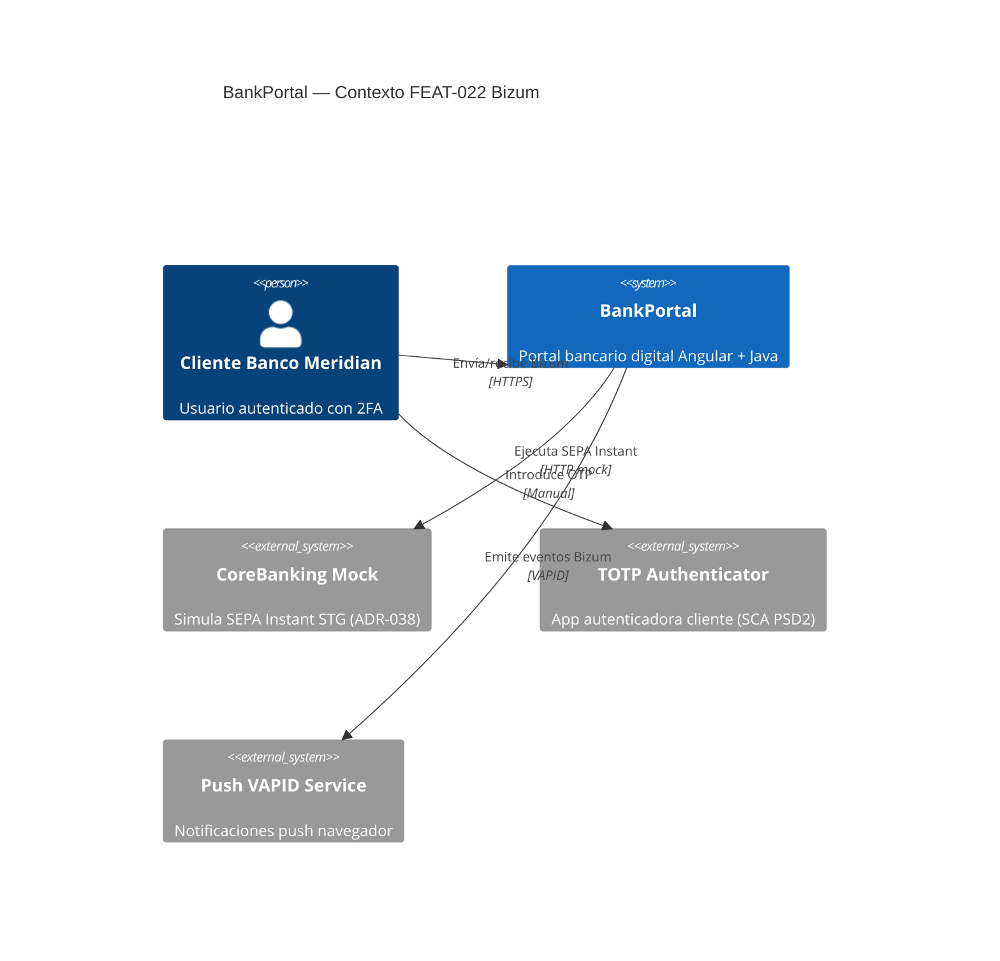
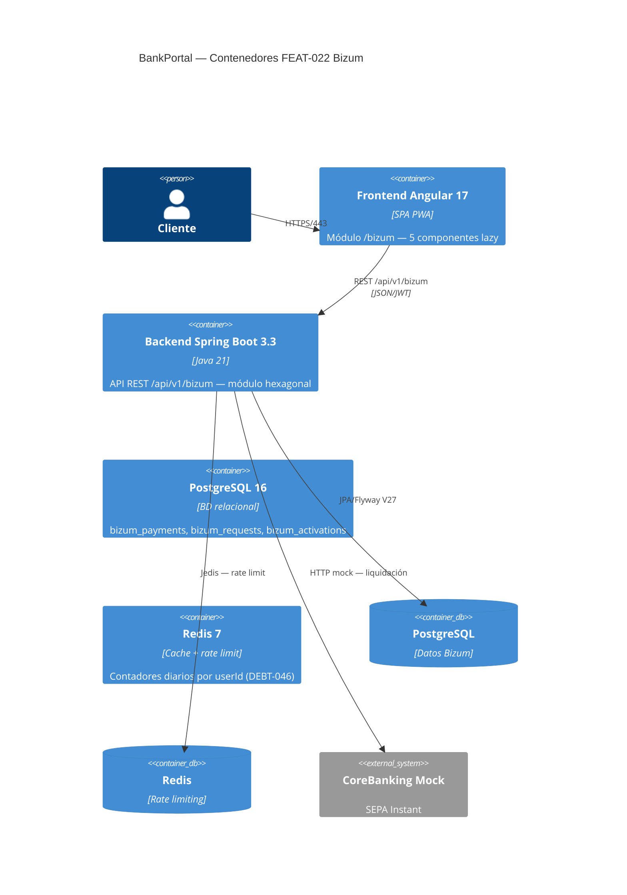
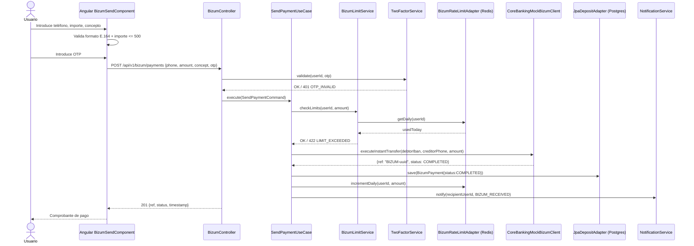

# HLD — FEAT-022: Bizum P2P
**Sprint 24 · BankPortal · Banco Meridian · SOFIA v2.7**

---

## 1. Contexto y alcance

FEAT-022 añade pagos P2P inmediatos Bizum al portal BankPortal. El módulo se integra con la infraestructura de autenticación 2FA (FEAT-001), notificaciones push VAPID (FEAT-014) y cuentas (FEAT-007). La liquidación se simula mediante un mock SEPA Instant síncrono en STG (ADR-038).

---

## 2. Diagrama C4 — Nivel Contexto



---

## 3. Diagrama C4 — Nivel Contenedor



---

## 4. Diagrama de Secuencia — Envío de pago Bizum



---

## 5. Modelo de datos — V27__bizum.sql

```sql
-- Activaciones Bizum
CREATE TABLE bizum_activations (
  id          UUID PRIMARY KEY DEFAULT gen_random_uuid(),
  user_id     UUID NOT NULL REFERENCES users(id),
  account_id  UUID NOT NULL REFERENCES accounts(id),
  phone       VARCHAR(20) NOT NULL UNIQUE,  -- E.164
  status      VARCHAR(20) NOT NULL DEFAULT 'ACTIVE',
  gdpr_consent_at TIMESTAMPTZ NOT NULL,
  activated_at    TIMESTAMPTZ NOT NULL DEFAULT NOW(),
  deactivated_at  TIMESTAMPTZ
);

-- Pagos Bizum (enviados/recibidos)
CREATE TABLE bizum_payments (
  id              UUID PRIMARY KEY DEFAULT gen_random_uuid(),
  sender_user_id  UUID NOT NULL REFERENCES users(id),
  recipient_phone VARCHAR(20) NOT NULL,
  amount          NUMERIC(12,2) NOT NULL,
  concept         VARCHAR(35),
  status          VARCHAR(20) NOT NULL DEFAULT 'PENDING',
  sepa_ref        VARCHAR(50),           -- BIZUM-{uuid}
  created_at      TIMESTAMPTZ NOT NULL DEFAULT NOW(),
  completed_at    TIMESTAMPTZ
);

-- Solicitudes de cobro
CREATE TABLE bizum_requests (
  id               UUID PRIMARY KEY DEFAULT gen_random_uuid(),
  requester_user_id UUID NOT NULL REFERENCES users(id),
  recipient_phone  VARCHAR(20) NOT NULL,
  amount           NUMERIC(12,2) NOT NULL,
  concept          VARCHAR(35),
  status           VARCHAR(20) NOT NULL DEFAULT 'PENDING',
  expires_at       TIMESTAMPTZ NOT NULL,  -- created_at + 24h
  created_at       TIMESTAMPTZ NOT NULL DEFAULT NOW(),
  resolved_at      TIMESTAMPTZ,
  payment_id       UUID REFERENCES bizum_payments(id)
);

CREATE INDEX idx_bizum_payments_sender ON bizum_payments(sender_user_id, created_at DESC);
CREATE INDEX idx_bizum_requests_recipient_phone ON bizum_requests(recipient_phone, status);
CREATE INDEX idx_bizum_requests_requester ON bizum_requests(requester_user_id, status);
```

### Mapa de tipos BD → Java (LA-019-13)

| Columna | Tipo PostgreSQL | Tipo Java | Notas |
|---|---|---|---|
| id | uuid | UUID | `rs.getObject("id", UUID.class)` |
| amount | numeric(12,2) | BigDecimal | HALF_EVEN (ADR-034) |
| created_at | timestamptz | Instant | `OffsetDateTime` en JdbcClient |
| expires_at | timestamptz | Instant | TTL 24h calculado al crear |
| status | varchar(20) | BizumStatus (enum) | PENDING/COMPLETED/REJECTED/EXPIRED |
| phone | varchar(20) | String | Validar E.164 en capa dominio |

---

## 6. API Contract — endpoints nuevos

| Método | Endpoint | Auth | Descripción |
|---|---|---|---|
| POST | /api/v1/bizum/activate | JWT | Activar Bizum y vincular teléfono |
| POST | /api/v1/bizum/payments | JWT + OTP | Enviar pago Bizum |
| POST | /api/v1/bizum/requests | JWT | Crear solicitud de cobro |
| PATCH | /api/v1/bizum/requests/{id} | JWT + OTP | Aceptar o rechazar solicitud |
| GET | /api/v1/bizum/transactions | JWT | Historial paginado |
| GET | /api/v1/bizum/status | JWT | Estado activación + límites |

---

## 7. Impacto en módulos existentes

| Módulo | Impacto | Detalle |
|---|---|---|
| TwoFactorService | Reutilización | Llamada a `validate(userId, otp)` — sin cambios |
| NotificationService | Extensión | Añadir tipos BIZUM_* en NotificationType enum |
| AccountRepository | Reutilización | Consulta saldo/IBAN para débito — sin cambios |
| Redis (DEBT-046) | Refactor | Nuevo key pattern `ratelimit:{userId}:bizum:{date}` |
| Flyway | Extensión | V27__bizum.sql — sin conflicto con V26 (depósitos) |

---

*HLD generado por Architect Agent — SOFIA v2.7 — Step 3 — Sprint 24*
