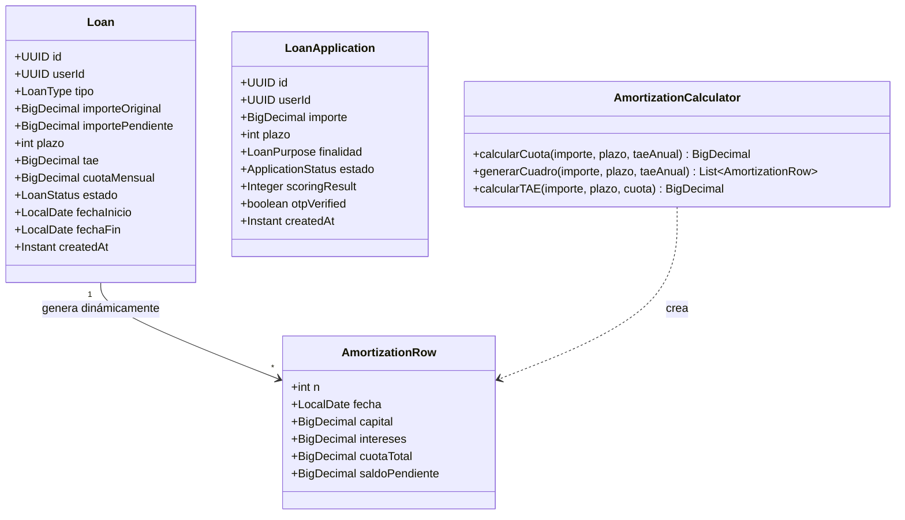

# LLD Backend — FEAT-020 Gestión de Préstamos Personales
## BankPortal · Banco Meridian · Sprint 22

**Servicio:** backend-2fa | **Stack:** Java 21 / Spring Boot 3.3.4  
**Feature:** FEAT-020 | **Versión:** 1.0 | **Estado:** APPROVED  
**Package raíz:** `com.experis.sofia.bankportal` (LA-020-09 — NUNCA `es.meridian`)

---

## 1. Estructura de paquetes nueva

```
apps/backend-2fa/src/main/java/com/experis/sofia/bankportal/
├── loan/
│   ├── domain/
│   │   ├── model/
│   │   │   ├── Loan.java                        # Entidad préstamo
│   │   │   ├── LoanApplication.java             # Entidad solicitud
│   │   │   ├── LoanStatus.java                  # Enum: ACTIVE|PENDING|APPROVED|REJECTED|PAID_OFF|CANCELLED
│   │   │   ├── LoanPurpose.java                 # Enum: CONSUMO|VEHICULO|REFORMA|OTROS
│   │   │   └── AmortizationRow.java             # Record: n, fecha, capital, intereses, cuota, saldo
│   │   ├── repository/
│   │   │   ├── LoanRepositoryPort.java          # Interface
│   │   │   └── LoanApplicationRepositoryPort.java
│   │   └── service/
│   │       └── AmortizationCalculator.java      # Lógica método francés BigDecimal
│   ├── application/
│   │   ├── usecase/
│   │   │   ├── ListLoansUseCase.java
│   │   │   ├── GetLoanDetailUseCase.java
│   │   │   ├── SimulateLoanUseCase.java         # Stateless — no persiste
│   │   │   ├── ApplyLoanUseCase.java            # OTP + scoring + persist
│   │   │   ├── GetAmortizationUseCase.java
│   │   │   └── CancelLoanApplicationUseCase.java
│   │   └── dto/
│   │       ├── LoanSummaryDTO.java              # Record — listado paginado
│   │       ├── LoanDetailDTO.java               # Record — detalle completo
│   │       ├── SimulateRequest.java             # Record — importe, plazo, finalidad
│   │       ├── SimulationResponse.java          # Record — cuota, tae, total, schedule
│   │       ├── ApplyLoanRequest.java            # Record — importe, plazo, finalidad, otpCode
│   │       └── LoanApplicationResponse.java     # Record — id, estado
│   ├── infrastructure/
│   │   ├── persistence/
│   │   │   ├── JpaLoanRepositoryAdapter.java    # @Repository @Primary
│   │   │   ├── JpaLoanApplicationRepositoryAdapter.java
│   │   │   ├── LoanJpaRepository.java           # extends JpaRepository<LoanEntity, UUID>
│   │   │   ├── LoanApplicationJpaRepository.java
│   │   │   ├── LoanEntity.java                  # @Entity loans
│   │   │   ├── LoanApplicationEntity.java       # @Entity loan_applications
│   │   │   └── LoanAuditLogRepository.java      # JdbcClient — fire-and-forget
│   │   └── scoring/
│   │       └── CoreBankingMockScoringClient.java # hash(userId)%1000 (ADR-035)
│   └── api/
│       └── LoanController.java                  # @RestController /api/v1/loans
│
└── profile/
    └── api/
        └── ProfileController.java               # MODIFICADO — añadir /notifications + /sessions (DEBT-043)
```

---

## 2. Diagrama de entidades



---

## 3. Implementación AmortizationCalculator — método francés

```java
@Service
public class AmortizationCalculator {

    private static final int SCALE = 10;
    private static final RoundingMode RM = RoundingMode.HALF_EVEN;  // ADR-034

    public BigDecimal calcularCuota(BigDecimal importe, int plazo, BigDecimal taeAnual) {
        // r = TAE_anual / 12
        BigDecimal r = taeAnual.divide(BigDecimal.valueOf(12 * 100), SCALE, RM);
        // (1+r)^n
        BigDecimal factor = BigDecimal.ONE.add(r).pow(plazo);
        // cuota = P * r * (1+r)^n / ((1+r)^n - 1)
        BigDecimal num = importe.multiply(r).multiply(factor);
        BigDecimal den = factor.subtract(BigDecimal.ONE);
        return num.divide(den, 2, RM);
    }

    public List<AmortizationRow> generarCuadro(BigDecimal importe, int plazo, BigDecimal taeAnual) {
        BigDecimal r = taeAnual.divide(BigDecimal.valueOf(12 * 100), SCALE, RM);
        BigDecimal cuota = calcularCuota(importe, plazo, taeAnual);
        BigDecimal saldo = importe;
        List<AmortizationRow> rows = new ArrayList<>(plazo);
        LocalDate fecha = LocalDate.now().plusMonths(1).withDayOfMonth(1);

        for (int n = 1; n <= plazo; n++) {
            BigDecimal intereses = saldo.multiply(r).setScale(2, RM);
            BigDecimal capital   = cuota.subtract(intereses);
            saldo = saldo.subtract(capital).max(BigDecimal.ZERO);
            rows.add(new AmortizationRow(n, fecha, capital, intereses, cuota, saldo));
            fecha = fecha.plusMonths(1);
        }
        return rows;
    }
}
```

---

## 4. LoanController — contrato REST

```java
@RestController
@RequestMapping("/api/v1/loans")
@PreAuthorize("isAuthenticated()")
public class LoanController {

    // GET /api/v1/loans — RN-F020-01
    @GetMapping
    public Page<LoanSummaryDTO> listLoans(
            @RequestAttribute("authenticatedUserId") UUID userId,
            Pageable pageable) { ... }

    // GET /api/v1/loans/{id}
    @GetMapping("/{id}")
    public LoanDetailDTO getLoan(@PathVariable UUID id,
            @RequestAttribute("authenticatedUserId") UUID userId) { ... }

    // GET /api/v1/loans/{id}/amortization — RN-F020-17 (no persistido)
    @GetMapping("/{id}/amortization")
    public List<AmortizationRow> getAmortization(@PathVariable UUID id,
            @RequestAttribute("authenticatedUserId") UUID userId) { ... }

    // POST /api/v1/loans/simulate — RN-F020-04 (stateless)
    @PostMapping("/simulate")
    public SimulationResponse simulate(@Valid @RequestBody SimulateRequest req) { ... }

    // POST /api/v1/loans/applications — RN-F020-09 OTP obligatorio
    @PostMapping("/applications")
    public ResponseEntity<LoanApplicationResponse> apply(
            @Valid @RequestBody ApplyLoanRequest req,
            @RequestAttribute("authenticatedUserId") UUID userId) { ... }

    // GET /api/v1/loans/applications/{id}
    @GetMapping("/applications/{id}")
    public LoanApplicationResponse getApplication(@PathVariable UUID id,
            @RequestAttribute("authenticatedUserId") UUID userId) { ... }

    // DELETE /api/v1/loans/applications/{id} — RN-F020-15,16
    @DeleteMapping("/applications/{id}")
    public ResponseEntity<Void> cancelApplication(@PathVariable UUID id,
            @RequestAttribute("authenticatedUserId") UUID userId) { ... }
}
```

---

## 5. Mapa de tipos BD → Java (LA-019-13)

| Columna | Tipo PostgreSQL | Tipo Java | Notas |
|---|---|---|---|
| id | uuid | UUID | `rs.getObject("id", UUID.class)` |
| user_id | uuid | UUID | FK |
| importe_original | numeric(15,2) | BigDecimal | NUNCA double |
| tae | numeric(10,6) | BigDecimal | escala 6 para precisión regulatoria |
| cuota_mensual | numeric(15,2) | BigDecimal | NUNCA double |
| estado | varchar(20) | String → LoanStatus.valueOf() | NO tipo ENUM PostgreSQL |
| fecha_inicio | date | LocalDate | sin timezone |
| created_at | timestamptz | Instant | CON timezone |
| updated_at | timestamptz | Instant | CON timezone |

---

## 6. Estrategia de perfiles Spring (LA-019-08)

| Adaptador | Anotación | Activo en |
|---|---|---|
| `JpaLoanRepositoryAdapter` | `@Primary` sin `@Profile` | dev, staging, production |
| Mock (solo test unitario) | `@Profile("mock")` | tests unitarios exclusivamente |

**NUNCA** usar `@Profile("!production")` — activa en staging y rompe G-4b.

---

## 7. ExceptionHandler para dominio loans

```java
@ControllerAdvice
public class LoanExceptionHandler {
    @ExceptionHandler(DuplicateLoanApplicationException.class)
    @ResponseStatus(HttpStatus.CONFLICT)               // RN-F020-11
    public ErrorResponse handleDuplicate(DuplicateLoanApplicationException e) { ... }

    @ExceptionHandler(LoanApplicationNotCancellableException.class)
    @ResponseStatus(HttpStatus.UNPROCESSABLE_ENTITY)   // RN-F020-15
    public ErrorResponse handleNotCancellable(LoanApplicationNotCancellableException e) { ... }

    @ExceptionHandler(LoanAccessDeniedException.class)
    @ResponseStatus(HttpStatus.FORBIDDEN)              // RN-F020-16
    public ErrorResponse handleAccessDenied(LoanAccessDeniedException e) { ... }

    @ExceptionHandler(LoanSimulationException.class)
    @ResponseStatus(HttpStatus.BAD_REQUEST)            // RN-F020-05,06
    public ErrorResponse handleSimulation(LoanSimulationException e) { ... }
}
```

---

## 8. DEBT-043 — ProfileController completar endpoints

```java
// Añadir en ProfileController.java
@GetMapping("/notifications")
public ResponseEntity<List<NotificationDTO>> getNotifications(
        @RequestAttribute("authenticatedUserId") UUID userId) {
    // RN-F020-19: SIEMPRE 200 + [] si vacío — NUNCA 404
    return ResponseEntity.ok(
        notificationService.findByUserId(userId)
                           .orElse(Collections.emptyList())
    );
}

@GetMapping("/sessions")
public ResponseEntity<List<SessionDTO>> getSessions(
        @RequestAttribute("authenticatedUserId") UUID userId) {
    // RN-F020-20: SIEMPRE 200 + [] si vacío — NUNCA 404
    return ResponseEntity.ok(
        sessionService.findActiveByUserId(userId)
                      .orElse(Collections.emptyList())
    );
}
```

---

*Architect Agent · SOFIA v2.6 · BankPortal — Banco Meridian · Sprint 22 · 2026-04-02*
