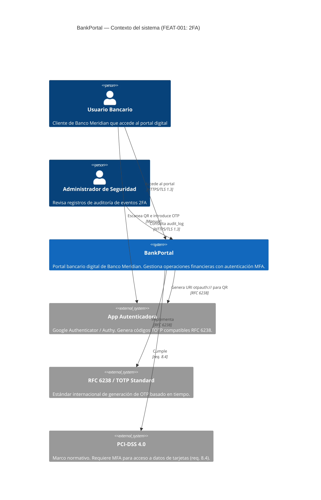
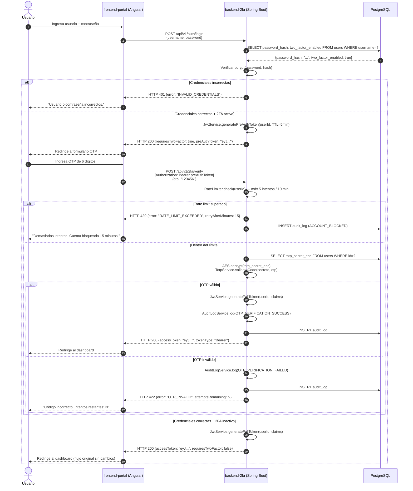
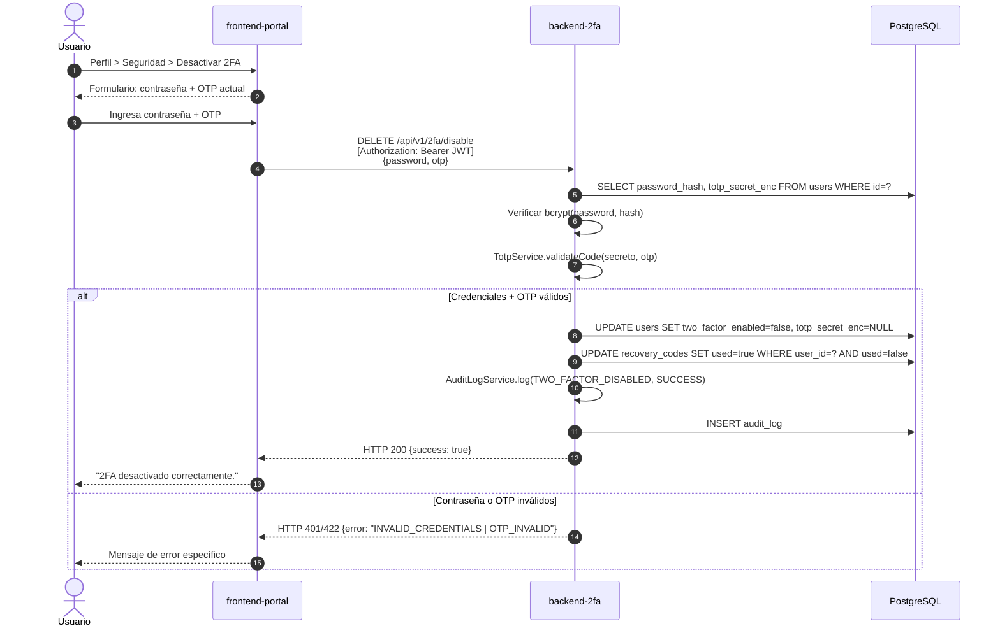
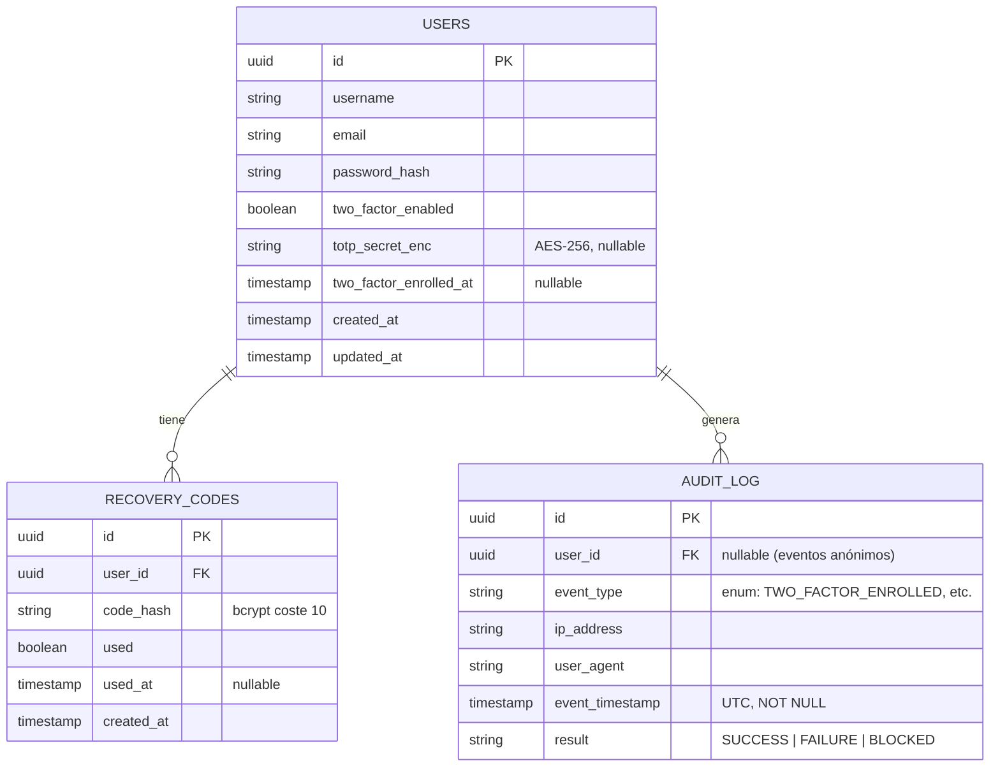

# HLD — Autenticación de Doble Factor (2FA)

> **Artefacto:** High Level Design (HLD)
> **Proceso CMMI:** TS — Technical Solution
> **Generado por:** SOFIA — Architect Agent
> **Fecha:** 2026-03-11
> **Versión:** 1.0 | **Estado:** IN_REVIEW (pendiente aprobación Tech Lead)

---

## 1. Metadata

| Campo              | Valor                                                        |
|--------------------|--------------------------------------------------------------|
| Feature ID         | FEAT-001                                                     |
| Proyecto           | BankPortal                                                   |
| Cliente            | Banco Meridian                                               |
| Stack              | Java 21 / Spring Boot 3.x · Angular 17+ · PostgreSQL 15     |
| Tipo de trabajo    | new-feature                                                  |
| Sprint             | Sprint 01 (2026-03-11 → 2026-03-25)                         |
| Versión            | 1.0                                                          |
| Estado             | IN_REVIEW                                                    |
| ADRs relacionados  | ADR-001, ADR-002, ADR-003, ADR-004                          |

---

## 2. Análisis de impacto en monorepo

| Servicio              | Tipo de impacto              | Acción requerida                                      |
|-----------------------|------------------------------|-------------------------------------------------------|
| `backend-2fa`         | NUEVO servicio/módulo        | Crear estructura completa bajo `apps/backend-2fa/`    |
| `frontend-portal`     | Modificación de módulo auth  | Añadir feature module `features/two-factor/`          |
| `POST /auth/login`    | Contrato API modificado      | Flujo condicional — responde pre-auth token si 2FA activo |
| Tabla `users` (BD)    | Modelo de datos extendido    | Migración Flyway: añadir columnas 2FA sin romper schema existente |
| JWT Service           | Sin cambio de contrato       | Reutilizar — emitir JWT completo solo post-OTP        |

> ✅ **Decisión:** los cambios en `POST /auth/login` son **retrocompatibles** —
> usuarios sin 2FA reciben el JWT completo exactamente como antes.
> El nuevo campo `requiresTwoFactor: true` en la respuesta es aditivo.
> Ver ADR-001 para detalle del patrón pre-auth token.

---

## 3. Contexto del sistema — C4 Nivel 1



---

## 4. Componentes del sistema — C4 Nivel 2

```mermaid
C4Container
  title BankPortal — Contenedores (FEAT-001: 2FA)

  Person(usuario, "Usuario Bancario", "")
  Person(admin, "Admin Seguridad", "")

  System_Boundary(bankportal, "BankPortal") {

    Container(frontend, "frontend-portal", "Angular 17+",
      "SPA bancaria. Gestiona flujo de login, enrolamiento 2FA,\ncódigos de recuperación y panel de perfil/seguridad.")

    Container(backend, "backend-2fa", "Java 21 / Spring Boot 3.x",
      "Microservicio de autenticación y 2FA. Expone REST API.\nGestiona TOTP, recovery codes y audit log.")

    ContainerDb(db, "PostgreSQL 15", "Base de datos relacional",
      "Persiste usuarios, secretos TOTP cifrados,\ncódigos de recuperación (bcrypt) y audit_log inmutable.")
  }

  System_Ext(authenticator, "App Autenticadora", "Google Authenticator / Authy")

  Rel(usuario, frontend, "Usa", "HTTPS / Browser")
  Rel(admin, backend, "Consulta audit API", "HTTPS / REST")
  Rel(frontend, backend, "Llama API REST", "HTTPS / JSON · JWT Bearer")
  Rel(backend, db, "Lee / Escribe", "JDBC / JPA · TLS")
  Rel(backend, authenticator, "Genera QR URI otpauth://", "RFC 6238 in-process")
  Rel(usuario, authenticator, "Escanea QR e introduce OTP", "Manual")
```

---

## 5. Flujos de interacción principales

### 5.1 Flujo de enrolamiento 2FA

```mermaid
sequenceDiagram
  autonumber
  actor U as Usuario
  participant FE as frontend-portal (Angular)
  participant BE as backend-2fa (Spring Boot)
  participant DB as PostgreSQL

  U->>FE: Navega a Perfil > Seguridad > Activar 2FA
  FE->>BE: POST /api/v1/2fa/enroll<br/>[Authorization: Bearer JWT]
  BE->>DB: SELECT totp_secret_enc, two_factor_enabled FROM users WHERE id=?
  DB-->>BE: {two_factor_enabled: false}
  BE->>BE: TotpService.generateSecret()<br/>Cifrar secreto AES-256
  BE->>DB: UPDATE users SET totp_secret_enc=? (pendiente confirmación)
  BE-->>FE: {qrDataUri: "data:image/png;base64,...", issuer: "BankMeridian"}
  FE-->>U: Muestra QR en pantalla
  U->>U: Escanea QR con Google Authenticator / Authy
  U->>FE: Ingresa OTP de 6 dígitos + clic "Confirmar"
  FE->>BE: POST /api/v1/2fa/enroll/confirm<br/>{otp: "123456"}
  BE->>BE: TotpService.validateCode(secreto, otp)<br/>Ventana ±30s, tolerancia ±1 período
  alt OTP válido
    BE->>DB: UPDATE users SET two_factor_enabled=true, two_factor_enrolled_at=NOW()
    BE->>BE: RecoveryCodeService.generateCodes(userId)<br/>10 códigos formato XXXX-XXXX-XXXX, hash bcrypt
    BE->>DB: INSERT INTO recovery_codes (10 filas)
    BE->>BE: AuditLogService.log(TWO_FACTOR_ENROLLED, SUCCESS)
    BE->>DB: INSERT INTO audit_log
    BE-->>FE: {success: true, recoveryCodes: ["XXXX-XXXX-XXXX", ...]}
    FE-->>U: Muestra 10 códigos de recuperación (única vez) + opción descarga
  else OTP inválido
    BE-->>FE: HTTP 422 {error: "OTP_INVALID"}
    FE-->>U: "Código inválido. Verifica la hora de tu dispositivo."
  end
```

### 5.2 Flujo de login con 2FA activo



### 5.3 Flujo de desactivación 2FA



---

## 6. Servicios nuevos o modificados

| Servicio / Módulo      | Acción    | Bounded Context                  | Endpoints principales                                   |
|------------------------|-----------|----------------------------------|---------------------------------------------------------|
| `backend-2fa`          | NUEVO     | Autenticación MFA                | `/api/v1/2fa/*` (6 endpoints nuevos)                   |
| `POST /auth/login`     | MODIFICADO| Autenticación                    | Respuesta extendida con `requiresTwoFactor` + `preAuthToken` |
| `frontend-portal`      | MODIFICADO| UI bancaria                      | Feature module `two-factor` (4 componentes Angular)     |
| PostgreSQL schema      | MODIFICADO| Persistencia                     | 3 columnas en `users` + 2 tablas nuevas                 |

---

## 7. Contrato de integración backend ↔ frontend

**Base URL:** `https://api.bankportal.meridian.com/v1`
**Auth header:** `Authorization: Bearer <token>`
**Content-Type:** `application/json`

| Método   | Endpoint                              | Auth requerida    | Descripción                                  |
|----------|---------------------------------------|-------------------|----------------------------------------------|
| `POST`   | `/auth/login`                         | Sin token         | Login — responde JWT completo o pre-auth token |
| `POST`   | `/2fa/enroll`                         | JWT completo      | Genera secreto TOTP + QR data URI            |
| `POST`   | `/2fa/enroll/confirm`                 | JWT completo      | Valida primer OTP, activa 2FA                |
| `POST`   | `/2fa/verify`                         | Pre-auth token    | Verifica OTP o recovery code, emite JWT      |
| `DELETE` | `/2fa/disable`                        | JWT completo      | Desactiva 2FA con confirmación               |
| `POST`   | `/2fa/recovery-codes/generate`        | JWT completo      | Regenera 10 nuevos códigos de recuperación   |
| `GET`    | `/2fa/recovery-codes/status`          | JWT completo      | Retorna count de recovery codes disponibles  |

> 📋 El contrato OpenAPI completo se define en el LLD Backend.
> Ver `docs/architecture/lld/FEAT-001-lld-backend.md`

---

## 8. Modelo de datos — vista de alto nivel



---

## 9. Componentes Angular — vista de alto nivel

```mermaid
C4Component
  title frontend-portal — Feature Module two-factor (Angular)

  Component(twoFactorModule, "TwoFactorModule", "NgModule / Standalone",
    "Feature module lazy-loaded. Agrupa componentes y servicios 2FA.")

  Component(setupComp, "TwoFactorSetupComponent", "Angular Smart Component",
    "Panel Perfil > Seguridad. Estado 2FA, activación y desactivación.")

  Component(otpComp, "OtpVerificationComponent", "Angular Smart Component",
    "Pantalla de ingreso OTP post-login. Maneja verificación y recovery code.")

  Component(recoveryComp, "RecoveryCodesComponent", "Angular Dumb Component",
    "Muestra 10 códigos post-enrolamiento. Descarga .txt. Solo se renderiza una vez.")

  Component(twoFactorSvc, "TwoFactorService", "Angular Service + HttpClient",
    "Encapsula todas las llamadas HTTP al backend-2fa.")

  Component(authGuard, "TwoFactorGuard", "Angular Route Guard (CanActivate)",
    "Redirige al formulario OTP si el token es pre-auth y la ruta requiere auth completa.")

  Rel(setupComp, twoFactorSvc, "Llama enroll / disable")
  Rel(otpComp, twoFactorSvc, "Llama verify")
  Rel(recoveryComp, twoFactorSvc, "Llama recovery-codes/generate")
  Rel(twoFactorSvc, authGuard, "Expone estado de autenticación")
```

---

## 10. Decisiones técnicas — ver ADRs

| ADR      | Decisión                                                     | Estado    |
|----------|--------------------------------------------------------------|-----------|
| ADR-001  | Pre-auth token stateless vs sesión server-side para flujo 2FA | Aceptado |
| ADR-002  | Bucket4j in-process vs Redis distribuido para rate limiting   | Aceptado |
| ADR-003  | AOP `@TwoFactorAudit` vs interceptor HTTP para audit log      | Aceptado |
| ADR-004  | `dev.samstevens.totp` vs implementación manual RFC 6238       | Aceptado |

---

## 11. RNF cubiertos por este diseño

| RNF      | Cómo se cubre en el diseño                                                      |
|----------|---------------------------------------------------------------------------------|
| RNF-D01  | Secreto TOTP cifrado AES-256 antes de `UPDATE users`; nunca en texto plano      |
| RNF-D02  | Recovery codes almacenados como `BCrypt.hash(code, cost=10)`                    |
| RNF-D03  | `RateLimiter` en `/2fa/verify` — Bucket4j por `userId` (ver ADR-002)           |
| RNF-D04  | `TotpService.validateCode()` con ventana ±30s, tolerancia ±1 período            |
| RNF-D05  | p95 < 300ms cubierto por: operaciones criptográficas in-process + índice en `users.id` |
| RNF-D06  | `audit_log` sin DELETE via API; retención 12m gestionada por política de BD/infra |
| RNF-001  | p95 < 200ms para todos los endpoints salvo `/2fa/verify` (ver RNF-D05)          |
| RNF-003  | Todos los endpoints `/2fa/*` requieren JWT (Bearer) o pre-auth token validado   |
| RNF-004  | TLS 1.3 en todos los endpoints — responsabilidad de infra (ya disponible)       |

---

## 12. Trazabilidad CMMI Nivel 3

| Área de proceso CMMI | Evidencia en este artefacto                                        |
|----------------------|--------------------------------------------------------------------|
| TS — Technical Solution | HLD completo con C4 L1+L2, flujos de secuencia, modelo de datos |
| IPM — Integrated Project Mgmt | Impacto en monorepo analizado y documentado              |
| RSKM — Risk Management | RNF mapeados a decisiones técnicas concretas                    |
| CM — Configuration Mgmt | Versión 1.0, artefacto en git rama feature                      |
| VER — Verification | Checklist de completitud cubierto (ver sección 13)                  |

---

## 13. Checklist de completitud

```
COMPLETITUD
[x] HLD tiene diagramas C4 Nivel 1 y Nivel 2 en Mermaid
[x] Flujos de secuencia para los 3 flujos críticos (enrolamiento, login, desactivación)
[x] Modelo de datos ER de alto nivel
[x] Vista de componentes Angular
[x] Análisis de impacto en monorepo documentado
[x] Contrato de integración backend ↔ frontend definido
[x] 4 ADRs generados para las decisiones no triviales
[x] RNF del SRS mapeados a decisiones de diseño

TRAZABILIDAD
[x] Metadata completa (feature ID, stack, tipo de trabajo, sprint)
[x] LLDs backend y frontend referenciados
[x] ADRs numerados y vinculados
```

---

*Generado por SOFIA Architect Agent · BankPortal · Sprint 01 · 2026-03-11*
