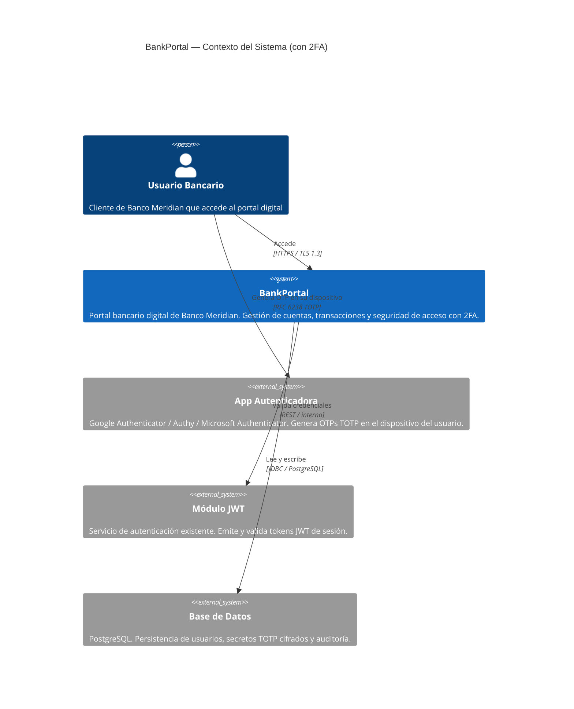
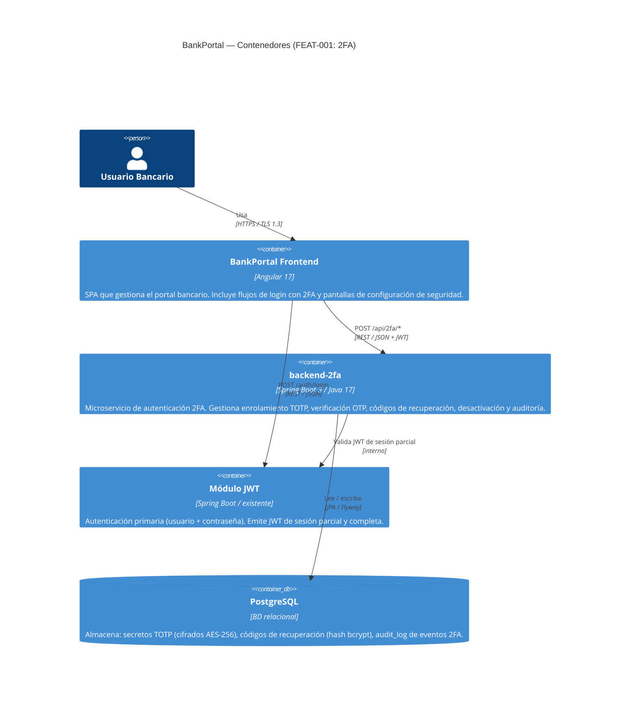

# HLD — FEAT-001: Autenticación de Doble Factor (2FA)

## Metadata

| Campo | Valor |
|---|---|
| **Feature** | FEAT-001 — Autenticación de Doble Factor (2FA) |
| **Proyecto** | BankPortal — Banco Meridian |
| **Stack** | Java 17 / Spring Boot 3.x (backend) + Angular 17 (frontend) |
| **Tipo de trabajo** | new-feature |
| **Sprint** | Sprint 1 + Sprint 2 |
| **Versión** | 1.0 |
| **Estado** | DRAFT — 🔒 Pendiente aprobación Tech Lead |
| **Fecha** | 2026-03-14 |
| **Autor** | SOFIA Architect Agent |

---

## Análisis de impacto en monorepo

| Servicio / Módulo | Tipo de impacto | Acción requerida |
|---|---|---|
| `backend-2fa` | NUEVO servicio | Crear módulo desde cero |
| Módulo JWT existente | Integración — lectura de userId | Sin cambio de contrato — solo consumo |
| Tabla `users` (BD existente) | Extensión — nuevas columnas | Migración Flyway compatible hacia adelante |
| `frontend-portal` | Extensión — nuevas pantallas y flujo login | Sin cambio en componentes existentes no relacionados |

✅ **Sin rotura de contratos existentes.** La integración con JWT es de solo lectura y la migración de BD es aditiva.

---

## Contexto del sistema — C4 Nivel 1



---

## Componentes involucrados — C4 Nivel 2



---

## Flujos principales de alto nivel

### Flujo 1 — Enrolamiento 2FA

```
Usuario → Angular → POST /api/2fa/enroll (JWT) → backend-2fa
  → genera secreto TOTP (TotpService)
  → retorna QR URI
  ← Angular muestra QR al usuario
Usuario escanea con App Autenticadora (RFC 6238)
Usuario → Angular → POST /api/2fa/activate (código OTP) → backend-2fa
  → verifica OTP (TotpService.verifyCode)
  → cifra secreto AES-256 → guarda en users.totp_secret
  → genera 10 códigos recuperación (hash bcrypt) → guarda en recovery_codes
  → registra audit_log: 2FA_ACTIVATED
  ← Angular muestra modal con códigos de recuperación (obligatorio)
```

### Flujo 2 — Login con 2FA activo

```
Usuario → Angular → POST /auth/login (usuario + pwd) → Módulo JWT
  → JWT de sesión parcial (scope: 2fa-pending)
  ← Angular detecta scope 2fa-pending → muestra pantalla OTP
Usuario → Angular → POST /api/2fa/verify (OTP) → backend-2fa
  → valida JWT parcial
  → verifica OTP con tolerancia ±1 período
  → si OK: emite JWT de sesión completa (scope: full-session) + registra 2FA_VERIFY_SUCCESS
  → si FAIL: incrementa contador; si ≥ 5 → bloqueo 15 min + registra 2FA_ACCOUNT_LOCKED
  ← Angular: acceso al dashboard (sesión completa) o error
```

### Flujo 3 — Recuperación sin OTP

```
Usuario → Angular (enlace "Usar código de recuperación")
  → POST /api/2fa/verify-recovery (código) → backend-2fa
  → valida hash bcrypt del código
  → si OK: invalida código (one-time) + emite JWT completo + registra 2FA_RECOVERY_USED
  → si FAIL: error + registra 2FA_RECOVERY_FAILED
```

---

## Servicios nuevos o modificados

| Servicio | Acción | Bounded Context | Puerto | Protocolo |
|---|---|---|---|---|
| `backend-2fa` | NUEVO | 2FA / Seguridad de acceso | 8081 | REST / HTTPS |
| `frontend-portal` (features/security) | MOD — nuevas pantallas | Seguridad de usuario | N/A (SPA) | HTTPS |
| Tabla `users` | MOD — nuevas columnas | Usuario / Perfil | N/A | Migración Flyway |
| Tabla `recovery_codes` | NUEVA | 2FA / Recuperación | N/A | Migración Flyway |
| Tabla `audit_log` | NUEVA | Auditoría de seguridad | N/A | Migración Flyway |

---

## Contrato de integración backend ↔ frontend

**Base URL:** `https://api.bankportal.meridian.com/v1`
**Auth:** Bearer JWT en header `Authorization` (requerido en todos los endpoints 2FA)
**Sesión parcial:** JWT con claim `scope: "2fa-pending"` emitido por módulo JWT tras credenciales válidas
**Sesión completa:** JWT con claim `scope: "full-session"` emitido por backend-2fa tras OTP válido

| Método | Endpoint | Descripción | Auth requerida |
|---|---|---|---|
| `POST` | `/api/2fa/enroll` | Genera secreto TOTP y QR URI | JWT sesión parcial |
| `POST` | `/api/2fa/activate` | Confirma activación con primer OTP | JWT sesión parcial |
| `POST` | `/api/2fa/verify` | Verifica OTP en login | JWT sesión parcial |
| `POST` | `/api/2fa/verify-recovery` | Usa código de recuperación | JWT sesión parcial |
| `POST` | `/api/2fa/recovery-codes/generate` | Regenera códigos de recuperación | JWT sesión completa |
| `DELETE` | `/api/2fa/deactivate` | Desactiva 2FA | JWT sesión completa |
| `GET` | `/api/2fa/status` | Obtiene estado 2FA del usuario | JWT sesión completa |

*Especificación OpenAPI completa: ver `docs/architecture/openapi/openapi-2fa.yaml`*

---

## Decisiones técnicas — ver ADRs

| ADR | Título |
|---|---|
| ADR-001 | Elección de librería TOTP para Java/Spring Boot |
| ADR-002 | Estrategia de cifrado de secretos TOTP en base de datos |
| ADR-003 | Modelo de sesión en dos fases (partial JWT → full JWT) |
| ADR-004 | Rate limiting: implementación en capa de aplicación vs API Gateway |

---

*Generado por SOFIA Architect Agent — 2026-03-14*
*Estado: DRAFT — 🔒 Pendiente aprobación Tech Lead*
