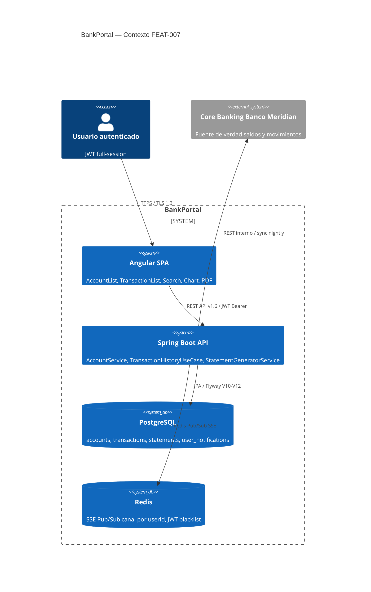
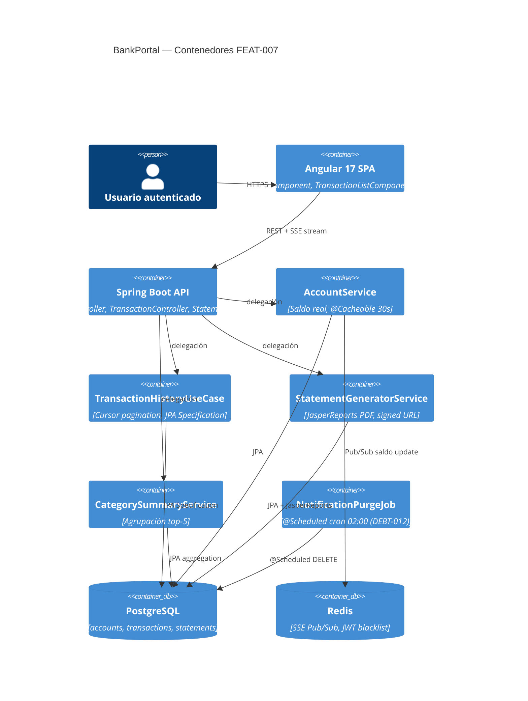
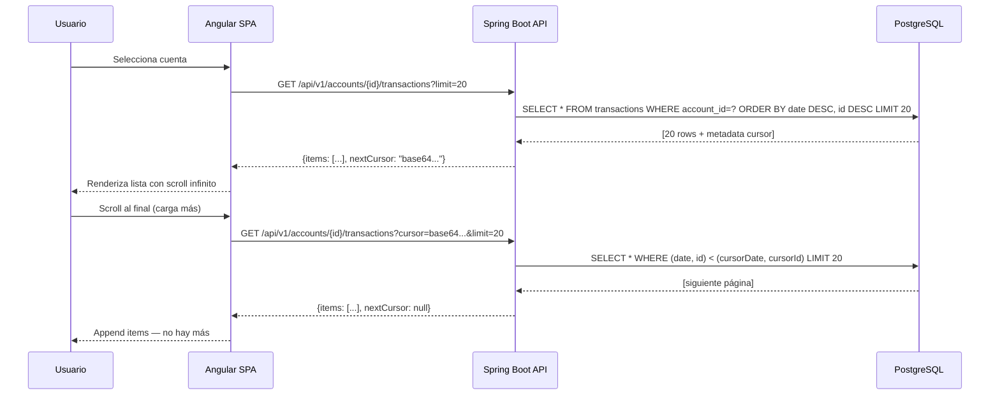

# HLD — FEAT-007: Consulta de Cuentas y Movimientos
## BankPortal · Banco Meridian · Sprint 9
*SOFIA Architect Agent · 2026-03-19*

## Metadata
| Campo | Valor |
|---|---|
| Feature | FEAT-007 |
| Sprint | 9 |
| Versión | 1.0 |
| Estado | Pendiente aprobación Tech Lead |
| ADRs asociados | ADR-013, ADR-014, ADR-015 |
| Cumplimiento | PCI-DSS 4.0 req. 3.4 / 4.2 · GDPR Art. 25 |

## Análisis de impacto en monorepo

| Servicio | Impacto | Acción |
|---|---|---|
| backend-2fa (AuthService) | Validar scope full-session en nuevos endpoints | Verificar JwtAuthFilter |
| user_notifications (SSE) | DEBT-011 refactoriza SseEmitter → Redis Pub/Sub | ADR-013 |
| NotificationPurgeJob | DEBT-012 nuevo @Scheduled — sin impacto API | Solo config scheduler |
| accounts, transactions, statements | Dominios nuevos — 0 conflicto | Flyway V10/V11/V12 |

## Diagrama C4 Nivel 1 (Contexto)

## Diagrama C4 Nivel 2 (Contenedores)

## Diagrama de secuencia — US-702 (Historial con cursor)

## Decisiones de arquitectura

### ADR-013 — Redis Pub/Sub para SSE multi-pod (DEBT-011)
- **Problema:** SseEmitter en memoria no escala a múltiples pods
- **Decisión:** RedisMessageListenerContainer — canal sse:{userId} por conexión
- **Fallback:** polling Angular 30s si Redis no disponible
- **Estado:** ACEPTADO

### ADR-014 — Cursor-based pagination para historial
- **Problema:** OFFSET/LIMIT genera full scan en tablas > 10k filas
- **Decisión:** cursor (date, id) serializado en Base64 opaco
- **Índice requerido:** (account_id, date DESC, id DESC) en Flyway V10
- **Estado:** ACEPTADO

### ADR-015 — JasperReports para extracto PDF
- **Problema:** US-704 requiere PDF con formato corporativo Banco Meridian
- **Decisión:** JasperReports con template .jrxml — signed URL TTL 60s
- **Alternativas descartadas:** iText (AGPL), PDFBox (bajo nivel), wkhtmltopdf (binario nativo)
- **Estado:** ACEPTADO

*CMMI Level 3 — TS SP 1.1 · TS SP 2.1 · TS SP 3.1*
*SOFIA Architect Agent · BankPortal Sprint 9 · 2026-03-19*
