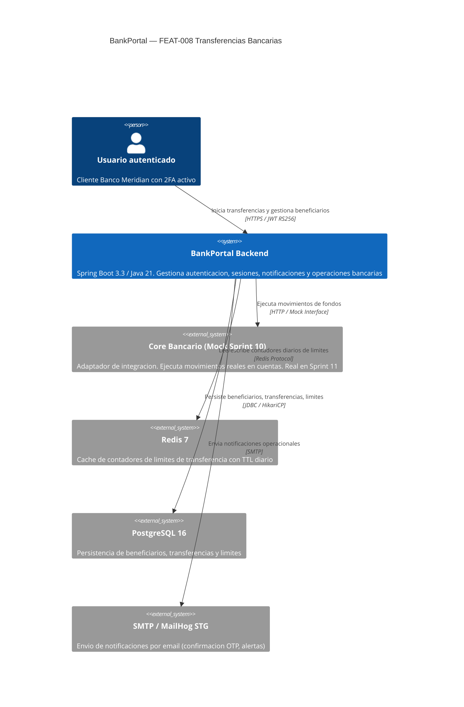
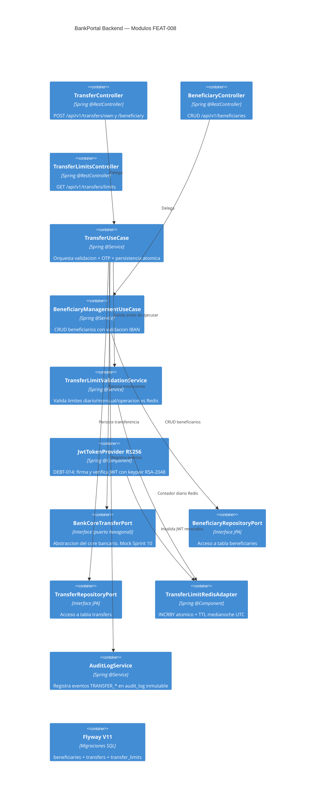
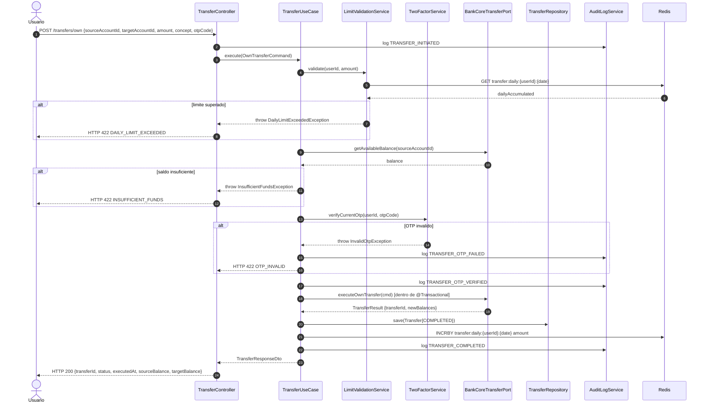

# HLD-FEAT-008 — Transferencias Bancarias
# BankPortal / Banco Meridian

## Metadata

| Campo | Valor |
|---|---|
| Feature | FEAT-008 — Transferencias Bancarias |
| Proyecto | BankPortal — Banco Meridian |
| Stack | Java 21 / Spring Boot 3.3.4 + Angular 17 |
| Tipo de trabajo | new-feature |
| Sprint | 10 |
| Versión | 1.0 |
| Estado | PENDING APPROVAL — Gate 3 Tech Lead |
| Fecha | 2026-03-20 |
| Autor | SOFIA Architect Agent |

---

## Análisis de impacto en monorepo (Paso 0)

| Servicio/Módulo | Tipo de impacto | Acción requerida |
|---|---|---|
| `JwtTokenProvider` / `PreAuthTokenProvider` | Cambio de algoritmo HS256 → RS256 | DEBT-014: reemplazar Keys.hmacShaKeyFor por keypair RSA-2048 |
| `JwtProperties` | Cambio de propiedades | Reemplazar `secret`/`pre-auth-secret` por `private-key-pem`/`public-key-pem` |
| `application-staging.yml` | Nuevas variables de configuración | Añadir claves RSA en Base64 + `docker-compose down -v` previo |
| `SecurityFilterChain` (FEAT-001) | Verificación JWT — cambio de key type | Actualizar `JwtAuthenticationFilter` para usar PublicKey RSA |
| Flyway V10 (FEAT-007) | Adición de V11 — sin modificar V10 | Nueva migración aditiva — sin impacto en datos existentes |
| `AccountSummaryUseCase` (FEAT-007) | Ninguno | — |
| `audit_log` (FEAT-005) | Nuevos event types | INSERT-only — compatible hacia adelante |

**Decisión:** Con impacto en JWT (DEBT-014) — documentado en ADR-015. Resto de cambios son aditivos y no breaking.

---

## Contexto del sistema — C4 Nivel 1

---

## Componentes involucrados — C4 Nivel 2

---

## Flujo de transferencia — diagrama de secuencia principal

---

## Decisiones técnicas — ADRs generados

| ADR | Título | Estado |
|---|---|---|
| ADR-015 | Migración JWT de HS256 a RS256 (DEBT-014) | Propuesto |
| ADR-016 | Patrón saga local para atomicidad de transferencias | Propuesto |

---

## Servicios nuevos y modificados

| Servicio/Clase | Acción | Bounded Context | Notas |
|---|---|---|---|
| `TransferController` | NUEVO | Transfers | POST /own + /beneficiary |
| `BeneficiaryController` | NUEVO | Beneficiaries | CRUD + validacion IBAN |
| `TransferLimitsController` | NUEVO | Transfers | Solo lectura |
| `TransferUseCase` | NUEVO | Transfers | Saga local con @Transactional |
| `TransferToBeneficiaryUseCase` | NUEVO | Transfers | Reutiliza TransferUseCase |
| `BeneficiaryManagementUseCase` | NUEVO | Beneficiaries | CRUD + OTP en alta |
| `TransferLimitValidationService` | NUEVO | Transfers | Redis INCRBY atomic |
| `BankCoreTransferPort` | NUEVO | Transfers | Interfaz hexagonal sellada |
| `BankCoreMockAdapter` | NUEVO | Transfers | Mock Sprint 10 |
| `JwtTokenProvider` | MODIFICADO | Auth | HS256 -> RS256 (DEBT-014) |
| `PreAuthTokenProvider` | MODIFICADO | Auth | HS256 -> RS256 (DEBT-014) |
| `JwtProperties` | MODIFICADO | Auth | Nuevas propiedades PEM |
| Flyway V11 | NUEVO | DB | 3 tablas nuevas aditivas |

---

## Contrato de integración Backend -> Frontend

**Base URL:** `http://localhost:8081/api/v1` (STG)
**Auth:** `Authorization: Bearer {JWT RS256}`
**Content-Type:** `application/json`

| Método | Endpoint | Descripción |
|---|---|---|
| POST | /transfers/own | Transferencia entre cuentas propias |
| POST | /transfers/beneficiary | Transferencia a beneficiario guardado |
| GET | /transfers/limits | Consultar límites vigentes |
| GET | /beneficiaries | Listar beneficiarios activos |
| POST | /beneficiaries | Dar de alta beneficiario (con OTP) |
| PUT | /beneficiaries/{id} | Editar alias (sin OTP) |
| DELETE | /beneficiaries/{id} | Eliminar beneficiario (soft delete) |

---

*Generado por SOFIA Architect Agent — Step 3*
*CMMI Level 3 — TS SP 1.1 · TS SP 2.1 · TS SP 3.1*
*BankPortal Sprint 10 — FEAT-008 — 2026-03-20 — v1.0 PENDING APPROVAL*
