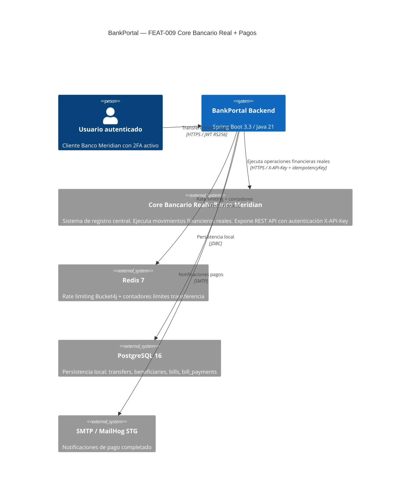
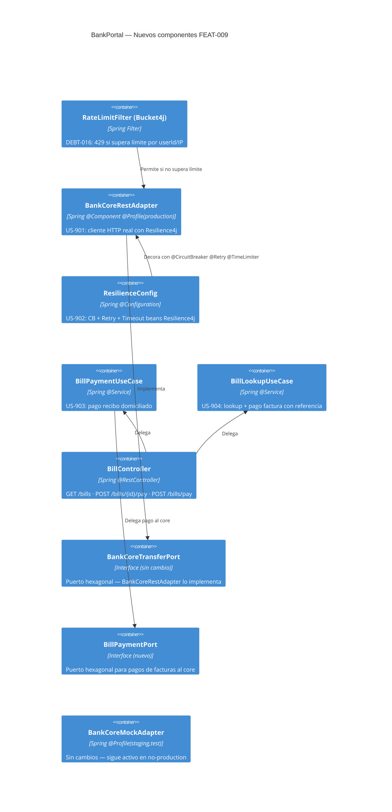
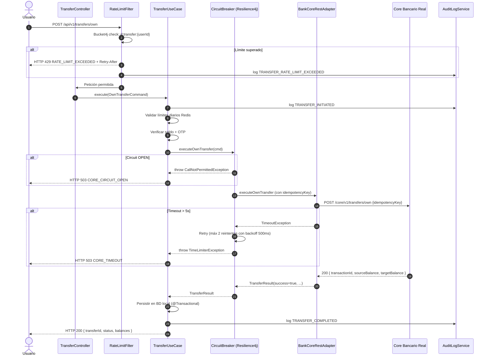

# HLD-FEAT-009 — Core Bancario Real + Pagos de Servicios
# BankPortal / Banco Meridian

## Metadata

| Campo | Valor |
|---|---|
| Feature | FEAT-009 |
| Proyecto | BankPortal — Banco Meridian |
| Stack | Java 21 / Spring Boot 3.3.4 |
| Tipo | new-feature + tech-debt |
| Sprint | 11 |
| Versión | 1.0 |
| Estado | PENDING APPROVAL — Gate 3 Tech Lead |
| Fecha | 2026-03-21 |

---

## Análisis de impacto en monorepo (Paso 0)

| Servicio/Módulo | Impacto | Acción |
|---|---|---|
| `BankCoreMockAdapter` | Reemplazado por `BankCoreRestAdapter` en perfil production | `@Profile` actualizado — sin cambio de interfaz |
| `BankCoreTransferPort` | Ninguno — interfaz sellada sin modificar | — |
| `TransferUseCase` / `TransferToBeneficiaryUseCase` | Ninguno — beneficio del diseño hexagonal | — |
| `TransferController` / `BeneficiaryController` | Añadir decorador `@RateLimited` (DEBT-016) | Rate limiting transparente para el negocio |
| `pom.xml` | Añadir `resilience4j-spring-boot3` + `bucket4j-spring-boot-starter` | Nuevas dependencias |
| Flyway V11 (FEAT-008) | Sin impacto — V12 es aditivo | Nuevas tablas `bills` + `bill_payments` |

**Decisión:** Cambios aditivos y de infraestructura. El diseño hexagonal de FEAT-008 protege el dominio. Dos ADRs requeridos: ADR-017 (Resilience4j) y ADR-018 (rate limiting Bucket4j).

---

## Contexto del sistema — C4 Nivel 1

---

## Componentes involucrados — C4 Nivel 2

---

## Flujo de transferencia con core real + resiliencia

---

## ADRs generados

| ADR | Título | Estado |
|---|---|---|
| ADR-017 | Resilience4j para resiliencia de llamadas al core bancario | Propuesto |
| ADR-018 | Bucket4j + Redis para rate limiting en endpoints financieros | Propuesto |

---

## Contrato de integración Backend → Frontend (nuevos endpoints)

| Método | Endpoint | Descripción |
|---|---|---|
| GET | /api/v1/bills | Listar recibos domiciliados PENDING |
| POST | /api/v1/bills/{id}/pay | Pagar recibo domiciliado (OTP) |
| GET | /api/v1/bills/lookup?reference={ref} | Buscar factura por referencia |
| POST | /api/v1/bills/pay | Pagar factura con referencia (OTP) |

---

*Generado por SOFIA Architect Agent — Step 3*
*CMMI Level 3 — TS SP 1.1 · TS SP 2.1*
*BankPortal Sprint 11 — FEAT-009 — 2026-03-21 — v1.0 PENDING APPROVAL*
