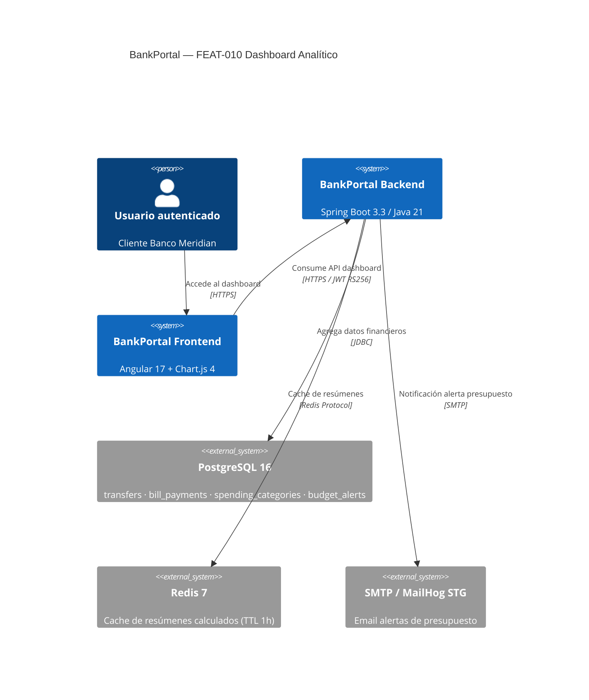
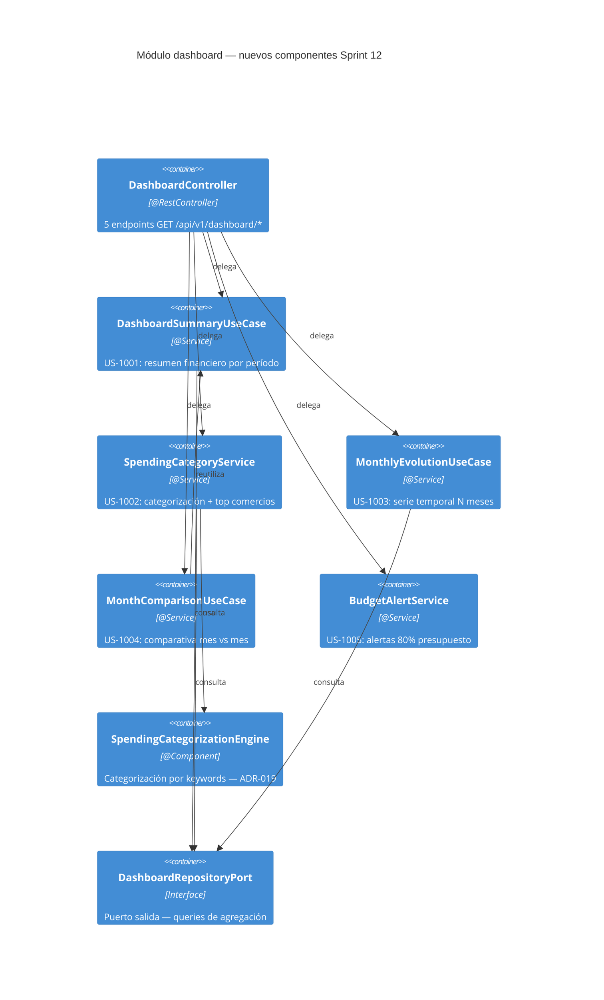
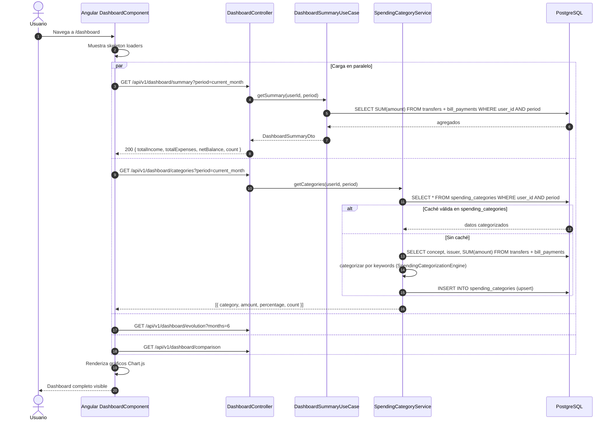

# HLD-FEAT-010 — Dashboard Analítico de Gastos y Movimientos
# BankPortal / Banco Meridian

## Metadata

| Campo | Valor |
|---|---|
| Feature | FEAT-010 |
| Sprint | 12 |
| Stack | Java 21 / Spring Boot 3.3.4 (backend) + Angular 17 + Chart.js 4 (frontend) |
| Versión | 1.0 |
| Estado | PENDING APPROVAL — Gate 3 Tech Lead |
| Fecha | 2026-03-22 |

---

## Análisis de impacto en monorepo

| Módulo | Impacto | Acción |
|---|---|---|
| `apps/backend-2fa` | Nuevo módulo `dashboard/` | 5 endpoints + 4 use cases + categorización |
| `apps/frontend-portal` | Nuevo módulo `dashboard/` | 4 componentes Angular + Chart.js |
| `transfer/` · `bill/` | Sin cambios en lógica — solo lectura | Queries de agregación sobre sus tablas |
| `BankCoreRestAdapter` | Null check (DEBT-017) | 1 línea con `Objects.requireNonNullElse` |
| `BillPaymentPort` | Extracción `BillLookupResult` (DEBT-018) | Nueva clase top-level en domain |
| `BillLookupAndPayUseCase` | Eliminar `validateReference()` (DEBT-019) | Simplificación |
| Flyway | V13 — 2 tablas nuevas | `spending_categories` + `budget_alerts` |

**ADR requerido:** ADR-019 — Estrategia de cálculo del dashboard (on-demand vs caché materializada).

---

## Contexto del sistema — C4 Nivel 1



---

## Componentes nuevos — C4 Nivel 2



---

## Flujo de carga del Dashboard



---

## Estructura de paquetes — nuevo módulo dashboard

```
apps/backend-2fa/src/main/java/com/experis/sofia/bankportal/
└── dashboard/
    ├── domain/
    │   ├── DashboardRepositoryPort.java   # Puerto salida — queries agregación
    │   ├── SpendingCategory.java           # Enum: ALIMENTACION, TRANSPORTE...
    │   └── BudgetAlertRepositoryPort.java  # Puerto salida — alertas
    ├── application/
    │   ├── DashboardSummaryUseCase.java    # US-1001
    │   ├── SpendingCategoryService.java    # US-1002 + categorización
    │   ├── MonthlyEvolutionUseCase.java    # US-1003
    │   ├── MonthComparisonUseCase.java     # US-1004 (reutiliza Summary)
    │   ├── BudgetAlertService.java         # US-1005
    │   ├── SpendingCategorizationEngine.java # Categorización por keywords
    │   └── dto/
    │       ├── DashboardSummaryDto.java
    │       ├── SpendingCategoryDto.java
    │       ├── TopMerchantDto.java
    │       ├── MonthlyEvolutionDto.java
    │       ├── MonthComparisonDto.java
    │       └── BudgetAlertDto.java
    ├── infrastructure/
    │   └── DashboardJpaAdapter.java        # Implementa DashboardRepositoryPort
    └── api/
        └── DashboardController.java        # 5 endpoints GET

apps/frontend-portal/src/app/features/
└── dashboard/
    ├── dashboard.module.ts                 # Lazy-loaded module
    ├── dashboard.component.ts              # Página principal
    ├── components/
    │   ├── summary-cards/                  # Ingresos/Gastos/Saldo
    │   ├── categories-chart/               # Donut Chart.js
    │   ├── evolution-chart/                # Bar Chart.js
    │   ├── month-comparison/               # Comparativa visual
    │   └── budget-alerts/                  # Banner de alerta
    └── services/
        └── dashboard.service.ts            # HTTP calls a API
```

---

## ADR generado

| ADR | Título | Estado |
|---|---|---|
| ADR-019 | Estrategia cálculo dashboard: on-demand con caché materializada en BD | Propuesto |

---

## Contrato OpenAPI v1.9.0 (nuevos endpoints)

| Método | Endpoint | Descripción |
|---|---|---|
| GET | /api/v1/dashboard/summary | Resumen financiero por período |
| GET | /api/v1/dashboard/categories | Gastos por categoría |
| GET | /api/v1/dashboard/top-merchants | Top comercios/emisores |
| GET | /api/v1/dashboard/evolution | Serie temporal N meses |
| GET | /api/v1/dashboard/comparison | Comparativa mes vs anterior |
| GET | /api/v1/dashboard/alerts | Alertas de presupuesto activas |

---

*SOFIA Architect Agent — Step 3 — BankPortal Sprint 12 — FEAT-010 — 2026-03-22 — v1.0 PENDING APPROVAL*
