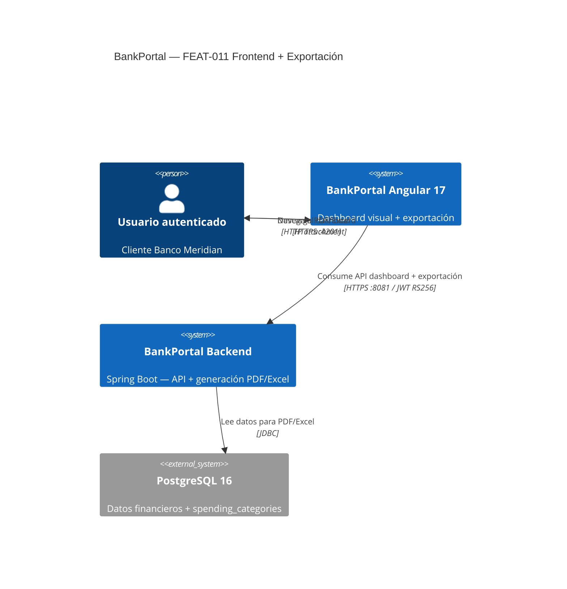
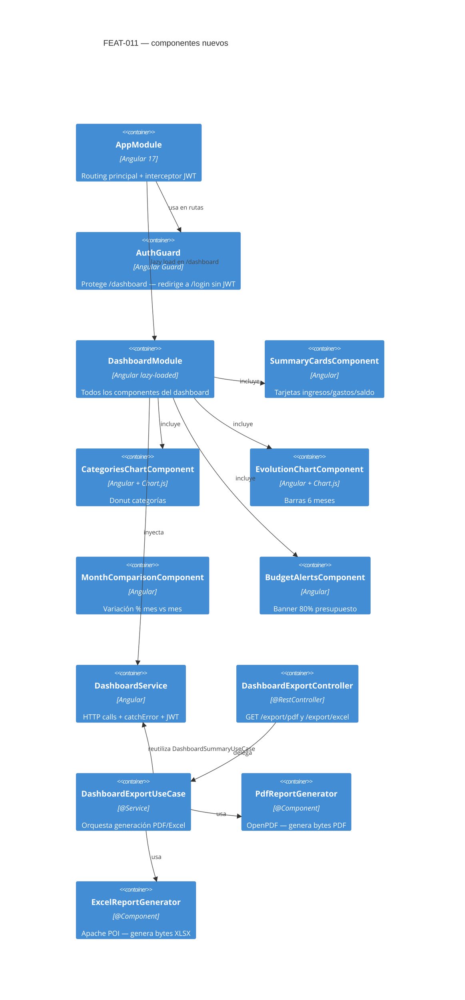
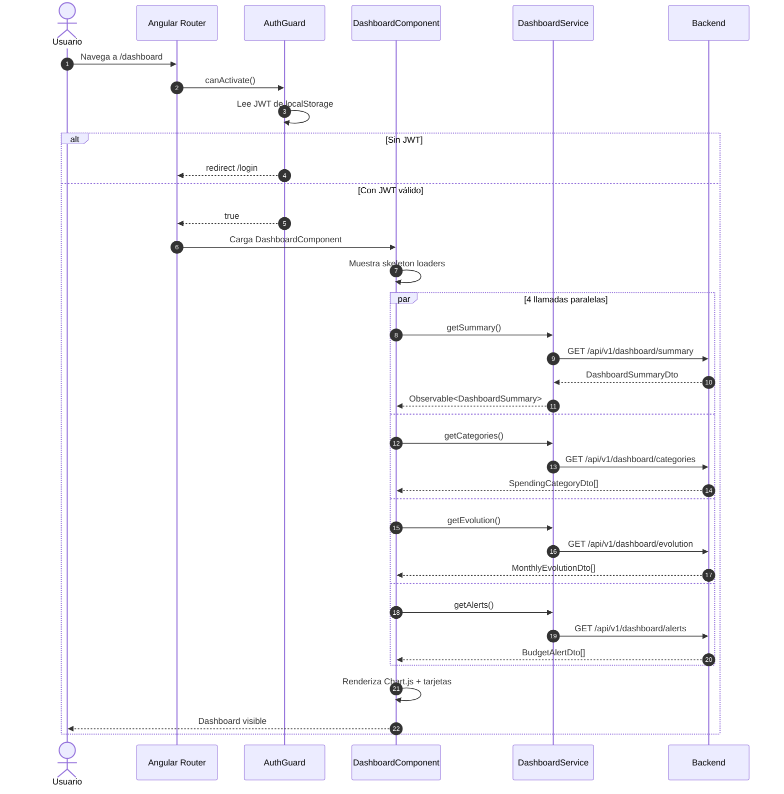
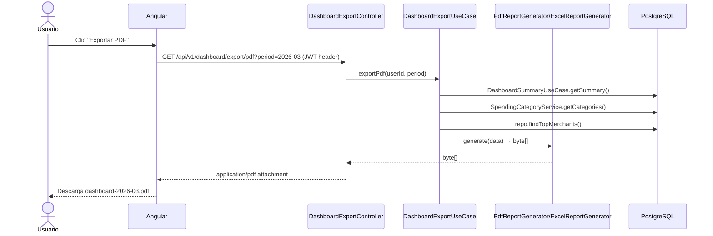

# HLD-FEAT-011 — Frontend Angular Dashboard + Exportación PDF/Excel
# BankPortal / Banco Meridian

## Metadata

| Campo | Valor |
|---|---|
| Feature | FEAT-011 |
| Sprint | 13 |
| Stack | Angular 17 + Chart.js 4 (frontend) · Java 21 + OpenPDF + Apache POI (backend) |
| Versión | 1.0 |
| Estado | PENDING APPROVAL — Gate 3 Tech Lead |
| Fecha | 2026-03-22 |

---

## Análisis de impacto en monorepo

| Módulo | Impacto | Acción |
|---|---|---|
| `apps/frontend-portal/` | Angular app completa desde cero | US-1101→1106 |
| `apps/backend-2fa/dashboard/` | 2 endpoints nuevos + exportación | US-1107/1108 |
| `DashboardSummaryUseCase` | DEBT-020 validación período | 1 guard |
| `DashboardController` | DEBT-021 imports explícitos | refactor |
| `pom.xml` | Apache POI 5.3.0 | nueva dependencia |
| `package.json` frontend | ng2-charts@5 + chart.js@4 | nuevas dependencias |

**ADR requerido:** ADR-020 — Estrategia de exportación: generación on-demand en backend vs cliente.

---

## Contexto C4 Nivel 1 — FEAT-011



---

## Componentes nuevos — C4 Nivel 2



---

## Flujo de carga del dashboard Angular



---

## Flujo de exportación PDF/Excel



---

## Estructura de paquetes nuevos

### Backend
```
dashboard/
├── api/
│   ├── DashboardController.java        (DEBT-021: imports explícitos)
│   └── DashboardExportController.java  (US-1107/1108: 2 endpoints export)
├── application/
│   ├── DashboardSummaryUseCase.java    (DEBT-020: validación período)
│   ├── DashboardExportUseCase.java     (US-1107/1108: orquestador)
│   ├── PdfReportGenerator.java         (US-1107: OpenPDF)
│   └── ExcelReportGenerator.java       (US-1108: Apache POI)
```

### Frontend
```
apps/frontend-portal/
├── angular.json
├── package.json                        (ng2-charts + chart.js)
├── src/
│   ├── app/
│   │   ├── app.module.ts
│   │   ├── app-routing.module.ts       (AuthGuard en /dashboard)
│   │   ├── core/
│   │   │   ├── guards/auth.guard.ts
│   │   │   └── interceptors/jwt.interceptor.ts
│   │   └── features/
│   │       └── dashboard/
│   │           ├── dashboard.module.ts
│   │           ├── dashboard.component.ts
│   │           ├── components/
│   │           │   ├── summary-cards/
│   │           │   ├── categories-chart/
│   │           │   ├── evolution-chart/
│   │           │   ├── month-comparison/
│   │           │   └── budget-alerts/
│   │           └── services/
│   │               └── dashboard.service.ts
│   └── environments/
│       ├── environment.ts
│       └── environment.prod.ts
```

---

## ADR generado

| ADR | Título |
|---|---|
| ADR-020 | Exportación on-demand en backend: PDF/Excel generados server-side |

---

## Contrato OpenAPI v1.10.0 — nuevos endpoints

| Método | Endpoint | Response |
|---|---|---|
| GET | /api/v1/dashboard/export/pdf | `application/pdf` attachment |
| GET | /api/v1/dashboard/export/excel | `application/vnd.openxmlformats-officedocument.spreadsheetml.sheet` |

Parámetro común: `?period=current_month` (mismos valores que /summary)

---

*SOFIA Architect Agent — Step 3 — BankPortal Sprint 13 — FEAT-011 — 2026-03-22 — v1.0 PENDING APPROVAL*
