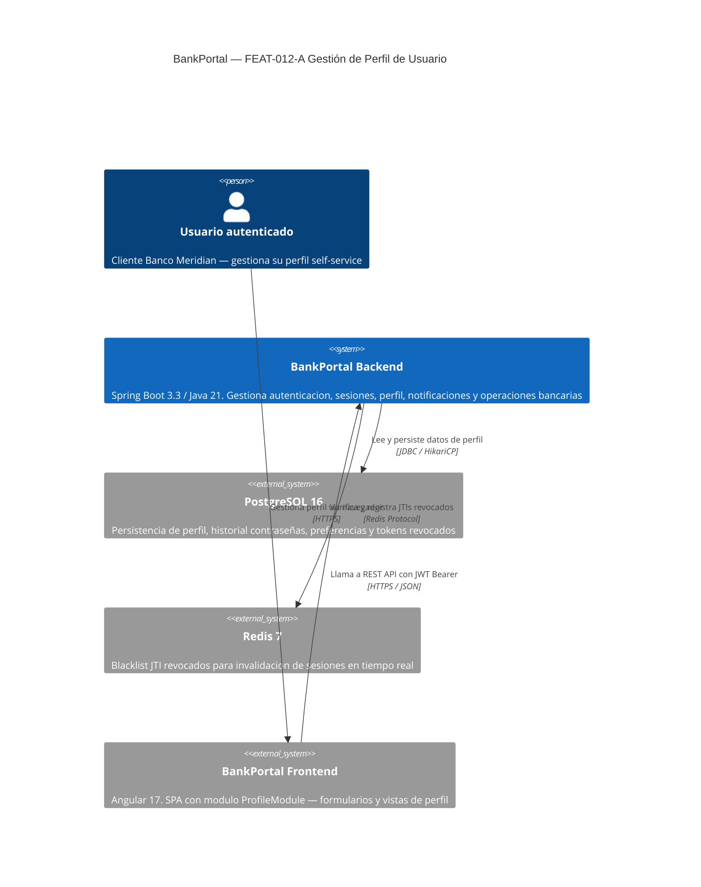
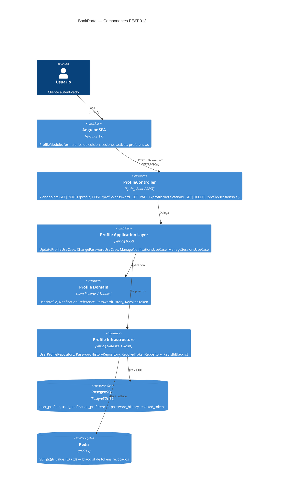

# HLD-FEAT-012 — Gestión de Perfil de Usuario
# BankPortal / Banco Meridian

## Metadata

| Campo | Valor |
|---|---|
| Feature | FEAT-012-A — Gestión de Perfil de Usuario |
| Proyecto | BankPortal — Banco Meridian |
| Stack | Java 21 / Spring Boot 3.3.4 + Angular 17 |
| Tipo de trabajo | new-feature |
| Sprint | 14 |
| Versión | 1.0 |
| Estado | PENDING APPROVAL — Gate 3 Tech Lead |
| Fecha | 2026-03-23 |
| Autor | SOFIA Architect Agent |

---

## Análisis de impacto en monorepo (Paso 0)

| Servicio/Módulo | Tipo de impacto | Acción requerida |
|---|---|---|
| `JwtService` / `NimbusJwtDecoder` | DEBT-022 + DEBT-023 — añadir `jti` UUID al payload | Prerequisito US-1205 (revocación sesiones) |
| `SecurityFilterChain` | Nuevo permiso `/api/v1/profile/**` | Añadir `requestMatchers("/api/v1/profile/**").authenticated()` |
| `users` table (Flyway V1) | No se modifica — `user_profiles` es tabla independiente | Relación FK `user_profiles.user_id → users.id` |
| `audit_log` (FEAT-005) | Nuevos event types: PROFILE_UPDATE, PASSWORD_CHANGE | INSERT-only — compatible hacia adelante |
| `DashboardExportUseCase` (FEAT-011) | Ninguno | — |
| `BankCoreRestAdapter` (FEAT-009) | Ninguno | — |
| Angular `AuthGuard` / `JwtInterceptor` | RV-017 — añadir verificación `exp` | Mejora de seguridad, no breaking |

**Decisión:** Impacto acotado en `JwtService` (DEBT-023) y `SecurityFilterChain`. Resto de cambios son aditivos (4 nuevas tablas vía Flyway V14, nuevo módulo `profile` en arquitectura hexagonal). Sin impacto en contratos API existentes.

---

## Contexto del sistema — C4 Nivel 1

---

## Componentes involucrados — C4 Nivel 2

---

## Servicios nuevos y modificados

| Servicio/Módulo | Acción | Bounded Context | Descripción |
|---|---|---|---|
| `profile` (backend) | NUEVO | User Management | Módulo hexagonal completo — perfil, contraseña, notificaciones, sesiones |
| `JwtService` | MODIFICADO | Security | Añade `jti` (UUID v4) al payload JWT — DEBT-023 |
| `SecurityFilterChain` | MODIFICADO | Security | Permite `authenticated()` en `/api/v1/profile/**` |
| `ProfileModule` (Angular) | NUEVO | Frontend | Módulo lazy-loaded con vistas y formularios |
| `RevokedTokenFilter` (backend) | NUEVO | Security | OncePerRequestFilter que consulta Redis blacklist por `jti` |

---

## Contrato de integración backend ↔ frontend

**Base URL:** `https://api.bankportal.meridian.com/api/v1`
**Auth:** `Authorization: Bearer {jwt}` en todas las peticiones

| Método | Endpoint | Request | Response | Descripción |
|---|---|---|---|---|
| GET | `/profile` | — | `ProfileResponse` | Obtener perfil completo |
| PATCH | `/profile` | `UpdateProfileRequest` | `ProfileResponse` | Actualizar teléfono/dirección |
| POST | `/profile/password` | `ChangePasswordRequest` | 204 | Cambiar contraseña |
| GET | `/profile/notifications` | — | `NotificationPrefsResponse` | Listar preferencias |
| PATCH | `/profile/notifications` | `Map<String,Boolean>` | `NotificationPrefsResponse` | Actualizar preferencias |
| GET | `/profile/sessions` | — | `List<SessionInfo>` | Sesiones activas |
| DELETE | `/profile/sessions/{jti}` | — | 204 | Revocar sesión |

---

## Decisiones técnicas — ADRs generados

- **ADR-021:** Estrategia de historial de contraseñas — tabla `password_history` vs columnas en `users`
- **ADR-022:** Revocación de sesiones JWT — Redis blacklist vs tabla BD `revoked_tokens`

---

*SOFIA Architect Agent — Step 3 Gate 3 pending*
*CMMI Level 3 — TS SP 1.1 · TS SP 2.1 · TS SP 2.2*
*BankPortal Sprint 14 — FEAT-012-A — 2026-03-23*
