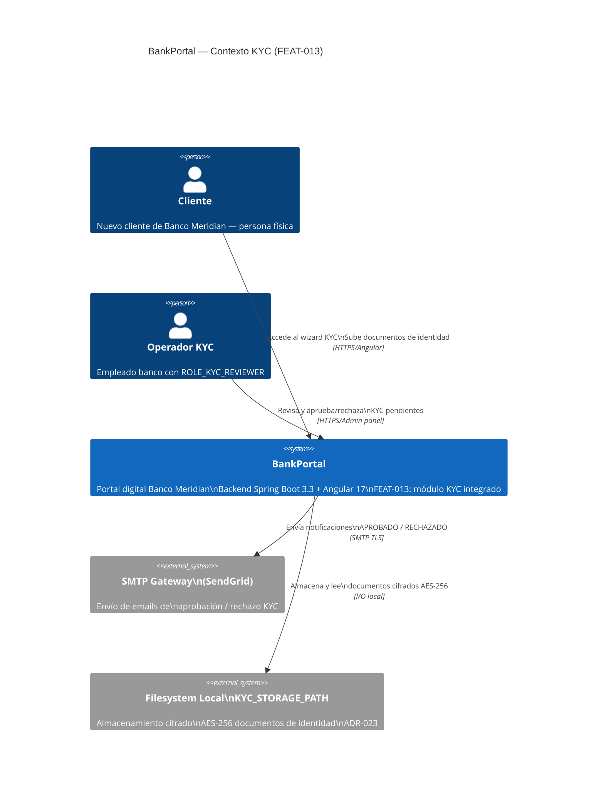
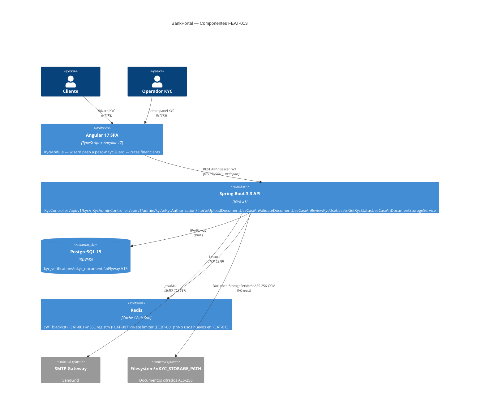

# HLD — FEAT-013: Onboarding KYC / Verificación de Identidad

## Metadata

| Campo | Valor |
|---|---|
| Feature | FEAT-013 |
| Proyecto | BankPortal |
| Cliente | Banco Meridian |
| Stack | Java 21 + Spring Boot 3.3 (backend) · Angular 17 (frontend) |
| Tipo | new-feature |
| Sprint | 15 |
| Release | v1.15.0 |
| Jira Epic | SCRUM-36 |
| Versión | 1.0 |
| Estado | APPROVED — Tech Lead (2026-03-24) |
| Normativa | PSD2 · AML EU 2018/843 · RGPD Art.9 · Circular BE 1/2010 |

---

## Análisis de impacto en monorepo

| Servicio / Módulo | Tipo de impacto | Acción requerida |
|---|---|---|
| `SecurityConfig` | Registro de `KycAuthorizationFilter` | Modificar cadena filtros: `RevokedTokenFilter` → `KycAuthorizationFilter` ✅ |
| `TransferController` | Filtro KYC intercepta `/api/v1/transfers/**` | Sin cambios en el controller — filtro actúa antes |
| `BillController` | Filtro KYC intercepta `/api/v1/bills/**` | Sin cambios en el controller — filtro actúa antes |
| `NotificationService` | Reutilizado para email APPROVED / REJECTED | Sin cambios — consumidor nuevo del servicio existente |
| `AuditLogService` | Reutilizado para trazabilidad KYC | Sin cambios |
| `UserNotification` | Reutilizado (FEAT-007) para notificaciones in-app | Sin cambios |
| `SseEmitterRegistry` | Reutilizado para actualizaciones estado en tiempo real | Sin cambios |
| Módulos restantes | Sin impacto | — |

**Conclusión:** Sin cambios en contratos API existentes. El módulo `kyc` es un Bounded Context nuevo dentro del monolito modular.

---

## Contexto del sistema — C4 Nivel 1



---

## Componentes involucrados — C4 Nivel 2



---

## Flujos principales

### Flujo 1 — Subida de documento y validación automática

```
Cliente → Angular KycWizard → POST /api/v1/kyc/documents (multipart)
  → JwtAuthenticationFilter (auth) → KycController
  → UploadDocumentUseCase
      → validateFile (tamaño + MIME)
      → DocumentStorageService.store (AES-256 + SHA-256)
      → KycDocumentRepository.save
      → ValidateDocumentUseCase.execute (síncrono post-save)
          → allDocumentsPresent? → si NO: status = PENDING
          → validateDocument (caducidad + integridad)
          → si pasa: status = APPROVED → AuditLog
          → si falla: status = SUBMITTED → AuditLog
  ← HTTP 201 DocumentUploadResponse {documentId, kycStatus}
```

### Flujo 2 — Revisión manual por operador

```
Operador → Angular AdminPanel → PATCH /api/v1/admin/kyc/{kycId}
  → JwtAuthenticationFilter → @PreAuthorize(KYC_REVIEWER)
  → KycAdminController → ReviewKycUseCase
      → validar estado no final
      → kyc.status = APPROVED | REJECTED
      → NotificationService → email cliente
      → AuditLog (reviewer_id + reviewed_at)
  ← HTTP 200 {kycId, newStatus, reviewedAt}
```

### Flujo 3 — Bloqueo acceso financiero

```
Cliente → POST /api/v1/transfers
  → JwtAuthenticationFilter
  → RevokedTokenFilter
  → KycAuthorizationFilter
      → isFinancialEndpoint? → si
      → kycRepo.findByUserId → status?
          → APPROVED → chain.doFilter (pasa)
          → PENDING / SUBMITTED / REJECTED → HTTP 403 KYC_REQUIRED
          → sin registro → período de gracia → pasa
```

---

## Servicios nuevos / modificados — resumen

| Servicio | Acción | User Stories | Protocolo |
|---|---|---|---|
| `KycController` | NUEVO | US-1302, US-1304 | REST/JSON + multipart |
| `KycAdminController` | NUEVO | US-1307 | REST/JSON |
| `KycAuthorizationFilter` | NUEVO | US-1305 | Servlet Filter |
| `UploadDocumentUseCase` | NUEVO | US-1302 | Interno |
| `ValidateDocumentUseCase` | NUEVO | US-1303 | Interno (síncrono) |
| `GetKycStatusUseCase` | NUEVO | US-1304 | Interno |
| `ReviewKycUseCase` | NUEVO | US-1307 | Interno |
| `DocumentStorageService` | NUEVO | US-1302, US-1303 | AES-256 I/O |
| `KycVerification` (JPA) | NUEVO | US-1301 | PostgreSQL |
| `KycDocument` (JPA) | NUEVO | US-1301 | PostgreSQL |
| `SecurityConfig` | MOD | US-1305 | `addFilterAfter(kycFilter)` |
| `KycModule` (Angular) | NUEVO | US-1306 | HTTP/REST + multipart |
| `KycGuard` (Angular) | NUEVO | US-1305 | CanActivateFn |
| Flyway `V15__kyc_onboarding.sql` | NUEVO | US-1301 | SQL/DDL |

---

## Contrato de integración backend ↔ frontend

**Base URL:** `https://api.bankportal.meridian.com/v1`
**Auth:** `Authorization: Bearer <JWT>` (HS256 — JwtAuthenticationFilter)

| Método | Ruta | Descripción | Auth |
|---|---|---|---|
| `GET` | `/api/v1/kyc/status` | Estado KYC actual del usuario | JWT |
| `POST` | `/api/v1/kyc/documents` | Subir documento (multipart) | JWT |
| `PATCH` | `/api/v1/admin/kyc/{kycId}` | Aprobar/rechazar KYC | JWT + KYC_REVIEWER |

---

## Decisiones técnicas

| ADR | Título | Estado |
|---|---|---|
| ADR-023 | Almacenamiento documentos KYC: filesystem local cifrado AES-256 | Aceptado |
| ADR-024 | Validación KYC síncrona vs asíncrona | Ver LLD |

---

*SOFIA Architect Agent — Step 3 | Sprint 15 · FEAT-013*
*CMMI Level 3 — TS SP 1.1 · TS SP 2.1 · TS SP 3.1*
*BankPortal — Banco Meridian — 2026-03-24*
