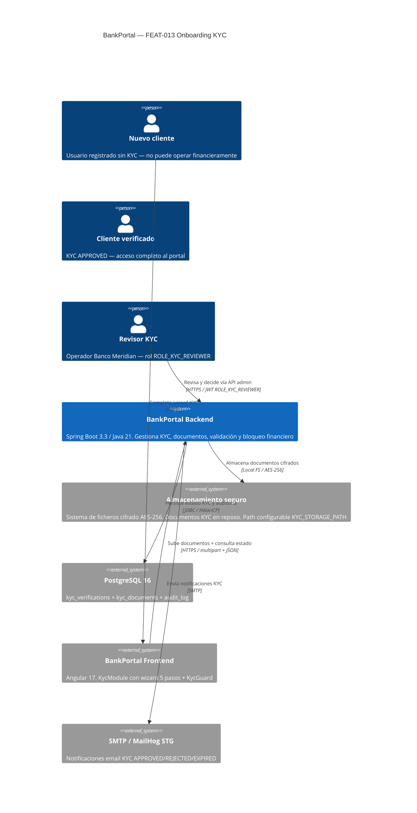
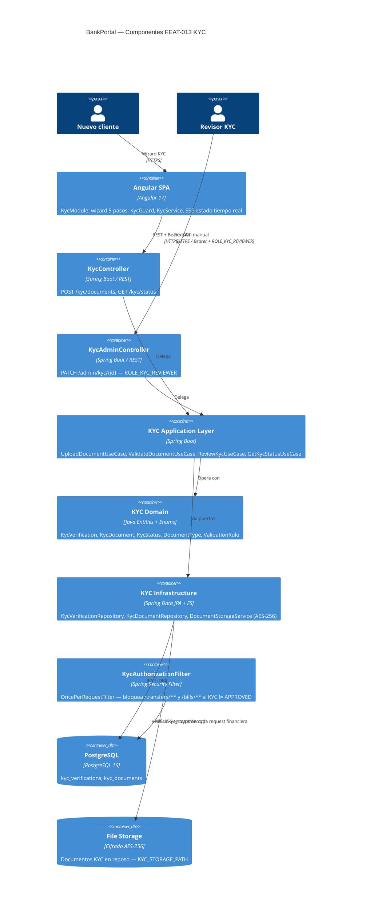

# HLD-FEAT-013 — Onboarding KYC / Verificación de Identidad
# BankPortal / Banco Meridian

## Metadata

| Campo | Valor |
|---|---|
| Feature | FEAT-013 — Onboarding KYC / Verificación de Identidad |
| Proyecto | BankPortal — Banco Meridian |
| Stack | Java 21 / Spring Boot 3.3.4 + Angular 17 |
| Tipo de trabajo | new-feature |
| Sprint | 15 |
| Versión | 1.0 |
| Estado | PENDING APPROVAL — Gate 3 Tech Lead |
| Fecha | 2026-03-23 |
| Autor | SOFIA Architect Agent |

---

## Análisis de impacto en monorepo (Paso 0)

| Servicio/Módulo | Tipo de impacto | Acción requerida |
|---|---|---|
| `SecurityFilterChain` | Nuevo filtro `KycAuthorizationFilter` antes de controllers financieros | Añadir `addFilterAfter(kycFilter, RevokedTokenFilter.class)` |
| `SecurityConfig` | Nuevo rol `ROLE_KYC_REVIEWER` | Añadir en Spring Security — no requiere cambios en BD si se gestiona via JWT claims |
| `transfers/**` endpoints | `KycAuthorizationFilter` intercepta antes del controller | Sin cambios en controller — filtro transparente |
| `bills/**` endpoints | Mismo que transfers | Sin cambios en controller |
| `audit_log` (FEAT-005) | Nuevos event types: KYC_DOCUMENT_UPLOADED, KYC_AUTO_APPROVED, KYC_MANUAL_APPROVED, KYC_REJECTED | INSERT-only — compatible hacia adelante |
| `user_notification_preferences` (FEAT-012) | Nuevos códigos de notificación KYC | Sin migración — inserción de nuevas filas |
| Flyway V14 → V15 | Nueva migración aditiva sin modificar V14 | kyc_verifications + kyc_documents |
| SSE (FEAT-007/008) | Reutilización del SseRegistry para notificaciones en tiempo real | Sin cambios — reutilización directa |

**Decisión:** Impacto acotado. Nuevo módulo `kyc` hexagonal independiente. El único cambio en código existente es la inserción de `KycAuthorizationFilter` en la cadena de seguridad — sin tocar controllers existentes.

---

## Contexto del sistema — C4 Nivel 1



---

## Componentes involucrados — C4 Nivel 2



---

## Servicios nuevos y modificados

| Servicio/Módulo | Acción | Bounded Context | Descripción |
|---|---|---|---|
| `kyc` (backend) | NUEVO | Identity Verification | Módulo hexagonal completo — subida, validación, revisión |
| `KycAuthorizationFilter` | NUEVO | Security | Bloquea `/transfers/**` y `/bills/**` si KYC ≠ APPROVED |
| `SecurityConfig` | MODIFICADO | Security | Registro de `KycAuthorizationFilter` en la cadena |
| `KycModule` (Angular) | NUEVO | Frontend | Wizard 5 pasos + KycGuard + KycService |
| `AppRoutingModule` | MODIFICADO | Frontend | Nueva ruta `/kyc` con `canActivate: [AuthGuard]` |

---

## Cadena de filtros Spring Security (post FEAT-013)

```
Request entrante
    ↓
JwtAuthenticationFilter       (autentica JWT, extrae userId/jti)
    ↓
RevokedTokenFilter             (verifica jti no revocado)
    ↓
KycAuthorizationFilter         (bloquea /transfers/** /bills/** si KYC ≠ APPROVED)
    ↓
Controller                     (procesa la request)
```

---

## Decisiones técnicas — ADRs generados

- **ADR-023:** Almacenamiento de documentos KYC — filesystem local cifrado vs object storage
- **ADR-024:** Estrategia de validación KYC — automática MVP vs integración proveedor externo

---

## Contrato de integración backend ↔ frontend

| Método | Endpoint | Auth | Descripción |
|---|---|---|---|
| GET | `/api/v1/kyc/status` | JWT | Estado KYC del usuario |
| POST | `/api/v1/kyc/documents` | JWT | Subir documento (multipart) |
| PATCH | `/api/v1/admin/kyc/{kycId}` | JWT + ROLE_KYC_REVIEWER | Aprobar/rechazar |

---

*SOFIA Architect Agent — Step 3 Gate 3 pending*
*CMMI Level 3 — TS SP 1.1 · TS SP 2.1 · TS SP 2.2*
*BankPortal Sprint 15 — FEAT-013 — 2026-03-23*
