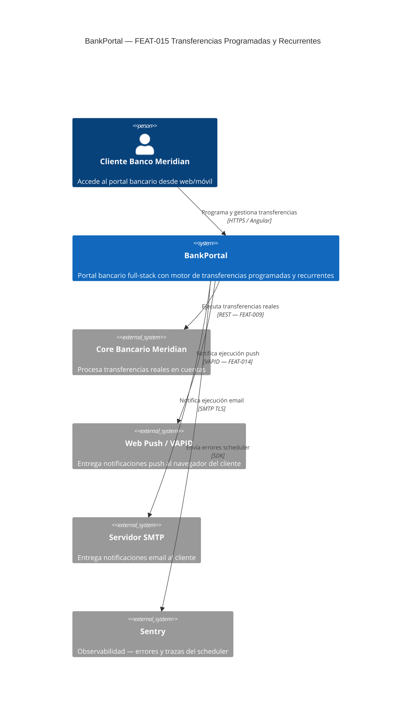
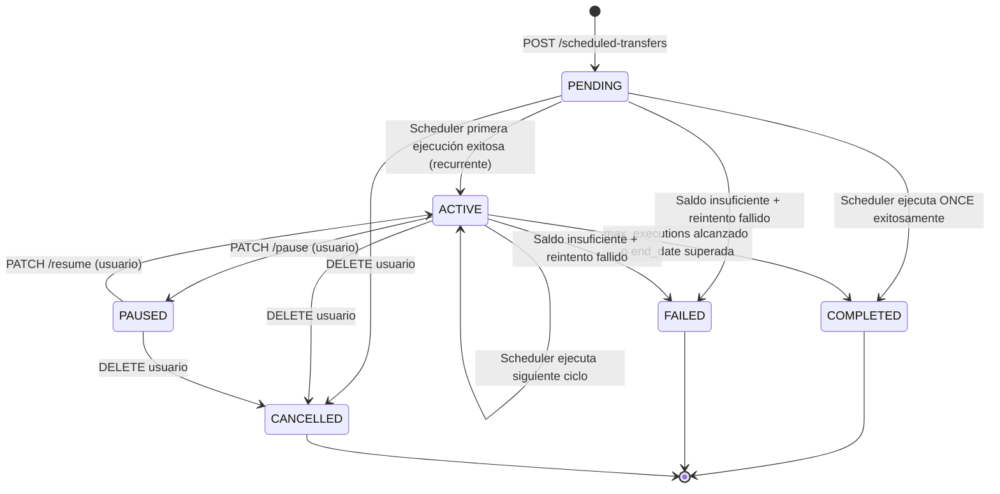
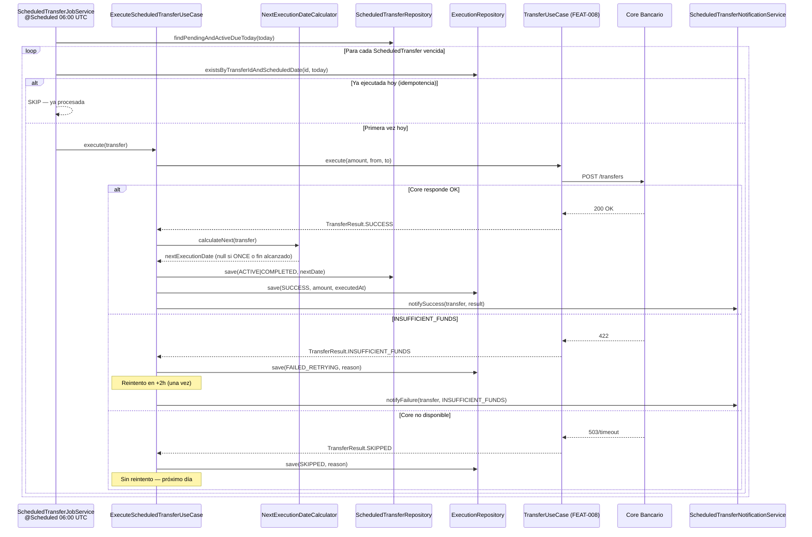

# HLD — FEAT-015 Transferencias Programadas y Recurrentes

## Metadata
- **Feature:** FEAT-015 | **Proyecto:** BankPortal | **Cliente:** Banco Meridian
- **Stack:** Java 21 + Spring Boot 3.x (backend) · Angular 17 (frontend)
- **Tipo de trabajo:** new-feature
- **Sprint:** 17 | **Versión:** 1.0 | **Estado:** DRAFT
- **Autor:** SOFIA Architect Agent
- **Fecha:** 2026-03-24
- **CMMI:** AD SP 1.1 · AD SP 2.1 · AD SP 3.1

---

## Análisis de impacto en monorepo

| Servicio / Módulo | Tipo de impacto | Acción requerida |
|---|---|---|
| `TransferUseCase` (FEAT-008) | Reutilización — invocado por Scheduler | Ninguna — API interna estable |
| `TransferToBeneficiaryUseCase` (FEAT-008) | Reutilización | Ninguna |
| `WebPushService` (FEAT-014) | Reutilización — notificación push | Ninguna — API interna estable |
| `EmailNotificationService` (FEAT-005) | Reutilización | Ninguna |
| `AuditLogService` (FEAT-004) | Reutilización — registro ejecutor | Ninguna |
| `AccountService` (FEAT-007) | Reutilización — validación saldo | Ninguna |
| `push_subscriptions` table (FEAT-014) | DEBT-028 — cifrado auth+p256dh | Migración Flyway V17b (mismo sprint) |
| REST API BankPortal | Adición — 5 endpoints nuevos | Sin breaking changes en rutas existentes |
| Angular routing | Adición — módulo `scheduled-transfers` | Sin impacto en módulos existentes |

**Decisión:** Sin breaking changes. Adición pura + DEBT-028 como migración backward-compatible.

---

## Contexto del sistema — C4 Nivel 1



---

## Componentes involucrados — C4 Nivel 2

```mermaid
C4Container
  title BankPortal — Containers FEAT-015

  Person(client, "Cliente", "Browser Angular")

  Container(ng, "Angular SPA", "Angular 17", "Wizard de creación, lista y gestión de programadas")
  Container(api, "BankPortal API", "Spring Boot 3 / Java 21", "REST endpoints + Scheduler @Scheduled")
  ContainerDb(pg, "PostgreSQL 15", "Base de datos", "scheduled_transfers · scheduled_transfer_executions · push_subscriptions (cifrado)")
  Container(redis, "Redis", "Cache / Blacklist", "JWT blacklist, rate limiting — sin cambios S17")

  System_Ext(core, "Core Bancario", "Procesa débito/crédito real")
  System_Ext(push, "Web Push VAPID", "Notificaciones browser")
  System_Ext(smtp, "SMTP", "Notificaciones email")

  Rel(client, ng, "Usa", "HTTPS")
  Rel(ng, api, "REST calls", "HTTPS / JWT Bearer")
  Rel(api, pg, "Lee/Escribe", "JDBC / JPA")
  Rel(api, redis, "Valida JWT", "Redis protocol")
  Rel(api, core, "POST /transfers", "REST mTLS — FEAT-009")
  Rel(api, push, "Web Push VAPID", "HTTPS — FEAT-014")
  Rel(api, smtp, "SMTP TLS", "JavaMail")
  Rel_Back(api, sentry, "Errores scheduler", "SDK async")
```

---

## Servicios nuevos o modificados

| Servicio | Acción | Responsabilidad | Puerto | Protocolo |
|---|---|---|---|---|
| `ScheduledTransferController` | NUEVO | CRUD de transferencias programadas | 8080 | REST / JWT |
| `CreateScheduledTransferUseCase` | NUEVO | Validar y persistir nueva programada | — | Interno |
| `UpdateScheduledTransferUseCase` | NUEVO | Pausar / reactivar / cancelar | — | Interno |
| `GetScheduledTransfersUseCase` | NUEVO | Listar y detalle por usuario | — | Interno |
| `ExecuteScheduledTransferUseCase` | NUEVO | Ejecutar programada vencida (invocado por Scheduler) | — | Interno |
| `NextExecutionDateCalculator` | NUEVO | Calcular próxima fecha según tipo de recurrencia | — | Interno |
| `ScheduledTransferJobService` | NUEVO | `@Scheduled(cron)` 06:00 UTC diario — idempotente | — | Spring Scheduler |
| `ScheduledTransferNotificationService` | NUEVO | Orquesta push + email por resultado | — | Interno |
| `ScheduledTransferRepository` | NUEVO | Puerto JPA para `scheduled_transfers` | — | JPA |
| `ScheduledTransferExecutionRepository` | NUEVO | Puerto JPA para `scheduled_transfer_executions` | — | JPA |
| `scheduled-transfers` module (Angular) | NUEVO | Wizard + lista + historial en frontend | — | Angular NgRx |

**Flyway migrations:**
- `V17__create_scheduled_transfers.sql` — tablas nuevas
- `V17b__encrypt_push_subscriptions_auth.sql` — DEBT-028

---

## Contrato de integración backend ↔ frontend

**Base URL:** `https://api.bankportal.experis.com/v1`
**Auth:** Bearer JWT en header `Authorization`

| Método | Ruta | Descripción |
|---|---|---|
| `POST` | `/scheduled-transfers` | Crear nueva programada (ONCE / recurrente) |
| `GET` | `/scheduled-transfers` | Listar programadas del usuario autenticado |
| `GET` | `/scheduled-transfers/{id}` | Detalle de una programada |
| `PATCH` | `/scheduled-transfers/{id}/pause` | Pausar recurrente activa |
| `PATCH` | `/scheduled-transfers/{id}/resume` | Reactivar recurrente pausada |
| `DELETE` | `/scheduled-transfers/{id}` | Cancelar (soft-delete, pasa a CANCELLED) |
| `GET` | `/scheduled-transfers/{id}/executions` | Historial de ejecuciones |

Ver contrato OpenAPI detallado en LLD-FEAT-015-backend.md.

---

## Modelo de estados — ScheduledTransfer



---

## Flujo de ejecución del Scheduler



---

## Decisiones técnicas — ver ADRs

- **ADR-026:** ShedLock (scheduler multi-instancia) — diferido a Sprint 18
- **ADR-027:** Edición de importe en recurrente activa — no permitido; cancelar + crear nueva

---

*SOFIA Architect Agent · Sprint 17 · CMMI Level 3*
*BankPortal — Banco Meridian — 2026-03-24*
