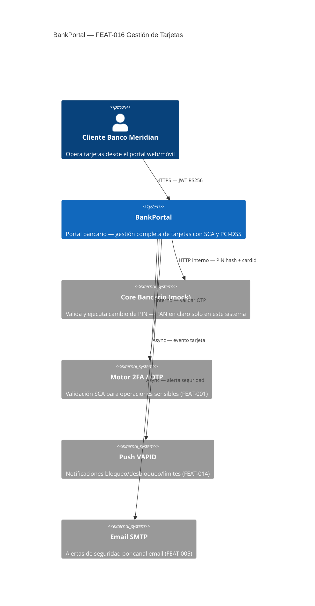
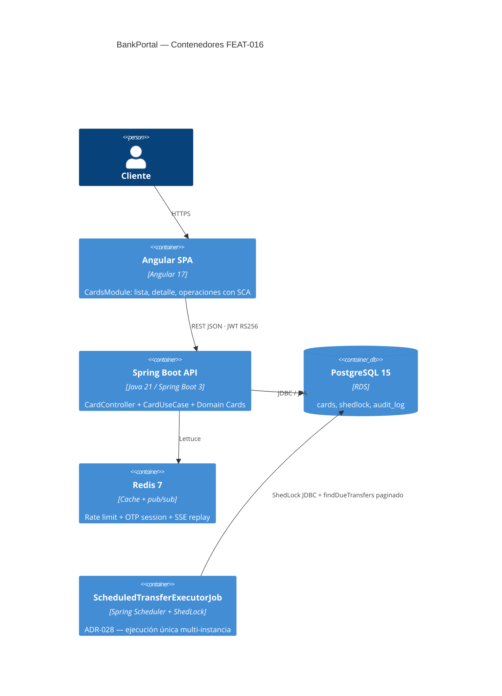
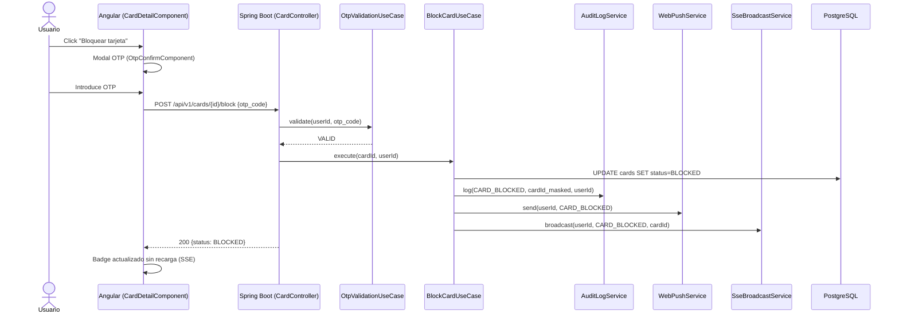
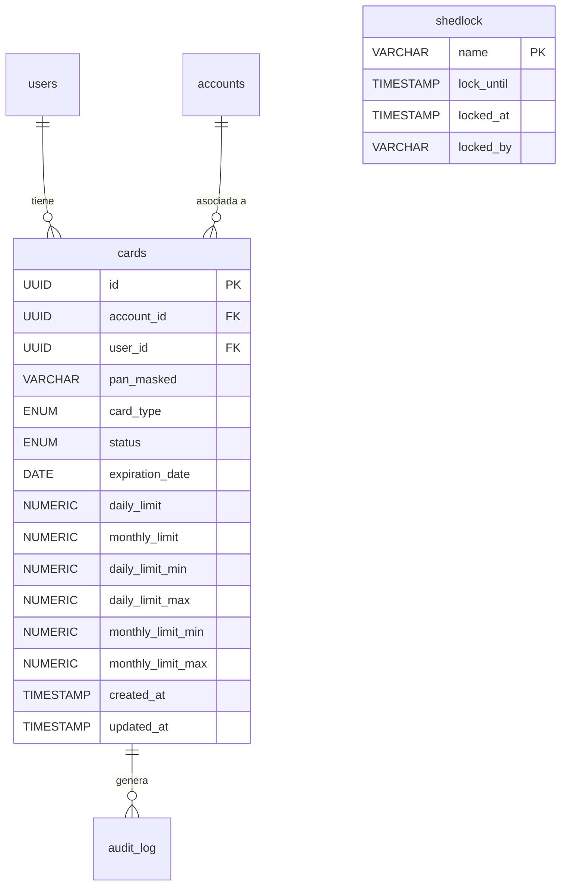

# HLD — FEAT-016 Gestión de Tarjetas

## Metadata
| Campo | Valor |
|---|---|
| Documento | HLD-FEAT-016 v1.0 |
| Feature | FEAT-016 — Gestión de Tarjetas |
| Sprint | 18 · v1.18.0 |
| Stack | Java 21 + Spring Boot 3.x · Angular 17 |
| Autor | SOFIA Architect Agent |
| Fecha | 2026-03-25 |
| CMMI | AD SP 1.1 · AD SP 2.1 · AD SP 3.1 |

---

## Análisis de impacto en monorepo

| Servicio / Módulo | Tipo de impacto | Acción requerida |
|---|---|---|
| `AccountService` (FEAT-007) | Reutilización — FK account_id | Ninguna — API interna estable |
| `OtpValidationUseCase` (FEAT-001) | Reutilización — SCA en bloqueo/desbloqueo/PIN/límites | Ninguna |
| `WebPushService` (FEAT-014) | Reutilización — notificación push tras operaciones | Ninguna |
| `AuditLogService` (FEAT-004) | Reutilización — trazabilidad PCI-DSS | Ninguna |
| `SseBroadcastService` (FEAT-014) | Extensión — eventos CARD_BLOCKED/CARD_UNBLOCKED | Añadir EventType al enum |
| `NotificationEventType` (FEAT-014) | Extensión — nuevos eventos de tarjeta | Adición backward-compatible |
| `ScheduledTransferExecutorJob` (FEAT-015) | ADR-028 ShedLock — MUST día 1 S1 | Flyway V18c tabla shedlock |
| REST API BankPortal | Adición — 6 endpoints /api/v1/cards/** | Sin breaking changes |
| Angular routing | Adición — módulo lazy-loaded CardsModule | Sin impacto módulos existentes |
| Flyway | V18 (cards), V18b (drop columnas), V18c (shedlock) | 3 migraciones secuenciales |

**Decisión:** Sin breaking changes. Adición pura sobre base madura (FEAT-001..015).

---

## Contexto del sistema — C4 Nivel 1



---

## Contenedores — C4 Nivel 2



---

## Flujo de bloqueo de tarjeta — Sequence



---

## Diagrama ER — Modelo de datos



---

## Clean Architecture — Capas FEAT-016

```
com.bankportal
└── cards/
    ├── domain/
    │   ├── Card.java                    (Entity — aggregate root)
    │   ├── CardType.java                (Enum: DEBIT, CREDIT)
    │   ├── CardStatus.java              (Enum: ACTIVE, BLOCKED, EXPIRED, CANCELLED)
    │   ├── CardLimits.java              (Value Object)
    │   ├── CardRepository.java          (Port — interface)
    │   └── CoreBankingPort.java         (Port — delegación PIN al core)
    ├── application/
    │   ├── GetCardsUseCase.java
    │   ├── GetCardDetailUseCase.java
    │   ├── BlockCardUseCase.java
    │   ├── UnblockCardUseCase.java
    │   ├── UpdateCardLimitsUseCase.java
    │   └── ChangePinUseCase.java
    └── infrastructure/
        ├── persistence/
        │   ├── CardJpaEntity.java
        │   ├── CardJpaRepository.java
        │   └── CardRepositoryAdapter.java
        ├── corebanking/
        │   └── CoreBankingAdapter.java  (mock HTTP)
        └── web/
            └── CardController.java
```

---

## Decisiones de arquitectura (ADRs)

| ADR | Título | Estado |
|---|---|---|
| ADR-028 | ShedLock para ScheduledTransferExecutorJob multi-instancia | **NUEVO — Sprint 18 MUST** |
| ADR-021 | JWT RS256 | Vigente — reutilizado |
| ADR-016 | Saga local para transferencias | Vigente — referenciado |
| ADR-025 | VAPID vs FCM | Vigente — push reutilizado |

---

## Riesgos de arquitectura

| ID | Riesgo | Mitigación | Sprint |
|---|---|---|---|
| R-015-01 | Job scheduler duplicado en multi-instancia | **ADR-028 ShedLock — MUST día 1** | S18 |
| R-018-01 | IDOR en endpoints /cards/{id} | Validación owner en use-case + test integración | S18 |
| R-018-02 | PAN en claro en logs o audit | Revisión estática SAST + RNF-003 | S18 |

---

## Impacto en CI/CD y calidad

| Criterio | Objetivo |
|---|---|
| Cobertura application | ≥ 85% |
| Tests nuevos estimados | +45 (unit + integration) |
| SAST | 0 bloqueantes |
| Performance | GET /cards < 300ms p95 |
| PCI-DSS | req.3 (PAN) · req.8 (MFA) · req.10 (audit) |

---

*Generado por SOFIA Architect Agent — Sprint 18 — 2026-03-25*
*CMMI Level 3 — AD SP 1.1 · AD SP 2.1 · AD SP 3.1*
*BankPortal — Banco Meridian*
