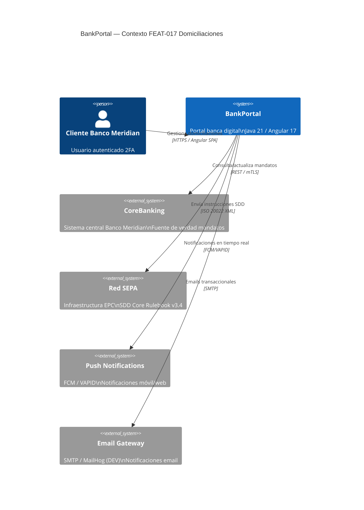
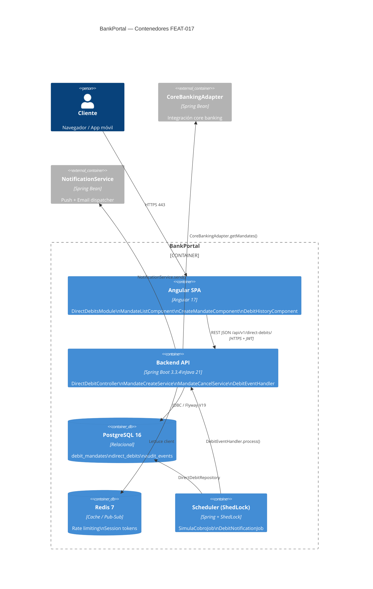
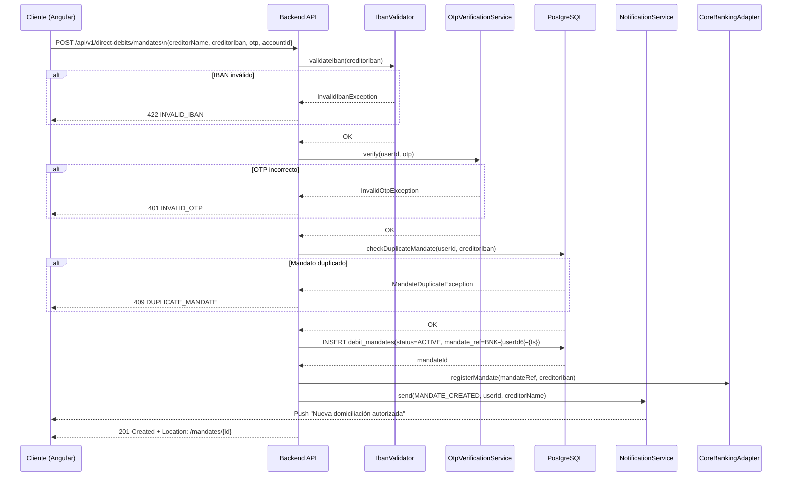
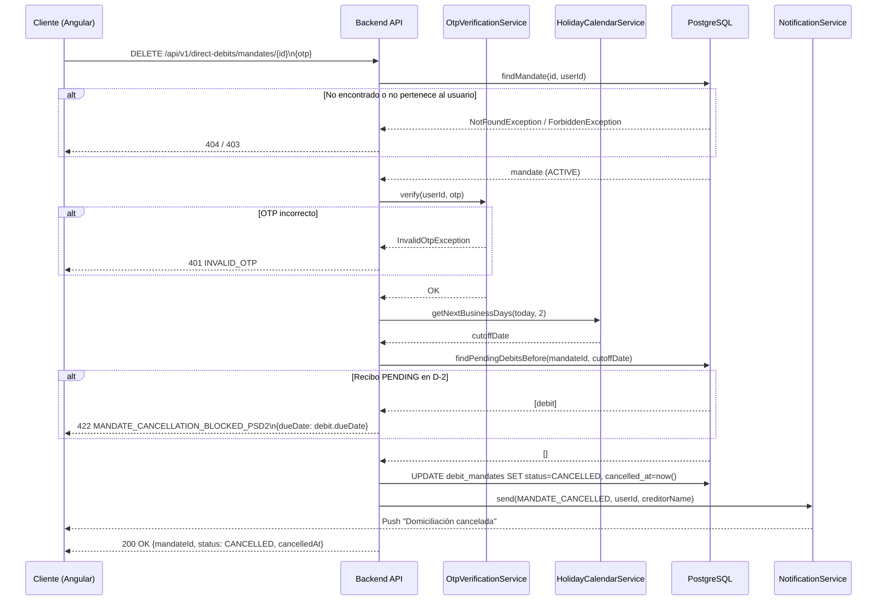
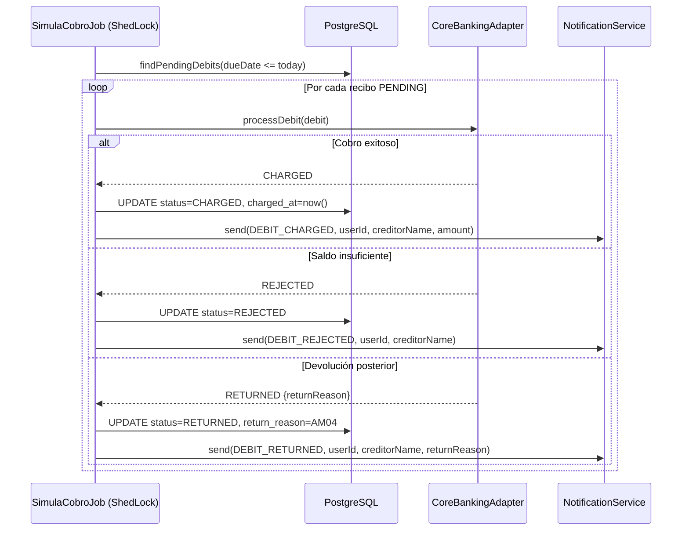
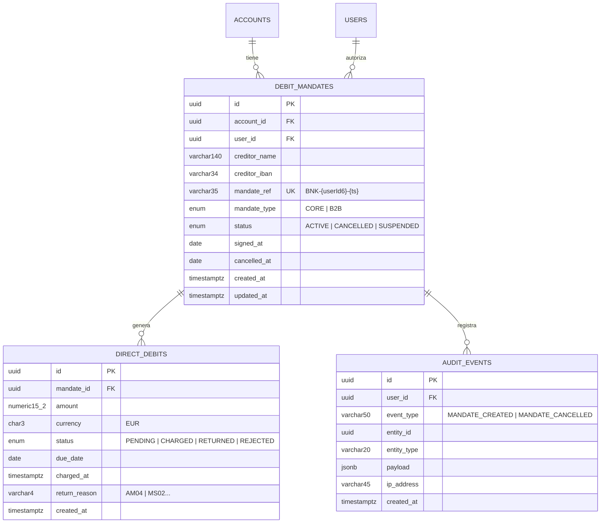

# HLD — FEAT-017 · Domiciliaciones y Recibos (SEPA Direct Debit)

**BankPortal · Banco Meridian · Sprint 19 · v1.19.0**

| Campo | Valor |
|---|---|
| Feature | FEAT-017 |
| Tipo | new-feature |
| Stack | Java 21 / Spring Boot 3.3.4 · Angular 17 · PostgreSQL 16 |
| Generado | 2026-03-27T06:28:42.133Z |
| Agente | Architect — SOFIA v2.2 |

---

## Impact Analysis — FEAT-017

### Servicios afectados

| Servicio | Tipo de impacto | Acción requerida |
|---|---|---|
| `backend-2fa` | Extensión de dominio — nuevas entidades y endpoints | Nueva capa `directdebit` dentro del mismo servicio |
| `CoreBankingAdapter` | Extensión de métodos existentes | Añadir `getMandates()`, `getDebits()` |
| `NotificationService` | Nuevos tipos de evento push | Añadir DEBIT_CHARGED, DEBIT_RETURNED, DEBIT_REJECTED |
| `EmailService` | Nuevas plantillas transaccionales | Añadir plantillas mandato alta/cancelación |
| `frontend-portal` | Módulo nuevo lazy-loaded | `DirectDebitsModule` sin impacto en bundle principal |

### Decisión de impacto
✅ Sin breaking changes en contratos existentes. Extensión aditiva — nuevos endpoints bajo ruta `/api/v1/direct-debits/`. Sin versioning de API requerido.

---

## Diagrama C4 — Nivel 1: Contexto del sistema

---

## Diagrama C4 — Nivel 2: Contenedores

---

## Diagrama de flujo — Alta de mandato SEPA

---

## Diagrama de flujo — Cancelación con regla PSD2 D-2

---

## Diagrama de flujo — Scheduler cobro + notificación

---

## Modelo de datos ER

---

## Decisiones de arquitectura

| ADR | Decisión | Estado |
|---|---|---|
| ADR-029 | SEPA mandate storage: BD propia vs. delegación 100% CoreBanking | APROBADO |
| ADR-018 (existente) | Bucket4j rate limiting — reutilizado para DEBT-031 /cards/pin | VIGENTE |
| ADR-028 (existente) | ShedLock scheduler — reutilizado para SimulaCobroJob | VIGENTE |
| ADR-025 (existente) | VAPID push notifications — reutilizado para DEBIT_* eventos | VIGENTE |

---

*Architect Agent · CMMI TS SP 1.1, 2.1 · SOFIA v2.2 · BankPortal — Banco Meridian · Sprint 19*
