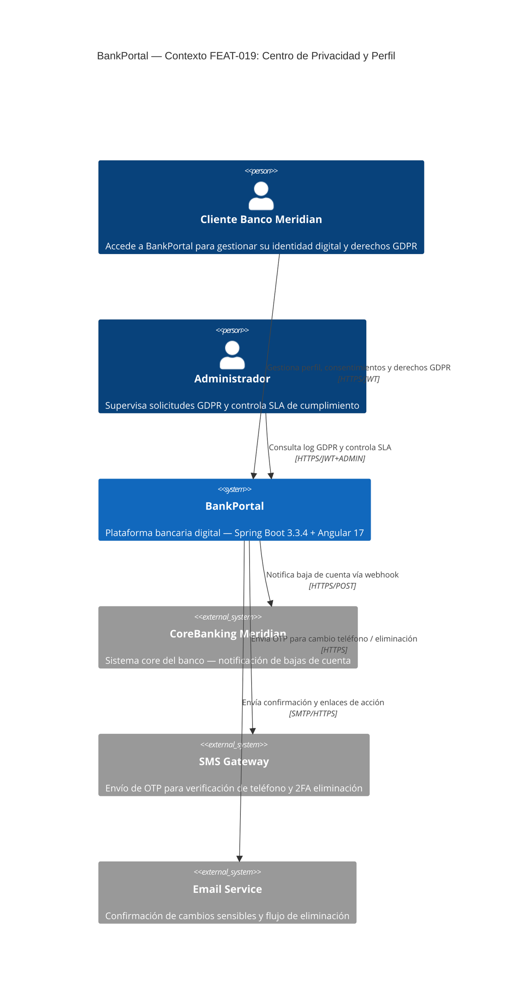
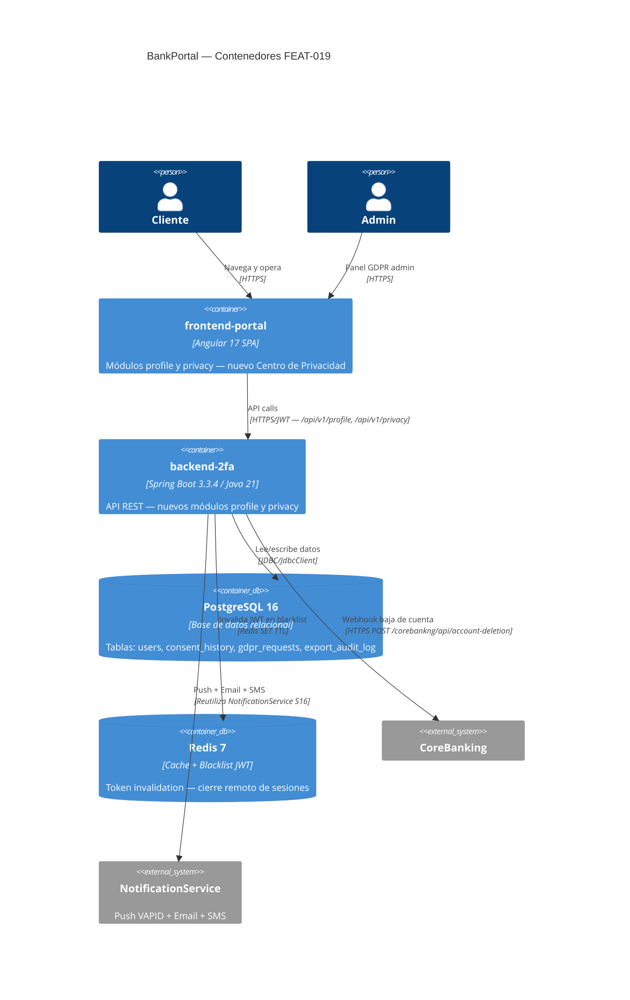
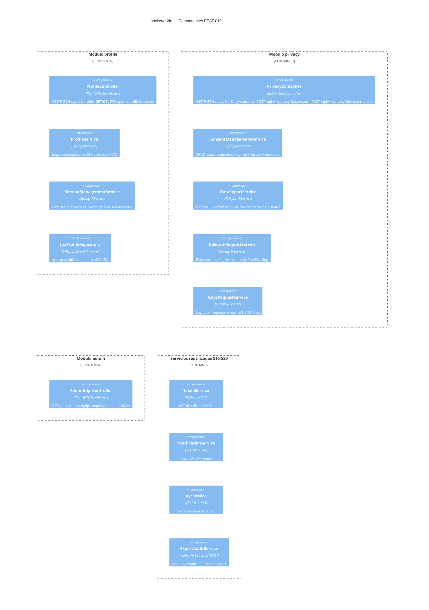
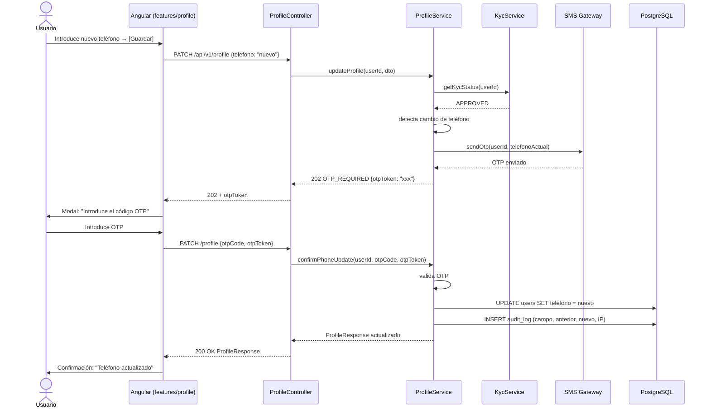
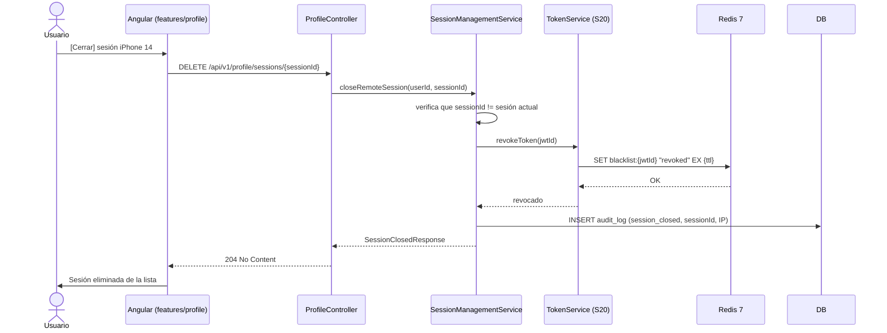
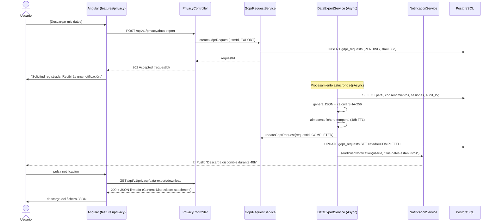
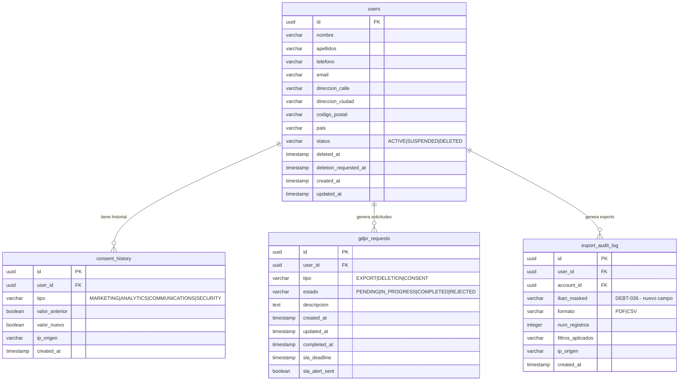

# HLD — High Level Design
## FEAT-019: Centro de Privacidad y Perfil de Usuario
**Proyecto:** BankPortal — Banco Meridian  
**Sprint:** 21 | **Release:** v1.21.0 | **Fecha:** 2026-03-31  
**SOFIA Step:** 3 — Architect | **Estado:** DRAFT — Pendiente Gate G-3 (Tech Lead)

---

## 1. Análisis de Impacto en Monorepo

| Servicio / Módulo | Tipo de impacto | Acción requerida |
|---|---|---|
| `backend-2fa` — ProfileController | Nuevo endpoint real (reemplaza stub) | Implementar ProfileController completo |
| `backend-2fa` — TokenService (S20) | Reutilización — cierre remoto de sesiones | Sin cambios, integración directa |
| `backend-2fa` — ExportService (S20) | DEBT-036: AccountRepository en ExportAuditService | Modificación mínima de ExportAuditService |
| `backend-2fa` — NotificationService (S16) | Reutilización — push cuando data-export listo | Sin cambios, llamada existente |
| `backend-2fa` — KycService (S15) | Read-only: verificar kycStatus antes de PATCH /profile | Sin cambios en KYC |
| `frontend-portal` — features/profile/ | Reemplazar placeholder por componente real | Reimplementar módulo completo |
| `frontend-portal` — features/privacy/ | Módulo nuevo | Crear desde cero + registrar en router |
| `frontend-portal` — shell.component.ts | Nuevos nav items | Añadir Mi Perfil + Centro de Privacidad |
| DB PostgreSQL | 2 tablas nuevas + 1 modificación | V22__profile_gdpr.sql |
| Redis | Sin cambios | TokenService.blacklist ya operativo |

**Decisión:** Impacto bajo-medio. Sin cambios en contratos API existentes. Continuar con diseño.

---

## 2. Diagrama C4 — Nivel 1: Contexto del Sistema

---

## 3. Diagrama C4 — Nivel 2: Contenedores

---

## 4. Diagrama de Componentes Backend — Módulos nuevos

---

## 5. Diagramas de Secuencia — Flujos críticos

### 5.1 Actualización de teléfono con OTP

### 5.2 Cierre remoto de sesión

### 5.3 Portabilidad de datos — flujo asíncrono

---

## 6. Decisiones de diseño clave

| Decisión | Opción elegida | Alternativa descartada | Razón |
|---|---|---|---|
| Generación data-export | @Async Spring + almacenamiento temporal | Síncrono | Potencial timeout con datos voluminosos (RNF-019-03) |
| consent_history | Tabla append-only, inmutable | Sobreescribir campos en users | Trazabilidad GDPR Art.13 — historial obligatorio |
| Borrado de cuenta | Soft delete + anonimización | Hard delete inmediato | Obligación legal GDPR Art.17§3.b — retención audit 6 años |
| OTP para cambio teléfono | SMS al número actual | Email | Mayor seguridad — el número actual es el factor de confianza |
| Webhook CoreBanking fallo | Fire-and-forget + DEBT-040 | Bloquear operación | No podemos bloquear el derecho del usuario por fallo externo |
| SessionManagement | Reutilizar TokenService Redis (S20) | Tabla sesiones nueva | DRY — TokenService ya gestiona JWT blacklist |

> Ver ADR-032 (estrategia borrado lógico) y ADR-033 (async data export).

---

## 7. Modelo de datos — tablas nuevas y modificadas

---

## 8. Mapa de tipos BD → Java (LA-019-13)

### Tabla: consent_history

| Columna | Tipo PostgreSQL | Tipo Java | Notas |
|---|---|---|---|
| id | uuid | UUID | `rs.getObject("id", UUID.class)` |
| user_id | uuid | UUID | FK — UUID no String |
| tipo | varchar(20) | String | Validar contra enum ConsentType |
| valor_anterior | boolean | Boolean | nullable — null en primera inserción |
| valor_nuevo | boolean | boolean | primitivo — nunca null |
| ip_origen | varchar(45) | String | IPv4 o IPv6 |
| created_at | timestamp | LocalDateTime | WITHOUT TIME ZONE — NO Instant |

### Tabla: gdpr_requests

| Columna | Tipo PostgreSQL | Tipo Java | Notas |
|---|---|---|---|
| id | uuid | UUID | `rs.getObject("id", UUID.class)` |
| user_id | uuid | UUID | FK |
| tipo | varchar(20) | String | GdprRequestType.name() |
| estado | varchar(20) | String | GdprRequestStatus.name() |
| sla_deadline | timestamp | LocalDateTime | created_at + 30 días |
| sla_alert_sent | boolean | boolean | default false |
| created_at | timestamp | LocalDateTime | WITHOUT TIME ZONE |
| updated_at | timestamp | LocalDateTime | nullable — actualizar en cada transición |
| completed_at | timestamp | LocalDateTime | nullable — solo cuando COMPLETED |

---

*Generado por SOFIA v2.3 — Step 3 Architect — Sprint 21 — 2026-03-31*  
*Estado: DRAFT — Pendiente Gate G-3 (aprobación Tech Lead)*
