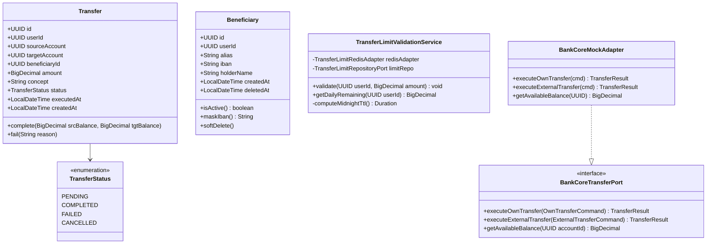
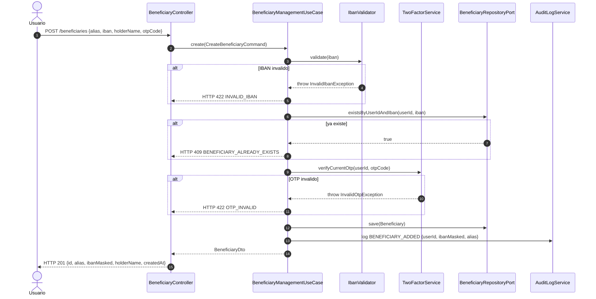

# LLD-011 — Transferencias Bancarias (Backend)
# BankPortal / Banco Meridian — FEAT-008

## Metadata

| Campo | Valor |
|---|---|
| Documento | LLD-011 |
| Servicio | bankportal-backend-2fa (módulo transfers + beneficiaries) |
| Feature | FEAT-008 |
| Stack | Java 21 / Spring Boot 3.3.4 / Spring Data JPA / Redis |
| Versión | 1.0 |
| Estado | PENDING APPROVAL — Gate 3 Tech Lead |
| Fecha | 2026-03-20 |

---

## Estructura de paquetes (nueva — hexagonal)

```
apps/backend-2fa/src/main/java/com/experis/sofia/bankportal/
├── transfer/
│   ├── domain/
│   │   ├── Transfer.java                      # Entidad de dominio
│   │   ├── TransferStatus.java                # Enum: PENDING, COMPLETED, FAILED, CANCELLED
│   │   ├── TransferRepositoryPort.java        # Puerto de salida (interface)
│   │   └── BankCoreTransferPort.java          # Puerto de salida (core bancario)
│   ├── application/
│   │   ├── TransferUseCase.java               # US-801: transferencia cuentas propias
│   │   ├── TransferToBeneficiaryUseCase.java  # US-802: transferencia a beneficiario
│   │   ├── TransferLimitValidationService.java # US-804: validacion de limites
│   │   └── dto/
│   │       ├── OwnTransferCommand.java        # Record: sourceAccountId, targetAccountId, amount, concept, otpCode
│   │       ├── BeneficiaryTransferCommand.java # Record: beneficiaryId, sourceAccountId, amount, otpCode, firstConfirmed
│   │       └── TransferResponseDto.java       # Record: transferId, status, executedAt, sourceBalance, targetBalance
│   ├── infrastructure/
│   │   ├── persistence/
│   │   │   ├── TransferJpaEntity.java         # @Entity tabla transfers
│   │   │   ├── TransferJpaRepository.java     # JpaRepository<TransferJpaEntity, UUID>
│   │   │   └── TransferJpaAdapter.java        # Implementa TransferRepositoryPort
│   │   ├── core/
│   │   │   └── BankCoreMockAdapter.java       # Mock Sprint 10: implementa BankCoreTransferPort
│   │   └── redis/
│   │       └── TransferLimitRedisAdapter.java # INCRBY atomico + TTL medianoche UTC
│   └── api/
│       ├── TransferController.java            # @RestController /api/v1/transfers
│       └── TransferLimitsController.java      # @RestController /api/v1/transfers/limits
│
├── beneficiary/
│   ├── domain/
│   │   ├── Beneficiary.java                   # Entidad de dominio (soft delete)
│   │   ├── BeneficiaryRepositoryPort.java     # Puerto de salida (interface)
│   │   └── IbanValidator.java                 # Servicio de validacion IBAN ISO 13616
│   ├── application/
│   │   ├── BeneficiaryManagementUseCase.java  # US-803: CRUD + OTP en alta
│   │   └── dto/
│   │       ├── CreateBeneficiaryCommand.java  # Record: alias, iban, holderName, otpCode
│   │       └── BeneficiaryDto.java            # Record: id, alias, ibanMasked, holderName, createdAt
│   ├── infrastructure/
│   │   └── persistence/
│   │       ├── BeneficiaryJpaEntity.java      # @Entity tabla beneficiaries
│   │       ├── BeneficiaryJpaRepository.java  # JpaRepository<BeneficiaryJpaEntity, UUID>
│   │       └── BeneficiaryJpaAdapter.java     # Implementa BeneficiaryRepositoryPort
│   └── api/
│       └── BeneficiaryController.java         # @RestController /api/v1/beneficiaries
```

---

## Diagrama de clases — dominio de transferencias



---

## Diagrama de secuencia — Gestión de beneficiarios (US-803)



---

## Modelo de datos completo — Flyway V11

```mermaid
erDiagram
  users {
    uuid id PK
    string email
    string account_status
  }

  accounts {
    uuid id PK
    uuid user_id FK
    string alias
    string iban
    decimal available_balance
  }

  beneficiaries {
    uuid id PK
    uuid user_id FK
    string alias
    string iban
    string holder_name
    timestamp created_at
    timestamp deleted_at "NULL = activo"
  }

  transfers {
    uuid id PK
    uuid user_id FK
    uuid source_account FK
    uuid target_account "NULL para externos"
    uuid beneficiary_id "NULL para propias"
    decimal amount
    string concept
    string status
    timestamp executed_at
    timestamp created_at
  }

  transfer_limits {
    uuid user_id PK FK
    decimal per_operation_limit
    decimal daily_limit
    decimal monthly_limit
    timestamp updated_at
  }

  users ||--o{ beneficiaries : "tiene"
  users ||--o{ transfers : "realiza"
  users ||--|| transfer_limits : "tiene configurado"
  accounts ||--o{ transfers : "origen"
  beneficiaries ||--o{ transfers : "destino externo"
```

---

## DEBT-014 — Migración JWT RS256: cambios en código

### JwtProperties.java (modificado)

```java
@ConfigurationProperties(prefix = "jwt")
public record JwtProperties(
    String privateKeyPem,    // Base64(PEM RSA-2048 privada) — ANTES: secret
    String publicKeyPem,     // Base64(PEM RSA-2048 publica) — ANTES: preAuthSecret
    long preAuthTtlSeconds,
    long sessionTtlSeconds
) {}
```

### JwtTokenProvider.java (modificado — fragmento clave)

```java
// ANTES (HS256):
this.signingKey = Keys.hmacShaKeyFor(jwtProperties.secret().getBytes(UTF_8));

// DESPUES (RS256):
byte[] privateBytes = Base64.getDecoder().decode(jwtProperties.privateKeyPem());
KeyFactory kf = KeyFactory.getInstance("RSA");
this.privateKey = kf.generatePrivate(new PKCS8EncodedKeySpec(privateBytes));

byte[] publicBytes = Base64.getDecoder().decode(jwtProperties.publicKeyPem());
this.publicKey = kf.generatePublic(new X509EncodedKeySpec(publicBytes));

// Firma:
Jwts.builder().signWith(privateKey, Jwts.SIG.RS256)...

// Verificacion:
Jwts.parser().verifyWith(publicKey).build()...
```

### application-staging.yml (modificado)

```yaml
jwt:
  private-key-pem: ${JWT_PRIVATE_KEY_PEM}   # Base64(openssl genrsa 2048 | pkcs8)
  public-key-pem:  ${JWT_PUBLIC_KEY_PEM}     # Base64(openssl rsa -pubout)
  pre-auth-ttl-seconds: 300
  session-ttl-seconds: 28800
```

---

## DEBT-013 — Testcontainers: estructura de tests de integración

```
apps/backend-2fa/src/test/java/com/experis/sofia/bankportal/
├── config/
│   └── PostgresTestcontainersConfig.java   # @Container + @DynamicPropertySource
├── transfer/
│   └── TransferControllerIT.java           # @SpringBootTest + Testcontainers
└── beneficiary/
    └── BeneficiaryControllerIT.java        # @SpringBootTest + Testcontainers
```

```java
// PostgresTestcontainersConfig.java
@Testcontainers
public abstract class PostgresTestcontainersConfig {

    @Container
    static PostgreSQLContainer<?> postgres =
        new PostgreSQLContainer<>("postgres:16-alpine");

    @DynamicPropertySource
    static void configureProperties(DynamicPropertyRegistry registry) {
        registry.add("spring.datasource.url", postgres::getJdbcUrl);
        registry.add("spring.datasource.username", postgres::getUsername);
        registry.add("spring.datasource.password", postgres::getPassword);
    }
}
```

---

## TransferLimitRedisAdapter — lógica TTL medianoche UTC

```java
@Component
@RequiredArgsConstructor
public class TransferLimitRedisAdapter {

    private static final String KEY_PREFIX = "transfer:daily:";
    private final StringRedisTemplate redisTemplate;

    /** Incrementa el acumulado diario de forma atomica. Retorna el nuevo total. */
    public BigDecimal incrementDaily(UUID userId, BigDecimal amount) {
        String key = KEY_PREFIX + userId + ":" + LocalDate.now(ZoneOffset.UTC);
        long amountCents = amount.multiply(BigDecimal.valueOf(100)).longValue();

        Long newTotal = redisTemplate.opsForValue().increment(key, amountCents);
        // Establecer TTL solo si es la primera operacion del dia
        redisTemplate.expire(key, computeMidnightTtl(), TimeUnit.SECONDS);

        return BigDecimal.valueOf(newTotal).divide(BigDecimal.valueOf(100));
    }

    public BigDecimal getDailyAccumulated(UUID userId) {
        String key = KEY_PREFIX + userId + ":" + LocalDate.now(ZoneOffset.UTC);
        String val = redisTemplate.opsForValue().get(key);
        return val == null ? BigDecimal.ZERO
            : BigDecimal.valueOf(Long.parseLong(val)).divide(BigDecimal.valueOf(100));
    }

    private long computeMidnightTtl() {
        LocalDateTime now = LocalDateTime.now(ZoneOffset.UTC);
        LocalDateTime midnight = now.toLocalDate().plusDays(1).atStartOfDay();
        return Duration.between(now, midnight).getSeconds();
    }
}
```

---

## Contrato OpenAPI v1.7.0 (extracto)

```yaml
openapi: "3.1.0"
info:
  title: BankPortal API
  version: "1.7.0"

paths:
  /api/v1/transfers/own:
    post:
      summary: Transferencia entre cuentas propias
      security:
        - bearerJwtRS256: []
      requestBody:
        required: true
        content:
          application/json:
            schema:
              type: object
              required: [sourceAccountId, targetAccountId, amount, otpCode]
              properties:
                sourceAccountId: { type: string, format: uuid }
                targetAccountId: { type: string, format: uuid }
                amount:
                  type: number
                  format: decimal
                  minimum: 0.01
                  maximum: 2000.00
                concept:  { type: string, maxLength: 256 }
                otpCode:  { type: string, pattern: '^\d{6}$' }
      responses:
        "200":
          content:
            application/json:
              schema:
                type: object
                properties:
                  transferId:    { type: string, format: uuid }
                  status:        { type: string, enum: [COMPLETED] }
                  executedAt:    { type: string, format: date-time }
                  sourceBalance: { type: number }
                  targetBalance: { type: number }
        "422":
          description: INSUFFICIENT_FUNDS | OTP_INVALID | DAILY_LIMIT_EXCEEDED | OPERATION_LIMIT_EXCEEDED
        "503":
          description: CORE_UNAVAILABLE

  /api/v1/beneficiaries:
    get:
      summary: Listar beneficiarios activos del usuario
      security:
        - bearerJwtRS256: []
      responses:
        "200":
          content:
            application/json:
              schema:
                type: array
                items:
                  type: object
                  properties:
                    id:          { type: string, format: uuid }
                    alias:       { type: string }
                    ibanMasked:  { type: string, example: "ES91****5228" }
                    holderName:  { type: string }
                    createdAt:   { type: string, format: date-time }
    post:
      summary: Dar de alta un beneficiario (requiere OTP)
      security:
        - bearerJwtRS256: []
      requestBody:
        required: true
        content:
          application/json:
            schema:
              type: object
              required: [alias, iban, holderName, otpCode]
              properties:
                alias:      { type: string, maxLength: 64 }
                iban:       { type: string, pattern: '^[A-Z]{2}\d{2}[A-Z0-9]{4,30}$' }
                holderName: { type: string, maxLength: 128 }
                otpCode:    { type: string, pattern: '^\d{6}$' }
      responses:
        "201":
          description: Beneficiario creado
        "422":
          description: INVALID_IBAN | OTP_INVALID
        "409":
          description: BENEFICIARY_ALREADY_EXISTS

components:
  securitySchemes:
    bearerJwtRS256:
      type: http
      scheme: bearer
      bearerFormat: JWT
      description: |
        JWT firmado con RS256 (RSA-2048). Claims obligatorios:
          sub: UUID del usuario
          scope: full-session
          jti: UUID unico del token (blacklist)
          exp: Unix timestamp de expiracion
```

---

## Variables de entorno — nuevas en Sprint 10

| Variable | Descripción | Staging (default) |
|---|---|---|
| `JWT_PRIVATE_KEY_PEM` | Base64 de clave privada RSA-2048 PKCS8 | Generar con openssl |
| `JWT_PUBLIC_KEY_PEM` | Base64 de clave pública RSA-2048 X509 | Generar con openssl |
| `TRANSFER_LIMIT_DAILY` | Límite diario por defecto (EUR) | 3000 |
| `TRANSFER_LIMIT_PER_OP` | Límite por operación (EUR) | 2000 |
| `BANK_CORE_BASE_URL` | URL del core bancario | http://mock-core:8090 |

**Generación de claves RSA para STG:**
```bash
# Clave privada PKCS8
openssl genrsa -out stg-private.pem 2048
openssl pkcs8 -topk8 -inform PEM -outform PEM -nocrypt -in stg-private.pem -out stg-private-pkcs8.pem
export JWT_PRIVATE_KEY_PEM=$(base64 -i stg-private-pkcs8.pem | tr -d '\n')

# Clave pública X509
openssl rsa -in stg-private.pem -pubout -out stg-public.pem
export JWT_PUBLIC_KEY_PEM=$(base64 -i stg-public.pem | tr -d '\n')
```

---

*Generado por SOFIA Architect Agent — Step 3*
*CMMI Level 3 — TS SP 2.1 · TS SP 2.2 · TS SP 3.1*
*BankPortal Sprint 10 — FEAT-008 — 2026-03-20 — v1.0 PENDING APPROVAL*
