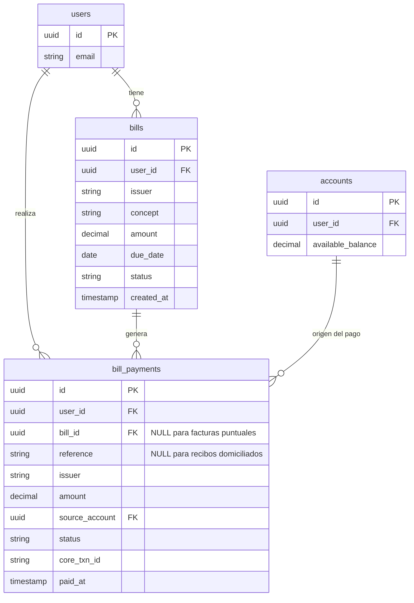

# LLD-012 — Core Bancario Real + Pagos de Servicios (Backend)
# BankPortal / Banco Meridian — FEAT-009

## Metadata

| Campo | Valor |
|---|---|
| Documento | LLD-012 |
| Servicio | bankportal-backend-2fa (módulos core-integration + bills) |
| Feature | FEAT-009 |
| Stack | Java 21 / Spring Boot 3.3.4 / Resilience4j / Bucket4j |
| Versión | 1.0 |
| Estado | PENDING APPROVAL — Gate 3 Tech Lead |
| Fecha | 2026-03-21 |

---

## Estructura de paquetes (nuevos módulos)

```
apps/backend-2fa/src/main/java/com/experis/sofia/bankportal/
├── transfer/
│   └── infrastructure/
│       └── core/
│           ├── BankCoreMockAdapter.java        (existente — sin cambios)
│           └── BankCoreRestAdapter.java        (NUEVO — @Profile("production"))
│
├── bill/
│   ├── domain/
│   │   ├── Bill.java                          # Entidad dominio recibo domiciliado
│   │   ├── BillStatus.java                    # Enum: PENDING, PAID, CANCELLED
│   │   ├── BillRepositoryPort.java            # Puerto salida — recibos
│   │   ├── BillPaymentPort.java               # Puerto salida — pago al core
│   │   └── BillPayment.java                   # Entidad registro pago realizado
│   ├── application/
│   │   ├── BillPaymentUseCase.java            # US-903 — pago recibo domiciliado
│   │   ├── BillLookupAndPayUseCase.java       # US-904 — lookup + pago factura
│   │   └── dto/
│   │       ├── BillDto.java                   # Record respuesta GET /bills
│   │       ├── PayBillCommand.java            # Record comando pago
│   │       └── BillLookupResult.java          # Record resultado lookup factura
│   ├── infrastructure/
│   │   ├── persistence/
│   │   │   ├── BillJpaEntity.java
│   │   │   ├── BillPaymentJpaEntity.java
│   │   │   ├── BillJpaRepository.java
│   │   │   ├── BillPaymentJpaRepository.java
│   │   │   └── BillJpaAdapter.java            # Implementa BillRepositoryPort
│   │   └── core/
│   │       └── BillCoreAdapter.java           # Implementa BillPaymentPort → core REST
│   └── api/
│       └── BillController.java                # GET /bills · POST pay
│
└── config/
    ├── ResilienceConfig.java                  # NUEVO — Resilience4j beans (ADR-017)
    └── RateLimitConfig.java                   # NUEVO — Bucket4j beans (ADR-018)
```

---

## BankCoreRestAdapter — fragmento clave

```java
@Slf4j
@Component
@Profile("production")
@RequiredArgsConstructor
public class BankCoreRestAdapter implements BankCoreTransferPort {

    private final RestClient restClient;          // Spring 6.1 RestClient
    private final BankCoreProperties props;       // baseUrl + apiKey

    @Override
    @CircuitBreaker(name = "bankCore", fallbackMethod = "fallbackTransfer")
    @Retry(name = "bankCore")
    @TimeLimiter(name = "bankCore")
    public TransferResult executeOwnTransfer(UUID sourceAccountId, UUID targetAccountId,
                                              BigDecimal amount, String concept) {
        String idempotencyKey = UUID.randomUUID().toString();
        try {
            var response = restClient.post()
                .uri(props.baseUrl() + "/core/v1/transfers/own")
                .header("X-API-Key", props.apiKey())
                .header("X-Idempotency-Key", idempotencyKey)
                .body(Map.of(
                    "sourceAccountId", sourceAccountId,
                    "targetAccountId", targetAccountId,
                    "amount", amount,
                    "concept", concept
                ))
                .retrieve()
                .body(CoreTransferResponse.class);

            log.info("[US-901] Core transfer OK: txnId={} src={}",
                    response.transactionId(), sourceAccountId);
            return new TransferResult(true, response.sourceBalance(), response.targetBalance(), null);

        } catch (HttpClientErrorException e) {
            // 4xx — no reintentar
            log.error("[US-901] Core transfer client error: {} {}", e.getStatusCode(), e.getMessage());
            return new TransferResult(false, BigDecimal.ZERO, BigDecimal.ZERO, "CORE_CLIENT_ERROR");
        }
    }

    // Fallback invocado cuando el circuit breaker está OPEN
    public TransferResult fallbackTransfer(UUID src, UUID tgt, BigDecimal amt, String concept,
                                           Exception ex) {
        log.error("[US-901] Circuit breaker OPEN — fallback activo: {}", ex.getMessage());
        return new TransferResult(false, BigDecimal.ZERO, BigDecimal.ZERO, "CORE_CIRCUIT_OPEN");
    }

    @Override
    public BigDecimal getAvailableBalance(UUID accountId) {
        return restClient.get()
            .uri(props.baseUrl() + "/core/v1/accounts/{id}/balance", accountId)
            .header("X-API-Key", props.apiKey())
            .retrieve()
            .body(CoreBalanceResponse.class)
            .available();
    }

    // Records internos para deserialización
    private record CoreTransferResponse(String transactionId,
                                        BigDecimal sourceBalance, BigDecimal targetBalance) {}
    private record CoreBalanceResponse(UUID accountId, BigDecimal available, BigDecimal retained) {}
}
```

---

## ResilienceConfig — configuración programática

```java
@Configuration
public class ResilienceConfig {

    // Circuit Breaker: abre al 50% fallos en ventana de 10 llamadas
    @Bean
    public CircuitBreakerConfig bankCoreCBConfig() {
        return CircuitBreakerConfig.custom()
            .slidingWindowType(SlidingWindowType.COUNT_BASED)
            .slidingWindowSize(10)
            .failureRateThreshold(50)
            .waitDurationInOpenState(Duration.ofSeconds(30))
            .permittedNumberOfCallsInHalfOpenState(3)
            .recordExceptions(ConnectException.class, SocketTimeoutException.class,
                              HttpServerErrorException.class)
            .ignoreExceptions(InsufficientFundsException.class,
                              InvalidOtpException.class)
            .build();
    }

    // Retry: 2 reintentos con backoff 500ms (solo errores de red)
    @Bean
    public RetryConfig bankCoreRetryConfig() {
        return RetryConfig.custom()
            .maxAttempts(3)
            .waitDuration(Duration.ofMillis(500))
            .retryExceptions(ConnectException.class, SocketTimeoutException.class)
            .ignoreExceptions(HttpClientErrorException.class)
            .build();
    }

    // TimeLimiter: cancela llamadas que tarden más de 5s
    @Bean
    public TimeLimiterConfig bankCoreTimeLimiterConfig() {
        return TimeLimiterConfig.custom()
            .timeoutDuration(Duration.ofSeconds(5))
            .cancelRunningFuture(true)
            .build();
    }
}
```

---

## Modelo de datos — Flyway V12



---

## Flyway V12 — SQL

```sql
-- V12__bills_and_payments.sql
CREATE TABLE bills (
    id         UUID          PRIMARY KEY DEFAULT gen_random_uuid(),
    user_id    UUID          NOT NULL REFERENCES users(id) ON DELETE CASCADE,
    issuer     VARCHAR(128)  NOT NULL,
    concept    VARCHAR(256)  NOT NULL,
    amount     DECIMAL(15,2) NOT NULL CHECK (amount > 0),
    due_date   DATE          NOT NULL,
    status     VARCHAR(16)   NOT NULL DEFAULT 'PENDING'
               CHECK (status IN ('PENDING','PAID','CANCELLED')),
    created_at TIMESTAMP     NOT NULL DEFAULT now()
);

CREATE INDEX idx_bills_user_status ON bills(user_id, status);

CREATE TABLE bill_payments (
    id             UUID          PRIMARY KEY DEFAULT gen_random_uuid(),
    user_id        UUID          NOT NULL REFERENCES users(id),
    bill_id        UUID          REFERENCES bills(id),
    reference      VARCHAR(64),
    issuer         VARCHAR(128),
    amount         DECIMAL(15,2) NOT NULL CHECK (amount > 0),
    source_account UUID          NOT NULL REFERENCES accounts(id),
    status         VARCHAR(16)   NOT NULL DEFAULT 'COMPLETED',
    core_txn_id    VARCHAR(64),
    paid_at        TIMESTAMP     NOT NULL DEFAULT now(),
    CONSTRAINT chk_bill_payment_source
        CHECK (bill_id IS NOT NULL OR reference IS NOT NULL)
);

CREATE INDEX idx_bill_payments_user ON bill_payments(user_id, paid_at DESC);
```

---

## Contrato OpenAPI v1.8.0 (extracto)

```yaml
paths:
  /api/v1/bills:
    get:
      summary: Listar recibos domiciliados pendientes
      security:
        - bearerJwtRS256: []
      responses:
        "200":
          content:
            application/json:
              schema:
                type: array
                items:
                  properties:
                    id:       { type: string, format: uuid }
                    issuer:   { type: string }
                    concept:  { type: string }
                    amount:   { type: number }
                    dueDate:  { type: string, format: date }
                    status:   { type: string, enum: [PENDING, PAID] }

  /api/v1/bills/{id}/pay:
    post:
      summary: Pagar recibo domiciliado (OTP obligatorio)
      security:
        - bearerJwtRS256: []
      requestBody:
        required: true
        content:
          application/json:
            schema:
              type: object
              required: [sourceAccountId, otpCode]
              properties:
                sourceAccountId: { type: string, format: uuid }
                otpCode: { type: string, pattern: '^\d{6}$' }
      responses:
        "200":
          content:
            application/json:
              schema:
                properties:
                  paymentId: { type: string, format: uuid }
                  status:    { type: string }
                  paidAt:    { type: string, format: date-time }
        "409": { description: BILL_ALREADY_PAID }
        "422": { description: INSUFFICIENT_FUNDS | OTP_INVALID }
        "429": { description: RATE_LIMIT_EXCEEDED }
        "503": { description: CORE_UNAVAILABLE | CORE_CIRCUIT_OPEN | CORE_TIMEOUT }

  /api/v1/bills/lookup:
    get:
      summary: Buscar factura por referencia
      parameters:
        - name: reference
          in: query
          required: true
          schema: { type: string, pattern: '^\d{20}$' }
      responses:
        "200":
          content:
            application/json:
              schema:
                properties:
                  billId:  { type: string }
                  issuer:  { type: string }
                  concept: { type: string }
                  amount:  { type: number }
                  expiryDate: { type: string, format: date }
        "404": { description: BILL_NOT_FOUND }
        "422": { description: INVALID_BILL_REFERENCE }

  /api/v1/bills/pay:
    post:
      summary: Pagar factura con referencia (OTP obligatorio)
      security:
        - bearerJwtRS256: []
      requestBody:
        required: true
        content:
          application/json:
            schema:
              type: object
              required: [reference, sourceAccountId, amount, otpCode]
              properties:
                reference:       { type: string, pattern: '^\d{20}$' }
                sourceAccountId: { type: string, format: uuid }
                amount:          { type: number }
                otpCode:         { type: string, pattern: '^\d{6}$' }
      responses:
        "200":
          content:
            application/json:
              schema:
                properties:
                  paymentId: { type: string, format: uuid }
                  status:    { type: string }
                  paidAt:    { type: string, format: date-time }
        "422": { description: INSUFFICIENT_FUNDS | OTP_INVALID | INVALID_BILL_REFERENCE }
        "503": { description: CORE_UNAVAILABLE }
```

---

## Variables de entorno nuevas en Sprint 11

| Variable | Descripción | Requerida en |
|---|---|---|
| `BANK_CORE_BASE_URL` | URL base del core bancario real | production |
| `BANK_CORE_API_KEY` | Clave de autenticación del core | production |
| `RATE_LIMIT_TRANSFER_PER_MIN` | Límite transfers por usuario/min (default 10) | todos |
| `RATE_LIMIT_BENEFICIARY_PER_MIN` | Límite altas beneficiario por IP/min (default 5) | todos |

---

*Generado por SOFIA Architect Agent — Step 3*
*CMMI Level 3 — TS SP 2.1 · TS SP 2.2 · TS SP 3.1*
*BankPortal Sprint 11 — FEAT-009 — 2026-03-21 — v1.0 PENDING APPROVAL*
