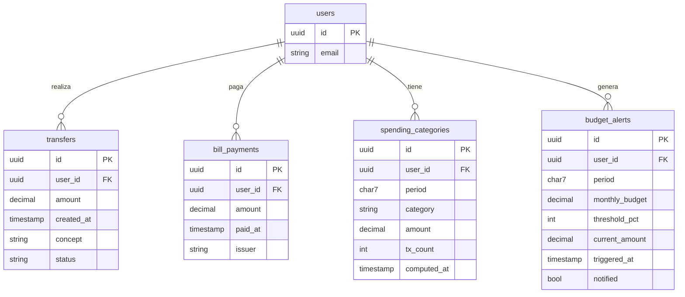

# LLD-013 — Dashboard Analítico (Backend + Frontend)
# BankPortal / Banco Meridian — FEAT-010

## Metadata

| Campo | Valor |
|---|---|
| Documento | LLD-013 |
| Feature | FEAT-010 |
| Sprint | 12 |
| Stack | Java 21 / Spring Boot 3.3.4 + Angular 17 + Chart.js 4 |
| Versión | 1.0 |
| Estado | PENDING APPROVAL — Gate 3 Tech Lead |
| Fecha | 2026-03-22 |

---

## Modelo de datos — Flyway V13

```sql
-- V13__dashboard_analytics.sql

CREATE TABLE spending_categories (
    id           UUID          PRIMARY KEY DEFAULT gen_random_uuid(),
    user_id      UUID          NOT NULL REFERENCES users(id),
    period       CHAR(7)       NOT NULL,           -- YYYY-MM
    category     VARCHAR(32)   NOT NULL,
    amount       DECIMAL(15,2) NOT NULL DEFAULT 0.00,
    tx_count     INTEGER       NOT NULL DEFAULT 0,
    computed_at  TIMESTAMP     NOT NULL DEFAULT now(),
    CONSTRAINT uq_spending_cat UNIQUE (user_id, period, category)
);
CREATE INDEX idx_spending_cat_user_period ON spending_categories(user_id, period);

CREATE TABLE budget_alerts (
    id              UUID          PRIMARY KEY DEFAULT gen_random_uuid(),
    user_id         UUID          NOT NULL REFERENCES users(id),
    period          CHAR(7)       NOT NULL,
    monthly_budget  DECIMAL(15,2) NOT NULL,
    threshold_pct   INTEGER       NOT NULL DEFAULT 80,
    current_amount  DECIMAL(15,2) NOT NULL,
    triggered_at    TIMESTAMP     NOT NULL DEFAULT now(),
    notified        BOOLEAN       NOT NULL DEFAULT false,
    CONSTRAINT uq_budget_alert UNIQUE (user_id, period)
);
CREATE INDEX idx_budget_alerts_user ON budget_alerts(user_id, period);

COMMENT ON TABLE spending_categories IS 'Cache de gastos categorizados por usuario/período — FEAT-010';
COMMENT ON TABLE budget_alerts IS 'Alertas de presupuesto disparadas — FEAT-010 US-1005';
```

---

## Diagrama ER — tablas nuevas y relaciones



---

## DashboardRepositoryPort — queries de agregación

```java
public interface DashboardRepositoryPort {

    /**
     * Suma de ingresos (transferencias entrantes) en el período.
     * period formato: "YYYY-MM"
     */
    BigDecimal sumIncome(UUID userId, String period);

    /**
     * Suma de gastos (transfers salientes + bill_payments) en el período.
     */
    BigDecimal sumExpenses(UUID userId, String period);

    /**
     * Cuenta total de transacciones (salientes + pagos) en el período.
     */
    int countTransactions(UUID userId, String period);

    /**
     * Gastos agrupados por issuer/concept en el período — para categorización.
     * Devuelve lista de {concept, issuer, sum(amount)} sin categorizar.
     */
    List<RawSpendingRecord> findRawSpendings(UUID userId, String period);

    record RawSpendingRecord(String concept, String issuer, BigDecimal amount) {}

    /**
     * Top N emisores ordenados por importe DESC.
     */
    List<TopMerchantDto> findTopMerchants(UUID userId, String period, int limit);

    /**
     * Upsert de spending_categories para un período.
     */
    void upsertSpendingCategories(UUID userId, String period,
                                   List<SpendingCategoryDto> categories);

    /**
     * Obtiene categorías ya calculadas para el período (caché BD).
     * Retorna vacío si no están calculadas aún.
     */
    List<SpendingCategoryDto> findCachedCategories(UUID userId, String period);
}
```

---

## SpendingCategorizationEngine — lógica de categorización

```java
@Component
public class SpendingCategorizationEngine {

    private static final Map<SpendingCategory, List<String>> KEYWORDS = Map.of(
        SpendingCategory.ALIMENTACION, List.of(
            "mercadona", "carrefour", "lidl", "aldi", "dia ", "supermercado",
            "alimentacion", "fruteria", "panaderia", "pescaderia"
        ),
        SpendingCategory.TRANSPORTE, List.of(
            "renfe", "metro", "bus ", "taxi", "uber", "cabify", "gasolina",
            "repsol", "bp ", "cepsa", "parking", "peaje", "autopista"
        ),
        SpendingCategory.SERVICIOS, List.of(
            "endesa", "iberdrola", "naturgy", "gas natural", "agua ",
            "telefonica", "vodafone", "orange", "movistar", "jazztel",
            "seguros", "mutua", "sanitas", "mapfre"
        ),
        SpendingCategory.OCIO, List.of(
            "netflix", "spotify", "amazon prime", "steam", "cine",
            "restaurante", "bar ", "cerveceria", "teatro", "concierto",
            "gym", "gimnasio", "amazon"
        )
    );

    public SpendingCategory categorize(String concept, String issuer) {
        String text = ((concept != null ? concept : "") + " " +
                       (issuer != null ? issuer : "")).toLowerCase();

        for (var entry : KEYWORDS.entrySet()) {
            for (String keyword : entry.getValue()) {
                if (text.contains(keyword)) return entry.getKey();
            }
        }
        return SpendingCategory.OTROS;
    }
}
```

---

## DashboardSummaryUseCase — fragmento clave

```java
@Service
@RequiredArgsConstructor
public class DashboardSummaryUseCase {

    private final DashboardRepositoryPort repo;

    public DashboardSummaryDto getSummary(UUID userId, String period) {
        BigDecimal income   = repo.sumIncome(userId, period);
        BigDecimal expenses = repo.sumExpenses(userId, period);
        int count           = repo.countTransactions(userId, period);
        BigDecimal net      = income.subtract(expenses);

        return new DashboardSummaryDto(period, income, expenses, net, count);
    }

    /** Convierte period string a "YYYY-MM" según el parámetro recibido. */
    public static String resolvePeriod(String periodParam) {
        return switch (periodParam) {
            case "current_month"  -> YearMonth.now().toString();
            case "previous_month" -> YearMonth.now().minusMonths(1).toString();
            default               -> periodParam; // ya viene en formato YYYY-MM
        };
    }
}
```

---

## MonthlyEvolutionUseCase — generación de serie temporal

```java
@Service
@RequiredArgsConstructor
public class MonthlyEvolutionUseCase {

    private final DashboardSummaryUseCase summaryUseCase;

    public List<MonthlyEvolutionDto> getEvolution(UUID userId, int months) {
        YearMonth current = YearMonth.now();
        List<MonthlyEvolutionDto> result = new ArrayList<>();

        for (int i = months - 1; i >= 0; i--) {
            YearMonth ym = current.minusMonths(i);
            String period = ym.toString(); // YYYY-MM
            DashboardSummaryDto summary = summaryUseCase.getSummary(userId, period);
            result.add(new MonthlyEvolutionDto(
                ym.getYear(), ym.getMonthValue(),
                summary.totalIncome(), summary.totalExpenses(), summary.netBalance()
            ));
        }
        return result; // siempre exactamente `months` elementos
    }
}
```

---

## DashboardController — 6 endpoints

```java
@Validated
@RestController
@RequestMapping("/api/v1/dashboard")
@RequiredArgsConstructor
public class DashboardController {

    private final DashboardSummaryUseCase summaryUseCase;
    private final SpendingCategoryService categoryService;
    private final MonthlyEvolutionUseCase evolutionUseCase;
    private final MonthComparisonUseCase comparisonUseCase;
    private final BudgetAlertService alertService;

    @GetMapping("/summary")
    public ResponseEntity<DashboardSummaryDto> getSummary(
            @RequestParam(defaultValue = "current_month") String period,
            @AuthenticationPrincipal Jwt jwt) {
        UUID userId = UUID.fromString(jwt.getSubject());
        String resolvedPeriod = DashboardSummaryUseCase.resolvePeriod(period);
        return ResponseEntity.ok(summaryUseCase.getSummary(userId, resolvedPeriod));
    }

    @GetMapping("/categories")
    public ResponseEntity<List<SpendingCategoryDto>> getCategories(
            @RequestParam(defaultValue = "current_month") String period,
            @AuthenticationPrincipal Jwt jwt) {
        UUID userId = UUID.fromString(jwt.getSubject());
        return ResponseEntity.ok(categoryService.getCategories(
                userId, DashboardSummaryUseCase.resolvePeriod(period)));
    }

    @GetMapping("/top-merchants")
    public ResponseEntity<List<TopMerchantDto>> getTopMerchants(
            @RequestParam(defaultValue = "current_month") String period,
            @RequestParam(defaultValue = "5") @Min(1) @Max(20) int limit,
            @AuthenticationPrincipal Jwt jwt) {
        UUID userId = UUID.fromString(jwt.getSubject());
        return ResponseEntity.ok(categoryService.getTopMerchants(
                userId, DashboardSummaryUseCase.resolvePeriod(period), limit));
    }

    @GetMapping("/evolution")
    public ResponseEntity<List<MonthlyEvolutionDto>> getEvolution(
            @RequestParam(defaultValue = "6") @Min(1) @Max(24) int months,
            @AuthenticationPrincipal Jwt jwt) {
        UUID userId = UUID.fromString(jwt.getSubject());
        return ResponseEntity.ok(evolutionUseCase.getEvolution(userId, months));
    }

    @GetMapping("/comparison")
    public ResponseEntity<MonthComparisonDto> getComparison(
            @AuthenticationPrincipal Jwt jwt) {
        UUID userId = UUID.fromString(jwt.getSubject());
        return ResponseEntity.ok(comparisonUseCase.getComparison(userId));
    }

    @GetMapping("/alerts")
    public ResponseEntity<List<BudgetAlertDto>> getAlerts(
            @AuthenticationPrincipal Jwt jwt) {
        UUID userId = UUID.fromString(jwt.getSubject());
        return ResponseEntity.ok(alertService.getActiveAlerts(userId));
    }
}
```

---

## Frontend Angular — estructura del módulo dashboard

```typescript
// dashboard.module.ts — lazy loaded
@NgModule({
  declarations: [
    DashboardComponent,
    SummaryCardsComponent,
    CategoriesChartComponent,  // Chart.js Donut
    EvolutionChartComponent,    // Chart.js Bar
    MonthComparisonComponent,
    BudgetAlertsComponent
  ],
  imports: [
    CommonModule,
    NgChartsModule,   // ng2-charts wrapper de Chart.js 4
    RouterModule.forChild([{ path: '', component: DashboardComponent }])
  ]
})
export class DashboardModule {}

// app-routing.module.ts — añadir ruta lazy
{
  path: 'dashboard',
  loadChildren: () => import('./features/dashboard/dashboard.module')
    .then(m => m.DashboardModule),
  canActivate: [AuthGuard]
}
```

```typescript
// dashboard.service.ts
@Injectable({ providedIn: 'root' })
export class DashboardService {
  private base = '/api/v1/dashboard';

  getSummary(period = 'current_month')
    : Observable<DashboardSummary> {
    return this.http.get<DashboardSummary>(`${this.base}/summary`, { params: { period } });
  }

  getCategories(period = 'current_month')
    : Observable<SpendingCategory[]> {
    return this.http.get<SpendingCategory[]>(`${this.base}/categories`, { params: { period } });
  }

  getEvolution(months = 6)
    : Observable<MonthlyEvolution[]> {
    return this.http.get<MonthlyEvolution[]>(`${this.base}/evolution`, { params: { months } });
  }

  getComparison(): Observable<MonthComparison> {
    return this.http.get<MonthComparison>(`${this.base}/comparison`);
  }

  getAlerts(): Observable<BudgetAlert[]> {
    return this.http.get<BudgetAlert[]>(`${this.base}/alerts`);
  }
}
```

---

## DEBT-017/018/019 — cambios concretos

### DEBT-017 — Null check `getAvailableBalance()`
```java
// BankCoreRestAdapter.java — línea getAvailableBalance()
// ANTES:
return response.available();

// DESPUÉS:
return Objects.requireNonNullElse(response.available(), BigDecimal.ZERO);
// + log.warn("[DEBT-017] Core devolvió balance nulo para accountId={}", accountId);
```

### DEBT-018 — BillLookupResult clase independiente
```
ELIMINAR: record BillLookupResult anidado en BillPaymentPort
CREAR:     bill/domain/BillLookupResult.java (record top-level)
ACTUALIZAR imports en: BillLookupAndPayUseCase · BillController · BillCoreAdapter
```

### DEBT-019 — Eliminar doble validación referencia
```
ELIMINAR:  validateReference() en BillLookupAndPayUseCase
MANTENER:  @Pattern(regexp = "\\d{20}") en BillController (ya existe)
RESULTADO: HTTP 400 consistente desde Bean Validation en ambos endpoints
```

---

*SOFIA Architect Agent — Step 3 — BankPortal Sprint 12 — FEAT-010 — 2026-03-22 — v1.0 PENDING APPROVAL*
