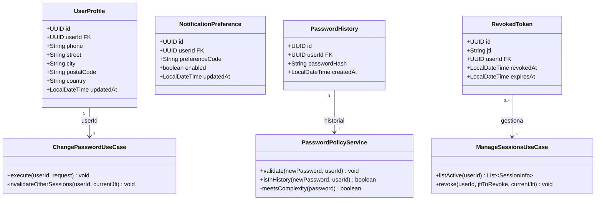
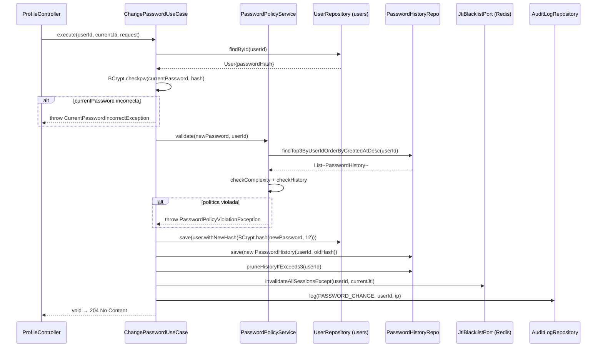
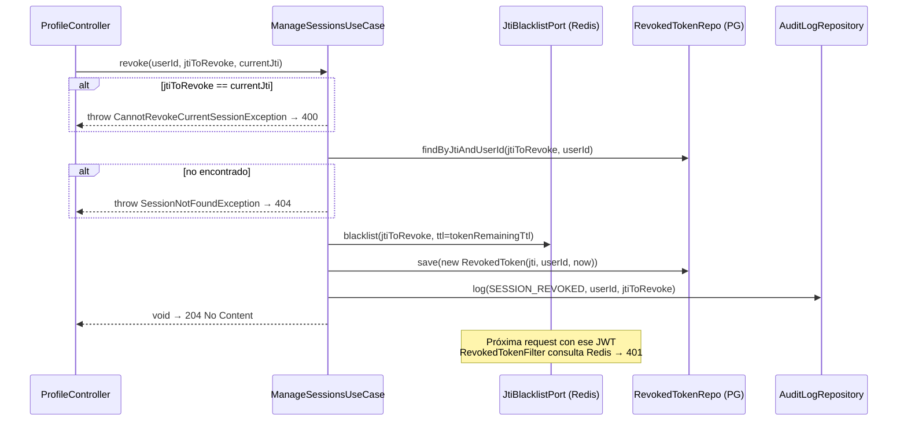
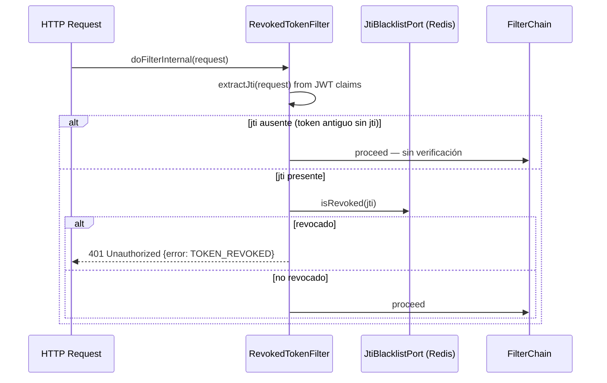
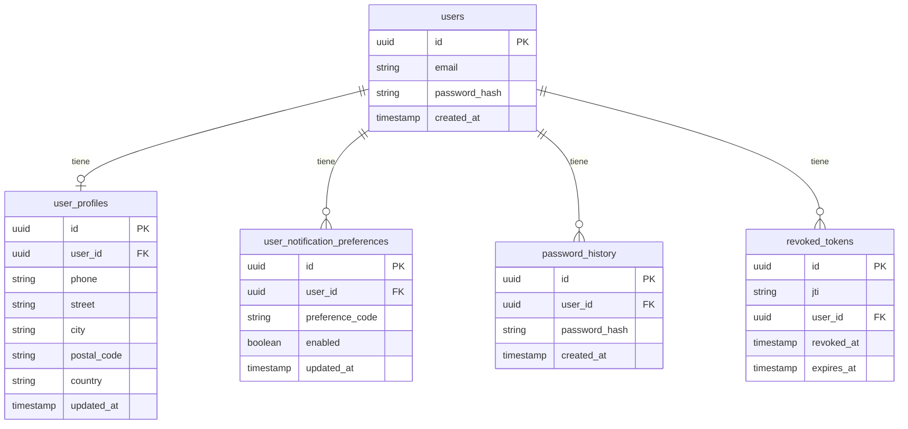

# LLD-015 — Perfil de Usuario Backend
# BankPortal / Banco Meridian — FEAT-012-A

## Metadata

| Campo | Valor |
|---|---|
| Documento | LLD-015 |
| Servicio | `backend-2fa` — módulo `profile` |
| Stack | Java 21 / Spring Boot 3.3.4 / Spring Data JPA / Redis |
| Feature | FEAT-012-A — Gestión de Perfil de Usuario |
| Sprint | 14 | Versión | 1.0 |
| Estado | PENDING APPROVAL — Gate 3 Tech Lead |
| Fecha | 2026-03-23 |

---

## Estructura de módulo (arquitectura hexagonal)

```
apps/backend-2fa/src/main/java/com/experis/sofia/bankportal/
└── profile/
    ├── domain/
    │   ├── model/
    │   │   ├── UserProfile.java              # @Entity — datos personales
    │   │   ├── NotificationPreference.java   # @Entity — preferencias por usuario
    │   │   ├── PasswordHistory.java          # @Entity — últimas 3 contraseñas
    │   │   └── RevokedToken.java             # @Entity — JTIs revocados
    │   ├── port/
    │   │   ├── UserProfileRepository.java    # Interface (puerto salida)
    │   │   ├── PasswordHistoryRepository.java
    │   │   ├── RevokedTokenRepository.java
    │   │   └── JtiBlacklistPort.java         # Interface Redis (puerto salida)
    │   └── service/
    │       └── PasswordPolicyService.java    # Validación política contraseña
    ├── application/
    │   ├── usecase/
    │   │   ├── GetProfileUseCase.java
    │   │   ├── UpdateProfileUseCase.java
    │   │   ├── ChangePasswordUseCase.java
    │   │   ├── ManageNotificationsUseCase.java
    │   │   └── ManageSessionsUseCase.java
    │   └── dto/
    │       ├── ProfileResponse.java          # record
    │       ├── UpdateProfileRequest.java     # record
    │       ├── ChangePasswordRequest.java    # record
    │       ├── NotificationPrefsResponse.java
    │       └── SessionInfo.java              # record — IP ofuscada
    ├── infrastructure/
    │   ├── persistence/
    │   │   ├── UserProfileJpaRepository.java
    │   │   ├── PasswordHistoryJpaRepository.java
    │   │   └── RevokedTokenJpaRepository.java
    │   └── redis/
    │       └── RedisJtiBlacklist.java        # Impl JtiBlacklistPort via StringRedisTemplate
    ├── api/
    │   └── ProfileController.java           # @RestController @RequestMapping("/api/v1/profile")
    └── security/
        └── RevokedTokenFilter.java          # OncePerRequestFilter — consulta Redis por jti
```

---

## Diagrama de clases — dominio



---

## Diagramas de secuencia — flujos críticos

### Flujo: Cambio de contraseña (US-1203)



### Flujo: Revocar sesión (US-1205)



### Flujo: RevokedTokenFilter (request entrante)



---

## Modelo de datos — Flyway V14



**Índices:**
- `user_profiles(user_id)` — UNIQUE
- `user_notification_preferences(user_id, preference_code)` — UNIQUE
- `password_history(user_id, created_at DESC)` — acceso rápido a últimas 3
- `revoked_tokens(jti)` — UNIQUE, para lookup O(1)
- `revoked_tokens(expires_at)` — para job de limpieza periódica

---

## Contrato OpenAPI (definido por Architect)

### GET /api/v1/profile
**Auth:** Bearer JWT

**Response 200:**
```json
{
  "userId": "uuid",
  "fullName": "string",
  "email": "string (read-only)",
  "phone": "string | null",
  "address": {
    "street": "string | null",
    "city": "string | null",
    "postalCode": "string | null",
    "country": "string | null"
  },
  "twoFactorEnabled": "boolean",
  "memberSince": "ISO-8601 date"
}
```

---

### PATCH /api/v1/profile
**Auth:** Bearer JWT

**Request (todos los campos opcionales — PATCH parcial):**
```json
{
  "phone": "+34612345678",
  "address": {
    "street": "Calle Mayor 1",
    "city": "Madrid",
    "postalCode": "28001",
    "country": "ES"
  }
}
```
**Response 200:** ProfileResponse actualizado
**Errores:** 400 (campo inválido: `{field, error}`), 400 (FIELD_NOT_UPDATABLE si intenta actualizar email)

---

### POST /api/v1/profile/password
**Auth:** Bearer JWT

**Request:**
```json
{
  "currentPassword": "string",
  "newPassword": "string",
  "confirmPassword": "string"
}
```
**Response 204:** No Content
**Errores:** 400 CURRENT_PASSWORD_INCORRECT | PASSWORD_POLICY_VIOLATION | PASSWORD_SAME_AS_CURRENT | PASSWORD_IN_HISTORY | PASSWORDS_DO_NOT_MATCH

---

### GET /api/v1/profile/notifications
**Response 200:**
```json
{
  "preferences": [
    { "code": "NOTIF_TRANSFER_EMAIL", "enabled": true },
    { "code": "NOTIF_TRANSFER_INAPP", "enabled": true },
    { "code": "NOTIF_LOGIN_EMAIL",    "enabled": true },
    { "code": "NOTIF_BUDGET_ALERT",   "enabled": true },
    { "code": "NOTIF_EXPORT_EMAIL",   "enabled": false }
  ]
}
```

---

### PATCH /api/v1/profile/notifications
**Request:** `{ "NOTIF_TRANSFER_EMAIL": false }`
**Response 200:** NotificationPrefsResponse actualizado
**Errores:** 400 UNKNOWN_PREFERENCE_CODE

---

### GET /api/v1/profile/sessions
**Response 200:**
```json
{
  "sessions": [
    {
      "jti": "uuid",
      "userAgent": "Chrome en macOS",
      "ipAddress": "192.168.***.***",
      "createdAt": "ISO-8601",
      "current": true
    }
  ]
}
```
> **Nota:** `jti` incluido en response para permitir la revocación.
> IP ofuscada en backend antes de llegar al frontend (RGPD Art. 25).

---

### DELETE /api/v1/profile/sessions/{jti}
**Response 204:** No Content
**Errores:** 400 CANNOT_REVOKE_CURRENT_SESSION | 404 SESSION_NOT_FOUND

---

## Variables de entorno requeridas (nuevas)

| Variable | Descripción | Ejemplo |
|---|---|---|
| `REDIS_URL` | Ya existente desde FEAT-007 | `redis://localhost:6379` |
| `JWT_JTI_ENABLED` | Feature flag — activa `jti` en tokens nuevos (DEBT-023) | `true` |
| `PASSWORD_HISTORY_SIZE` | Número de contraseñas a recordar | `3` |
| `SESSION_MAX_AGE_HOURS` | Sesiones > N horas no se muestran | `24` |

---

## DEBT-023 — Modificación a JwtService (prereq US-1205)

```java
// JwtService.java — generateToken() — CAMBIO REQUERIDO
String jti = UUID.randomUUID().toString();

return Jwts.builder()
    .id(jti)                          // ← NUEVO: jti claim
    .subject(userId.toString())
    .claim("email", user.getEmail())
    .issuedAt(new Date())
    .expiration(new Date(System.currentTimeMillis() + jwtExpirationMs))
    .signWith(secretKey)
    .compact();
```

**Compatibilidad:** Tokens existentes sin `jti` pasan por `RevokedTokenFilter` sin verificación (graceful degradation). Solo tokens nuevos (post-DEBT-023) son revocables.

---

*SOFIA Architect Agent — Step 3 Gate 3 pending*
*CMMI Level 3 — TS SP 1.1 · TS SP 2.1 · TS SP 2.2*
*BankPortal Sprint 14 — FEAT-012-A Backend — 2026-03-23*
