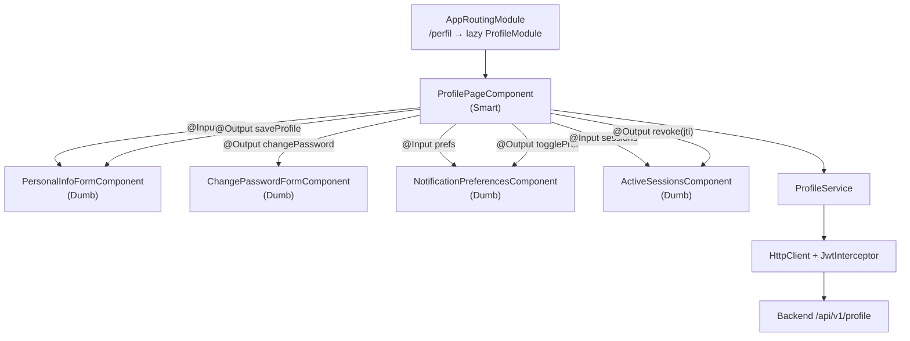
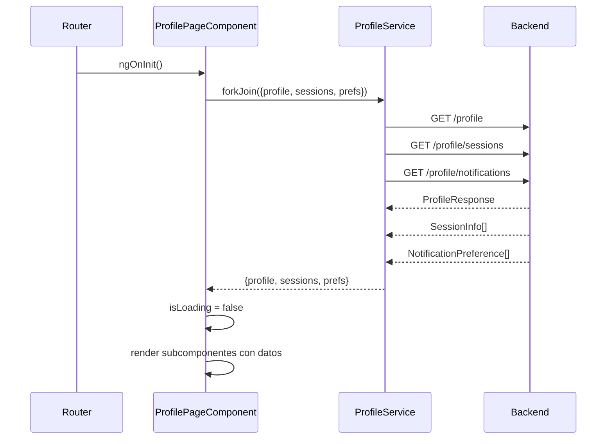

# LLD-016 — Perfil de Usuario Frontend
# BankPortal / Banco Meridian — FEAT-012-A

## Metadata

| Campo | Valor |
|---|---|
| Documento | LLD-016 |
| Módulo | `frontend-portal` — `ProfileModule` (Angular 17) |
| Stack | Angular 17 / TypeScript 5 / Angular Signals |
| Feature | FEAT-012-A — Gestión de Perfil de Usuario |
| Sprint | 14 | Versión | 1.0 |
| Estado | PENDING APPROVAL — Gate 3 Tech Lead |
| Fecha | 2026-03-23 |

---

## Estructura del módulo Angular

```
apps/frontend-portal/src/app/features/profile/
├── profile.module.ts               # lazy-loaded desde AppRoutingModule
├── profile-routing.module.ts       # /perfil → ProfilePageComponent
├── models/
│   ├── profile.model.ts            # interfaces TypeScript
│   └── notification.model.ts
├── services/
│   └── profile.service.ts          # HttpClient — 7 endpoints
├── components/
│   ├── profile-page/
│   │   ├── profile-page.component.ts    # Smart: orquesta subcomponentes
│   │   ├── profile-page.component.html
│   │   └── profile-page.component.scss
│   ├── personal-info-form/
│   │   ├── personal-info-form.component.ts   # Dumb: formulario datos
│   │   └── personal-info-form.component.html
│   ├── change-password-form/
│   │   ├── change-password-form.component.ts # Dumb: formulario contraseña
│   │   └── change-password-form.component.html
│   ├── notification-preferences/
│   │   ├── notification-preferences.component.ts  # Dumb: toggles
│   │   └── notification-preferences.component.html
│   └── active-sessions/
│       ├── active-sessions.component.ts  # Dumb: tabla + botón revocar
│       └── active-sessions.component.html
└── profile.component.spec.ts       # tests unitarios principales
```

---

## Modelos TypeScript

```typescript
// profile.model.ts
export interface ProfileResponse {
  userId: string;
  fullName: string;
  email: string;       // read-only en UI
  phone: string | null;
  address: Address | null;
  twoFactorEnabled: boolean;
  memberSince: string; // ISO-8601
}

export interface Address {
  street: string | null;
  city: string | null;
  postalCode: string | null;
  country: string | null;
}

export interface UpdateProfileRequest {
  phone?: string;
  address?: Partial<Address>;
}

export interface ChangePasswordRequest {
  currentPassword: string;
  newPassword: string;
  confirmPassword: string;
}

export interface SessionInfo {
  jti: string;
  userAgent: string;
  ipAddress: string; // ya ofuscado por backend
  createdAt: string;
  current: boolean;
}

// notification.model.ts
export type NotificationCode =
  | 'NOTIF_TRANSFER_EMAIL'
  | 'NOTIF_TRANSFER_INAPP'
  | 'NOTIF_LOGIN_EMAIL'
  | 'NOTIF_BUDGET_ALERT'
  | 'NOTIF_EXPORT_EMAIL';

export interface NotificationPreference {
  code: NotificationCode;
  enabled: boolean;
}
```

---

## ProfileService — contratos HTTP

```typescript
@Injectable({ providedIn: 'root' })
export class ProfileService {
  private readonly base = '/api/v1/profile';

  getProfile(): Observable<ProfileResponse>
  updateProfile(req: UpdateProfileRequest): Observable<ProfileResponse>
  changePassword(req: ChangePasswordRequest): Observable<void>
  getNotifications(): Observable<NotificationPreference[]>
  updateNotifications(patch: Partial<Record<NotificationCode, boolean>>): Observable<NotificationPreference[]>
  getSessions(): Observable<SessionInfo[]>
  revokeSession(jti: string): Observable<void>
}
```

> Todos los métodos usan `catchError` → `EMPTY | throwError` con mensaje de error tipado.
> `JwtInterceptor` inyecta `Authorization: Bearer {token}` automáticamente.
> RV-016 fix: todos los `subscribe()` usan `takeUntilDestroyed(this.destroyRef)`.

---

## Diagrama de componentes Angular



---

## Diagrama de secuencia — carga inicial del perfil



---

## Manejo de errores y estados UI

| Estado | Comportamiento |
|---|---|
| `isLoading = true` | Skeleton loaders en todas las secciones |
| Error 401 | `JwtInterceptor` redirige a `/login` |
| Error 400 validación | Muestra mensaje inline en campo afectado |
| Error 400 PASSWORD_POLICY_VIOLATION | Lista las violaciones en el formulario |
| Error 400 CURRENT_PASSWORD_INCORRECT | Mensaje en campo contraseña actual |
| Error 404 SESSION_NOT_FOUND | Toast de error — lista se recarga |
| Error 500 | Toast genérico "Error del servidor" |

---

## AuthGuard — RV-017 fix (JWT exp check)

```typescript
// auth.guard.ts — MODIFICACIÓN
canActivate(): boolean | UrlTree {
  const token = localStorage.getItem('jwt_token');
  if (!token) return this.router.createUrlTree(['/login']);

  try {
    const payload = JSON.parse(atob(token.split('.')[1]));
    const isExpired = Date.now() / 1000 > payload.exp;
    if (isExpired) {
      localStorage.removeItem('jwt_token');
      return this.router.createUrlTree(['/login']);
    }
    return true;
  } catch {
    return this.router.createUrlTree(['/login']);
  }
}
```

---

## Routing — integración en AppRoutingModule

```typescript
// app-routing.module.ts — añadir ruta lazy
{
  path: 'perfil',
  loadChildren: () =>
    import('./features/profile/profile.module')
      .then(m => m.ProfileModule),
  canActivate: [AuthGuard]
}
```

---

## Navegación desde Dashboard

El `DashboardComponent` (FEAT-011) incluirá un enlace en el header:
```html
<!-- header.component.html -->
<a routerLink="/perfil" class="profile-link">
  <span>{{ userName }}</span>
  <mat-icon>account_circle</mat-icon>
</a>
```

---

*SOFIA Architect Agent — Step 3 Gate 3 pending*
*CMMI Level 3 — TS SP 1.1 · TS SP 2.1 · TS SP 2.2*
*BankPortal Sprint 14 — FEAT-012-A Frontend — 2026-03-23*
