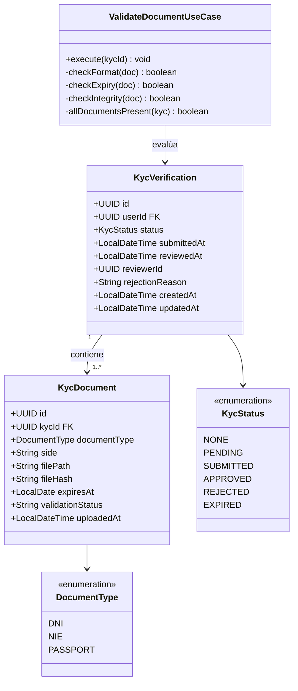
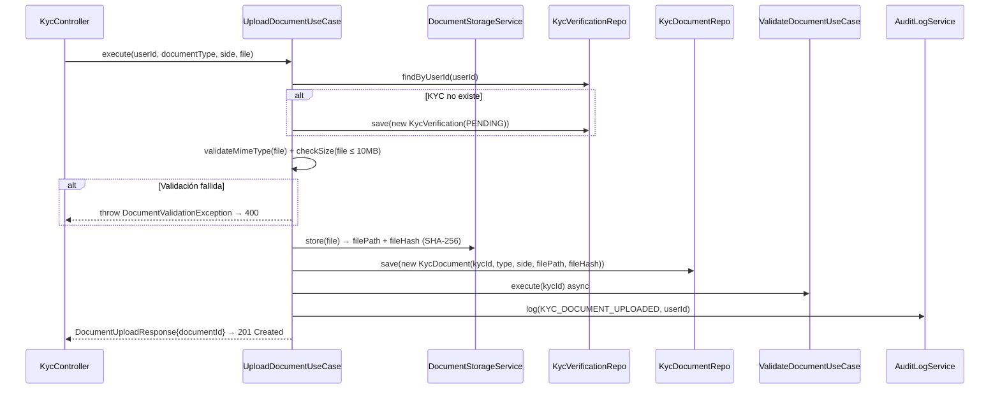
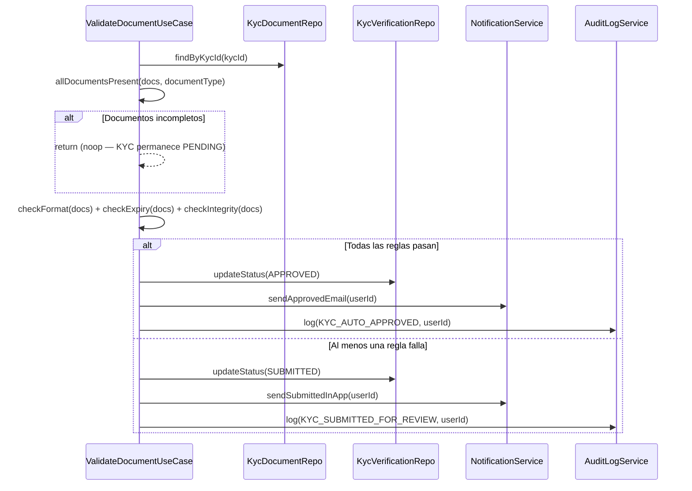
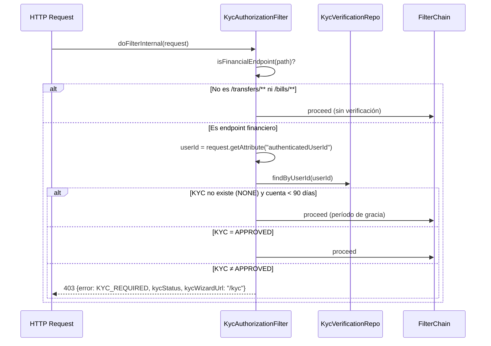
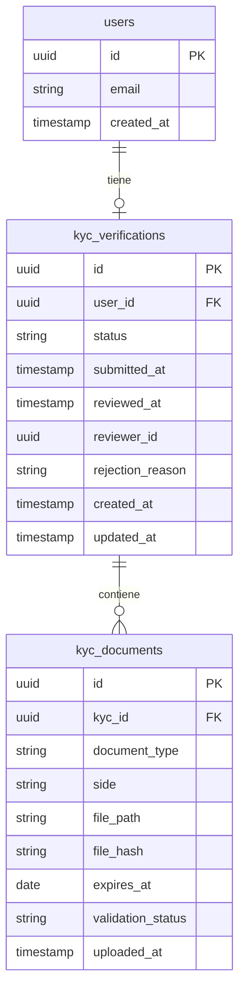

# LLD-017 — KYC Backend
# BankPortal / Banco Meridian — FEAT-013

## Metadata

| Campo | Valor |
|---|---|
| Documento | LLD-017 |
| Servicio | `backend-2fa` — módulo `kyc` |
| Stack | Java 21 / Spring Boot 3.3.4 / Spring Data JPA / Spring Security |
| Feature | FEAT-013 — Onboarding KYC |
| Sprint | 15 | Versión | 1.0 |
| Estado | PENDING APPROVAL — Gate 3 Tech Lead |
| Fecha | 2026-03-23 |

---

## Estructura de módulo (arquitectura hexagonal)

```
apps/backend-2fa/src/main/java/com/experis/sofia/bankportal/
└── kyc/
    ├── domain/
    │   ├── model/
    │   │   ├── KycVerification.java     # @Entity — estado KYC por usuario
    │   │   ├── KycDocument.java         # @Entity — documento subido
    │   │   ├── KycStatus.java           # enum: NONE/PENDING/SUBMITTED/APPROVED/REJECTED/EXPIRED
    │   │   └── DocumentType.java        # enum: DNI/NIE/PASSPORT
    │   └── port/
    │       ├── KycVerificationRepository.java   # Interface JPA (puerto salida)
    │       └── KycDocumentRepository.java       # Interface JPA (puerto salida)
    ├── application/
    │   ├── usecase/
    │   │   ├── GetKycStatusUseCase.java
    │   │   ├── UploadDocumentUseCase.java
    │   │   ├── ValidateDocumentUseCase.java      # motor validación automática
    │   │   └── ReviewKycUseCase.java             # revisión manual (admin)
    │   ├── service/
    │   │   └── DocumentStorageService.java       # cifrado AES-256 + SHA-256
    │   └── dto/
    │       ├── KycStatusResponse.java
    │       ├── DocumentUploadRequest.java
    │       └── KycReviewRequest.java
    ├── infrastructure/
    │   ├── persistence/
    │   │   ├── KycVerificationJpaRepository.java
    │   │   └── KycDocumentJpaRepository.java
    │   └── storage/
    │       └── LocalEncryptedDocumentStorage.java  # AES-256 file I/O
    ├── api/
    │   ├── KycController.java           # /api/v1/kyc/**
    │   └── KycAdminController.java      # /api/v1/admin/kyc/**
    └── security/
        └── KycAuthorizationFilter.java  # OncePerRequestFilter — bloqueo financiero
```

---

## Diagrama de clases — dominio



---

## Diagramas de secuencia — flujos críticos

### Flujo: Subida de documento (US-1302)



### Flujo: Validación automática (US-1303)



### Flujo: KycAuthorizationFilter (US-1305)



---

## Modelo de datos — Flyway V15



**Índices:**
- `kyc_verifications(user_id)` — UNIQUE
- `kyc_verifications(status)` — para queries de revisión admin
- `kyc_documents(kyc_id)` — lookup por verificación
- `kyc_documents(kyc_id, document_type, side)` — UNIQUE (un doc por tipo+cara)

---

## Contrato OpenAPI (definido por Architect)

### GET /api/v1/kyc/status
**Auth:** Bearer JWT

**Response 200:**
```json
{
  "userId": "uuid",
  "status": "PENDING | SUBMITTED | APPROVED | REJECTED | EXPIRED | NONE",
  "submittedAt": "ISO-8601 | null",
  "rejectionReason": "string | null",
  "kycWizardUrl": "/kyc",
  "estimatedReviewHours": 24
}
```

---

### POST /api/v1/kyc/documents
**Auth:** Bearer JWT
**Content-Type:** multipart/form-data

**Fields:**
- `documentType`: `DNI | NIE | PASSPORT`
- `side`: `FRONT | BACK`
- `file`: binary (JPEG, PNG, PDF ≤ 10MB)

**Response 201:**
```json
{ "documentId": "uuid", "kycStatus": "PENDING | SUBMITTED" }
```

**Errores:**
- `400 FILE_TOO_LARGE` — fichero > 10MB
- `400 UNSUPPORTED_FORMAT` — MIME type no aceptado
- `400 DOCUMENT_ALREADY_UPLOADED` — ya existe ese tipo+cara para este KYC
- `409 KYC_ALREADY_APPROVED` — KYC ya aprobado, no se aceptan nuevos documentos

---

### PATCH /api/v1/admin/kyc/{kycId}
**Auth:** Bearer JWT + `ROLE_KYC_REVIEWER`

**Request:**
```json
{
  "action": "APPROVE | REJECT",
  "reason": "string (obligatorio si action=REJECT)"
}
```

**Response 200:**
```json
{ "kycId": "uuid", "newStatus": "APPROVED | REJECTED", "reviewedAt": "ISO-8601" }
```

**Errores:**
- `400 INVALID_KYC_TRANSITION` — estado actual no permite la transición
- `403 Forbidden` — usuario sin `ROLE_KYC_REVIEWER`
- `404 Not Found` — kycId no existe

---

## Variables de entorno requeridas (nuevas)

| Variable | Descripción | Ejemplo |
|---|---|---|
| `KYC_STORAGE_PATH` | Directorio raíz almacenamiento documentos | `/data/kyc-documents` |
| `KYC_ENCRYPTION_KEY` | Clave AES-256 para cifrado de ficheros (32 bytes en Base64) | (secret) |
| `KYC_GRACE_PERIOD_DAYS` | Días de gracia para usuarios NONE | `90` |
| `KYC_AUTO_REVIEW_ENABLED` | Activa/desactiva validación automática | `true` |

---

*SOFIA Architect Agent — Step 3 Gate 3 pending*
*CMMI Level 3 — TS SP 1.1 · TS SP 2.1 · TS SP 2.2*
*BankPortal Sprint 15 — FEAT-013 Backend — 2026-03-23*
