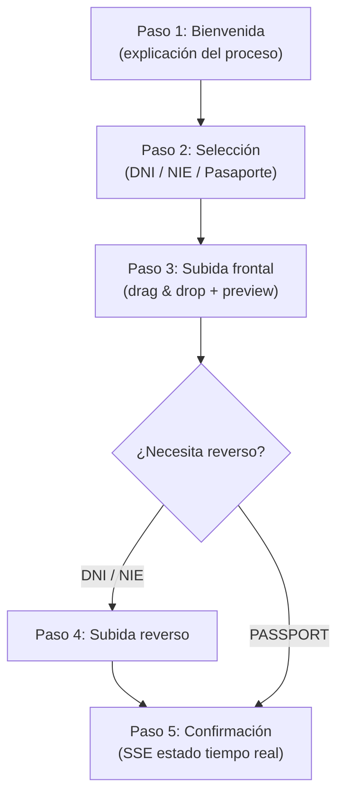

# LLD-018 — KYC Frontend Angular
# BankPortal / Banco Meridian — FEAT-013

## Metadata

| Campo | Valor |
|---|---|
| Documento | LLD-018 |
| Módulo | `frontend-portal` — `KycModule` (Angular 17) |
| Stack | Angular 17 / TypeScript 5 / Angular Signals |
| Feature | FEAT-013 — Onboarding KYC |
| Sprint | 15 | Versión | 1.0 |

---

## Estructura del módulo Angular

```
apps/frontend-portal/src/app/features/kyc/
├── kyc.module.ts                    # lazy-loaded desde AppRoutingModule
├── kyc-routing.module.ts            # /kyc → KycWizardComponent
├── models/
│   └── kyc.models.ts                # KycStatus, DocumentType, KycStatusResponse
├── services/
│   └── kyc.service.ts               # KycService (HTTP + SSE)
├── guards/
│   └── kyc.guard.ts                 # Redirige a /kyc si KYC ≠ APPROVED
└── components/
    ├── kyc-wizard/
    │   ├── kyc-wizard.component.ts  # Smart — orquesta los 5 pasos
    │   └── kyc-wizard.component.html
    ├── step-welcome/
    ├── step-document-select/
    ├── step-upload-front/
    ├── step-upload-back/            # Solo si documentType ≠ PASSPORT
    └── step-confirmation/           # SSE estado tiempo real
```

---

## Modelos TypeScript

```typescript
export type KycStatus = 'NONE' | 'PENDING' | 'SUBMITTED' | 'APPROVED' | 'REJECTED' | 'EXPIRED';
export type DocumentType = 'DNI' | 'NIE' | 'PASSPORT';

export interface KycStatusResponse {
  userId: string;
  status: KycStatus;
  submittedAt: string | null;
  rejectionReason: string | null;
  kycWizardUrl: string;
  estimatedReviewHours: number;
}

export interface DocumentUploadResponse {
  documentId: string;
  kycStatus: KycStatus;
}
```

---

## KycGuard — bloqueo angular

```typescript
// kyc.guard.ts — protege /transfers y /bills
export const kycGuard: CanActivateFn = async () => {
  const kycService = inject(KycService);
  const router     = inject(Router);
  const status     = await firstValueFrom(kycService.getStatus());
  if (status.status === 'APPROVED') return true;
  return router.createUrlTree(['/kyc'], {
    queryParams: { reason: 'KYC_REQUIRED' }
  });
};
```

---

## Wizard — flujo de pasos



---

*SOFIA Architect Agent — Step 3 Gate 3 pending*
*CMMI Level 3 — TS SP 1.1 · TS SP 2.1 · TS SP 2.2*
*BankPortal Sprint 15 — FEAT-013 Frontend — 2026-03-23*
