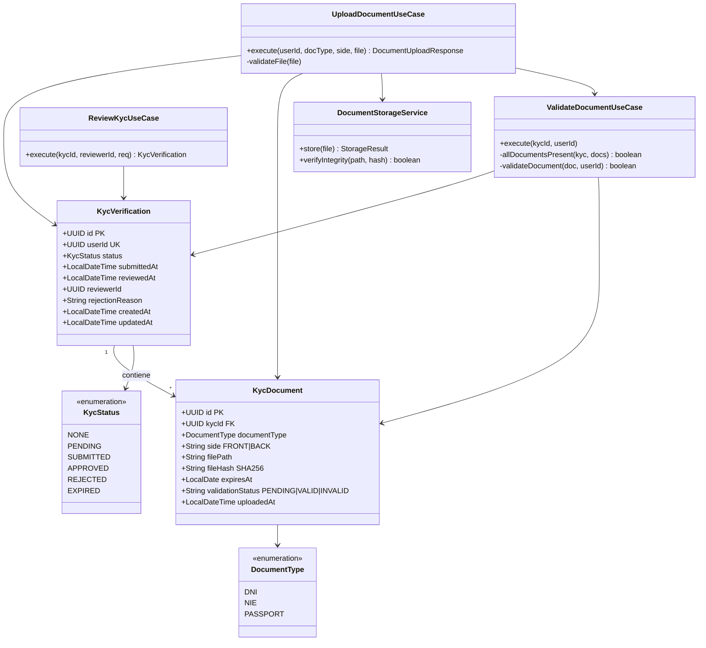
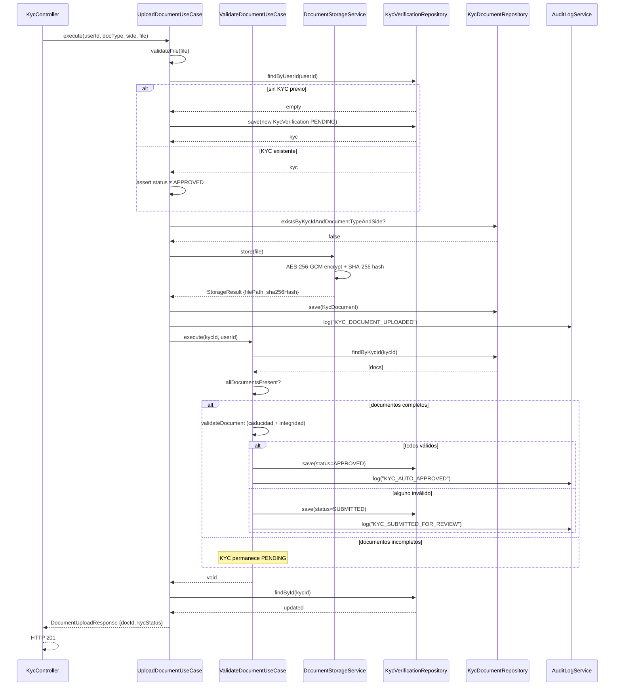
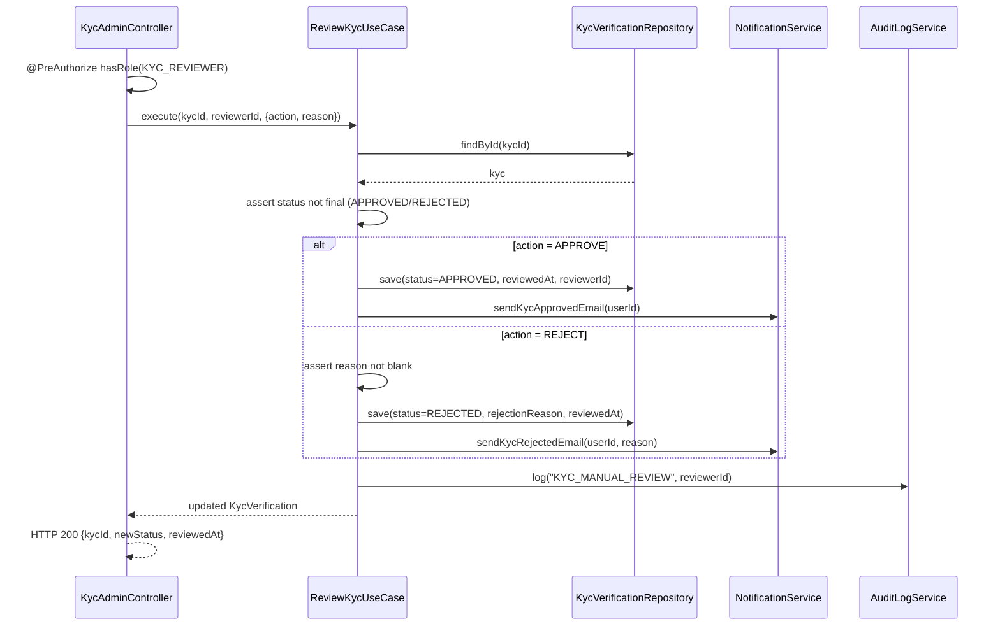
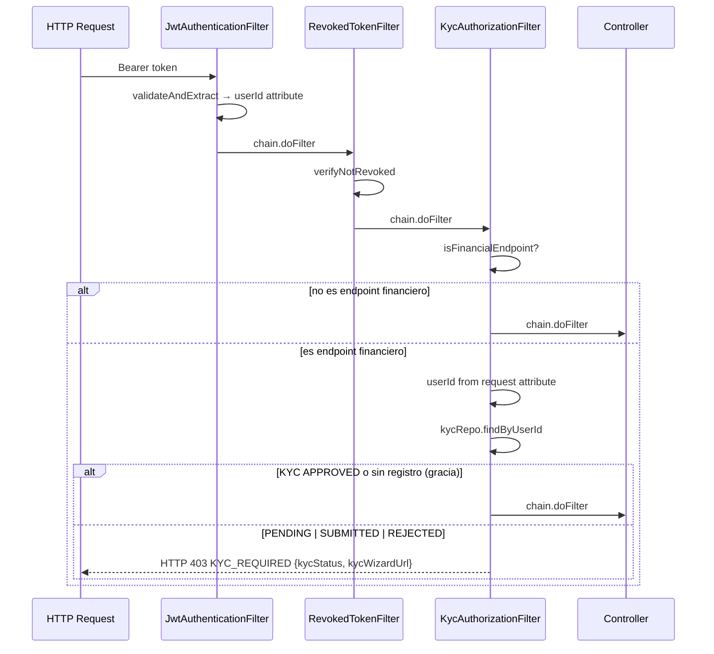
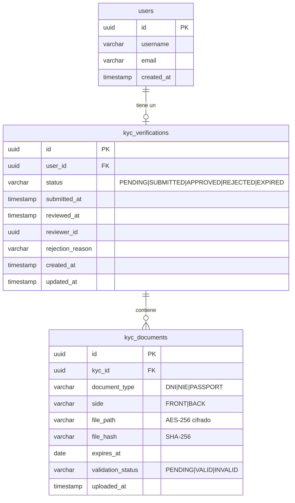

# LLD Backend — FEAT-013: Onboarding KYC

## Metadata

| Campo | Valor |
|---|---|
| Servicio | `bankportal-backend-2fa` |
| Stack | Java 21 · Spring Boot 3.3 · PostgreSQL 15 · Flyway |
| Feature | FEAT-013 — Sprint 15 |
| Versión | 1.0 |
| Estado | APPROVED — Tech Lead (2026-03-24) |

---

## Estructura de módulo `kyc`

```
apps/backend-2fa/src/main/java/com/experis/sofia/bankportal/kyc/
├── api/
│   ├── KycController.java               # US-1302 / US-1304 — POST /documents · GET /status
│   └── KycAdminController.java          # US-1307 — PATCH /admin/kyc/{id}  @PreAuthorize KYC_REVIEWER
├── application/
│   ├── UploadDocumentUseCase.java        # US-1302 — validación + almacenamiento + hash SHA-256
│   ├── ValidateDocumentUseCase.java      # US-1303 — motor validación automática
│   ├── GetKycStatusUseCase.java          # US-1304 — consulta estado + documentos
│   ├── ReviewKycUseCase.java             # US-1307 — aprobación / rechazo manual
│   ├── DocumentStorageService.java       # ADR-023 — AES-256 filesystem local
│   └── dto/
│       ├── DocumentUploadResponse.java   # { documentId, kycStatus }
│       ├── KycStatusResponse.java        # { status, submittedAt, documents[] }
│       ├── KycReviewRequest.java         # { action: APPROVE|REJECT, reason? }
│       └── DocumentSummaryDto.java       # { id, documentType, side, validationStatus }
├── domain/
│   ├── KycVerification.java             # @Entity — kyc_verifications
│   ├── KycDocument.java                 # @Entity — kyc_documents
│   ├── KycStatus.java                   # NONE|PENDING|SUBMITTED|APPROVED|REJECTED|EXPIRED
│   ├── DocumentType.java                # DNI|NIE|PASSPORT
│   ├── KycVerificationRepository.java   # JPA — findByUserId, findById
│   └── KycDocumentRepository.java       # JPA — findByKycId, existsByKycIdAndTypeAndSide
└── security/
    └── KycAuthorizationFilter.java      # US-1305 — OncePerRequestFilter · bloqueo financiero
```

---

## Diagrama de clases — dominio KYC



---

## Diagrama de secuencia — US-1302 / US-1303: Subida y validación



---

## Diagrama de secuencia — US-1307: Revisión manual



---

## Diagrama de secuencia — US-1305: KycAuthorizationFilter



---

## Modelo de datos (ER)



---

## Contrato OpenAPI

### GET /api/v1/kyc/status

**Descripción:** Consulta el estado KYC del usuario autenticado.
**Auth:** Bearer JWT

**Response 200:**
```json
{
  "kycId": "uuid",
  "status": "PENDING|SUBMITTED|APPROVED|REJECTED",
  "submittedAt": "2026-03-24T10:00:00Z",
  "reviewedAt": null,
  "documents": [
    {
      "id": "uuid",
      "documentType": "DNI",
      "side": "FRONT",
      "validationStatus": "VALID",
      "uploadedAt": "2026-03-24T09:55:00Z"
    }
  ]
}
```
**Errores:** 401 (sin auth)

---

### POST /api/v1/kyc/documents

**Descripción:** Sube un documento de identidad (multipart).
**Auth:** Bearer JWT
**Content-Type:** `multipart/form-data`

**Request (form fields):**
```
documentType: DNI | NIE | PASSPORT
side:         FRONT | BACK
file:         <binary — image/jpeg | image/png | application/pdf, máx 10MB>
```

**Response 201:**
```json
{
  "documentId": "uuid",
  "kycStatus": "SUBMITTED"
}
```

**Errores:**
- `400 FILE_TOO_LARGE` — fichero > 10MB
- `400 UNSUPPORTED_FORMAT` — MIME no permitido
- `400 FILE_EMPTY` — fichero vacío
- `409 KYC_ALREADY_APPROVED` — KYC ya aprobado
- `409 DOCUMENT_ALREADY_UPLOADED` — ese tipo+cara ya subido

---

### PATCH /api/v1/admin/kyc/{kycId}

**Descripción:** Aprueba o rechaza un KYC (operadores con ROLE_KYC_REVIEWER).
**Auth:** Bearer JWT + `ROLE_KYC_REVIEWER`

**Request:**
```json
{
  "action": "APPROVE | REJECT",
  "reason": "string — requerido si action=REJECT"
}
```

**Response 200:**
```json
{
  "kycId": "uuid",
  "newStatus": "APPROVED",
  "reviewedAt": "2026-03-24T11:00:00Z"
}
```

**Errores:**
- `400 REASON_REQUIRED` — REJECT sin motivo
- `403` — rol insuficiente
- `404` — kycId no encontrado
- `409 KYC_ALREADY_IN_FINAL_STATE` — intento modificar estado final

---

## Estrategia de datos

| Aspecto | Decisión |
|---|---|
| Motor | PostgreSQL 15 |
| Migraciones | Flyway — `V15__kyc_onboarding.sql` |
| Cifrado en reposo | AES-256-GCM — `DocumentStorageService` (ADR-023) |
| Hash integridad | SHA-256 por documento — verificado en cada read |
| Retención | ≥ 5 años desde aprobación (RGPD + AML) — job de expiración en sprint futuro |
| Índices | `idx_kyc_verifications_user`, `idx_kyc_verifications_status`, `idx_kyc_documents_kyc_id` |

---

## Variables de entorno requeridas

| Variable | Descripción | Ejemplo |
|---|---|---|
| `KYC_STORAGE_PATH` | Directorio base almacenamiento documentos | `/data/kyc-docs` |
| `KYC_ENCRYPTION_KEY` | Clave AES-256 Base64 (32 bytes) | `<secret>` |
| `kyc.grace-period-days` | Días de gracia sin KYC para usuarios existentes | `90` |

---

*SOFIA Architect Agent — Step 3 | Sprint 15 · FEAT-013*
*CMMI Level 3 — TS SP 2.1 · TS SP 3.1*
*BankPortal — Banco Meridian — 2026-03-24*
