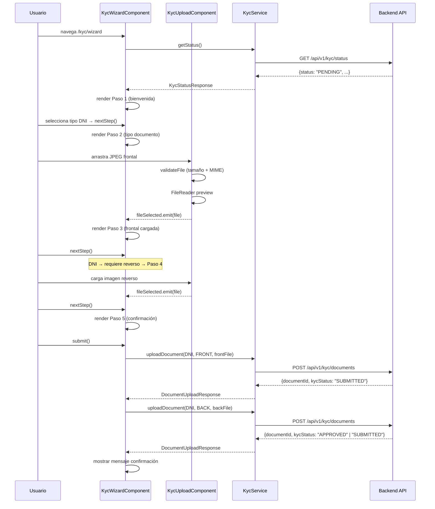
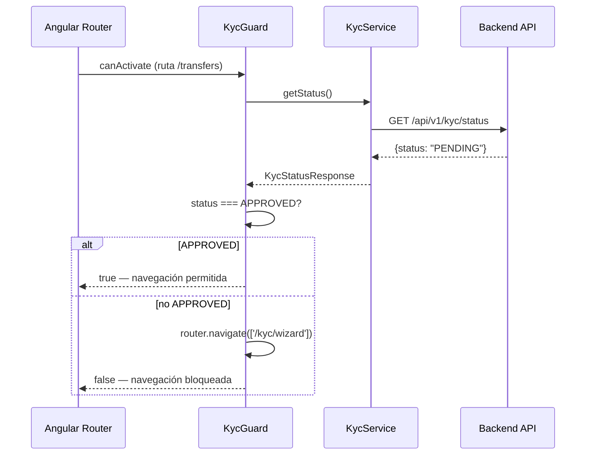

# LLD Frontend Angular — FEAT-013: KYC Wizard

## Metadata

| Campo | Valor |
|---|---|
| App | `bankportal-frontend-portal` |
| Stack | Angular 17 · TypeScript · Angular CDK |
| Feature | FEAT-013 — Sprint 15 |
| Versión | 1.0 |
| Estado | APPROVED — Tech Lead (2026-03-24) |

---

## Estructura del módulo `kyc`

```
apps/frontend-portal/src/app/features/kyc/
├── kyc.module.ts                    # Lazy module — loadChildren en AppRouter
├── kyc.routes.ts                    # Rutas: /kyc, /kyc/wizard, /kyc/status
├── kyc.guard.ts                     # KycGuard — CanActivateFn para rutas financieras
├── components/
│   ├── kyc-wizard/
│   │   ├── kyc-wizard.component.ts  # US-1306 — stepper 5 pasos
│   │   ├── kyc-wizard.component.html
│   │   └── kyc-wizard.component.spec.ts
│   ├── kyc-upload/
│   │   ├── kyc-upload.component.ts  # Drag & drop + previsualización
│   │   ├── kyc-upload.component.html
│   │   └── kyc-upload.component.spec.ts
│   ├── kyc-status/
│   │   ├── kyc-status.component.ts  # US-1304 — banner estado + polling
│   │   ├── kyc-status.component.html
│   │   └── kyc-status.component.spec.ts
│   └── kyc-summary/
│       ├── kyc-summary.component.ts # Paso final — confirmación
│       └── kyc-summary.component.html
├── services/
│   └── kyc.service.ts               # HTTP — GET /status · POST /documents
└── models/
    └── kyc.model.ts                 # KycStatus, KycStatusResponse, DocumentType
```

---

## Diagrama de componentes Angular — FEAT-013

```mermaid
classDiagram
  class KycModule {
    +routes: Routes
    +lazy loaded desde AppRouter
  }

  class KycGuard {
    <<CanActivateFn>>
    +canActivate(route, state) Observable~boolean~
    -kycService.getStatus()
    -router.navigate(['/kyc/wizard']) si no APPROVED
  }

  class KycWizardComponent {
    +currentStep: number
    +selectedDocType: DocumentType
    +frontFile: File | null
    +backFile: File | null
    +nextStep()
    +prevStep()
    +onDocTypeSelected(type)
    +submit()
  }

  class KycUploadComponent {
    <<Input>> side: 'FRONT' | 'BACK'
    <<Output>> fileSelected: EventEmitter~File~
    +onDrop(event: DragEvent)
    +onFileInput(event: Event)
    +preview: string | null
    +errorMessage: string | null
    -validateFile(file: File): boolean
  }

  class KycStatusComponent {
    +kycStatus$: Observable~KycStatusResponse~
    +showBanner: boolean
    -pollStatus()
  }

  class KycService {
    +getStatus() Observable~KycStatusResponse~
    +uploadDocument(docType, side, file) Observable~DocumentUploadResponse~
  }

  KycModule --> KycWizardComponent
  KycModule --> KycStatusComponent
  KycModule --> KycGuard
  KycWizardComponent --> KycUploadComponent
  KycWizardComponent --> KycService
  KycStatusComponent --> KycService
  KycGuard --> KycService
```



---

## Diagrama de secuencia — US-1306: Flujo wizard



---

## Flujo KycGuard — US-1305 frontend



---

## Pasos del wizard — US-1306

| Paso | Componente / Template | Condición omisión |
|---|---|---|
| 1 | Bienvenida + normativa RGPD consent | Siempre visible |
| 2 | Selección tipo documento (DNI / NIE / Pasaporte) | Siempre visible |
| 3 | Subida cara frontal (`KycUploadComponent side=FRONT`) | Siempre visible |
| 4 | Subida reverso (`KycUploadComponent side=BACK`) | Omitido si tipo = PASSPORT |
| 5 | Confirmación + submit + estado en tiempo real | Siempre visible |

---

## Rutas Angular

```typescript
// kyc.routes.ts
export const KYC_ROUTES: Routes = [
  { path: '',       component: KycStatusComponent },
  { path: 'wizard', component: KycWizardComponent }
];

// app.routes.ts — lazy loading
{
  path: 'kyc',
  loadChildren: () => import('./features/kyc/kyc.routes').then(m => m.KYC_ROUTES)
}

// rutas financieras protegidas por KycGuard
{
  path: 'transfers',
  canActivate: [kycGuard],
  loadChildren: () => import('./features/transfers/transfer.routes').then(...)
},
{
  path: 'payments',
  canActivate: [kycGuard],
  loadChildren: () => import('./features/payments/payment.routes').then(...)
}
```

---

## Modelos TypeScript — `kyc.model.ts`

```typescript
export type KycStatus = 'NONE' | 'PENDING' | 'SUBMITTED' | 'APPROVED' | 'REJECTED' | 'EXPIRED';
export type DocumentType = 'DNI' | 'NIE' | 'PASSPORT';
export type DocumentSide = 'FRONT' | 'BACK';

export interface KycStatusResponse {
  kycId: string | null;
  status: KycStatus;
  submittedAt: string | null;
  reviewedAt: string | null;
  documents: DocumentSummary[];
}

export interface DocumentSummary {
  id: string;
  documentType: DocumentType;
  side: DocumentSide;
  validationStatus: 'PENDING' | 'VALID' | 'INVALID';
  uploadedAt: string;
}

export interface DocumentUploadResponse {
  documentId: string;
  kycStatus: KycStatus;
}
```

---

## Accesibilidad — WCAG 2.1 AA (US-1306 DoD)

| Requisito | Implementación |
|---|---|
| `aria-label` en dropzone | `aria-label="Zona de arrastre de documento"` |
| `role="status"` en mensajes de error | `<div role="status" aria-live="polite">` |
| Navegación por teclado en stepper | `tabindex`, `keydown.enter` en cada paso |
| Contraste mínimo 4.5:1 | Colores corporativos Banco Meridian verificados |
| Previsualización con `alt` | `` |

---

*SOFIA Architect Agent — Step 3 | Sprint 15 · FEAT-013*
*CMMI Level 3 — TS SP 2.1 · TS SP 3.1*
*BankPortal — Banco Meridian — 2026-03-24*
