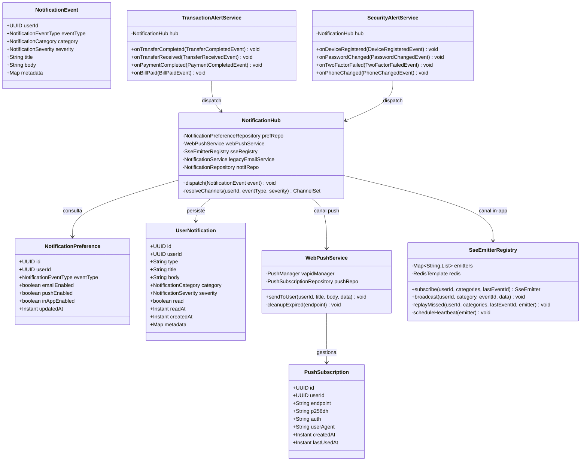

# LLD — FEAT-014: Notificaciones Push & In-App — Backend

**BankPortal · Banco Meridian · Sprint 16**

| Campo | Valor |
|---|---|
| Servicio | `backend-2fa` (módulo `notifications`) |
| Stack | Java 21 · Spring Boot 3.3 |
| Feature | FEAT-014 |
| Versión | 1.0 |
| Estado | DRAFT — Gate 3 pendiente Tech Lead |
| CMMI | TS SP 2.1 · TS SP 2.2 |

---

## Estructura de paquetes

```
apps/backend-2fa/src/main/java/com/experis/bankportal/
└── notifications/                           ← módulo nuevo
    ├── api/
    │   ├── NotificationPreferenceController.java   # GET/PATCH /preferences
    │   ├── NotificationHistoryController.java      # GET / · PATCH read · POST mark-all-read · DELETE
    │   ├── NotificationStreamController.java       # GET /stream (SSE)
    │   └── PushSubscriptionController.java         # POST/DELETE /push/subscribe
    ├── application/
    │   ├── usecase/
    │   │   ├── ManagePreferencesUseCase.java
    │   │   ├── GetNotificationsUseCase.java
    │   │   ├── MarkReadUseCase.java
    │   │   └── ManagePushSubscriptionUseCase.java
    │   ├── service/
    │   │   ├── NotificationHub.java                # Orchestrador multicanal @Async
    │   │   ├── TransactionAlertService.java        # @TransactionalEventListener
    │   │   └── SecurityAlertService.java           # @TransactionalEventListener
    │   └── dto/
    │       ├── NotificationDto.java                # Record response historial
    │       ├── NotificationPreferenceDto.java      # Record response preferencias
    │       ├── PreferencePatchRequest.java         # Record request PATCH
    │       ├── PushSubscribeRequest.java           # Record request suscripción
    │       └── NotificationEvent.java              # Record interno Hub
    ├── domain/
    │   ├── model/
    │   │   ├── UserNotification.java               # JPA Entity (extendida FEAT-007)
    │   │   ├── NotificationPreference.java         # JPA Entity
    │   │   ├── PushSubscription.java               # JPA Entity
    │   │   ├── NotificationCategory.java           # Enum: TRANSACTION|SECURITY|KYC|SYSTEM
    │   │   ├── NotificationSeverity.java           # Enum: INFO|HIGH
    │   │   └── NotificationEventType.java          # Enum: TRANSFER_COMPLETED|SECURITY_NEW_DEVICE|...
    │   └── repository/
    │       ├── NotificationPreferenceRepository.java
    │       ├── PushSubscriptionRepository.java
    │       └── NotificationRepository.java         # Extendida (nueva query methods)
    └── infrastructure/
        ├── push/
        │   └── WebPushService.java                 # nl.martijndwars:web-push · VAPID
        └── sse/
            └── SseEmitterRegistry.java             # Extendida (filtro + replay Redis)

apps/backend-2fa/src/main/resources/db/migration/
└── V16__notification_preferences.sql
```

---

## Diagrama de clases — Dominio



---

## Modelo de datos — Flyway V16

```mermaid
erDiagram
  users ||--o{ notification_preferences : "configura"
  users ||--o{ push_subscriptions : "registra"
  users ||--o{ user_notifications : "recibe"

  notification_preferences {
    uuid id PK
    uuid user_id FK
    varchar event_type "TRANSFER_COMPLETED|SECURITY_NEW_DEVICE|..."
    boolean email_enabled "DEFAULT true"
    boolean push_enabled "DEFAULT true"
    boolean in_app_enabled "DEFAULT true"
    timestamptz updated_at
  }

  push_subscriptions {
    uuid id PK
    uuid user_id FK
    text endpoint UNIQUE
    text p256dh
    text auth
    text user_agent
    timestamptz created_at
    timestamptz last_used_at
  }

  user_notifications {
    uuid id PK
    uuid user_id FK
    varchar type "TRANSFER_COMPLETED|SECURITY_NEW_DEVICE|..."
    varchar title
    text body
    varchar category "TRANSACTION|SECURITY|KYC|SYSTEM"
    varchar severity "INFO|HIGH"
    boolean read "DEFAULT false"
    timestamptz read_at
    jsonb metadata
    timestamptz created_at
  }
```

**Flyway V16 — DDL completo:**
```sql
-- Tabla preferencias de canal por usuario y tipo de evento
CREATE TABLE notification_preferences (
    id             UUID PRIMARY KEY DEFAULT gen_random_uuid(),
    user_id        UUID NOT NULL REFERENCES users(id) ON DELETE CASCADE,
    event_type     VARCHAR(50) NOT NULL,
    email_enabled  BOOLEAN NOT NULL DEFAULT true,
    push_enabled   BOOLEAN NOT NULL DEFAULT true,
    in_app_enabled BOOLEAN NOT NULL DEFAULT true,
    updated_at     TIMESTAMPTZ DEFAULT now(),
    CONSTRAINT uq_pref_user_event UNIQUE(user_id, event_type)
);

-- Tabla suscripciones Web Push (multi-device)
CREATE TABLE push_subscriptions (
    id           UUID PRIMARY KEY DEFAULT gen_random_uuid(),
    user_id      UUID NOT NULL REFERENCES users(id) ON DELETE CASCADE,
    endpoint     TEXT NOT NULL,
    p256dh       TEXT NOT NULL,
    auth         TEXT NOT NULL,
    user_agent   TEXT,
    created_at   TIMESTAMPTZ DEFAULT now(),
    last_used_at TIMESTAMPTZ,
    CONSTRAINT uq_push_endpoint UNIQUE(endpoint)
);

-- Extensión aditiva de user_notifications (FEAT-007 → FEAT-014)
ALTER TABLE user_notifications
    ADD COLUMN IF NOT EXISTS category VARCHAR(20) NOT NULL DEFAULT 'SYSTEM',
    ADD COLUMN IF NOT EXISTS severity  VARCHAR(10) NOT NULL DEFAULT 'INFO',
    ADD COLUMN IF NOT EXISTS metadata  JSONB,
    ADD COLUMN IF NOT EXISTS read_at   TIMESTAMPTZ,
    ADD COLUMN IF NOT EXISTS title     VARCHAR(200);

-- Índices de rendimiento
CREATE INDEX idx_notif_prefs_user      ON notification_preferences(user_id);
CREATE INDEX idx_push_sub_user         ON push_subscriptions(user_id);
CREATE INDEX idx_notif_user_cat        ON user_notifications(user_id, category);
CREATE INDEX idx_notif_user_unread     ON user_notifications(user_id, read) WHERE read = false;
CREATE INDEX idx_notif_user_created    ON user_notifications(user_id, created_at DESC);
```

---

## NotificationHub — Lógica de despacho multicanal

```java
// Pseudocódigo de la lógica de resolución de canales
@Async
public void dispatch(NotificationEvent event) {
    // 1. Persistir en historial SIEMPRE (in-app history)
    UserNotification saved = notifRepo.save(toEntity(event));

    // 2. Obtener preferencias (lazy — si no existen, todos habilitados por defecto)
    NotificationPreference prefs = prefRepo
        .findByUserIdAndEventType(event.userId(), event.eventType())
        .orElse(NotificationPreference.defaults(event.userId(), event.eventType()));

    // 3. Severidad HIGH ignora preferencias email e in-app (solo push es opcional)
    boolean forceEmail  = event.severity() == HIGH;
    boolean forceInApp  = event.severity() == HIGH;

    // 4. Despachar por canal
    if (prefs.inAppEnabled() || forceInApp) {
        sseRegistry.broadcast(event.userId(), event.category(), generateEventId(), toSsePayload(event));
    }
    if (prefs.pushEnabled()) {
        webPushService.sendToUser(event.userId(), event.title(), event.body(), event.metadata());
    }
    if (prefs.emailEnabled() || forceEmail) {
        legacyNotificationService.sendEmail(event.userId(), event.title(), event.body());
    }
}
```

---

## SseEmitterRegistry — Extensión filtro + replay

```java
// Cambios clave respecto a FEAT-007:
// 1. Emitter registrado con Set<NotificationCategory> por usuario
// 2. broadcast() filtra emitters por category match
// 3. subscribe() con lastEventId → replayMissed() desde Redis

public SseEmitter subscribe(UUID userId, Set<NotificationCategory> categories, String lastEventId) {
    SseEmitter emitter = new SseEmitter(Long.MAX_VALUE);
    String key = userId + ":" + UUID.randomUUID();
    emitters.computeIfAbsent(userId.toString(), k -> new CopyOnWriteArrayList<>())
            .add(new FilteredEmitter(emitter, categories));

    if (lastEventId != null) {
        replayMissed(userId, categories, lastEventId, emitter);
    }
    scheduleHeartbeat(emitter);  // cada 30s → ": heartbeat\n\n"

    emitter.onCompletion(() -> removeEmitter(userId, key));
    emitter.onTimeout(() -> removeEmitter(userId, key));
    return emitter;
}
```

---

## WebPushService — Configuración VAPID

```java
@Service
public class WebPushService {
    private final PushService pushService;  // nl.martijndwars:web-push
    private final PushSubscriptionRepository pushRepo;
    private final int maxRetries = 3;

    @Value("${notifications.push.vapid-public-key}")
    private String vapidPublicKey;

    public void sendToUser(UUID userId, String title, String body, Map<String, Object> data) {
        List<PushSubscription> subs = pushRepo.findByUserId(userId);
        for (PushSubscription sub : subs) {
            sendWithRetry(sub, buildPayload(title, body, data), 0);
        }
    }

    private void sendWithRetry(PushSubscription sub, String payload, int attempt) {
        try {
            HttpResponse response = pushService.send(buildNotification(sub, payload));
            if (response.getStatusLine().getStatusCode() == 410) {
                pushRepo.deleteByEndpoint(sub.getEndpoint()); // cleanup automático
            } else if (response.getStatusLine().getStatusCode() == 429 && attempt < maxRetries) {
                long backoff = (long) Math.pow(4, attempt) * 1000L; // 1s, 4s, 16s
                Thread.sleep(backoff);
                sendWithRetry(sub, payload, attempt + 1);
            }
        } catch (Exception e) {
            log.error("Push send failed for endpoint {}: {}", sub.getEndpoint(), e.getMessage());
        }
    }
}
```

---

## Variables de entorno requeridas

| Variable | Descripción | Ejemplo |
|---|---|---|
| `VAPID_PUBLIC_KEY` | Clave pública VAPID (Base64 URL-safe) | `BEl62iUYg...` |
| `VAPID_PRIVATE_KEY` | Clave privada VAPID (Base64 URL-safe) | `(secret)` |
| `VAPID_SUBJECT` | Subject VAPID (email contacto) | `mailto:no-reply@bancomeridian.es` |
| `VAPID_TTL_SECONDS` | TTL push en segundos | `86400` |
| `NOTIFICATION_THRESHOLD_ALERT` | Importe mínimo para alerta email en transacciones | `1000` |
| `SSE_REPLAY_TTL_SECONDS` | TTL buffer replay Redis | `300` |

---

## Checklist de implementación para el Developer

- [ ] `V16__notification_preferences.sql` ejecutada sin errores en Flyway
- [ ] `NotificationHub` — despacho multicanal @Async con resolución de preferencias
- [ ] `WebPushService` — VAPID funcional, cleanup 410, backoff 429
- [ ] `SseEmitterRegistry` — filtro por categoría + Last-Event-ID replay + heartbeat
- [ ] `TransactionAlertService` — 4 listeners `@TransactionalEventListener(AFTER_COMMIT)`
- [ ] `SecurityAlertService` — 4 listeners, severity HIGH siempre in-app + email
- [ ] DEBT-023 — `KycAuthorizationFilter` período de gracia
- [ ] DEBT-024 — `KycReviewResponse` record tipado
- [ ] Tests unitarios ≥ 80% cobertura en capa `application`
- [ ] Tests integración: migración V16, endpoints REST, SSE

---

*SOFIA Architect Agent — Step 3 | Sprint 16 · FEAT-014*
*CMMI Level 3 — TS SP 2.1 · TS SP 2.2*
*BankPortal — Banco Meridian — 2026-03-24*
