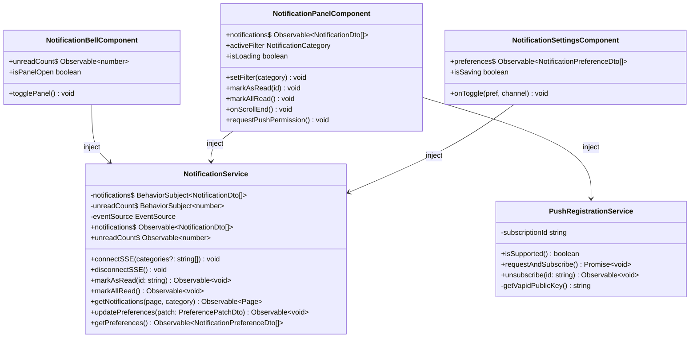
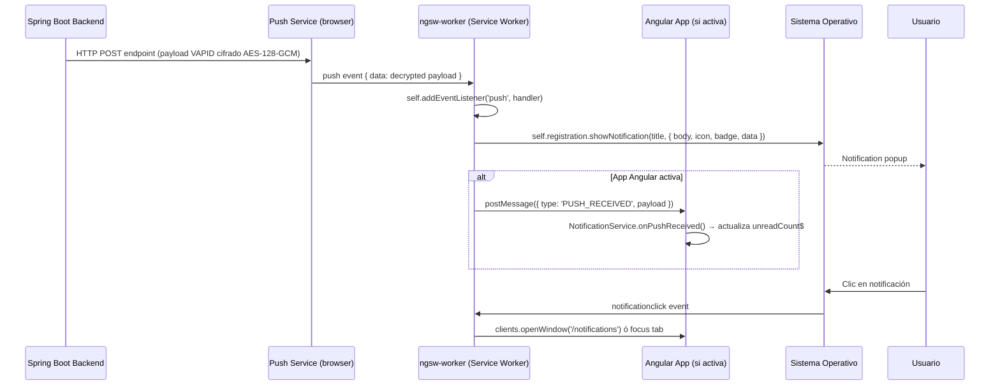
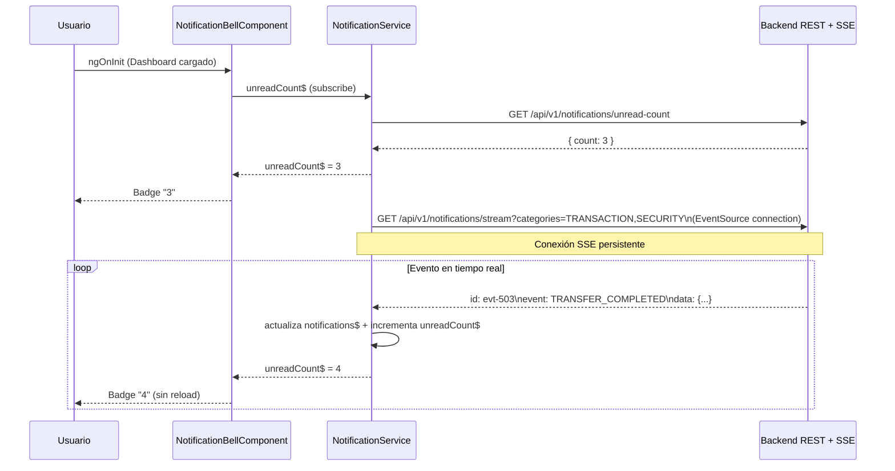

# LLD — FEAT-014: Notificaciones Push & In-App — Frontend Angular

**BankPortal · Banco Meridian · Sprint 16**

| Campo | Valor |
|---|---|
| Servicio | `frontend-portal` (módulo `notifications`) |
| Stack | Angular 17 · TypeScript · Service Worker |
| Feature | FEAT-014 |
| Versión | 1.0 |
| Estado | DRAFT — Gate 3 pendiente Tech Lead |
| CMMI | TS SP 2.1 · TS SP 2.2 |

---

## Estructura de módulo

```
apps/frontend-portal/src/app/
├── features/
│   └── notifications/                         ← módulo nuevo (lazy-loaded)
│       ├── notifications.module.ts
│       ├── notifications-routing.module.ts    # ruta /settings/notifications
│       ├── services/
│       │   └── notification.service.ts        # SSE + REST + push suscripción
│       ├── components/
│       │   ├── notification-bell/
│       │   │   ├── notification-bell.component.ts
│       │   │   ├── notification-bell.component.html
│       │   │   └── notification-bell.component.spec.ts
│       │   ├── notification-panel/
│       │   │   ├── notification-panel.component.ts
│       │   │   ├── notification-panel.component.html
│       │   │   └── notification-panel.component.spec.ts
│       │   └── notification-settings/
│       │       ├── notification-settings.component.ts
│       │       ├── notification-settings.component.html
│       │       └── notification-settings.component.spec.ts
│       └── models/
│           └── notification.model.ts          # Interfaces TypeScript
├── core/
│   └── services/
│       └── push-registration.service.ts      # Singleton VAPID subscription
└── (Service Worker)
    └── ngsw-worker.js                         # @angular/service-worker (existente)
    └── push-event-handler.ts                  # handler evento 'push'
```

---

## Diagrama de componentes Angular



---

## Diagrama de secuencia — Angular recibe push notification (SW)



---

## Diagrama de secuencia — Carga inicial y SSE



---

## Interfaces TypeScript

```typescript
// notification.model.ts

export type NotificationCategory = 'TRANSACTION' | 'SECURITY' | 'KYC' | 'SYSTEM' | 'ALL';
export type NotificationSeverity = 'INFO' | 'HIGH';
export type NotificationEventType =
  | 'TRANSFER_COMPLETED' | 'TRANSFER_RECEIVED'
  | 'PAYMENT_COMPLETED' | 'BILL_PAID'
  | 'SECURITY_NEW_DEVICE' | 'SECURITY_PASSWORD_CHANGED'
  | 'SECURITY_2FA_FAILED' | 'SECURITY_PHONE_CHANGED'
  | 'KYC_APPROVED' | 'KYC_REJECTED';

export interface NotificationDto {
  id: string;
  type: NotificationEventType;
  category: NotificationCategory;
  title: string;
  body: string;
  read: boolean;
  readAt: string | null;
  severity: NotificationSeverity;
  createdAt: string;
  metadata?: Record<string, unknown>;
}

export interface NotificationPreferenceDto {
  eventType: NotificationEventType;
  emailEnabled: boolean;
  pushEnabled: boolean;
  inAppEnabled: boolean;
}

export interface PreferencePatchDto {
  eventType: NotificationEventType;
  emailEnabled?: boolean;
  pushEnabled?: boolean;
  inAppEnabled?: boolean;
}

export interface PushSubscribeRequest {
  endpoint: string;
  p256dh: string;
  auth: string;
  userAgent: string;
}

export interface Page<T> {
  content: T[];
  totalElements: number;
  totalPages: number;
  number: number;
  size: number;
}
```

---

## Accesibilidad WCAG 2.1 AA

| Elemento | Requisito | Implementación |
|---|---|---|
| Panel lateral (drawer) | `role="complementary"` | `<aside role="complementary" aria-label="Notificaciones">` |
| Badge contador | `aria-label` dinámico | `aria-label="3 notificaciones no leídas"` |
| Botón campana | Accesible por teclado | `<button>` nativo con `aria-expanded` |
| Lista notificaciones | `role="list"` | `<ul role="list">` + `<li role="listitem">` |
| Filtros categoría | `role="tablist"` | Tabs accesibles con `aria-selected` |
| Tiempo relativo | `<time datetime="">` | `datetime="2026-03-24T10:30:00Z"` con texto "hace 5 min" |
| Notificación no leída | Contraste visual | Fondo diferenciado con ratio ≥ 4.5:1 |

---

## Checklist de implementación para el Developer

- [ ] `NotificationModule` lazy-loaded registrado en `AppRoutingModule` en `/settings/notifications`
- [ ] `NotificationService` — SSE `EventSource` con reconexión automática y `lastEventId`
- [ ] `NotificationBellComponent` — badge reactivo via `unreadCount$`
- [ ] `NotificationPanelComponent` — drawer, filtros, infinite scroll, mark-read
- [ ] `NotificationSettingsComponent` — toggles preferencias por canal
- [ ] `PushRegistrationService` — `requestPermission()` + `subscribe()` + POST al backend
- [ ] `push-event-handler.ts` — listener `push` en Service Worker → `showNotification()`
- [ ] Flag `localStorage.push_permission_asked` — solicitar permiso solo 1ª vez
- [ ] Accesibilidad WCAG 2.1 AA verificada con axe-core
- [ ] Tests Karma/Jest ≥ 5 escenarios por componente

---

*SOFIA Architect Agent — Step 3 | Sprint 16 · FEAT-014*
*CMMI Level 3 — TS SP 2.1 · TS SP 2.2*
*BankPortal — Banco Meridian — 2026-03-24*
