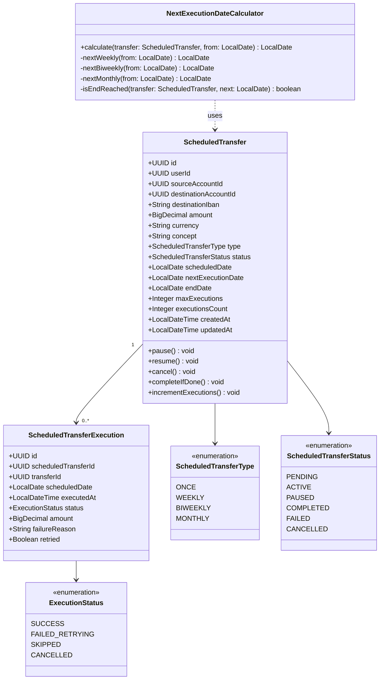
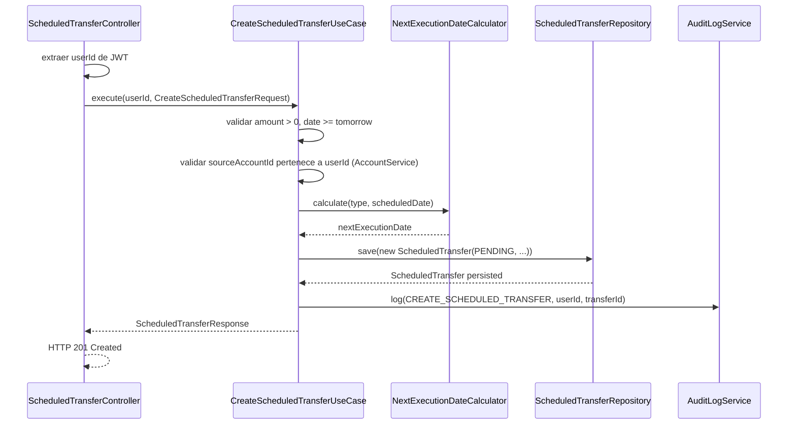
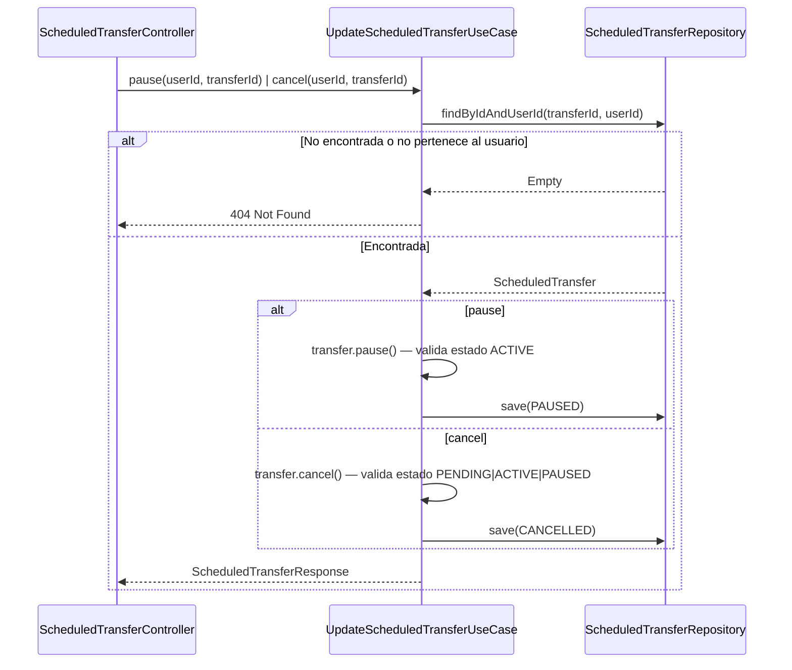
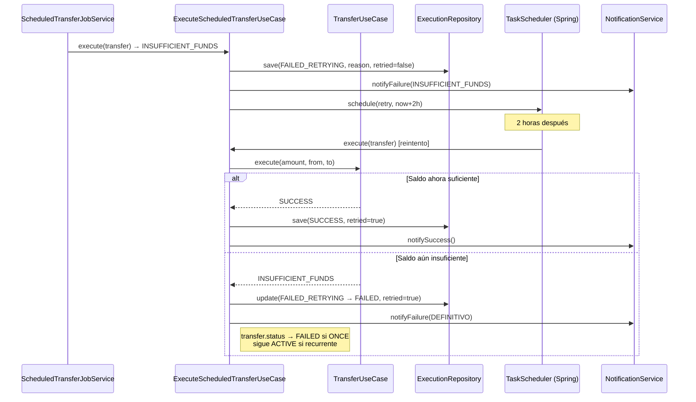
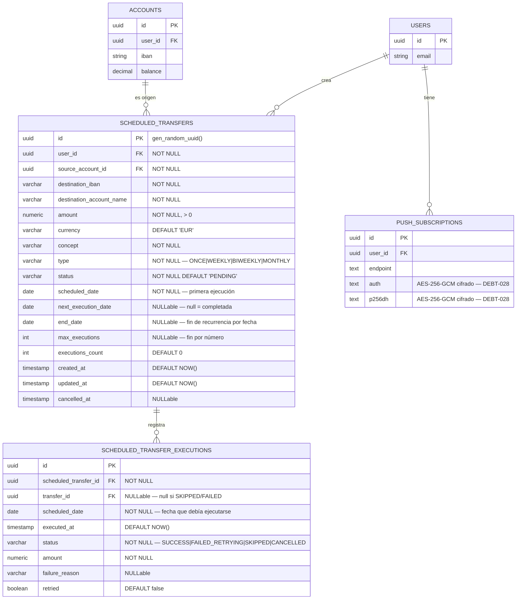

# LLD — FEAT-015 Transferencias Programadas y Recurrentes — Backend

## Metadata
- **Servicio:** bankportal-backend | **Stack:** Java 21 · Spring Boot 3.x
- **Feature:** FEAT-015 | **Sprint:** 17 | **Versión:** 1.0 | **Estado:** DRAFT
- **Autor:** SOFIA Architect Agent | **Fecha:** 2026-03-24
- **CMMI:** AD SP 2.1 · AD SP 3.1 · TS SP 1.1

---

## Estructura de módulo

```
apps/bankportal-backend/src/main/java/com/experis/bankportal/
├── domain/
│   ├── model/
│   │   ├── ScheduledTransfer.java          ← Entidad de dominio (aggregate root)
│   │   ├── ScheduledTransferExecution.java ← Registro de ejecución
│   │   ├── ScheduledTransferType.java      ← Enum: ONCE | WEEKLY | BIWEEKLY | MONTHLY
│   │   ├── ScheduledTransferStatus.java    ← Enum: PENDING|ACTIVE|PAUSED|COMPLETED|FAILED|CANCELLED
│   │   └── ExecutionStatus.java            ← Enum: SUCCESS|FAILED_RETRYING|SKIPPED|CANCELLED
│   ├── repository/
│   │   ├── ScheduledTransferRepository.java      ← Puerto (interface)
│   │   └── ScheduledTransferExecutionRepository.java
│   └── service/
│       └── NextExecutionDateCalculator.java       ← Lógica de cálculo de fechas (pure)
├── application/
│   ├── usecase/
│   │   ├── CreateScheduledTransferUseCase.java
│   │   ├── UpdateScheduledTransferUseCase.java    ← pause/resume/cancel
│   │   ├── GetScheduledTransfersUseCase.java
│   │   ├── ExecuteScheduledTransferUseCase.java   ← Invocado por Scheduler
│   │   └── GetScheduledTransferExecutionsUseCase.java
│   ├── dto/
│   │   ├── CreateScheduledTransferRequest.java
│   │   ├── ScheduledTransferResponse.java
│   │   ├── ScheduledTransferSummaryResponse.java
│   │   └── ScheduledTransferExecutionResponse.java
│   └── scheduler/
│       └── ScheduledTransferJobService.java       ← @Scheduled(cron="0 0 6 * * *")
├── infrastructure/
│   ├── persistence/
│   │   ├── JpaScheduledTransferRepository.java
│   │   └── JpaScheduledTransferExecutionRepository.java
│   └── notification/
│       └── ScheduledTransferNotificationService.java  ← Orquesta push+email
└── api/
    └── controller/
        └── ScheduledTransferController.java
```

**Flyway migrations:**
```
src/main/resources/db/migration/
├── V17__create_scheduled_transfers.sql
└── V17b__encrypt_push_subscriptions_auth.sql   ← DEBT-028
```

---

## Diagrama de clases — dominio



---

## Diagrama de secuencia — Crear transferencia programada



---

## Diagrama de secuencia — Pausar / Cancelar



---

## Diagrama de secuencia — Reintento INSUFFICIENT_FUNDS



---

## Modelo de datos — ER Diagram



**Índices obligatorios:**
```sql
-- Consulta principal del Scheduler (crítica en performance)
CREATE INDEX idx_sched_transfers_due ON scheduled_transfers
  (next_execution_date, status)
  WHERE status IN ('PENDING','ACTIVE');

-- Idempotencia: verificar si ya se ejecutó hoy
CREATE UNIQUE INDEX idx_exec_transfer_date ON scheduled_transfer_executions
  (scheduled_transfer_id, scheduled_date);

-- Listado por usuario
CREATE INDEX idx_sched_transfers_user ON scheduled_transfers (user_id, status);
```

---

## Flyway V17 — DDL

```sql
-- V17__create_scheduled_transfers.sql

CREATE TABLE scheduled_transfers (
  id                      UUID PRIMARY KEY DEFAULT gen_random_uuid(),
  user_id                 UUID NOT NULL REFERENCES users(id),
  source_account_id       UUID NOT NULL REFERENCES accounts(id),
  destination_iban        VARCHAR(34) NOT NULL,
  destination_account_name VARCHAR(100) NOT NULL,
  amount                  NUMERIC(15,2) NOT NULL CHECK (amount > 0),
  currency                VARCHAR(3) NOT NULL DEFAULT 'EUR',
  concept                 VARCHAR(140) NOT NULL,
  type                    VARCHAR(20) NOT NULL CHECK (type IN ('ONCE','WEEKLY','BIWEEKLY','MONTHLY')),
  status                  VARCHAR(20) NOT NULL DEFAULT 'PENDING'
                            CHECK (status IN ('PENDING','ACTIVE','PAUSED','COMPLETED','FAILED','CANCELLED')),
  scheduled_date          DATE NOT NULL,
  next_execution_date     DATE,
  end_date                DATE,
  max_executions          INT,
  executions_count        INT NOT NULL DEFAULT 0,
  created_at              TIMESTAMPTZ NOT NULL DEFAULT NOW(),
  updated_at              TIMESTAMPTZ NOT NULL DEFAULT NOW(),
  cancelled_at            TIMESTAMPTZ
);

CREATE TABLE scheduled_transfer_executions (
  id                       UUID PRIMARY KEY DEFAULT gen_random_uuid(),
  scheduled_transfer_id    UUID NOT NULL REFERENCES scheduled_transfers(id),
  transfer_id              UUID REFERENCES transfers(id),
  scheduled_date           DATE NOT NULL,
  executed_at              TIMESTAMPTZ NOT NULL DEFAULT NOW(),
  status                   VARCHAR(30) NOT NULL
                             CHECK (status IN ('SUCCESS','FAILED_RETRYING','SKIPPED','CANCELLED')),
  amount                   NUMERIC(15,2) NOT NULL,
  failure_reason           TEXT,
  retried                  BOOLEAN NOT NULL DEFAULT FALSE
);

CREATE INDEX idx_sched_transfers_due
  ON scheduled_transfers (next_execution_date, status)
  WHERE status IN ('PENDING','ACTIVE');

CREATE UNIQUE INDEX idx_exec_transfer_date
  ON scheduled_transfer_executions (scheduled_transfer_id, scheduled_date);

CREATE INDEX idx_sched_transfers_user
  ON scheduled_transfers (user_id, status);
```

---

## Contrato OpenAPI

### POST /v1/scheduled-transfers
**Descripción:** Crear transferencia programada o recurrente
**Auth:** Bearer JWT

**Request:**
```json
{
  "sourceAccountId": "uuid",
  "destinationIban": "ES7621000418401234567891",
  "destinationAccountName": "Arrendador García SL",
  "amount": 850.00,
  "currency": "EUR",
  "concept": "Alquiler julio 2026",
  "type": "MONTHLY",
  "scheduledDate": "2026-08-01",
  "endDate": "2027-08-01",
  "maxExecutions": null
}
```
**Response 201:**
```json
{
  "id": "uuid",
  "type": "MONTHLY",
  "status": "PENDING",
  "amount": 850.00,
  "currency": "EUR",
  "scheduledDate": "2026-08-01",
  "nextExecutionDate": "2026-08-01",
  "executionsCount": 0,
  "createdAt": "2026-03-24T10:00:00Z"
}
```
**Errores:** 400 (validación), 401, 403 (cuenta ajena), 422 (saldo insuficiente preview)

---

### GET /v1/scheduled-transfers
**Query params:** `status` (opcional), `page`, `size`
**Response 200:**
```json
{
  "content": [ { "id":"uuid", "type":"MONTHLY", "status":"ACTIVE", "amount":850.00, "nextExecutionDate":"2026-09-01" } ],
  "totalElements": 3,
  "totalPages": 1
}
```

---

### GET /v1/scheduled-transfers/{id}
**Response 200:** ScheduledTransferResponse completo con campo `executions` (últimas 5)

---

### PATCH /v1/scheduled-transfers/{id}/pause
**Response 200:** ScheduledTransferResponse con `status: "PAUSED"`
**Errores:** 409 si no está en estado `ACTIVE`

---

### PATCH /v1/scheduled-transfers/{id}/resume
**Response 200:** ScheduledTransferResponse con `status: "ACTIVE"`
**Errores:** 409 si no está en estado `PAUSED`

---

### DELETE /v1/scheduled-transfers/{id}
**Response 200:** ScheduledTransferResponse con `status: "CANCELLED"`
**Errores:** 409 si ya está `COMPLETED` o `CANCELLED`

---

### GET /v1/scheduled-transfers/{id}/executions
**Query params:** `page`, `size`
**Response 200:** Página de ScheduledTransferExecutionResponse

---

## Variables de entorno requeridas

| Variable | Descripción | Ejemplo |
|---|---|---|
| `SCHEDULER_ENABLED` | Activar/desactivar el Scheduler (útil en dev) | `true` |
| `SCHEDULER_CRON` | Expresión cron del Scheduler | `0 0 6 * * *` |
| `SCHEDULER_RETRY_DELAY_HOURS` | Horas para reintento por saldo insuficiente | `2` |
| `PUSH_ENCRYPTION_KEY` | Clave AES-256 para cifrar auth/p256dh (DEBT-028) | `[32 bytes base64]` |

---

## Criterios de testing obligatorios (QA gate)

| Clase de test | Mínimo | Enfoque clave |
|---|---|---|
| `NextExecutionDateCalculatorTest` | 100% branch | Feb/28, Feb/29 bisiesto, meses 30 días, último día mes |
| `ScheduledTransferJobServiceTest` | IT idempotencia | Doble ejecución mismo día → 1 resultado, no duplicado |
| `CreateScheduledTransferUseCaseTest` | Unitario | Validaciones, pertenencia cuenta, fecha futura |
| `ExecuteScheduledTransferUseCaseTest` | Unitario + IT | Flujos SUCCESS, INSUFFICIENT_FUNDS, SKIPPED |

---

*SOFIA Architect Agent · Sprint 17 · CMMI Level 3*
*BankPortal — Banco Meridian — 2026-03-24*
