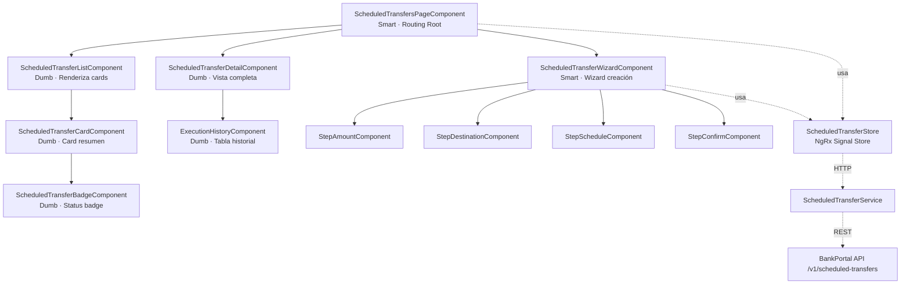
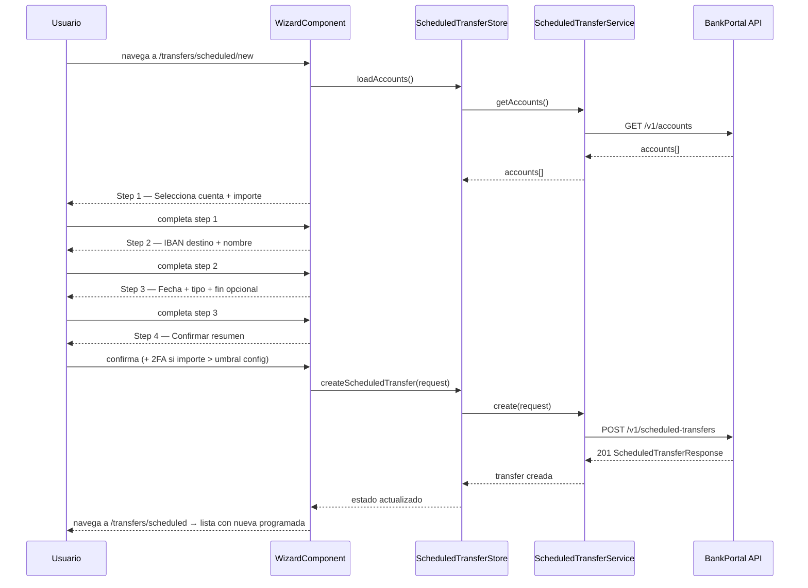

# LLD — FEAT-015 Transferencias Programadas y Recurrentes — Frontend Angular

## Metadata
- **Módulo:** scheduled-transfers | **Stack:** Angular 17 · NgRx Signal Store
- **Feature:** FEAT-015 | **Sprint:** 17 | **Versión:** 1.0 | **Estado:** DRAFT
- **Autor:** SOFIA Architect Agent | **Fecha:** 2026-03-24
- **CMMI:** AD SP 2.1 · TS SP 1.1

---

## Estructura del módulo Angular

```
apps/bankportal-frontend/src/app/features/scheduled-transfers/
├── components/
│   ├── scheduled-transfer-list/
│   │   ├── scheduled-transfer-list.component.ts
│   │   └── scheduled-transfer-list.component.html
│   ├── scheduled-transfer-card/
│   │   ├── scheduled-transfer-card.component.ts
│   │   └── scheduled-transfer-card.component.html
│   ├── scheduled-transfer-detail/
│   │   ├── scheduled-transfer-detail.component.ts
│   │   └── scheduled-transfer-detail.component.html
│   ├── execution-history/
│   │   ├── execution-history.component.ts
│   │   └── execution-history.component.html
│   └── scheduled-transfer-badge/
│       └── scheduled-transfer-badge.component.ts       ← status badge reutilizable
├── containers/
│   ├── scheduled-transfer-wizard/
│   │   ├── scheduled-transfer-wizard.component.ts      ← Smart — orquesta pasos
│   │   ├── scheduled-transfer-wizard.component.html
│   │   └── steps/
│   │       ├── step-amount/                            ← importe + cuenta origen
│   │       ├── step-destination/                       ← IBAN + nombre beneficiario
│   │       ├── step-schedule/                          ← fecha + tipo + fin
│   │       └── step-confirm/                           ← resumen + 2FA si > umbral
│   └── scheduled-transfers-page/
│       └── scheduled-transfers-page.component.ts       ← Smart — routing root
├── services/
│   └── scheduled-transfer.service.ts                  ← HTTP client → /v1/scheduled-transfers
├── store/
│   ├── scheduled-transfer.store.ts                    ← NgRx Signal Store
│   └── scheduled-transfer.effects.ts                  ← Side effects HTTP
├── models/
│   ├── scheduled-transfer.model.ts
│   ├── scheduled-transfer-execution.model.ts
│   └── scheduled-transfer-type.enum.ts
└── scheduled-transfers-routing.module.ts
```

---

## Diagrama de componentes Angular



---

## Diagrama de secuencia — Wizard creación (frontend)



---

## Modelos TypeScript

```typescript
// scheduled-transfer.model.ts
export interface ScheduledTransfer {
  id: string;
  sourceAccountId: string;
  destinationIban: string;
  destinationAccountName: string;
  amount: number;
  currency: string;
  concept: string;
  type: ScheduledTransferType;
  status: ScheduledTransferStatus;
  scheduledDate: string;        // ISO date
  nextExecutionDate: string | null;
  endDate: string | null;
  maxExecutions: number | null;
  executionsCount: number;
  createdAt: string;
  updatedAt: string;
}

export type ScheduledTransferType = 'ONCE' | 'WEEKLY' | 'BIWEEKLY' | 'MONTHLY';
export type ScheduledTransferStatus = 'PENDING' | 'ACTIVE' | 'PAUSED' | 'COMPLETED' | 'FAILED' | 'CANCELLED';

export interface ScheduledTransferExecution {
  id: string;
  scheduledDate: string;
  executedAt: string;
  status: 'SUCCESS' | 'FAILED_RETRYING' | 'SKIPPED' | 'CANCELLED';
  amount: number;
  failureReason: string | null;
  retried: boolean;
}

export interface CreateScheduledTransferRequest {
  sourceAccountId: string;
  destinationIban: string;
  destinationAccountName: string;
  amount: number;
  currency: string;
  concept: string;
  type: ScheduledTransferType;
  scheduledDate: string;
  endDate?: string;
  maxExecutions?: number;
}
```

---

## NgRx Signal Store — estado

```typescript
// scheduled-transfer.store.ts (outline)
const ScheduledTransferStore = signalStore(
  withState<ScheduledTransferState>({
    transfers: [],
    selectedTransfer: null,
    executions: [],
    loading: false,
    error: null,
    pagination: { page: 0, size: 10, totalElements: 0 }
  }),
  withMethods((store, service = inject(ScheduledTransferService)) => ({
    loadTransfers: rxMethod(/* GET /scheduled-transfers */),
    loadDetail:    rxMethod(/* GET /scheduled-transfers/:id */),
    create:        rxMethod(/* POST /scheduled-transfers */),
    pause:         rxMethod(/* PATCH /scheduled-transfers/:id/pause */),
    resume:        rxMethod(/* PATCH /scheduled-transfers/:id/resume */),
    cancel:        rxMethod(/* DELETE /scheduled-transfers/:id */),
    loadExecutions:rxMethod(/* GET /scheduled-transfers/:id/executions */),
  }))
);
```

---

## Routing

```typescript
// scheduled-transfers-routing.module.ts
const routes: Routes = [
  { path: '', component: ScheduledTransferListComponent },
  { path: 'new', component: ScheduledTransferWizardComponent },
  { path: ':id', component: ScheduledTransferDetailComponent },
];
// Integración en app routing: { path: 'transfers/scheduled', loadChildren: () => import('./features/scheduled-transfers/...) }
```

---

## Criterios UX / accesibilidad

| Criterio | Requerimiento |
|---|---|
| WCAG 2.1 AA | Contraste mínimo 4.5:1 en badges de estado, labels en inputs del wizard |
| Wizard steps | Indicador visual de paso activo, navegación por teclado (Tab/Enter/Esc) |
| Fechas | Usar `DatePipe` + locale `es-ES`. Formato `dd/MM/yyyy` en UI |
| Importes | Formato `CurrencyPipe` EUR. Validación mínimo 0.01, máximo límite cuenta |
| IBAN | Validador reactivo — checksum IBAN en cliente + confirmación backend |
| Empty state | Lista vacía → CTA "Programar tu primera transferencia" con ilustración |
| Error state | Mensajes de error de API mapeados a textos amigables en español |

---

*SOFIA Architect Agent · Sprint 17 · CMMI Level 3*
*BankPortal — Banco Meridian — 2026-03-24*
