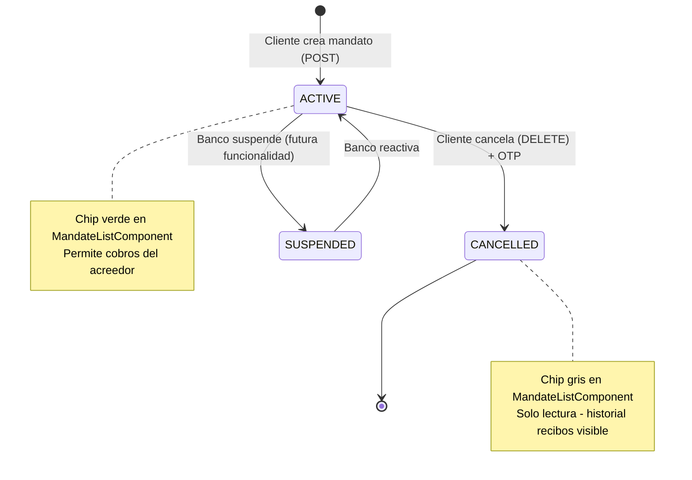

# LLD Frontend — FEAT-017 · Domiciliaciones y Recibos (Angular)

**BankPortal · Banco Meridian · Sprint 19 · v1.19.0**

| Campo | Valor |
|---|---|
| Feature | FEAT-017 |
| Stack | Angular 17 · TypeScript · RxJS · Angular Material |
| Agente | Architect — SOFIA v2.2 |
| Fecha | 2026-03-27T06:30:37.196Z |

---

## Estructura de módulo Angular

```
apps/frontend-portal/src/app/
└── direct-debits/                         ← DirectDebitsModule (lazy-loaded)
    ├── direct-debits.module.ts
    ├── direct-debits-routing.module.ts    ← Rutas: /direct-debits/*
    ├── components/
    │   ├── mandate-list/
    │   │   ├── mandate-list.component.ts
    │   │   ├── mandate-list.component.html
    │   │   └── mandate-list.component.spec.ts
    │   ├── mandate-detail/
    │   │   ├── mandate-detail.component.ts
    │   │   ├── mandate-detail.component.html
    │   │   └── mandate-detail.component.spec.ts
    │   ├── create-mandate/
    │   │   ├── create-mandate.component.ts   ← Wizard 3 pasos
    │   │   ├── create-mandate.component.html
    │   │   └── create-mandate.component.spec.ts
    │   ├── cancel-mandate/
    │   │   ├── cancel-mandate.component.ts
    │   │   ├── cancel-mandate.component.html
    │   │   └── cancel-mandate.component.spec.ts
    │   └── debit-history/
    │       ├── debit-history.component.ts
    │       ├── debit-history.component.html
    │       └── debit-history.component.spec.ts
    ├── services/
    │   ├── direct-debit.service.ts         ← HttpClient + BehaviorSubject
    │   └── direct-debit.service.spec.ts
    ├── models/
    │   ├── mandate.model.ts
    │   ├── direct-debit.model.ts
    │   └── mandate-status.enum.ts
    ├── validators/
    │   └── iban.validator.ts               ← Validación IBAN frontend (mod-97)
    └── pipes/
        └── mandate-status-label.pipe.ts
```

---

## Rutas del módulo

```typescript
// direct-debits-routing.module.ts
const routes: Routes = [
  { path: '',        component: MandateListComponent },
  { path: 'new',     component: CreateMandateComponent },
  { path: ':id',     component: MandateDetailComponent },
  { path: ':id/cancel', component: CancelMandateComponent },
  { path: 'history', component: DebitHistoryComponent }
];

// app-routing.module.ts — registro lazy
{
  path: 'direct-debits',
  loadChildren: () => import('./direct-debits/direct-debits.module')
    .then(m => m.DirectDebitsModule),
  canActivate: [AuthGuard]
}
```

---

## DirectDebitService

```typescript
@Injectable({ providedIn: DirectDebitsModule })
export class DirectDebitService {

  private mandatesSubject = new BehaviorSubject<Mandate[]>([]);
  mandates$ = this.mandatesSubject.asObservable();

  constructor(private http: HttpClient) {}

  getMandates(page = 0, size = 20): Observable<MandatePage> {
    return this.http.get<MandatePage>('/api/v1/direct-debits/mandates',
      { params: { page, size } }
    ).pipe(
      tap(res => this.mandatesSubject.next(res.content)),
      catchError(this.handleError)
    );
  }

  getMandate(id: string): Observable<Mandate> {
    return this.http.get<Mandate>(`/api/v1/direct-debits/mandates/${id}`)
      .pipe(catchError(this.handleError));
  }

  createMandate(req: CreateMandateRequest): Observable<Mandate> {
    return this.http.post<Mandate>('/api/v1/direct-debits/mandates', req)
      .pipe(catchError(this.handleError));
  }

  cancelMandate(id: string, otp: string): Observable<void> {
    return this.http.delete<void>(`/api/v1/direct-debits/mandates/${id}`,
      { body: { otp } }
    ).pipe(catchError(this.handleError));
  }

  getDebits(params: DebitFilterParams): Observable<DirectDebitPage> {
    return this.http.get<DirectDebitPage>('/api/v1/direct-debits/debits',
      { params: { ...params } }
    ).pipe(catchError(this.handleError));
  }

  private handleError(error: HttpErrorResponse): Observable<never> {
    const msg = error.error?.message ?? 'Error de conexión. Inténtelo de nuevo.';
    return throwError(() => new Error(msg));
  }
}
```

---

## IbanValidator (frontend)

```typescript
// iban.validator.ts
import { AbstractControl, ValidationErrors } from '@angular/forms';

const SEPA_COUNTRIES = new Set([
  'AD','AT','BE','BG','CH','CY','CZ','DE','DK','EE',
  'ES','FI','FR','GB','GI','GR','HR','HU','IE','IS',
  'IT','LI','LT','LU','LV','MC','MT','NL','NO','PL',
  'PT','RO','SE','SI','SK','SM','VA'
]);

export function ibanValidator(control: AbstractControl): ValidationErrors | null {
  const raw = (control.value ?? '').replace(/\s/g, '').toUpperCase();
  if (!raw) return null;
  if (raw.length < 5 || raw.length > 34) return { invalidIban: true };
  if (!SEPA_COUNTRIES.has(raw.substring(0, 2))) return { notSepaCountry: true };
  const rearranged = raw.substring(4) + raw.substring(0, 4);
  const numeric = rearranged.split('').map(c =>
    /[A-Z]/.test(c) ? (c.charCodeAt(0) - 55).toString() : c
  ).join('');
  return mod97(numeric) === 1 ? null : { invalidIban: true };
}

function mod97(numStr: string): number {
  let remainder = 0;
  for (const ch of numStr) {
    remainder = (remainder * 10 + parseInt(ch)) % 97;
  }
  return remainder;
}
```

---

## CreateMandateComponent — Wizard 3 pasos

```typescript
@Component({ selector: 'app-create-mandate', ... })
export class CreateMandateComponent {
  step = 1;  // 1: Datos acreedor | 2: Resumen | 3: OTP + confirmación

  form = this.fb.group({
    creditorName: ['', [Validators.required, Validators.maxLength(140)]],
    creditorIban: ['', [Validators.required, ibanValidator]],
    otp:          ['', [Validators.required, Validators.pattern(/^\d{6}$/)]]
  });

  get ibanControl() { return this.form.get('creditorIban')!; }
  get ibanError(): string {
    if (this.ibanControl.hasError('notSepaCountry')) return 'País no pertenece a zona SEPA';
    if (this.ibanControl.hasError('invalidIban')) return 'IBAN no válido (formato incorrecto)';
    return '';
  }

  nextStep(): void { if (this.form.get('creditorName')!.valid
    && this.form.get('creditorIban')!.valid) this.step++; }
  prevStep(): void { this.step--; }

  submit(): void {
    if (this.form.invalid) return;
    this.service.createMandate(this.form.value as CreateMandateRequest)
      .subscribe({
        next: () => this.router.navigate(['/direct-debits']),
        error: (e) => this.errorMsg = e.message
      });
  }
}
```

---

## Diagrama de estado — MandateStatus (frontend)



---

## Modelos TypeScript

```typescript
// mandate.model.ts
export interface Mandate {
  id: string;
  accountId: string;
  creditorName: string;
  creditorIban: string;
  mandateRef: string;
  mandateType: 'CORE' | 'B2B';
  status: MandateStatus;
  signedAt: string;       // ISO date
  cancelledAt?: string;   // ISO date
  createdAt: string;      // ISO datetime
}

export type MandateStatus = 'ACTIVE' | 'CANCELLED' | 'SUSPENDED';

export interface DirectDebit {
  id: string;
  mandateId: string;
  amount: number;
  currency: string;
  status: 'PENDING' | 'CHARGED' | 'RETURNED' | 'REJECTED';
  dueDate: string;
  chargedAt?: string;
  returnReason?: string;
}

export interface CreateMandateRequest {
  creditorName: string;
  creditorIban: string;
  accountId: string;
  otp: string;
}

export interface DebitFilterParams {
  status?: string;
  from?: string;
  to?: string;
  mandateId?: string;
  page?: number;
  size?: number;
}
```

---

*Architect Agent · CMMI TS SP 2.1 · SOFIA v2.2 · BankPortal — Banco Meridian · Sprint 19*