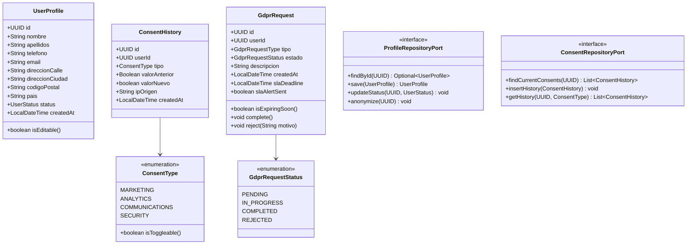

# LLD — Low Level Design Backend
## FEAT-019: Centro de Privacidad y Perfil de Usuario
**Proyecto:** BankPortal — Banco Meridian  
**Sprint:** 21 | **Stack:** Java 21 / Spring Boot 3.3.4 / PostgreSQL 16 / Redis 7  
**SOFIA Step:** 3 — Architect | **Fecha:** 2026-03-31

---

## 1. Estructura de paquetes

```
apps/backend-2fa/src/main/java/com/experis/sofia/bankportal/
├── profile/
│   ├── api/
│   │   ├── controller/
│   │   │   └── ProfileController.java          # GET/PATCH /api/v1/profile + sessions
│   │   └── advice/
│   │       └── ProfileExceptionHandler.java     # @ControllerAdvice para profile
│   ├── application/
│   │   ├── dto/
│   │   │   ├── ProfileResponse.java             # record
│   │   │   ├── ProfileUpdateRequest.java        # record + validaciones
│   │   │   ├── PhoneUpdateRequest.java          # record (con otpCode)
│   │   │   └── SessionResponse.java             # record
│   │   └── usecase/
│   │       ├── GetProfileUseCase.java
│   │       ├── UpdateProfileUseCase.java
│   │       └── ManageSessionsUseCase.java
│   ├── domain/
│   │   ├── model/
│   │   │   └── UserProfile.java                 # entidad de dominio
│   │   ├── repository/
│   │   │   └── ProfileRepositoryPort.java       # interface puerto
│   │   └── service/
│   │       ├── ProfileService.java              # lógica de negocio
│   │       └── SessionManagementService.java
│   └── infrastructure/
│       └── persistence/
│           └── JpaProfileRepositoryAdapter.java  # @Primary, sin @Profile
│
├── privacy/
│   ├── api/
│   │   ├── controller/
│   │   │   ├── PrivacyController.java            # /api/v1/privacy/**
│   │   │   └── AdminGdprController.java          # /api/v1/admin/gdpr-requests
│   │   └── advice/
│   │       └── PrivacyExceptionHandler.java
│   ├── application/
│   │   ├── dto/
│   │   │   ├── ConsentResponse.java
│   │   │   ├── ConsentUpdateRequest.java
│   │   │   ├── DataExportResponse.java
│   │   │   ├── DeletionRequestDto.java
│   │   │   └── GdprRequestResponse.java
│   │   └── usecase/
│   │       ├── ManageConsentsUseCase.java
│   │       ├── RequestDataExportUseCase.java
│   │       ├── RequestAccountDeletionUseCase.java
│   │       └── GetGdprRequestsUseCase.java
│   ├── domain/
│   │   ├── model/
│   │   │   ├── ConsentHistory.java
│   │   │   ├── GdprRequest.java
│   │   │   └── enums/
│   │   │       ├── ConsentType.java              # MARKETING, ANALYTICS, COMMUNICATIONS, SECURITY
│   │   │       ├── GdprRequestType.java          # EXPORT, DELETION, CONSENT
│   │   │       └── GdprRequestStatus.java        # PENDING, IN_PROGRESS, COMPLETED, REJECTED
│   │   ├── repository/
│   │   │   ├── ConsentRepositoryPort.java
│   │   │   └── GdprRequestRepositoryPort.java
│   │   └── service/
│   │       ├── ConsentManagementService.java
│   │       ├── DataExportService.java            # @Async
│   │       ├── DeletionRequestService.java
│   │       └── GdprRequestService.java
│   └── infrastructure/
│       └── persistence/
│           ├── JpaConsentRepositoryAdapter.java   # @Primary
│           └── JpaGdprRequestRepositoryAdapter.java # @Primary
```

---

## 2. Diseño de clases — Capa de dominio



---

## 3. Diseño de ProfileController

```java
@RestController
@RequestMapping("/api/v1/profile")
@RequiredArgsConstructor
@Tag(name = "Profile", description = "Gestión del perfil de usuario — GDPR Art.16")
public class ProfileController {

    private final ProfileService profileService;
    private final SessionManagementService sessionManagementService;

    // RF-019-01: Consultar perfil
    @GetMapping
    @ResponseStatus(HttpStatus.OK)
    public ProfileResponse getProfile(HttpServletRequest request) {
        UUID userId = (UUID) request.getAttribute("authenticatedUserId"); // LA-TEST-001
        return profileService.getProfile(userId);
    }

    // RF-019-02: Actualizar perfil (sin cambio de teléfono)
    @PatchMapping
    public ResponseEntity<Object> updateProfile(
            @Valid @RequestBody ProfileUpdateRequest dto,
            HttpServletRequest request) {
        UUID userId = (UUID) request.getAttribute("authenticatedUserId");
        // Si el dto contiene telefono nuevo → devolver 202 + otpToken
        if (dto.telefonoNuevo() != null) {
            String otpToken = profileService.initiatePhoneUpdate(userId, dto.telefonoNuevo());
            return ResponseEntity.accepted().body(Map.of("otpToken", otpToken));
        }
        return ResponseEntity.ok(profileService.updateProfile(userId, dto));
    }

    // RF-019-02: Confirmar cambio de teléfono con OTP
    @PatchMapping("/phone-confirm")
    public ProfileResponse confirmPhoneUpdate(
            @Valid @RequestBody PhoneUpdateRequest dto,
            HttpServletRequest request) {
        UUID userId = (UUID) request.getAttribute("authenticatedUserId");
        return profileService.confirmPhoneUpdate(userId, dto);
    }

    // RF-019-03: Listar sesiones activas
    @GetMapping("/sessions")
    public List<SessionResponse> getSessions(HttpServletRequest request) {
        UUID userId = (UUID) request.getAttribute("authenticatedUserId");
        String currentJwtId = (String) request.getAttribute("jwtId");
        return sessionManagementService.getActiveSessions(userId, currentJwtId);
    }

    // RF-019-03: Cerrar sesión remota
    @DeleteMapping("/sessions/{sessionId}")
    @ResponseStatus(HttpStatus.NO_CONTENT)
    public void closeSession(@PathVariable UUID sessionId, HttpServletRequest request) {
        UUID userId = (UUID) request.getAttribute("authenticatedUserId");
        String currentJwtId = (String) request.getAttribute("jwtId");
        sessionManagementService.closeRemoteSession(userId, sessionId, currentJwtId);
    }
}
```

---

## 4. Diseño de PrivacyController

```java
@RestController
@RequestMapping("/api/v1/privacy")
@RequiredArgsConstructor
@Tag(name = "Privacy", description = "Centro de Privacidad GDPR — Arts. 7, 15, 17, 20")
public class PrivacyController {

    private final ConsentManagementService consentService;
    private final DataExportService dataExportService;
    private final DeletionRequestService deletionService;
    private final GdprRequestService gdprRequestService;

    // RF-019-04: Consultar consentimientos
    @GetMapping("/consents")
    public List<ConsentResponse> getConsents(HttpServletRequest request) {
        UUID userId = (UUID) request.getAttribute("authenticatedUserId");
        return consentService.getCurrentConsents(userId);
    }

    // RF-019-04: Actualizar consentimiento
    @PatchMapping("/consents")
    public ConsentResponse updateConsent(
            @Valid @RequestBody ConsentUpdateRequest dto,
            HttpServletRequest request) {
        UUID userId = (UUID) request.getAttribute("authenticatedUserId");
        String ipOrigen = request.getRemoteAddr();
        return consentService.updateConsent(userId, dto, ipOrigen);
    }

    // RF-019-05: Solicitar portabilidad de datos
    @PostMapping("/data-export")
    @ResponseStatus(HttpStatus.ACCEPTED)
    public DataExportResponse requestDataExport(HttpServletRequest request) {
        UUID userId = (UUID) request.getAttribute("authenticatedUserId");
        return dataExportService.requestExport(userId);
    }

    // RF-019-05: Estado del export
    @GetMapping("/data-export/status")
    public DataExportResponse getExportStatus(HttpServletRequest request) {
        UUID userId = (UUID) request.getAttribute("authenticatedUserId");
        return dataExportService.getExportStatus(userId);
    }

    // RF-019-05: Descarga del JSON
    @GetMapping("/data-export/download")
    public ResponseEntity<Resource> downloadExport(
            @RequestParam String token,
            HttpServletRequest request) {
        UUID userId = (UUID) request.getAttribute("authenticatedUserId");
        return dataExportService.downloadExport(userId, token);
    }

    // RF-019-06: Solicitar eliminación — Paso 1 (OTP)
    @PostMapping("/deletion-request")
    @ResponseStatus(HttpStatus.ACCEPTED)
    public Map<String, String> requestDeletion(
            @Valid @RequestBody DeletionRequestDto dto,
            HttpServletRequest request) {
        UUID userId = (UUID) request.getAttribute("authenticatedUserId");
        deletionService.initiateWithOtp(userId, dto.otpCode());
        return Map.of("message", "Email de confirmación enviado. Tienes 24 horas para confirmar.");
    }

    // RF-019-06: Confirmar eliminación — Paso 2 (email link)
    @GetMapping("/deletion-request/confirm")
    public ResponseEntity<Void> confirmDeletion(@RequestParam String token) {
        deletionService.confirmWithEmailToken(token);
        return ResponseEntity.ok().build();
    }
}
```

---

## 5. DataExportService — Diseño @Async

```java
@Service
@RequiredArgsConstructor
public class DataExportService {

    private final GdprRequestService gdprRequestService;
    private final ProfileRepositoryPort profileRepo;
    private final ConsentRepositoryPort consentRepo;
    private final NotificationService notificationService; // FEAT-014
    private final ObjectMapper objectMapper;

    // Paso 1: solicitud — síncrono, responde 202 inmediatamente
    public DataExportResponse requestExport(UUID userId) {
        // RN-F019-19: solo un export activo simultáneo
        gdprRequestService.findActiveExport(userId).ifPresent(r -> {
            throw new ExportAlreadyActiveException("Ya tienes una solicitud de datos en proceso.");
        });
        GdprRequest request = gdprRequestService.create(userId, GdprRequestType.EXPORT);
        generateExportAsync(userId, request.getId()); // dispara async
        return new DataExportResponse(request.getId(), GdprRequestStatus.PENDING);
    }

    // Paso 2: generación asíncrona — no bloquea el hilo principal
    @Async("gdprExportExecutor")
    public void generateExportAsync(UUID userId, UUID requestId) {
        try {
            gdprRequestService.updateStatus(requestId, GdprRequestStatus.IN_PROGRESS);

            // Recopilar todos los datos del usuario
            var perfil = profileRepo.findById(userId).orElseThrow();
            var consentimientos = consentRepo.getHistory(userId, null);
            // ... otras colecciones

            // Construir payload
            var payload = Map.of(
                "metadata", Map.of("userId", userId, "exportedAt", Instant.now(), "version", "1.0"),
                "perfil", perfil,
                "consentimientos", consentimientos
            );

            // Serializar y calcular SHA-256 (patrón FEAT-018)
            String json = objectMapper.writeValueAsString(payload);
            String sha256 = DigestUtils.sha256Hex(json);

            // Almacenar con TTL 48h (RN-F019-23)
            storeTemporaryExport(userId, requestId, json, sha256);

            gdprRequestService.updateStatus(requestId, GdprRequestStatus.COMPLETED);

            // Notificación push (RN-F019-22)
            notificationService.sendPush(userId, "Tus datos están listos para descargar (disponibles 48h)");

        } catch (Exception e) {
            gdprRequestService.updateStatus(requestId, GdprRequestStatus.REJECTED);
            log.error("Error generando data-export para user {}: {}", userId, e.getMessage());
        }
    }
}
```

---

## 6. ConsentManagementService — Reglas críticas

```java
@Service
@RequiredArgsConstructor
public class ConsentManagementService {

    private final ConsentRepositoryPort consentRepo;
    private final NotificationPreferenceService notifPrefService; // FEAT-014

    public ConsentResponse updateConsent(UUID userId, ConsentUpdateRequest dto, String ip) {
        // RN-F019-15: SECURITY no es toggleable
        if (ConsentType.SECURITY.equals(dto.tipo())) {
            throw new ConsentNotToggleableException(
                "Las alertas de seguridad no pueden desactivarse.");
        }

        // Recuperar valor anterior para historial (RN-F019-16)
        Boolean valorAnterior = consentRepo.getCurrentValue(userId, dto.tipo());

        // Insertar registro inmutable en consent_history
        var history = new ConsentHistory(
            UUID.randomUUID(), userId, dto.tipo(),
            valorAnterior, dto.activo(),
            ip, LocalDateTime.now()  // LA-019-13: LocalDateTime para timestamp sin tz
        );
        consentRepo.insertHistory(history);

        // RN-F019-17: sincronizar con preferencias de notificación (FEAT-014)
        if (ConsentType.COMMUNICATIONS.equals(dto.tipo())) {
            notifPrefService.syncCommunicationsConsent(userId, dto.activo());
        }

        return new ConsentResponse(dto.tipo(), dto.activo(), LocalDateTime.now(), 1);
    }
}
```

---

## 7. Migración Flyway V22

```sql
-- V22__profile_gdpr.sql
-- Sprint 21 — FEAT-019: Centro de Privacidad y Perfil

-- Ampliar tabla users con campos de privacidad
ALTER TABLE users
    ADD COLUMN IF NOT EXISTS status VARCHAR(20) NOT NULL DEFAULT 'ACTIVE',
    ADD COLUMN IF NOT EXISTS deleted_at TIMESTAMP,
    ADD COLUMN IF NOT EXISTS deletion_requested_at TIMESTAMP;

-- Historial de consentimientos GDPR (append-only, inmutable)
CREATE TABLE IF NOT EXISTS consent_history (
    id              UUID PRIMARY KEY DEFAULT gen_random_uuid(),
    user_id         UUID NOT NULL REFERENCES users(id),
    tipo            VARCHAR(20) NOT NULL,
    valor_anterior  BOOLEAN,
    valor_nuevo     BOOLEAN NOT NULL,
    ip_origen       VARCHAR(45),
    created_at      TIMESTAMP NOT NULL DEFAULT NOW()
);

-- Solicitudes de derechos GDPR con control de SLA
CREATE TABLE IF NOT EXISTS gdpr_requests (
    id              UUID PRIMARY KEY DEFAULT gen_random_uuid(),
    user_id         UUID NOT NULL REFERENCES users(id),
    tipo            VARCHAR(20) NOT NULL,
    estado          VARCHAR(20) NOT NULL DEFAULT 'PENDING',
    descripcion     TEXT,
    created_at      TIMESTAMP NOT NULL DEFAULT NOW(),
    updated_at      TIMESTAMP,
    completed_at    TIMESTAMP,
    sla_deadline    TIMESTAMP NOT NULL,
    sla_alert_sent  BOOLEAN NOT NULL DEFAULT FALSE
);

-- DEBT-036: campo iban_masked en export_audit_log
ALTER TABLE export_audit_log
    ADD COLUMN IF NOT EXISTS iban_masked VARCHAR(10);

-- Índices para rendimiento
CREATE INDEX IF NOT EXISTS idx_consent_history_user_tipo
    ON consent_history(user_id, tipo, created_at DESC);

CREATE INDEX IF NOT EXISTS idx_gdpr_requests_user
    ON gdpr_requests(user_id, created_at DESC);

CREATE INDEX IF NOT EXISTS idx_gdpr_requests_sla
    ON gdpr_requests(estado, sla_deadline)
    WHERE estado NOT IN ('COMPLETED', 'REJECTED');

-- Seed: consentimientos iniciales para usuarios existentes
INSERT INTO consent_history (user_id, tipo, valor_anterior, valor_nuevo, ip_origen, created_at)
SELECT id, 'MARKETING', NULL, true, '0.0.0.0', NOW() FROM users WHERE status = 'ACTIVE'
ON CONFLICT DO NOTHING;

INSERT INTO consent_history (user_id, tipo, valor_anterior, valor_nuevo, ip_origen, created_at)
SELECT id, 'ANALYTICS', NULL, false, '0.0.0.0', NOW() FROM users WHERE status = 'ACTIVE'
ON CONFLICT DO NOTHING;

INSERT INTO consent_history (user_id, tipo, valor_anterior, valor_nuevo, ip_origen, created_at)
SELECT id, 'COMMUNICATIONS', NULL, true, '0.0.0.0', NOW() FROM users WHERE status = 'ACTIVE'
ON CONFLICT DO NOTHING;

INSERT INTO consent_history (user_id, tipo, valor_anterior, valor_nuevo, ip_origen, created_at)
SELECT id, 'SECURITY', NULL, true, '0.0.0.0', NOW() FROM users WHERE status = 'ACTIVE'
ON CONFLICT DO NOTHING;
```

---

## 8. Estrategia de perfiles Spring (LA-019-08)

| Adaptador | Anotación | Entornos activos |
|---|---|---|
| `JpaProfileRepositoryAdapter` | `@Primary` (sin @Profile) | dev, staging, production |
| `JpaConsentRepositoryAdapter` | `@Primary` (sin @Profile) | dev, staging, production |
| `JpaGdprRequestRepositoryAdapter` | `@Primary` (sin @Profile) | dev, staging, production |
| `MockProfileRepositoryAdapter` | `@Profile("mock")` | Solo tests unitarios explícitos |

**NUNCA** usar `@Profile("!production")` — activa en staging y rompe Gate G-4b.

---

## 9. Excepciones de dominio con @ResponseStatus (LA-TEST-003)

```java
// Todas las excepciones de dominio DEBEN tener @ResponseStatus o mapping en ControllerAdvice

@ResponseStatus(HttpStatus.LOCKED)             // 423
class ProfileKycPendingException extends RuntimeException {}

@ResponseStatus(HttpStatus.UNPROCESSABLE_ENTITY) // 422
class ConsentNotToggleableException extends RuntimeException {}

@ResponseStatus(HttpStatus.CONFLICT)            // 409
class ExportAlreadyActiveException extends RuntimeException {}

@ResponseStatus(HttpStatus.CONFLICT)            // 409
class CannotCloseCurrentSessionException extends RuntimeException {}

@ResponseStatus(HttpStatus.GONE)               // 410
class DeletionTokenExpiredException extends RuntimeException {}

@ResponseStatus(HttpStatus.UNPROCESSABLE_ENTITY) // 422
class InvalidOtpException extends RuntimeException {}
```

---

## 10. Guardrails pre-implementación (LA-020-09..11)

```bash
# Ejecutar ANTES de crear cualquier fichero Java
cat apps/backend-2fa/src/main/java/com/experis/sofia/bankportal/BankPortalApplication.java | head -1
# RESULTADO ESPERADO: package com.experis.sofia.bankportal;

# Verificar package en ficheros nuevos
grep -r "^package" apps/backend-2fa/src/main/java/com/experis/sofia/bankportal/profile/
# TODOS deben comenzar: package com.experis.sofia.bankportal.profile.*

# SpringContextIT BLOQUEANTE — Gate G-4b
# Si no existe, Developer Agent lo crea en el mismo step
ls apps/backend-2fa/src/test/java/.../SpringContextIT.java

# mvn compile BUILD SUCCESS antes de G-4b
cd apps/backend-2fa && mvn compile -q
# Sin BUILD SUCCESS → gate no se aprueba
```

---

*Generado por SOFIA v2.3 — Step 3 Architect (LLD Backend) — Sprint 21 — 2026-03-31*  
*Estado: DRAFT — Pendiente Gate G-3 (aprobación Tech Lead)*
