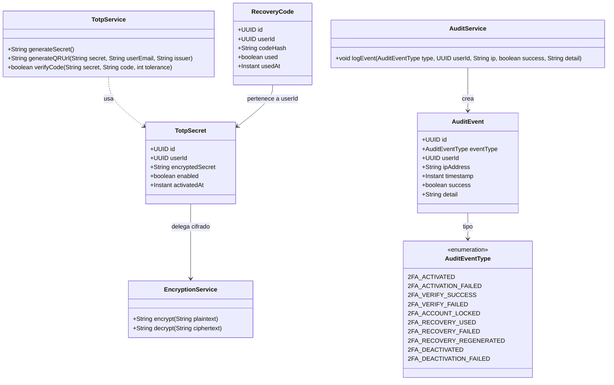
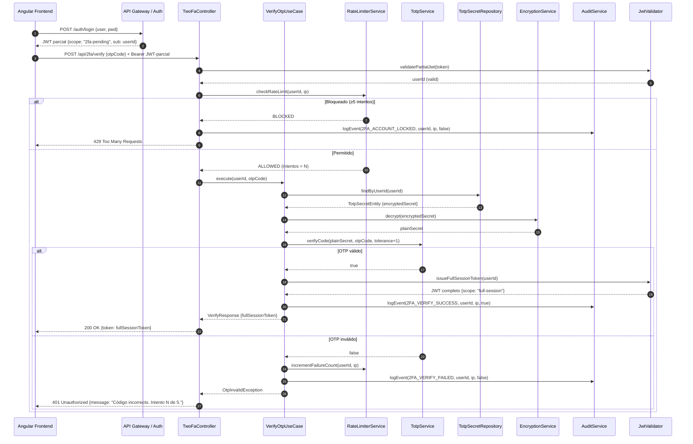
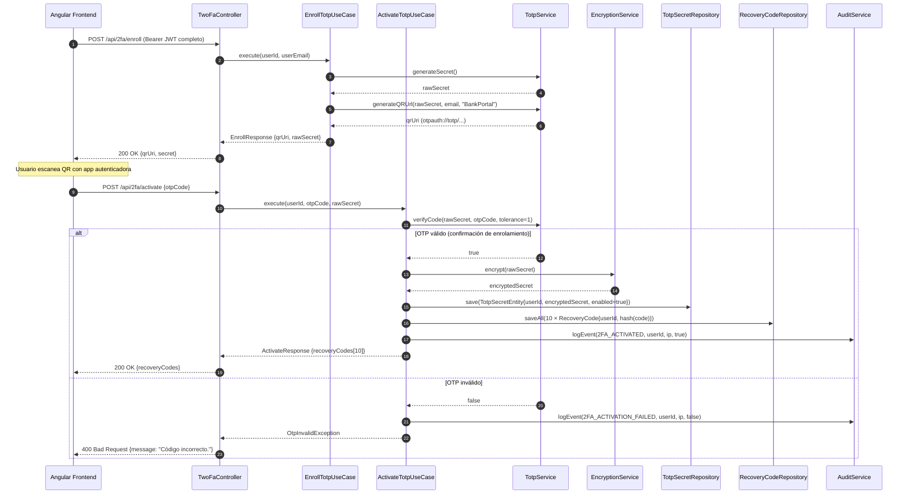

# LLD — backend-2fa (FEAT-001)

## Metadata

| Campo | Valor |
|---|---|
| **Servicio** | `backend-2fa` |
| **Feature** | FEAT-001 — 2FA TOTP |
| **Stack** | Java 17 / Spring Boot 3.x / PostgreSQL |
| **Arquitectura** | Hexagonal (Ports & Adapters) |
| **Versión** | 1.0 |
| **Estado** | DRAFT — 🔒 Pendiente aprobación Tech Lead |
| **Fecha** | 2026-03-14 |

---

## Estructura de módulo (Java Hexagonal)

```
apps/backend-2fa/
├── pom.xml
└── src/
    ├── main/
    │   ├── java/com/experis/sofia/twofa/
    │   │   ├── domain/
    │   │   │   ├── model/
    │   │   │   │   ├── TotpSecret.java          # Value Object — secreto cifrado
    │   │   │   │   ├── RecoveryCode.java         # Value Object — código recuperación
    │   │   │   │   └── AuditEvent.java           # Entidad de auditoría
    │   │   │   ├── repository/
    │   │   │   │   ├── TotpSecretRepository.java # Puerto (interface)
    │   │   │   │   ├── RecoveryCodeRepository.java
    │   │   │   │   └── AuditEventRepository.java
    │   │   │   └── service/
    │   │   │       ├── TotpService.java          # Lógica TOTP (RFC 6238)
    │   │   │       ├── EncryptionService.java    # AES-256 cifrado/descifrado
    │   │   │       └── AuditService.java         # Registro de eventos
    │   │   ├── application/
    │   │   │   ├── usecase/
    │   │   │   │   ├── EnrollTotpUseCase.java    # US-001: enrolamiento
    │   │   │   │   ├── ActivateTotpUseCase.java  # US-001: activación
    │   │   │   │   ├── VerifyOtpUseCase.java     # US-002: verificación login
    │   │   │   │   ├── VerifyRecoveryUseCase.java# US-003: código recuperación
    │   │   │   │   ├── GenerateRecoveryUseCase.java # US-003: regenerar códigos
    │   │   │   │   └── DeactivateTotpUseCase.java# US-004: desactivación
    │   │   │   └── dto/
    │   │   │       ├── EnrollResponse.java       # { qrUri, secret }
    │   │   │       ├── ActivateRequest.java      # { otpCode }
    │   │   │       ├── ActivateResponse.java     # { recoveryCodes[] }
    │   │   │       ├── VerifyRequest.java        # { otpCode }
    │   │   │       ├── VerifyResponse.java       # { fullSessionToken }
    │   │   │       ├── RecoveryVerifyRequest.java# { recoveryCode }
    │   │   │       ├── DeactivateRequest.java    # { currentPassword }
    │   │   │       └── TwoFaStatusResponse.java  # { enabled, codesRemaining }
    │   │   ├── infrastructure/
    │   │   │   ├── persistence/
    │   │   │   │   ├── JpaTotpSecretRepository.java    # Adaptador JPA
    │   │   │   │   ├── JpaRecoveryCodeRepository.java
    │   │   │   │   ├── JpaAuditEventRepository.java
    │   │   │   │   └── entity/
    │   │   │   │       ├── TotpSecretEntity.java
    │   │   │   │       ├── RecoveryCodeEntity.java
    │   │   │   │       └── AuditEventEntity.java
    │   │   │   └── security/
    │   │   │       ├── JwtValidator.java         # Valida JWT parcial/completo
    │   │   │       ├── RateLimiterService.java   # 5 intentos → bloqueo 15 min
    │   │   │       └── AesEncryptionAdapter.java # Implementación AES-256
    │   │   └── api/
    │   │       ├── controller/
    │   │       │   └── TwoFaController.java      # @RestController /api/2fa
    │   │       └── advice/
    │   │           └── TwoFaExceptionHandler.java # @RestControllerAdvice
    │   └── resources/
    │       ├── application.yml
    │       └── db/migration/
    │           ├── V1__add_totp_columns_to_users.sql
    │           ├── V2__create_recovery_codes.sql
    │           └── V3__create_audit_log.sql
    └── test/
        └── java/com/experis/sofia/twofa/
            ├── domain/service/
            │   ├── TotpServiceTest.java
            │   └── AuditServiceTest.java
            ├── application/usecase/
            │   ├── EnrollTotpUseCaseTest.java
            │   ├── VerifyOtpUseCaseTest.java
            │   └── VerifyRecoveryUseCaseTest.java
            └── api/controller/
                └── TwoFaControllerTest.java      # @WebMvcTest
```

---

## Diagrama de clases — Dominio



---

## Diagrama de secuencia — Verificación OTP en Login (US-002)



---

## Diagrama de secuencia — Enrolamiento 2FA (US-001)



---

## Modelo de datos

```mermaid
erDiagram
  users {
    uuid id PK
    varchar email NOT_NULL
    varchar password_hash NOT_NULL
    boolean totp_enabled DEFAULT_false
    timestamp created_at
    timestamp updated_at
  }

  totp_secrets {
    uuid id PK
    uuid user_id FK_users_id NOT_NULL UNIQUE
    text encrypted_secret NOT_NULL
    boolean enabled DEFAULT_false
    timestamp activated_at
    timestamp updated_at
  }

  recovery_codes {
    uuid id PK
    uuid user_id FK_users_id NOT_NULL
    varchar code_hash NOT_NULL
    boolean used DEFAULT_false
    timestamp used_at
    timestamp created_at
  }

  audit_log {
    uuid id PK
    varchar event_type NOT_NULL
    uuid user_id
    varchar ip_address NOT_NULL
    boolean success NOT_NULL
    text detail
    timestamp created_at NOT_NULL
  }

  users ||--o| totp_secrets : "tiene"
  users ||--o{ recovery_codes : "posee"
  users ||--o{ audit_log : "genera eventos"
```

---

## Estrategia de datos

| Aspecto | Decisión |
|---|---|
| **Motor** | PostgreSQL 15 (existente en proyecto) |
| **Patrón acceso** | Repository (Hexagonal — interfaces en domain, JPA en infrastructure) |
| **Migraciones** | Flyway — scripts versionados en `db/migration/` |
| **Índice `totp_secrets`** | `(user_id)` UNIQUE — búsqueda por usuario en cada verificación |
| **Índice `recovery_codes`** | `(user_id, used)` — filtrado rápido de códigos disponibles |
| **Índice `audit_log`** | `(user_id, created_at DESC)` — consultas forenses por usuario y fecha |
| **Cifrado `encrypted_secret`** | AES-256-GCM, clave en variable de entorno `TOTP_ENCRYPTION_KEY` |
| **Hash `code_hash`** | BCrypt (cost factor 12) — resistente a rainbow tables |

---

## Scripts de migración Flyway

### V1__add_totp_columns_to_users.sql
```sql
ALTER TABLE users
  ADD COLUMN totp_enabled BOOLEAN NOT NULL DEFAULT FALSE;
```

### V2__create_totp_secrets_and_recovery_codes.sql
```sql
CREATE TABLE totp_secrets (
  id              UUID PRIMARY KEY DEFAULT gen_random_uuid(),
  user_id         UUID NOT NULL UNIQUE REFERENCES users(id) ON DELETE CASCADE,
  encrypted_secret TEXT NOT NULL,
  enabled         BOOLEAN NOT NULL DEFAULT FALSE,
  activated_at    TIMESTAMP WITH TIME ZONE,
  updated_at      TIMESTAMP WITH TIME ZONE DEFAULT NOW()
);

CREATE TABLE recovery_codes (
  id          UUID PRIMARY KEY DEFAULT gen_random_uuid(),
  user_id     UUID NOT NULL REFERENCES users(id) ON DELETE CASCADE,
  code_hash   VARCHAR(72) NOT NULL,
  used        BOOLEAN NOT NULL DEFAULT FALSE,
  used_at     TIMESTAMP WITH TIME ZONE,
  created_at  TIMESTAMP WITH TIME ZONE DEFAULT NOW()
);

CREATE INDEX idx_recovery_codes_user_available ON recovery_codes(user_id, used);
```

### V3__create_audit_log.sql
```sql
CREATE TABLE audit_log (
  id          UUID PRIMARY KEY DEFAULT gen_random_uuid(),
  event_type  VARCHAR(50) NOT NULL,
  user_id     UUID REFERENCES users(id) ON DELETE SET NULL,
  ip_address  VARCHAR(45) NOT NULL,
  success     BOOLEAN NOT NULL,
  detail      TEXT,
  created_at  TIMESTAMP WITH TIME ZONE NOT NULL DEFAULT NOW()
);

CREATE INDEX idx_audit_log_user_date ON audit_log(user_id, created_at DESC);
CREATE INDEX idx_audit_log_event_type ON audit_log(event_type);
```

---

## Variables de entorno requeridas

| Variable | Descripción | Ejemplo |
|---|---|---|
| `SPRING_DATASOURCE_URL` | URL JDBC PostgreSQL | `jdbc:postgresql://localhost:5432/bankportal` |
| `SPRING_DATASOURCE_USERNAME` | Usuario BD | `bankportal_user` |
| `SPRING_DATASOURCE_PASSWORD` | Contraseña BD | *(secret)* |
| `TOTP_ENCRYPTION_KEY` | Clave AES-256 (32 bytes base64) | *(secret — jamás hardcodeada)* |
| `JWT_PARTIAL_SECRET` | Clave firma JWT sesión parcial | *(secret)* |
| `JWT_FULL_SECRET` | Clave firma JWT sesión completa | *(secret)* |
| `TOTP_ISSUER` | Nombre emisor en QR | `BankPortal - Banco Meridian` |
| `RATE_LIMIT_MAX_ATTEMPTS` | Máx. intentos OTP | `5` |
| `RATE_LIMIT_BLOCK_MINUTES` | Minutos de bloqueo | `15` |

---

## Dependencias Maven (pom.xml additions)

```xml
<!-- TOTP — RFC 6238 -->
<dependency>
  <groupId>dev.samstevens.totp</groupId>
  <artifactId>totp-spring-boot-starter</artifactId>
  <version>1.7.1</version>
</dependency>

<!-- BCrypt para códigos de recuperación -->
<dependency>
  <groupId>org.springframework.security</groupId>
  <artifactId>spring-security-crypto</artifactId>
</dependency>

<!-- Rate limiting -->
<dependency>
  <groupId>com.bucket4j</groupId>
  <artifactId>bucket4j-core</artifactId>
  <version>8.10.1</version>
</dependency>

<!-- Flyway migraciones -->
<dependency>
  <groupId>org.flywaydb</groupId>
  <artifactId>flyway-core</artifactId>
</dependency>
```

---

*Generado por SOFIA Architect Agent — 2026-03-14*
*Estado: DRAFT — 🔒 Pendiente aprobación Tech Lead*
