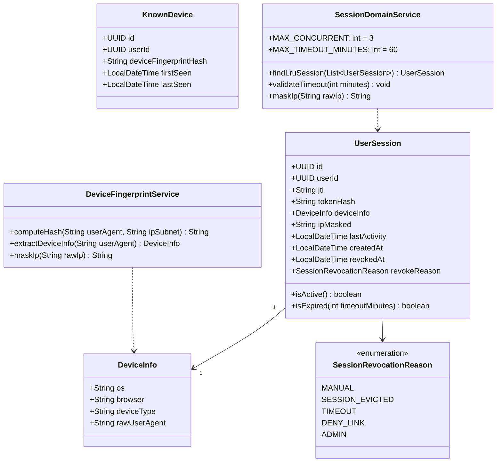
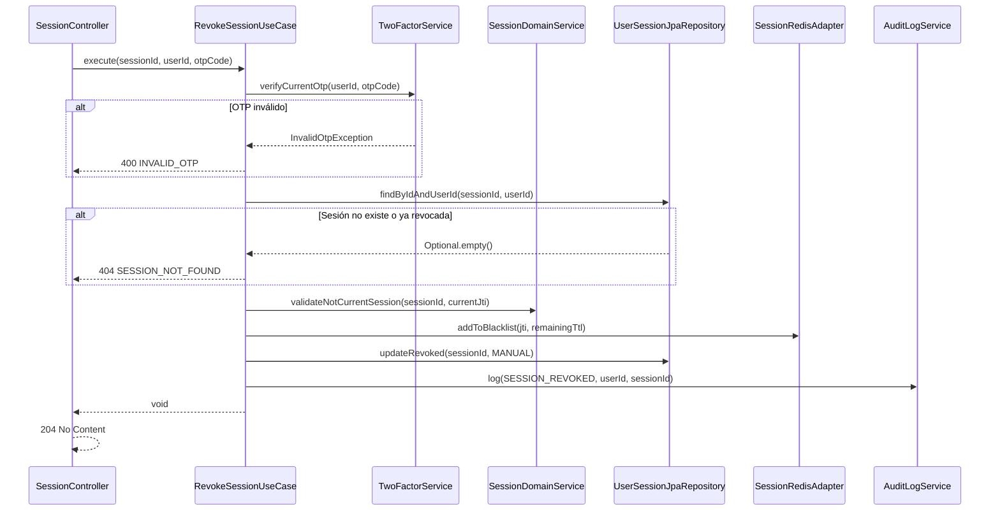
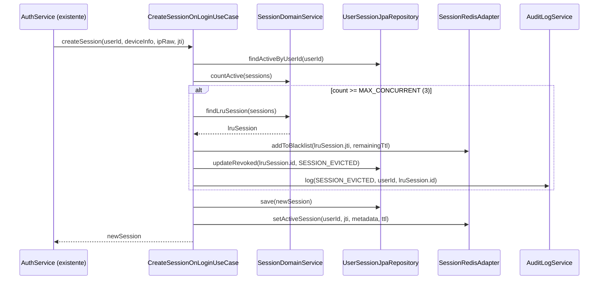
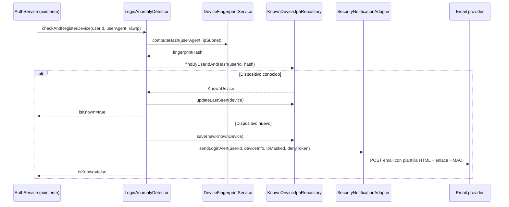
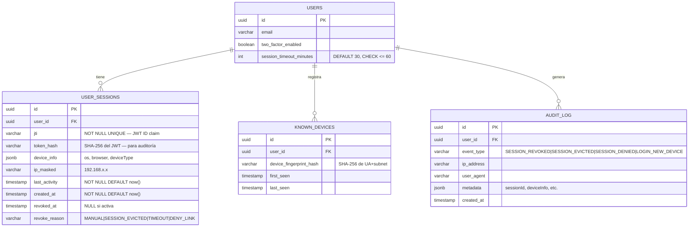

# LLD — Backend: Gestión de Sesiones (FEAT-002)

## Metadata

| Campo | Valor |
|---|---|
| **Servicio** | `backend-2fa` |
| **Módulo nuevo** | `session` |
| **Stack** | Java 17 · Spring Boot 3.2 · PostgreSQL 15 · Redis 7 |
| **Feature** | FEAT-002 · Sprint 3 |
| **Versión** | 1.0 |
| **Estado** | DRAFT — 🔒 Pendiente aprobación Tech Lead |

---

## Estructura de paquetes — módulo session

```
apps/backend-2fa/src/main/java/com/experis/sofia/bankportal/
└── session/
    ├── domain/
    │   ├── model/
    │   │   ├── UserSession.java          # Entidad de dominio
    │   │   ├── KnownDevice.java          # Entidad dispositivo conocido
    │   │   └── SessionRevocationReason.java  # Enum: MANUAL | SESSION_EVICTED | TIMEOUT | DENY_LINK
    │   ├── repository/
    │   │   ├── UserSessionRepository.java    # Puerto (interface)
    │   │   └── KnownDeviceRepository.java    # Puerto (interface)
    │   └── service/
    │       ├── SessionDomainService.java     # Reglas de dominio (concurrencia, expiración)
    │       └── DeviceFingerprintService.java # Hash de User-Agent + IP subnet
    ├── application/
    │   ├── usecase/
    │   │   ├── ListActiveSessionsUseCase.java
    │   │   ├── RevokeSessionUseCase.java
    │   │   ├── RevokeAllSessionsUseCase.java
    │   │   ├── UpdateSessionTimeoutUseCase.java
    │   │   ├── DenySessionByLinkUseCase.java
    │   │   └── CreateSessionOnLoginUseCase.java   # Hook en AuthService
    │   └── dto/
    │       ├── SessionResponse.java       # Record: id, deviceInfo, ipMasked, lastActivity, isCurrent
    │       ├── RevokeSessionRequest.java  # Record: otpCode
    │       └── UpdateTimeoutRequest.java  # Record: timeoutMinutes
    ├── infrastructure/
    │   ├── persistence/
    │   │   ├── UserSessionJpaRepository.java   # Spring Data JPA
    │   │   ├── KnownDeviceJpaRepository.java
    │   │   ├── UserSessionEntity.java          # @Entity
    │   │   └── KnownDeviceEntity.java          # @Entity
    │   ├── cache/
    │   │   └── SessionRedisAdapter.java        # Blacklist + concurrencia en Redis
    │   └── notification/
    │       └── SecurityNotificationAdapter.java # Integración email (SendGrid/SES)
    └── api/
        ├── controller/
        │   └── SessionController.java          # @RestController /api/v1/sessions
        └── security/
            └── TokenBlacklistFilter.java        # OncePerRequestFilter — check jti en Redis
```

---

## Diagrama de clases — dominio session



---

## Diagrama de secuencia — US-102: Revocar sesión con OTP



---

## Diagrama de secuencia — US-104: Concurrencia LRU en login



---

## Diagrama de secuencia — US-105: Alerta login dispositivo nuevo



---

## Modelo de datos



---

## Estrategia Redis — namespaces

| Namespace | Clave | Valor | TTL |
|---|---|---|---|
| Token blacklist | `sessions:blacklist:{jti}` | `"1"` | Tiempo restante del JWT (max 60 min) |
| Sesiones activas | `sessions:active:{userId}:{jti}` | JSON metadata | `session_timeout_minutes` |
| Concurrencia counter | `sessions:count:{userId}` | int | Sin TTL (se gestiona por eventos) |

**Implementación de blacklist en `TokenBlacklistFilter`:**
```java
// OncePerRequestFilter — se ejecuta antes del JwtAuthenticationFilter
String jti = extractJtiFromToken(request);
if (jti != null && redisTemplate.hasKey("sessions:blacklist:" + jti)) {
    response.setStatus(HttpStatus.UNAUTHORIZED.value());
    writeError(response, "SESSION_REVOKED", "Esta sesión ha sido revocada.");
    return;
}
```

---

## Migraciones Flyway

```sql
-- V3__create_session_tables.sql
ALTER TABLE users
  ADD COLUMN IF NOT EXISTS session_timeout_minutes INT NOT NULL DEFAULT 30
    CHECK (session_timeout_minutes BETWEEN 5 AND 60);

CREATE TABLE user_sessions (
  id             UUID PRIMARY KEY DEFAULT gen_random_uuid(),
  user_id        UUID NOT NULL REFERENCES users(id) ON DELETE CASCADE,
  jti            VARCHAR(36) NOT NULL UNIQUE,
  token_hash     VARCHAR(64) NOT NULL,
  device_info    JSONB,
  ip_masked      VARCHAR(32),
  last_activity  TIMESTAMP NOT NULL DEFAULT now(),
  created_at     TIMESTAMP NOT NULL DEFAULT now(),
  revoked_at     TIMESTAMP,
  revoke_reason  VARCHAR(32)
);
CREATE INDEX idx_user_sessions_user_active
  ON user_sessions(user_id) WHERE revoked_at IS NULL;
CREATE INDEX idx_user_sessions_last_activity
  ON user_sessions(user_id, last_activity DESC) WHERE revoked_at IS NULL;

CREATE TABLE known_devices (
  id                       UUID PRIMARY KEY DEFAULT gen_random_uuid(),
  user_id                  UUID NOT NULL REFERENCES users(id) ON DELETE CASCADE,
  device_fingerprint_hash  VARCHAR(64) NOT NULL,
  first_seen               TIMESTAMP NOT NULL DEFAULT now(),
  last_seen                TIMESTAMP NOT NULL DEFAULT now(),
  UNIQUE (user_id, device_fingerprint_hash)
);
CREATE INDEX idx_known_devices_user ON known_devices(user_id);
```

---

## Contrato OpenAPI — nuevos endpoints

### GET /api/v1/sessions

**Auth:** Bearer JWT full-session

**Response 200:**
```json
[
  {
    "sessionId": "uuid",
    "deviceInfo": { "os": "macOS", "browser": "Safari", "deviceType": "desktop" },
    "ipMasked": "192.168.x.x",
    "lastActivity": "2026-04-14T10:30:00Z",
    "createdAt": "2026-04-14T09:00:00Z",
    "isCurrent": true
  }
]
```
**Errores:** 401

---

### DELETE /api/v1/sessions/{sessionId}

**Auth:** Bearer JWT full-session | Header `X-OTP-Code: 123456`

**Response:** 204 No Content

**Errores:** 400 INVALID_OTP · 401 · 404 SESSION_NOT_FOUND · 409 CANNOT_REVOKE_CURRENT

---

### DELETE /api/v1/sessions

**Auth:** Bearer JWT full-session | Header `X-OTP-Code: 123456`

**Response:** 204 No Content (revoca todas excepto la actual)

**Errores:** 400 INVALID_OTP · 401

---

### PUT /api/v1/sessions/timeout

**Auth:** Bearer JWT full-session

**Request:**
```json
{ "timeoutMinutes": 30 }
```
**Response 200:**
```json
{ "timeoutMinutes": 30 }
```
**Errores:** 400 SESSION_TIMEOUT_EXCEEDS_POLICY (> 60 min) · 401

---

### GET /api/v1/sessions/deny/{token}

**Auth:** Sin autenticación (enlace en email)

**Descripción:** Revoca la sesión usando el token HMAC del enlace "No fui yo".
El token tiene TTL 24h y es de un solo uso.

**Response:** 302 redirect a `/login?reason=session-denied`

**Errores:** 400 TOKEN_EXPIRED · 400 TOKEN_ALREADY_USED · 400 TOKEN_INVALID

---

## Variables de entorno requeridas

| Variable | Descripción | Ejemplo |
|---|---|---|
| `SESSION_MAX_CONCURRENT` | Máximo de sesiones simultáneas | `3` |
| `SESSION_DEFAULT_TIMEOUT_MIN` | Timeout por defecto en minutos | `30` |
| `SESSION_MAX_TIMEOUT_MIN` | Timeout máximo permitido (PCI-DSS) | `60` |
| `SESSION_DENY_LINK_HMAC_KEY` | Clave HMAC para links de denegación | `(secret)` |
| `SESSION_DENY_LINK_TTL_HOURS` | TTL del link "No fui yo" | `24` |
| `NOTIFICATION_EMAIL_PROVIDER` | `sendgrid` o `ses` | `sendgrid` |
| `SENDGRID_API_KEY` | API key SendGrid | `(secret)` |
| `EMAIL_FROM` | Remitente de alertas | `seguridad@bankmeridian.com` |

---

*Generado por SOFIA Architect Agent · backend-2fa · FEAT-002 · Sprint 3 · 2026-04-14*
