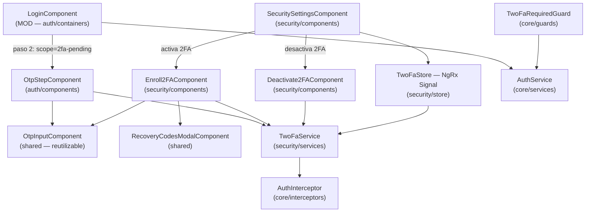
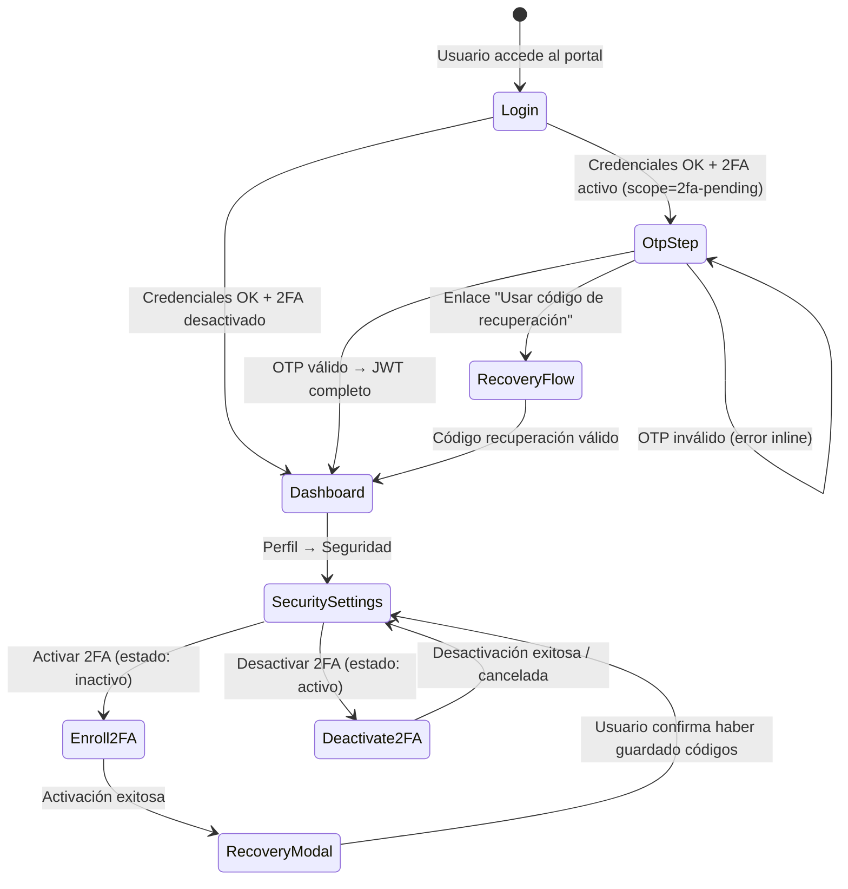

# LLD — frontend-portal / feature: security-2fa (FEAT-001)

## Metadata

| Campo | Valor |
|---|---|
| **Módulo** | `frontend-portal` — feature `security-2fa` |
| **Feature** | FEAT-001 — 2FA TOTP |
| **Stack** | Angular 17 / TypeScript / NgRx Signal Store |
| **Versión** | 1.0 |
| **Estado** | DRAFT — 🔒 Pendiente aprobación Tech Lead |
| **Fecha** | 2026-03-14 |

---

## Estructura de módulo Angular (feature-based)

```
apps/frontend-portal/src/app/
├── core/
│   ├── guards/
│   │   └── two-fa-required.guard.ts      # Redirige al paso OTP si scope=2fa-pending
│   ├── interceptors/
│   │   └── auth.interceptor.ts           # Añade Bearer JWT a todas las peticiones
│   └── services/
│       └── auth.service.ts               # Gestiona tokens JWT (parcial y completo)
│
├── shared/
│   ├── components/
│   │   ├── otp-input/                    # Componente reutilizable de 6 dígitos
│   │   │   ├── otp-input.component.ts
│   │   │   ├── otp-input.component.html
│   │   │   └── otp-input.component.scss
│   │   └── recovery-codes-modal/         # Modal bloqueante de códigos backup
│   │       ├── recovery-codes-modal.component.ts
│   │       ├── recovery-codes-modal.component.html
│   │       └── recovery-codes-modal.component.scss
│   └── models/
│       └── two-fa.models.ts              # Interfaces TypeScript compartidas
│
└── features/
    ├── auth/
    │   ├── containers/
    │   │   └── login/
    │   │       ├── login.component.ts    # MOD: añade paso OTP condicional
    │   │       └── login.component.html
    │   └── components/
    │       └── otp-step/
    │           ├── otp-step.component.ts # Paso 2FA en flujo de login
    │           └── otp-step.component.html
    │
    └── security/                         # Feature nueva — configuración 2FA
        ├── components/
        │   ├── security-settings/        # Panel de seguridad en perfil
        │   │   ├── security-settings.component.ts
        │   │   └── security-settings.component.html
        │   ├── enroll-2fa/               # Flujo de enrolamiento (QR + activación)
        │   │   ├── enroll-2fa.component.ts
        │   │   └── enroll-2fa.component.html
        │   └── deactivate-2fa/           # Confirmación desactivación
        │       ├── deactivate-2fa.component.ts
        │       └── deactivate-2fa.component.html
        ├── services/
        │   └── two-fa.service.ts         # HTTP calls a /api/2fa/*
        ├── store/
        │   └── two-fa.store.ts           # NgRx Signal Store — estado 2FA
        └── models/
            └── two-fa-feature.models.ts  # Interfaces de la feature
```

---

## Diagrama de componentes Angular



---

## Flujos de navegación (Router)



---

## Estado NgRx Signal Store — TwoFaStore

```typescript
// Interfaz del estado
interface TwoFaState {
  status: 'idle' | 'loading' | 'error';
  twoFaEnabled: boolean;
  codesRemaining: number;
  enrollQrUri: string | null;
  enrollSecret: string | null;
  recoveryCodes: string[];        // Solo disponibles durante el modal post-activación
  errorMessage: string | null;
}

// Signals computados
readonly isEnrolling = computed(() => this.enrollQrUri() !== null);
readonly hasRecoveryCodes = computed(() => this.codesRemaining() > 0);
readonly showCodeWarning = computed(() => this.codesRemaining() === 0 && this.twoFaEnabled());
```

---

## Interfaces TypeScript (two-fa.models.ts)

```typescript
export interface EnrollResponse {
  qrUri: string;
  secret: string;
}

export interface ActivateRequest {
  otpCode: string;
}

export interface ActivateResponse {
  recoveryCodes: string[];
}

export interface VerifyRequest {
  otpCode: string;
}

export interface VerifyResponse {
  token: string;  // JWT sesión completa
}

export interface RecoveryVerifyRequest {
  recoveryCode: string;
}

export interface DeactivateRequest {
  currentPassword: string;
}

export interface TwoFaStatus {
  enabled: boolean;
  codesRemaining: number;
}

export type OtpErrorType =
  | 'INVALID_CODE'
  | 'RATE_LIMITED'
  | 'NETWORK_ERROR';
```

---

## Contrato de consumo HTTP (TwoFaService)

```typescript
@Injectable({ providedIn: 'root' })
export class TwoFaService {
  private readonly BASE = '/api/2fa';

  enroll(): Observable<EnrollResponse>
  activate(req: ActivateRequest): Observable<ActivateResponse>
  verify(req: VerifyRequest): Observable<VerifyResponse>
  verifyRecovery(req: RecoveryVerifyRequest): Observable<VerifyResponse>
  generateRecoveryCodes(): Observable<ActivateResponse>
  deactivate(req: DeactivateRequest): Observable<void>
  getStatus(): Observable<TwoFaStatus>
}
```

Todas las llamadas incluyen el Bearer JWT via `AuthInterceptor`.
Los errores HTTP 429 (rate limit) se mapean a `OtpErrorType.RATE_LIMITED` y
se muestran con countdown de 15 minutos.

---

## Accesibilidad — WCAG 2.1 AA (RNF-008)

| Requisito | Implementación |
|---|---|
| OTP input accesible | `<input>` nativo con `aria-label="Código de verificación"` y `autocomplete="one-time-code"` |
| Modal bloqueante | `role="dialog"`, `aria-modal="true"`, foco gestionado al abrir/cerrar |
| Mensajes de error | `role="alert"` — anunciados automáticamente por lectores de pantalla |
| Countdown rate limit | `aria-live="polite"` — actualización progresiva sin interrumpir al usuario |
| Contraste | Verificar colores del design system existente — mínimo ratio 4.5:1 |
| Navegación teclado | Todos los flujos navigables sin ratón — tab order lógico |

---

*Generado por SOFIA Architect Agent — 2026-03-14*
*Estado: DRAFT — 🔒 Pendiente aprobación Tech Lead*
