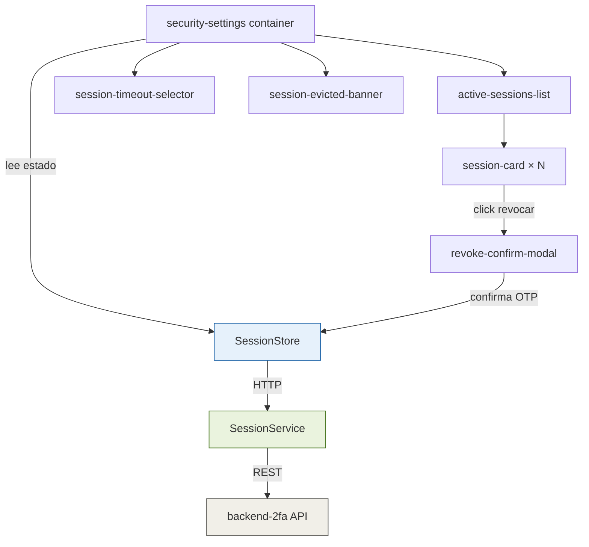

# LLD — Frontend Angular: Gestión de Sesiones (FEAT-002)

## Metadata

| Campo | Valor |
|---|---|
| **App** | `frontend-portal` |
| **Feature module** | `session-management` |
| **Stack** | Angular 17 · TypeScript 5 · NgRx Signal Store |
| **Feature** | FEAT-002 · Sprint 3 |
| **Versión** | 1.0 |
| **Estado** | DRAFT — 🔒 Pendiente aprobación Tech Lead |

---

## Estructura de módulo Angular

```
apps/frontend-portal/src/app/features/session-management/
├── components/
│   ├── active-sessions-list/
│   │   ├── active-sessions-list.component.ts    # Lista sesiones con badge "esta sesión"
│   │   ├── active-sessions-list.component.html
│   │   └── active-sessions-list.component.spec.ts
│   ├── session-card/
│   │   ├── session-card.component.ts            # Tarjeta individual con botón revocar
│   │   └── session-card.component.html
│   ├── revoke-confirm-modal/
│   │   ├── revoke-confirm-modal.component.ts    # Modal con OTP input
│   │   └── revoke-confirm-modal.component.html
│   ├── session-timeout-selector/
│   │   ├── session-timeout-selector.component.ts  # Dropdown 15/30/60 min
│   │   └── session-timeout-selector.component.html
│   └── session-evicted-banner/
│       └── session-evicted-banner.component.ts  # Banner: "Tu sesión más antigua fue cerrada"
├── containers/
│   └── security-settings/
│       ├── security-settings.component.ts        # Smart component: carga y coordina
│       └── security-settings.component.html
├── services/
│   └── session.service.ts                        # HTTP: GET/DELETE /sessions · PUT /timeout
├── store/
│   ├── session.store.ts                          # NgRx Signal Store
│   └── session.model.ts                          # Interfaces TS
└── session-management.routes.ts                  # Lazy route: /security/sessions
```

---

## Modelos TypeScript

```typescript
// session.model.ts

export interface DeviceInfo {
  os: string;
  browser: string;
  deviceType: 'desktop' | 'mobile' | 'tablet';
}

export interface ActiveSession {
  sessionId: string;
  deviceInfo: DeviceInfo;
  ipMasked: string;
  lastActivity: string; // ISO 8601
  createdAt: string;
  isCurrent: boolean;
}

export interface SessionState {
  sessions: ActiveSession[];
  timeoutMinutes: number;
  loading: boolean;
  revoking: string | null;    // sessionId siendo revocada
  error: string | null;
  evictedBanner: boolean;     // mostrar banner de sesión eviccionada
}

export interface RevokePayload {
  sessionId: string | 'all';
  otpCode: string;
}

export interface UpdateTimeoutPayload {
  timeoutMinutes: 15 | 30 | 60;
}
```

---

## Signal Store — session.store.ts

```typescript
// session.store.ts
import { signalStore, withState, withMethods, withComputed } from '@ngrx/signals';
import { inject } from '@angular/core';
import { SessionService } from '../services/session.service';
import { SessionState, ActiveSession } from './session.model';

const initialState: SessionState = {
  sessions: [],
  timeoutMinutes: 30,
  loading: false,
  revoking: null,
  error: null,
  evictedBanner: false,
};

export const SessionStore = signalStore(
  withState(initialState),

  withComputed(({ sessions }) => ({
    activeSessions: computed(() => sessions().filter(s => !s.isCurrent)),
    currentSession: computed(() => sessions().find(s => s.isCurrent) ?? null),
    hasOtherSessions: computed(() => sessions().some(s => !s.isCurrent)),
  })),

  withMethods((store, sessionService = inject(SessionService)) => ({

    async loadSessions(): Promise<void> {
      patchState(store, { loading: true, error: null });
      try {
        const sessions = await firstValueFrom(sessionService.getActiveSessions());
        patchState(store, { sessions, loading: false });
      } catch {
        patchState(store, { error: 'Error cargando sesiones', loading: false });
      }
    },

    async revokeSession(sessionId: string, otpCode: string): Promise<void> {
      patchState(store, { revoking: sessionId });
      try {
        await firstValueFrom(sessionService.revokeSession(sessionId, otpCode));
        patchState(store, {
          sessions: store.sessions().filter(s => s.sessionId !== sessionId),
          revoking: null,
        });
      } catch (err: any) {
        patchState(store, { error: err.error?.message ?? 'Error revocando sesión', revoking: null });
      }
    },

    async revokeAllOtherSessions(otpCode: string): Promise<void> {
      patchState(store, { revoking: 'all' });
      try {
        await firstValueFrom(sessionService.revokeAllSessions(otpCode));
        patchState(store, {
          sessions: store.sessions().filter(s => s.isCurrent),
          revoking: null,
        });
      } catch (err: any) {
        patchState(store, { error: err.error?.message ?? 'Error revocando sesiones', revoking: null });
      }
    },

    async updateTimeout(timeoutMinutes: 15 | 30 | 60): Promise<void> {
      try {
        await firstValueFrom(sessionService.updateTimeout(timeoutMinutes));
        patchState(store, { timeoutMinutes });
      } catch {
        patchState(store, { error: 'Error actualizando timeout' });
      }
    },

    dismissEvictedBanner(): void {
      patchState(store, { evictedBanner: false });
    },
  }))
);
```

---

## Servicio HTTP — session.service.ts

```typescript
// session.service.ts
import { Injectable, inject } from '@angular/core';
import { HttpClient, HttpHeaders } from '@angular/common/http';
import { Observable } from 'rxjs';
import { ActiveSession, UpdateTimeoutPayload } from '../store/session.model';

@Injectable({ providedIn: 'root' })
export class SessionService {
  private http = inject(HttpClient);
  private baseUrl = '/api/v1/sessions';

  getActiveSessions(): Observable<ActiveSession[]> {
    return this.http.get<ActiveSession[]>(this.baseUrl);
  }

  revokeSession(sessionId: string, otpCode: string): Observable<void> {
    return this.http.delete<void>(`${this.baseUrl}/${sessionId}`, {
      headers: new HttpHeaders({ 'X-OTP-Code': otpCode }),
    });
  }

  revokeAllSessions(otpCode: string): Observable<void> {
    return this.http.delete<void>(this.baseUrl, {
      headers: new HttpHeaders({ 'X-OTP-Code': otpCode }),
    });
  }

  updateTimeout(payload: UpdateTimeoutPayload): Observable<UpdateTimeoutPayload> {
    return this.http.put<UpdateTimeoutPayload>(`${this.baseUrl}/timeout`, payload);
  }
}
```

---

## Diagrama de interacción de componentes



---

## Flujo de usuario — Ruta `/security/sessions`

```
1. Usuario navega a Perfil → Seguridad → Sesiones activas
2. SecuritySettingsComponent.ngOnInit() → SessionStore.loadSessions()
3. Render: lista de SessionCardComponent (una por sesión)
   - La sesión actual muestra badge "Esta sesión" + botón desactivado
   - Las otras muestran: dispositivo, IP enmascarada, última actividad + botón "Cerrar"
4. Usuario hace click en "Cerrar" → abre RevokeConfirmModal
5. Modal: input OTP → usuario ingresa código → click "Confirmar"
6. SessionStore.revokeSession(sessionId, otpCode)
   → HTTP DELETE /sessions/{id} con X-OTP-Code header
   → Si 204: elimina sesión del store → modal se cierra
   → Si 400 INVALID_OTP: muestra error inline en modal
7. Si "Cerrar todas las demás" → mismo flujo con revokeAllOtherSessions()
```

---

## Accesibilidad WCAG 2.1 AA — checklist

- [ ] `SessionCard`: `aria-label="Cerrar sesión en {os} {browser}"` en botón revocar
- [ ] `RevokeConfirmModal`: trap focus dentro del modal · `role="dialog"` · `aria-labelledby`
- [ ] `SessionTimeoutSelector`: `aria-label="Tiempo de inactividad"` en `<select>`
- [ ] `SessionEvictedBanner`: `role="alert"` · `aria-live="polite"`
- [ ] Todos los estados de loading con `aria-busy="true"`

---

## Variables de entorno Angular

```typescript
// environment.ts
export const environment = {
  apiBaseUrl: 'https://api.bankportal.meridian.com/v1',
  sessionDenyBaseUrl: 'https://api.bankportal.meridian.com/v1/sessions/deny',
};
```

---

*Generado por SOFIA Architect Agent · frontend-portal · FEAT-002 · Sprint 3 · 2026-04-14*
