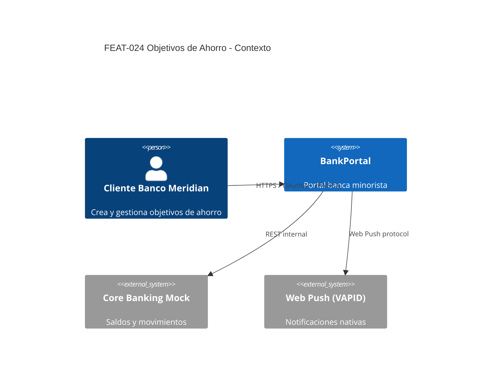
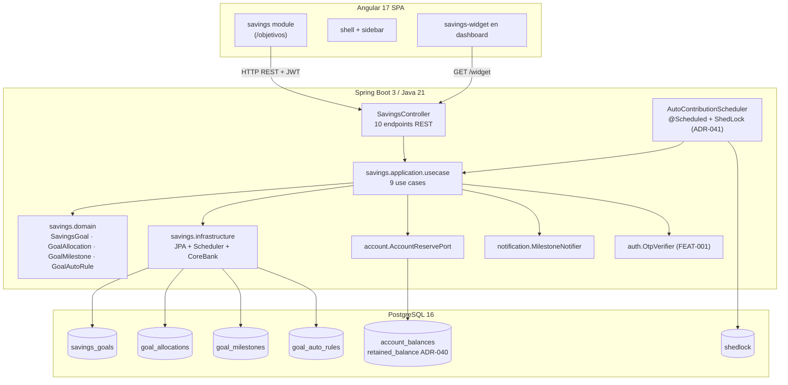
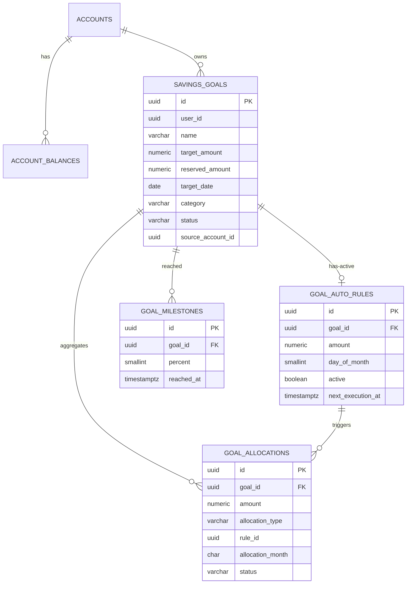

# HLD - FEAT-024 · Objetivos de Ahorro (Savings Goals)

## Metadata
- **Feature:** FEAT-024 | **Proyecto:** BankPortal | **Cliente:** Banco Meridian
- **Stack:** Java 21 / Spring Boot 3 + Angular 17 + PostgreSQL 16
- **Tipo:** new-feature | **Sprint:** 26 | **Version:** 1.0 | **Estado:** DRAFT
- **Architect Agent:** SOFIA v2.7 · 2026-04-27
- **ADRs:** ADR-040 (segregacion virtual alpha), ADR-041 (@Scheduled+ShedLock), ADR-042 (springdoc OpenAPI 3.1)
- **Inputs:** SRS-FEAT-024-sprint26.md (8 US, 15 RN, 7 RNF, 12 endpoints), UX-FEAT-024-sprint26.md, FA-FEAT-024-sprint26-draft.md

---

## 1. Analisis de impacto

| Servicio existente | Tipo de impacto | Accion requerida |
|---|---|---|
| **account** (FEAT-002) | Extension no breaking | Nuevo puerto AccountReservePort + adapter JpaAccountReserveAdapter; reutiliza tabla account_balances (campo retained_balance ya existente desde V10) |
| **auth / 2FA** (FEAT-001) | Consumidor nuevo | DELETE /goals/{id} con devolucion >30EUR exige header X-OTP (PSD2 SCA, RN-F024-11). Sin cambios de contrato 2FA |
| **gdpr-export** (FEAT-019) | Extension del export | Anadir savings_goals + goal_allocations al snapshot Art.15 (RN-F024-10). Soft-delete preserva 7 anos (RN-F024-12) |
| **notification / push VAPID** (FEAT-021) | Consumidor nuevo | Nuevo tipo SAVINGS_MILESTONE_REACHED (25/50/75/100%); idempotencia via UK (goal_id, percent) en tabla goal_milestones |
| **dashboard** (FEAT-014) | Modificacion no breaking | Anadir slot SavingsWidgetComponent (US-024-08) |
| **pfm / bizum / deposit** | Sin impacto | Siguen leyendo availableBalance del account_balances; ADR-040 garantiza retrocompatibilidad |

**Decision Step 0:** sin breaking changes. Nuevo bounded context savings paralelo a los existentes (pfm, bizum, deposit). Continuar con diseno.

---

## 2. Servicios involucrados

| Servicio | Accion | Responsabilidad |
|---|---|---|
| **savings (NUEVO)** | CREATE | Bounded context completo de objetivos de ahorro |
| **account** (FEAT-002) | EXTEND | Anadir puerto reserve/release |
| **notification** (FEAT-014) | INTEGRATE | Emision SAVINGS_MILESTONE_REACHED |
| **auth** (FEAT-001) | INTEGRATE | Validacion X-OTP en cierre con devolucion >30EUR |
| **gdpr-export** (FEAT-019) | INTEGRATE | Inclusion en snapshot Art.15 |
| **dashboard** (FEAT-014) | MODIFY | Slot widget |

---

## 3. Diagrama C4 - Nivel 1 (Contexto)

---

## 4. Diagrama C4 - Nivel 2 (Contenedores y bounded contexts)

---

## 5. Contrato de integracion backend - frontend

**Base URL:** /api/v1/savings | **Auth:** Bearer JWT (FEAT-001) | **Content:** application/json

| Metodo | Path | Summary | Codigos |
|---|---|---|---|
| GET | /goals | Listar objetivos del usuario (filtro status?) | 200 / 401 |
| POST | /goals | Crear objetivo | 201 / 400 / 409 / 422 |
| GET | /goals/{id} | Detalle con histograma + proyeccion | 200 / 401 / 403 / 404 |
| PUT | /goals/{id} | Editar (name, targetAmount, targetDate, status) | 200 / 400 / 403 / 404 / 422 |
| DELETE | /goals/{id} | Cerrar con devolucion (X-OTP si >30EUR) | 200 / 401 / 403 / 404 |
| POST | /goals/{id}/contributions | Aportacion manual | 201 / 400 / 403 / 404 / 422 |
| GET | /goals/{id}/contributions | Historico paginado | 200 / 401 / 403 / 404 |
| PUT | /goals/{id}/auto-rule | Configurar regla auto | 200 / 400 / 403 / 404 / 422 |
| DELETE | /goals/{id}/auto-rule | Pausar regla | 204 / 403 / 404 |
| GET | /goals/{id}/milestones | Hitos alcanzados | 200 / 403 / 404 |
| GET | /dashboard-widget | Widget agregado | 200 / 401 |
| GET | /v3/api-docs | OpenAPI 3.1 (springdoc, ADR-042) | 200 |

Codigo 422 = ReservedExceedsTargetException, MaxGoalsReachedException, InsufficientFundsException, MilestoneAlreadyEmittedException.

Detalle de DTOs y schemas en LLD-backend-FEAT-024-sprint26.md seccion 5.

---

## 6. Decisiones tecnicas - ADRs

| ID | Titulo | Status | Sintesis |
|---|---|---|---|
| **ADR-040** | Segregacion virtual alpha sobre retained_balance | ACCEPTED | Reutilizar account_balances.retained_balance existente; nuevo AccountReservePort; sin migracion de cuentas |
| **ADR-041** | @Scheduled + ShedLock vs Quartz | ACCEPTED | Reutilizar patron ADR-028; cron 0 0 2 * * * UTC; ShedLock distributed lock; reintentos 3x backoff exp en regla |
| **ADR-042** | OpenAPI 3.1 via springdoc-openapi 2.3 | ACCEPTED | Habilita GR-SMOKE-001; cubre RNF-F024-06/07; DEBT-048/049/050 ligadas |

---

## 7. Modelo de datos - vista logica

Detalle DDL completo + tipos BD-Java (LA-019-13) en LLD-backend seccion 4.

---

## 8. Atributos de calidad y RNF

| RNF | Estrategia HLD |
|---|---|
| RNF-F024-01 latencia /savings/* p95<400ms | JPA index (user_id,status); proyeccion calculada en use case sin N+1; widget cache 60s en Redis (opcional, diferido) |
| RNF-F024-02 scheduler 1000 reglas <60s | Lectura batch 200 reglas; transaccion REQUIRES_NEW por regla; UPDATE batch JDBC en account_balances |
| RNF-F024-03 widget p95<200ms | Endpoint dedicado /dashboard-widget con query agregada SUM(reserved_amount); sin joins a goal_allocations |
| RNF-F024-04 WCAG 2.1 AA | Hereda design system FEAT-021/023 (UX-FEAT-024-sprint26.md secc.WCAG) |
| RNF-F024-05 auditoria CRUD | audit_log entry en cada POST/PUT/DELETE de goals y allocations (interceptor existente) |
| RNF-F024-06 OpenAPI 3.1 auto | ADR-042 (springdoc 2.3.0) |
| RNF-F024-07 cobertura retroactiva | DEBT-048 (SCRUM-171) decora controllers existentes |

---

## 9. Cumplimiento normativo

| Norma | Aplicacion |
|---|---|
| **PSD2 SCA** | Cierre con devolucion >30EUR exige X-OTP (RN-F024-11), reusa FEAT-001 |
| **GDPR Art.15** | Export incluye objetivos+aportaciones (RN-F024-10) |
| **GDPR Art.17** | Soft-delete con retencion 7 anos (RN-F024-12, obligacion fiscal/contable) |
| **Ley 44/2002** | Sin impacto: la reserva no genera intereses (no es deposito remunerado) |

---

## 10. Riesgos y mitigaciones

| ID | Riesgo | Probabilidad | Impacto | Mitigacion |
|---|---|---|---|---|
| R1 | Inconsistencia reserved_amount vs allocations tras fallo parcial | Media | Alto | Transaccion atomica goal+allocation+account_balance; test invariante en IT |
| R2 | Saldo negativo si race condition en aportacion | Baja | Alto | UPDATE WHERE available_balance>=:amount + check affectedRows=1 |
| R3 | Doble ejecucion scheduler en deploy multi-instancia | Baja | Medio | ShedLock @SchedulerLock |
| R4 | Notificacion duplicada de hito | Baja | Bajo | UK (goal_id,percent) |
| R5 | Deriva contrato API vs smoke test | Media | Alto | ADR-042 + GR-SMOKE-001 |
| R6 | Drift retained_balance entre savings y retenciones clasicas | Baja | Medio | DEBT-051 diferida (reservation_breakdown JSONB) si auditoria lo exige |

---

## 11. Handoff a Workflow Manager

> **Handoff a Workflow Manager**
> **Artefactos:** HLD-FEAT-024-sprint26.md + LLD-backend + LLD-frontend + ADR-040/041/042
> **Gate requerido:** G-3 - aprobacion Tech Lead
> **Accion post-aprobacion:** Step 3b automatico (Documentation Agent + FA-Agent enrich + Confluence + validate-fa-index 8/8) -> notificar a Developer

---

## 12. Referencias
- SRS-FEAT-024-sprint26.md
- UX-FEAT-024-sprint26.md
- FA-FEAT-024-sprint26-draft.md
- ADR-028 (ShedLock), ADR-040, ADR-041, ADR-042
- V10__account_transactions.sql (origen de retained_balance)
- LA-019-08 (perfiles Spring), LA-019-13 (mapa tipos BD-Java), LA-CORE-064 (GR-SMOKE-001)
