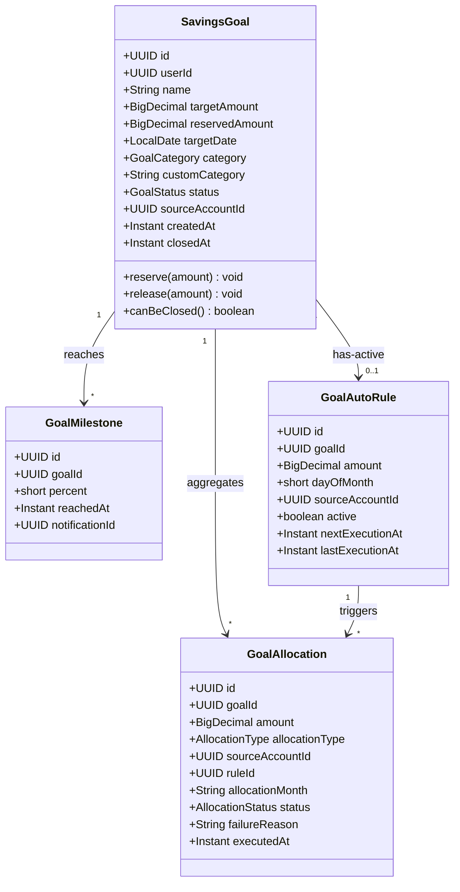
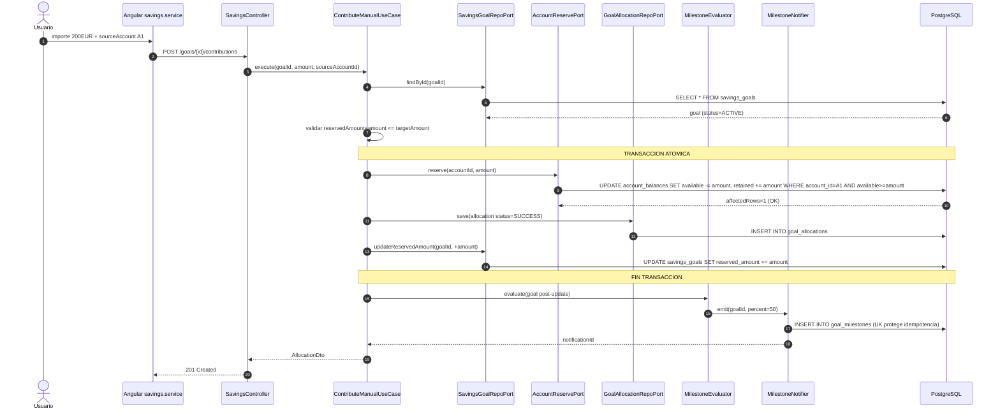
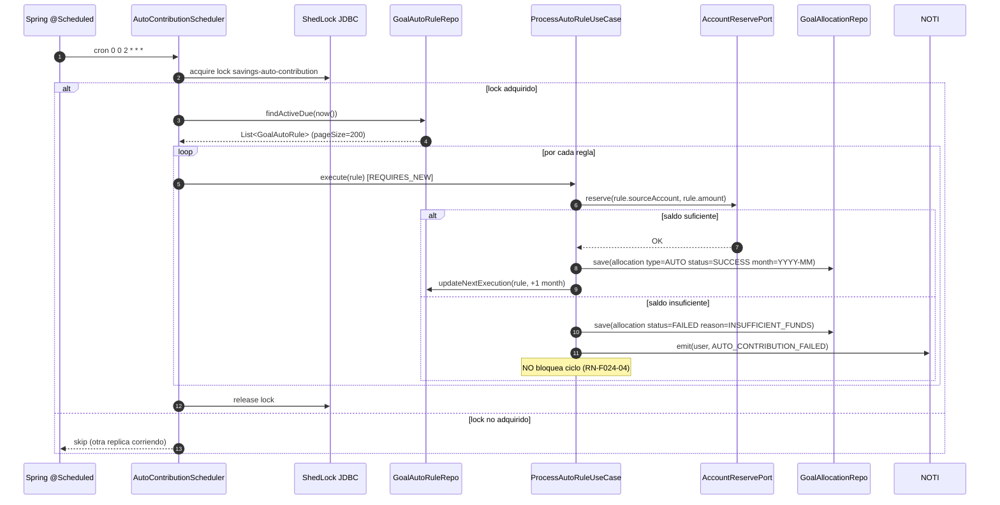
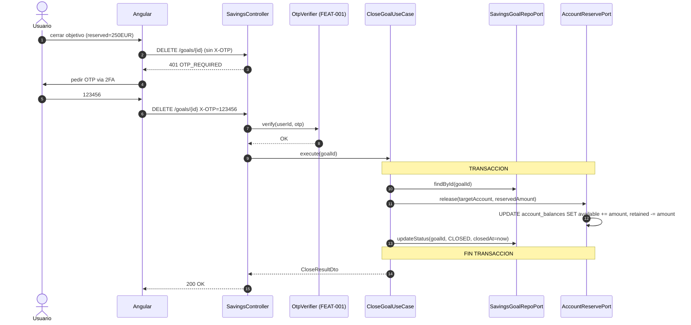

# LLD Backend - FEAT-024 · Objetivos de Ahorro

## Metadata
- **Feature:** FEAT-024 | **Sprint:** 26 | **Version:** 1.0 | **Estado:** DRAFT
- **Stack:** Java 21 + Spring Boot 3 + PostgreSQL 16 + Hibernate 6
- **Architect Agent:** SOFIA v2.7 · 2026-04-27
- **Documento companero:** HLD-FEAT-024-sprint26.md, LLD-frontend-FEAT-024-sprint26.md
- **ADRs:** ADR-040, ADR-041, ADR-042

---

## 1. Estructura de paquetes hexagonal

```
apps/backend-2fa/src/main/java/com/experis/sofia/bankportal/savings/
├─ domain/
│  ├─ model/
│  │  ├─ SavingsGoal.java
│  │  ├─ GoalAllocation.java
│  │  ├─ GoalMilestone.java
│  │  ├─ GoalAutoRule.java
│  │  ├─ GoalStatus.java          (enum ACTIVE, PAUSED, CLOSED, COMPLETED)
│  │  ├─ AllocationType.java      (enum MANUAL, AUTO)
│  │  ├─ AllocationStatus.java    (enum PENDING, SUCCESS, FAILED)
│  │  └─ GoalCategory.java        (enum VIAJE, HOGAR, VEHICULO, EMERGENCIA, EDUCACION, OTROS)
│  ├─ exception/
│  │  ├─ GoalNotFoundException.java
│  │  ├─ InsufficientFundsException.java
│  │  ├─ MaxGoalsReachedException.java
│  │  ├─ MilestoneAlreadyEmittedException.java
│  │  ├─ ReservedExceedsTargetException.java
│  │  └─ GoalAccessDeniedException.java
│  ├─ service/
│  │  ├─ GoalProjectionService.java
│  │  ├─ MilestoneEvaluator.java
│  │  └─ GoalClosureService.java
│  └─ repository/
│     ├─ SavingsGoalRepositoryPort.java
│     ├─ GoalAllocationRepositoryPort.java
│     ├─ GoalMilestoneRepositoryPort.java
│     └─ GoalAutoRuleRepositoryPort.java
├─ application/
│  ├─ usecase/
│  │  ├─ CreateGoalUseCase.java
│  │  ├─ ListGoalsUseCase.java
│  │  ├─ GetGoalDetailUseCase.java
│  │  ├─ UpdateGoalUseCase.java
│  │  ├─ CloseGoalUseCase.java
│  │  ├─ ContributeManualUseCase.java
│  │  ├─ ConfigureAutoRuleUseCase.java
│  │  ├─ PauseAutoRuleUseCase.java
│  │  ├─ GetDashboardWidgetUseCase.java
│  │  └─ ProcessAutoRuleUseCase.java         (invocado desde scheduler)
│  └─ dto/
│     └─ SavingsDtos.java                     (12 records: requests + responses)
├─ infrastructure/
│  ├─ persistence/
│  │  ├─ entity/
│  │  │  ├─ SavingsGoalEntity.java
│  │  │  ├─ GoalAllocationEntity.java
│  │  │  ├─ GoalMilestoneEntity.java
│  │  │  └─ GoalAutoRuleEntity.java
│  │  ├─ jpa/
│  │  │  ├─ JpaSavingsGoalRepository.java
│  │  │  ├─ JpaGoalAllocationRepository.java
│  │  │  ├─ JpaGoalMilestoneRepository.java
│  │  │  └─ JpaGoalAutoRuleRepository.java
│  │  └─ adapter/
│  │     ├─ JpaSavingsGoalAdapter.java        (@Primary, sin @Profile)
│  │     ├─ JpaGoalAllocationAdapter.java     (@Primary)
│  │     ├─ JpaGoalMilestoneAdapter.java      (@Primary)
│  │     └─ JpaGoalAutoRuleAdapter.java       (@Primary)
│  ├─ scheduler/
│  │  └─ AutoContributionScheduler.java       (@Scheduled + @SchedulerLock, ADR-041)
│  └─ corebanking/
│     └─ SavingsReserveAdapter.java           (delega en AccountReservePort, ADR-040)
└─ api/
   ├─ controller/
   │  └─ SavingsController.java               (10 endpoints REST)
   └─ exception/
      └─ SavingsExceptionHandler.java         (@ControllerAdvice, LA-TEST-003)
```

**Anadidos en bounded context account (ADR-040):**
```
account/
├─ domain/repository/AccountReservePort.java   (NUEVO)
└─ infrastructure/persistence/JpaAccountReserveAdapter.java   (NUEVO, @Primary)
```

---

## 2. Modelo de dominio

### 2.1 Entidades raiz

| Entidad | Identidad | Estado | Invariantes |
|---|---|---|---|
| **SavingsGoal** | UUID id | ACTIVE \| PAUSED \| CLOSED \| COMPLETED | reservedAmount in [0..targetAmount]; targetDate > created_at + 30d; userId no cambia |
| **GoalAllocation** | UUID id | PENDING \| SUCCESS \| FAILED | amount > 0; allocationType in (MANUAL,AUTO); inmutable tras SUCCESS |
| **GoalMilestone** | UUID id | (sin estado) | percent in (25,50,75,100); UK (goal_id,percent) |
| **GoalAutoRule** | UUID id | active boolean | amount in [10..5000]; dayOfMonth in [1..28]; UK (goal_id) WHERE active=true |

### 2.2 Diagrama de clases



---

## 3. Modelo de datos - DDL completo (Flyway V29)

### 3.1 Migracion V29__savings_goals.sql

```sql
-- ============================================================================
-- V29__savings_goals.sql · FEAT-024 Objetivos de Ahorro · Sprint 26
-- Architect: SOFIA v2.7 · 2026-04-27 · ADR-040
-- ============================================================================

CREATE TABLE savings_goals (
  id                 UUID PRIMARY KEY,
  user_id            UUID NOT NULL,
  name               VARCHAR(100) NOT NULL,
  target_amount      NUMERIC(12,2) NOT NULL CHECK (target_amount BETWEEN 100 AND 500000),
  reserved_amount    NUMERIC(12,2) NOT NULL DEFAULT 0.00 CHECK (reserved_amount >= 0),
  target_date        DATE NOT NULL,
  category           VARCHAR(20) NOT NULL,
  custom_category    VARCHAR(50),
  icon               VARCHAR(30),
  color              VARCHAR(10),
  status             VARCHAR(15) NOT NULL CHECK (status IN ('ACTIVE','PAUSED','CLOSED','COMPLETED')),
  source_account_id  UUID,
  created_at         TIMESTAMPTZ NOT NULL DEFAULT now(),
  updated_at         TIMESTAMPTZ NOT NULL DEFAULT now(),
  closed_at          TIMESTAMPTZ,
  CONSTRAINT uk_user_goal_name UNIQUE (user_id, name) DEFERRABLE INITIALLY DEFERRED,
  CONSTRAINT chk_reserved_le_target CHECK (reserved_amount <= target_amount)
);
CREATE INDEX idx_savings_goals_user_status ON savings_goals(user_id, status);

CREATE TABLE goal_allocations (
  id                 UUID PRIMARY KEY,
  goal_id            UUID NOT NULL REFERENCES savings_goals(id) ON DELETE CASCADE,
  amount             NUMERIC(10,2) NOT NULL CHECK (amount > 0),
  allocation_type    VARCHAR(10) NOT NULL CHECK (allocation_type IN ('MANUAL','AUTO')),
  source_account_id  UUID NOT NULL,
  rule_id            UUID,
  allocation_month   CHAR(7),
  status             VARCHAR(10) NOT NULL CHECK (status IN ('PENDING','SUCCESS','FAILED')),
  failure_reason     VARCHAR(50),
  executed_at        TIMESTAMPTZ NOT NULL DEFAULT now(),
  CONSTRAINT uk_goal_month UNIQUE (goal_id, allocation_month) DEFERRABLE INITIALLY DEFERRED
);
CREATE INDEX idx_goal_allocations_goal_time ON goal_allocations(goal_id, executed_at DESC);

CREATE TABLE goal_milestones (
  id              UUID PRIMARY KEY,
  goal_id         UUID NOT NULL REFERENCES savings_goals(id) ON DELETE CASCADE,
  percent         SMALLINT NOT NULL CHECK (percent IN (25,50,75,100)),
  reached_at      TIMESTAMPTZ NOT NULL DEFAULT now(),
  notification_id UUID,
  CONSTRAINT uk_goal_milestone UNIQUE (goal_id, percent)
);

CREATE TABLE goal_auto_rules (
  id                UUID PRIMARY KEY,
  goal_id           UUID NOT NULL REFERENCES savings_goals(id) ON DELETE CASCADE,
  amount            NUMERIC(10,2) NOT NULL CHECK (amount BETWEEN 10 AND 5000),
  day_of_month      SMALLINT NOT NULL CHECK (day_of_month BETWEEN 1 AND 28),
  source_account_id UUID NOT NULL,
  active            BOOLEAN NOT NULL DEFAULT TRUE,
  next_execution_at TIMESTAMPTZ NOT NULL,
  last_execution_at TIMESTAMPTZ,
  created_at        TIMESTAMPTZ NOT NULL DEFAULT now()
);
CREATE UNIQUE INDEX uk_goal_active_rule ON goal_auto_rules(goal_id) WHERE active = TRUE;

COMMENT ON TABLE savings_goals IS 'FEAT-024 - objetivos de ahorro virtuales (ADR-040 alpha)';
COMMENT ON TABLE goal_allocations IS 'FEAT-024 - aportaciones manuales y automaticas';
COMMENT ON TABLE goal_milestones IS 'FEAT-024 - hitos 25/50/75/100 emitidos (idempotencia RN-F024-09)';
COMMENT ON TABLE goal_auto_rules IS 'FEAT-024 - reglas de aportacion automatica mensual';
```

**Aclaracion sobre erratas del SRS:** la tabla de hitos se llama `goal_milestones` (sin prefijo `pfm_`). RN-F024-09 quedara reescrita en el FA enriquecido del Step 3b.

**Tablas existentes NO modificadas** (ADR-040 reusa columnas):
- `account_balances.available_balance` y `.retained_balance` (V10).
- `shedlock` (V?? Sprint anterior, ADR-028).
- `audit_log` (V?? interceptor existente).

### 3.2 Soft-delete y retencion fiscal (RN-F024-12)

`savings_goals.closed_at TIMESTAMPTZ` actua como marca de soft-delete.
Reglas de ciclo de vida:

- `status=ACTIVE | PAUSED` -> `closed_at IS NULL`.
- `status=CLOSED | COMPLETED` -> `closed_at = now()` en la transaccion de cierre.
- **NUNCA** ejecutar `DELETE FROM savings_goals` desde la aplicacion.
- Las filas con `status IN ('CLOSED','COMPLETED')` se preservan **7 anos**
  (obligacion contable y fiscal espanola). Job de purga diferido a sprint
  futuro (DEBT-052, no incluida en S26).
- Los listados y agregados (US-024-02, widget US-024-08) filtran por
  `status=ACTIVE` por defecto; el detalle (US-024-03) muestra todos los
  estados si el usuario navega a un goal cerrado.

`goal_allocations` heredan la retencion via FK `ON DELETE CASCADE`: mientras
la fila padre exista, las allocations se preservan. La cascada solo aplicaria
si en el futuro se ejecutara purga real al expirar los 7 anos.

### 3.3 GDPR export y derecho al olvido (RN-F024-10)

El export Art.15 (FEAT-019) es un BC externo a `savings`. La integracion es
**read-only**: el servicio de export ejecuta queries SELECT directas sobre
`savings_goals` y `goal_allocations` filtradas por `user_id`. No requiere
cambios en este modulo.

Para Art.17 (derecho al olvido) la politica es **anonimizacion en lugar de
borrado**: si un usuario solicita borrado de cuenta, FEAT-019 sustituye
`savings_goals.user_id` por un UUID nil predefinido y elimina `name`,
`custom_category`, `icon`, `color`. Las allocations quedan como datos
agregados anonimos para auditoria contable. La logica de anonimizacion
vive en FEAT-019, fuera del scope de este LLD.

---

## 4. Mapa de tipos BD - Java (LA-019-13 OBLIGATORIO)

### 4.1 savings_goals

| Columna | Tipo PostgreSQL | Tipo Java | Notas |
|---|---|---|---|
| id | uuid | UUID | rs.getObject("id", UUID.class) |
| user_id | uuid | UUID | FK logica a users |
| name | varchar(100) | String | NOT NULL |
| target_amount | numeric(12,2) | BigDecimal | NO double/float |
| reserved_amount | numeric(12,2) | BigDecimal | denormalizada (ADR-040 invariante) |
| target_date | date | LocalDate | sin zona horaria |
| category | varchar(20) | GoalCategory.name() | enum como String |
| custom_category | varchar(50) | String (nullable) | solo si category=OTROS |
| icon | varchar(30) | String (nullable) | nombre de icono UX |
| color | varchar(10) | String (nullable) | hex token UX |
| status | varchar(15) | GoalStatus.name() | enum como String |
| source_account_id | uuid | UUID (nullable) | cuenta origen ultimas aportaciones |
| created_at | timestamptz | Instant | timestamp WITH timezone |
| updated_at | timestamptz | Instant | actualizado por trigger BEFORE UPDATE |
| closed_at | timestamptz | Instant (nullable) | solo cuando status=CLOSED \| COMPLETED |

### 4.2 goal_allocations

| Columna | Tipo PostgreSQL | Tipo Java | Notas |
|---|---|---|---|
| id | uuid | UUID | |
| goal_id | uuid | UUID | FK |
| amount | numeric(10,2) | BigDecimal | siempre positivo |
| allocation_type | varchar(10) | AllocationType.name() | MANUAL \| AUTO |
| source_account_id | uuid | UUID | NOT NULL |
| rule_id | uuid (nullable) | UUID | FK debil a goal_auto_rules |
| allocation_month | char(7) | String (nullable) | formato YYYY-MM, solo en AUTO |
| status | varchar(10) | AllocationStatus.name() | PENDING \| SUCCESS \| FAILED |
| failure_reason | varchar(50) | String (nullable) | INSUFFICIENT_FUNDS \| TIMEOUT \| ... |
| executed_at | timestamptz | Instant | |

### 4.3 goal_milestones

| Columna | Tipo PostgreSQL | Tipo Java | Notas |
|---|---|---|---|
| id | uuid | UUID | |
| goal_id | uuid | UUID | FK |
| percent | smallint | short | mapeo primitivo (no Short) |
| reached_at | timestamptz | Instant | |
| notification_id | uuid (nullable) | UUID | id devuelto por NotificationService |

### 4.4 goal_auto_rules

| Columna | Tipo PostgreSQL | Tipo Java | Notas |
|---|---|---|---|
| id | uuid | UUID | |
| goal_id | uuid | UUID | FK |
| amount | numeric(10,2) | BigDecimal | en [10..5000] |
| day_of_month | smallint | short | en [1..28] |
| source_account_id | uuid | UUID | NOT NULL |
| active | boolean | boolean | UK parcial cuando true |
| next_execution_at | timestamptz | Instant | calculado por use case |
| last_execution_at | timestamptz (nullable) | Instant | actualizado por scheduler |
| created_at | timestamptz | Instant | |

### 4.5 Notas criticas

- **NUNCA** mapear timestamptz a LocalDateTime; usar Instant (LA-019-13 / LA-CORE-054).
- **JdbcClient + Instant**: bindear via `Timestamp.from(instant)` (LA-CORE-054).
- **enums como String**: nunca PostgreSQL ENUM (no compatible con Hibernate sin custom type).
- **target_date** queda `date` (sin zona) porque es una intencion del usuario, no un instante.

---

## 5. Estrategia de perfiles Spring (LA-019-08)

| Adaptador | Anotacion | Perfiles activos |
|---|---|---|
| JpaSavingsGoalAdapter | @Primary | dev, staging, production |
| JpaGoalAllocationAdapter | @Primary | dev, staging, production |
| JpaGoalMilestoneAdapter | @Primary | dev, staging, production |
| JpaGoalAutoRuleAdapter | @Primary | dev, staging, production |
| JpaAccountReserveAdapter | @Primary | dev, staging, production |
| MockSavingsGoalAdapter | @Profile("mock") | solo tests unitarios |
| AutoContributionScheduler | @Component @EnableScheduling | dev, staging, production |

NUNCA usar @Profile("!production") - activa en dev Y staging y enmascara bugs.

---

## 6. Diagramas de secuencia (3 flujos criticos)

### 6.1 Aportacion manual



### 6.2 Scheduler aportacion automatica



### 6.3 Cierre con devolucion >30EUR (SCA)



---

## 7. DTOs (records)

```java
// SavingsDtos.java
public final class SavingsDtos {

  public record CreateGoalRequest(
      @NotBlank @Size(max=100) String name,
      @NotNull @DecimalMin("100") @DecimalMax("500000") BigDecimal targetAmount,
      @NotNull @Future LocalDate targetDate,
      @NotNull GoalCategory category,
      @Size(max=50) String customCategory,
      @Size(max=30) String icon,
      @Size(max=10) String color,
      UUID sourceAccountId
  ) {}

  public record UpdateGoalRequest(
      @Size(max=100) String name,
      @DecimalMin("100") @DecimalMax("500000") BigDecimal targetAmount,
      @Future LocalDate targetDate,
      GoalStatus status
  ) {}

  public record ContributeRequest(
      @NotNull @DecimalMin("10") @DecimalMax("5000") BigDecimal amount,
      @NotNull UUID sourceAccountId
  ) {}

  public record AutoRuleRequest(
      @NotNull @DecimalMin("10") @DecimalMax("5000") BigDecimal amount,
      @NotNull @Min(1) @Max(28) Short dayOfMonth,
      @NotNull UUID sourceAccountId
  ) {}

  public record SavingsGoalDto(
      UUID id, String name, BigDecimal targetAmount, BigDecimal reservedAmount,
      LocalDate targetDate, GoalCategory category, String customCategory,
      String icon, String color, GoalStatus status, UUID sourceAccountId,
      Instant createdAt, BigDecimal progressPct,
      BigDecimal suggestedMonthlyContribution, boolean projectionRisk
  ) {}

  public record GoalDetailDto(
      SavingsGoalDto goal,
      List<AllocationDto> recentAllocations,
      List<MilestoneDto> milestones,
      AutoRuleDto autoRule
  ) {}

  public record AllocationDto(
      UUID id, BigDecimal amount, AllocationType type, UUID sourceAccountId,
      String allocationMonth, AllocationStatus status, String failureReason,
      Instant executedAt
  ) {}

  public record AutoRuleDto(
      UUID id, BigDecimal amount, short dayOfMonth, UUID sourceAccountId,
      boolean active, Instant nextExecutionAt, Instant lastExecutionAt
  ) {}

  public record MilestoneDto(UUID id, short percent, Instant reachedAt) {}

  public record CloseResultDto(
      UUID goalId, BigDecimal returnedAmount, UUID returnAccountId,
      Instant closedAt
  ) {}

  public record WidgetDto(
      int activeGoalsCount, BigDecimal totalReserved, BigDecimal totalTarget,
      BigDecimal globalProgressPct, List<WidgetGoalSummary> topGoals
  ) {
    public record WidgetGoalSummary(
        UUID id, String name, String icon, BigDecimal progressPct
    ) {}
  }

  public record ProcessAutoRuleResult(
      UUID ruleId, AllocationStatus status, String failureReason
  ) {}
}
```

---

## 8. Mapeo endpoints REST - use cases

| Metodo | Path | Use case | Tx |
|---|---|---|---|
| GET | /api/v1/savings/goals | ListGoalsUseCase | readOnly |
| POST | /api/v1/savings/goals | CreateGoalUseCase | RW |
| GET | /api/v1/savings/goals/{id} | GetGoalDetailUseCase | readOnly |
| PUT | /api/v1/savings/goals/{id} | UpdateGoalUseCase | RW |
| DELETE | /api/v1/savings/goals/{id} | CloseGoalUseCase | RW + SCA si >30EUR |
| POST | /api/v1/savings/goals/{id}/contributions | ContributeManualUseCase | RW atomico |
| GET | /api/v1/savings/goals/{id}/contributions | (lectura paginada del repo) | readOnly |
| PUT | /api/v1/savings/goals/{id}/auto-rule | ConfigureAutoRuleUseCase | RW |
| DELETE | /api/v1/savings/goals/{id}/auto-rule | PauseAutoRuleUseCase | RW |
| GET | /api/v1/savings/goals/{id}/milestones | (lectura del repo) | readOnly |
| GET | /api/v1/savings/dashboard-widget | GetDashboardWidgetUseCase | readOnly |
| GET | /v3/api-docs | springdoc (ADR-042) | n/a |

---

## 9. Transaccionalidad

| Operacion | @Transactional | Aislamiento | Justificacion |
|---|---|---|---|
| ContributeManualUseCase | propagation=REQUIRED | READ_COMMITTED | UPDATE account_balances con WHERE available>=amount es row-level lock |
| ProcessAutoRuleUseCase | propagation=REQUIRES_NEW | READ_COMMITTED | un fallo en una regla no aborta el batch |
| CloseGoalUseCase | propagation=REQUIRED | READ_COMMITTED | release + status update atomico |
| CreateGoalUseCase | propagation=REQUIRED | READ_COMMITTED | una sola insercion |
| UpdateGoalUseCase | propagation=REQUIRED | READ_COMMITTED | UPDATE simple |
| MilestoneEvaluator | propagation=REQUIRED | READ_COMMITTED | INSERT con UK protege duplicado |

**Regla clave atomicidad** (ADR-040):
```
@Transactional(propagation=REQUIRED)
public AllocationDto execute(...) {
  goal = goalRepo.findById(goalId);
  validateReservedNotExceedTarget(goal, amount);
  accountReservePort.reserve(sourceAccountId, amount);   // UPDATE 1
  allocationRepo.save(allocation);                        // INSERT
  goalRepo.updateReservedAmount(goalId, +amount);         // UPDATE 2
  // si cualquier paso falla -> rollback de los anteriores
}
```

---

## 10. Configuracion - application.yml (anadidos)

```yaml
bank:
  savings:
    max-active-goals-per-user: 10           # RN-F024-02
    target-amount:
      min: 100
      max: 500000                           # RN-F024-01
    contribution:
      min: 10
      max: 5000                             # RN-F024-03
    target-date:
      min-days-ahead: 30
      max-years-ahead: 30                   # RN-F024-01
    auto:
      cron: "0 0 2 * * *"                   # ADR-041 02:00 UTC
      lock-max: "30m"                       # ShedLock lockAtMostFor
      lock-min: "1m"                        # ShedLock lockAtLeastFor
      page-size: 200                        # batch lectura reglas
      retry:
        max-attempts: 3
        backoff: [60s, 300s, 900s]          # RN-F024-14
    closure:
      sca-threshold: 30.00                  # RN-F024-11

springdoc:                                   # ADR-042
  api-docs:
    path: /v3/api-docs
    enabled: true
  swagger-ui:
    enabled: true                            # override prod en application-prod.yml
    path: /swagger-ui.html
```

```yaml
# application-prod.yml
springdoc:
  swagger-ui:
    enabled: false                           # ADR-042 - no exponer UI en prod
```

---

## 11. AutoContributionScheduler - esqueleto

```java
@Component
@RequiredArgsConstructor
@Slf4j
public class AutoContributionScheduler {

  private final GoalAutoRuleRepositoryPort ruleRepo;
  private final ProcessAutoRuleUseCase processRule;

  @Scheduled(cron = "${bank.savings.auto.cron}")
  @SchedulerLock(
      name = "savings-auto-contribution",
      lockAtMostFor = "${bank.savings.auto.lock-max}",
      lockAtLeastFor = "${bank.savings.auto.lock-min}"
  )
  public void runDueAutoContributions() {
    Instant now = Instant.now();
    int processed = 0;
    int failed = 0;
    var page = ruleRepo.findActiveDue(now, PageRequest.of(0, pageSize));
    while (!page.isEmpty()) {
      for (var rule : page) {
        var r = processRule.execute(rule);
        if (r.status() == AllocationStatus.SUCCESS) processed++; else failed++;
      }
      if (page.size() < pageSize) break;
      page = ruleRepo.findActiveDue(now, page.nextPageable());
    }
    log.info("savings.auto.scheduler done processed={} failed={} elapsed_ms={}",
             processed, failed, Duration.between(now, Instant.now()).toMillis());
  }
}
```

---

## 12. Estrategia de tests

| Capa | Test | TC del SRS | Cobertura |
|---|---|---|---|
| Unitario dominio | SavingsGoalTest | TC-F024-001..004 | invariantes, reserve/release |
| Unitario use case | ContributeManualUseCaseTest | TC-F024-012..017 | happy path, sin saldo, exceeds target, hito |
| Unitario use case | ProcessAutoRuleUseCaseTest | TC-F024-018..023 | success, insufficient, retry exhaustion, idempotencia mes |
| Unitario service | MilestoneEvaluatorTest | TC-F024-031..035 | 25/50/75/100, idempotencia |
| Unitario service | GoalProjectionServiceTest | TC-F024-005..007 | projectionRisk, suggestedMonthlyContribution |
| Integracion | SavingsControllerIT | TC-F024-008..011, 024..030 | endpoints + JWT + 403/404 + SCA |
| Integracion | AutoContributionSchedulerIT | TC-F024-022 | end-to-end con override de cron |
| Invariante BD | SavingsGoalInvariantIT | (nuevo) | SUM(allocations)==reserved_amount; SUM(reserved)<=retained_balance |

Cobertura objetivo: >=85% (umbral proyecto 80%).

---

## 13. Observabilidad

- Logs estructurados (Logback JSON):
  - `savings.goal.created goalId=... userId=... target=... category=...`
  - `savings.contribution.success goalId=... amount=... type=MANUAL|AUTO`
  - `savings.contribution.failed goalId=... reason=INSUFFICIENT_FUNDS`
  - `savings.auto.scheduler done processed=... failed=... elapsed_ms=...`
- Metricas Micrometer (bean MeterRegistry):
  - `savings.goals.active{user=...}` gauge
  - `savings.allocations.total{type=MANUAL|AUTO,status=SUCCESS|FAILED}` counter
  - `savings.scheduler.duration` timer
- Audit log (tabla audit_log existente, RNF-F024-05): GoalCreated, GoalUpdated, GoalClosed, AllocationCreated.

---

## 14. Trazabilidad

| Componente | US | RN | Endpoint |
|---|---|---|---|
| CreateGoalUseCase | US-024-01 | RN-F024-01, RN-F024-02, RN-F024-07 | POST /goals |
| ListGoalsUseCase | US-024-02 | RN-F024-08 | GET /goals |
| GetGoalDetailUseCase | US-024-03 | - | GET /goals/{id} |
| ContributeManualUseCase | US-024-04 | RN-F024-03, RN-F024-05, RN-F024-09, RN-F024-15 | POST /goals/{id}/contributions |
| ConfigureAutoRuleUseCase | US-024-05 | RN-F024-13 | PUT /goals/{id}/auto-rule |
| AutoContributionScheduler | US-024-05 | RN-F024-04, RN-F024-13, RN-F024-14 | (scheduler) |
| UpdateGoalUseCase | US-024-06 | - | PUT /goals/{id} |
| CloseGoalUseCase | US-024-06 | RN-F024-06, RN-F024-11, RN-F024-12 | DELETE /goals/{id} |
| MilestoneEvaluator | US-024-07 | RN-F024-09 | (sin endpoint) |
| GetDashboardWidgetUseCase | US-024-08 | - | GET /dashboard-widget |
| (FEAT-019 GDPR export, read-only sobre savings_goals + goal_allocations) | - | RN-F024-10 | (sin endpoint propio) |

---

## 15. Handoff Step 4

Developer recibe en Step 4 (post-G-3 + post-Step 3b):
1. Esta especificacion (LLD-backend-FEAT-024-sprint26.md).
2. ADR-040, ADR-041, ADR-042 vinculadas.
3. Confluence HLD page (publicada en Step 3b).
4. FA enriquecido (Step 3b).

Pre-G-4 obligatorio: GR-001..GR-006 (compile, package root, API surface, SpringContextIT).
Pre-G-4b obligatorio: GR-012 (Step 3b en completed_steps), GR-007/008/009 frontend.
