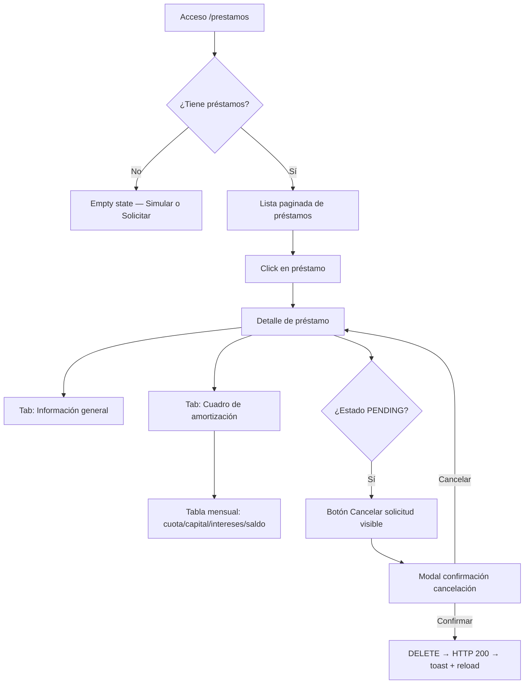
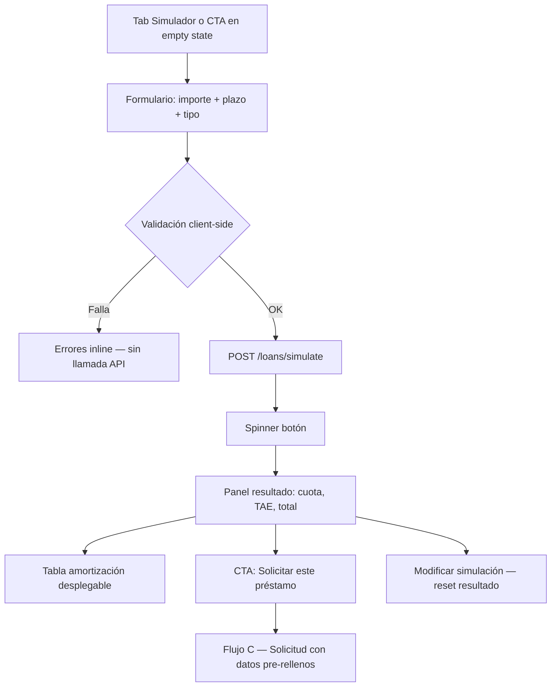
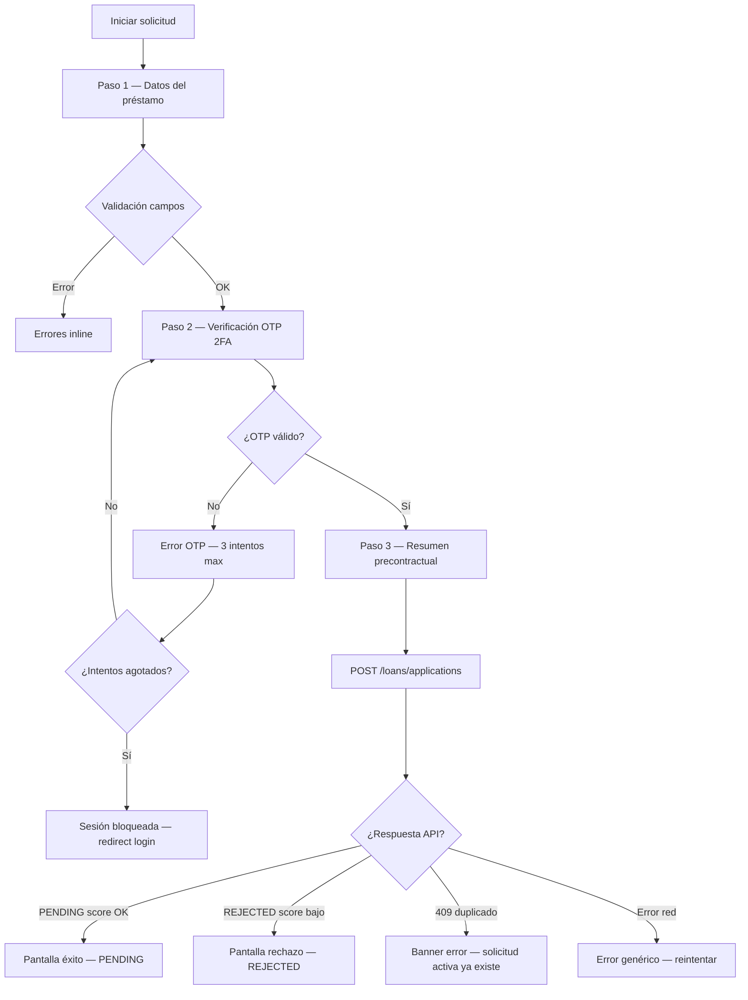

# UX/UI Design — FEAT-020 Gestión de Préstamos Personales · Sprint 22
**Versión:** 1.0  
**Fecha:** 2026-04-02  
**Agente:** UX/UI Designer Agent v2.0  
**Sprint:** 22 | **Feature:** FEAT-020  
**Prototipo:** docs/ux-ui/prototypes/PROTO-FEAT-020-sprint22.html  
**Estado:** PENDIENTE APROBACIÓN PO/TL  
**SOFIA:** v2.6

---

## 1. Resumen de Diseño

FEAT-020 introduce el módulo completo de **Gestión de Préstamos Personales** en BankPortal para Banco Meridian. Es el primer módulo de crédito al consumo, regulado por la **Ley 16/2011** y la **Directiva 2008/48/CE**.

El módulo cubre tres grandes flujos:
- **Consulta** — listado y detalle de préstamos activos con cuadro de amortización
- **Simulación** — cálculo stateless (método francés, TAE, BigDecimal) sin persistencia
- **Solicitud** — flujo de 3 pasos con validación OTP 2FA y pre-scoring automático

Adicionalmente se resuelven deudas técnicas DEBT-043 (endpoints perfil) y DEBT-036/037 (audit log + regex PAN).

Ruta base Angular: `/prestamos`

---

## 2. Actores y Contexto de Uso

| Actor | Rol | Contexto |
|-------|-----|----------|
| Cliente Banco Meridian | Usuario final | SPA Angular, móvil o escritorio, sesión autenticada con JWT + 2FA activo |
| Sistema pre-scoring | CoreBanking mock (STG) | API interna — score automático basado en hash(userId) |
| OTP Service | Validación 2FA | Usado en solicitud de préstamo (RN-F020-09) |

**Contexto crítico:**  
- El usuario opera con datos financieros reales — feedback de errores debe ser claro y no alarmante  
- Préstamos implican compromiso económico: flujo de solicitud debe incluir resumen precontractual (Ley 16/2011 Art.10)  
- Simulación es libre y sin consecuencias — promover uso exploratorio

---

## 3. User Flows

### Flujo A — Consulta de préstamos



### Flujo B — Simulador de préstamo



### Flujo C — Solicitud de préstamo (3 pasos + OTP)



---

## 4. Arquitectura de Información

```
/prestamos                          → LoanListComponent (lista + tabs)
  /prestamos/simular                → LoanSimulatorComponent
  /prestamos/:id                    → LoanDetailComponent
    /prestamos/:id/amortizacion     → AmortizationTableComponent (sub-ruta o tab)
  /prestamos/solicitar              → LoanApplicationFormComponent (stepper)
  /prestamos/solicitar/:id/estado   → LoanApplicationStatusComponent
```

**Guardrails aplicados:**
- LA-FRONT-001: ruta + nav item en shell obligatorio antes de G-4
- LA-FRONT-004: todos los endpoints backend verificados antes de registrar ruta
- LA-STG-001: catchError → `of([])` nunca EMPTY en forkJoin

---

## 5. Wireframes por Pantalla

### 5.1 Lista de préstamos (`/prestamos`)

```
┌──────────────────────────────────────────────────────────────────┐
│  BankPortal                                       👤 Juan García  │
│  ── ── ── ── ── ── ── ── ── ── ── ── ── ── ── ──                 │
├──────────────────────────────────────────────────────────────────┤
│  SIDEBAR       │  ◀ Inicio › Préstamos                           │
│  📊 Dashboard  │                                                  │
│  💰 Cuentas    │  Mis Préstamos                    [+ Solicitar]  │
│  💸 Transfer.  │                                                  │
│  🏦 Préstamos ←│  ┌─ Filtros ─────────────────────────────────┐  │
│  💳 Tarjetas   │  │ [Todos ✓] [Activos] [Pendientes] [Otros]  │  │
│                │  └───────────────────────────────────────────┘  │
│                │                                                  │
│                │  ┌────────────────────────────────────────────┐ │
│                │  │ CONCEPTO       │ IMPORTE   │ ESTADO │  ···  │ │
│                │  ├────────────────────────────────────────────┤ │
│                │  │ Préstamo       │ 12.000 €  │ ACTIVO │  →   │ │
│                │  │ personal 2025  │ 487,30/ms │        │      │ │
│                │  ├────────────────────────────────────────────┤ │
│                │  │ Reforma cocina │  8.500 €  │ ACTIVO │  →   │ │
│                │  │ 2024           │ 352,10/ms │        │      │ │
│                │  ├────────────────────────────────────────────┤ │
│                │  │ Vehículo 2023  │ 15.000 €  │ PAID_  │  →   │ │
│                │  │                │ Amortizado│ OFF    │      │ │
│                │  └────────────────────────────────────────────┘ │
│                │                                                  │
│                │  [CTA secundario: 🧮 Simular un préstamo]        │
└──────────────────────────────────────────────────────────────────┘
NOTA: Cuota mensual visible en listado — dato clave para el usuario
NOTA: PAID_OFF con badge neutral — no genera acción
```

### 5.2 Simulador (`/prestamos/simular`)

```
┌──────────────────────────────────────────────────────────────────┐
│  Simulador de Préstamo                                           │
│  ── ── ── ── ── ── ── ── ── ── ── ── ── ── ── ── ── ── ── ──    │
│                                                                  │
│  ┌── Parámetros ─────────────────┐ ┌── Resultado ─────────────┐ │
│  │                               │ │                          │ │
│  │  Importe del préstamo *       │ │  💰 Cuota mensual        │ │
│  │  [  12.000  ] EUR             │ │  487,30 €                │ │
│  │  1.000 – 60.000               │ │                          │ │
│  │                               │ │  📊 TAE                  │ │
│  │  Plazo *                      │ │  6,95%                   │ │
│  │  [  36  ] meses               │ │                          │ │
│  │  12 – 84 meses                │ │  🏦 Coste total          │ │
│  │                               │ │  17.542,80 €             │ │
│  │  Finalidad (orientativa)      │ │                          │ │
│  │  [Selecciona ▾]               │ │  📋 Intereses totales    │ │
│  │                               │ │  5.542,80 €              │ │
│  │  [🧮 Calcular simulación]     │ │                          │ │
│  │                               │ │  [Ver cuadro amort. ▾]  │ │
│  └───────────────────────────────┘ │  [Solicitar préstamo →]  │ │
│                                    └──────────────────────────┘ │
│  ⚠ Información precontractual Ley 16/2011 (Directiva 2008/48)   │
│  Esta simulación es orientativa. Las condiciones finales...      │
└──────────────────────────────────────────────────────────────────┘
NOTA: Resultado aparece inline sin page-reload — UX fluida
NOTA: Información precontractual SIEMPRE visible (Ley 16/2011 Art.10)
```

### 5.3 Solicitud — Paso 1 Datos

```
┌──────────────────────────────────────────────────────────────────┐
│  Nueva Solicitud de Préstamo                                     │
│                                                                  │
│  [1. Datos] ──────── [2. Verificación] ──────── [3. Confirmar]  │
│      ●                       ○                         ○         │
│                                                                  │
│  ┌── Datos del préstamo ──────────────────────────────────────┐  │
│  │  Importe solicitado *                                      │  │
│  │  [___________] EUR  (1.000 – 60.000 EUR)                  │  │
│  │                                                            │  │
│  │  Plazo de devolución *                                     │  │
│  │  [___] meses  (12 – 84 meses)                             │  │
│  │                                                            │  │
│  │  Finalidad *                                               │  │
│  │  ○ CONSUMO  ○ VEHÍCULO  ○ REFORMA  ○ OTROS                │  │
│  │                                                            │  │
│  │  ⚠ Información precontractual obligatoria (Ley 16/2011)   │  │
│  │  □ He leído y acepto la información precontractual         │  │
│  └────────────────────────────────────────────────────────────┘  │
│                                                                  │
│           [Cancelar]                    [Continuar →]            │
└──────────────────────────────────────────────────────────────────┘
```

### 5.4 Solicitud — Paso 2 OTP 2FA

```
┌──────────────────────────────────────────────────────────────────┐
│  Nueva Solicitud de Préstamo                                     │
│                                                                  │
│  [1. Datos ✓] ──── [2. Verificación] ──────── [3. Confirmar]   │
│        ✓                    ●                         ○          │
│                                                                  │
│  ┌─────────────────────────────────────────────────────────────┐ │
│  │  🔐 Verificación de identidad requerida                     │ │
│  │                                                             │ │
│  │  Para solicitar un préstamo necesitamos verificar           │ │
│  │  tu identidad con el código OTP de tu aplicación            │ │
│  │  de autenticación.                                          │ │
│  │                                                             │ │
│  │  Código OTP *                                               │ │
│  │  ┌───┐ ┌───┐ ┌───┐ ┌───┐ ┌───┐ ┌───┐                      │ │
│  │  │   │ │   │ │   │ │   │ │   │ │   │    ← 6 dígitos        │ │
│  │  └───┘ └───┘ └───┘ └───┘ └───┘ └───┘                      │ │
│  │                                                             │ │
│  │  El código expira en: 00:28                                 │ │
│  │                                                             │ │
│  └─────────────────────────────────────────────────────────────┘ │
│                                                                  │
│           [← Volver]                   [Verificar →]            │
└──────────────────────────────────────────────────────────────────┘
NOTA: 6 inputs separados — UX de OTP estándar, auto-focus al siguiente
NOTA: Countdown visible — genera urgencia positiva sin alarmar
```

### 5.5 Solicitud — Paso 3 Resumen precontractual

```
┌──────────────────────────────────────────────────────────────────┐
│  Nueva Solicitud de Préstamo                                     │
│  [1. Datos ✓] ── [2. Verificación ✓] ── [3. Confirmar]         │
│                                                  ●               │
│  ┌── Resumen de la solicitud ──────────────────────────────────┐ │
│  │  Importe             12.000,00 EUR                          │ │
│  │  Plazo               36 meses                               │ │
│  │  Finalidad           REFORMA                                │ │
│  │  Cuota estimada      487,30 EUR/mes                         │ │
│  │  TAE estimada        6,95%                                  │ │
│  │  Coste total         17.542,80 EUR                          │ │
│  └─────────────────────────────────────────────────────────────┘ │
│                                                                  │
│  ⚠ INFORMACIÓN PRECONTRACTUAL (Ley 16/2011 / Dir. 2008/48/CE)  │
│  Las condiciones finales estarán sujetas a la valoración        │
│  crediticia. Esta solicitud no implica concesión automática.    │
│                                                                  │
│  □ Confirmo haber leído la información precontractual           │
│    y acepto enviar esta solicitud para valoración.              │
│                                                                  │
│         [← Modificar]              [Enviar solicitud →]         │
└──────────────────────────────────────────────────────────────────┘
```

---

## 6. Inventario de Componentes Angular

| Componente | Tipo | Módulo | Notas |
|---|---|---|---|
| `LoanListComponent` | Smart | loans | NgRx selector, lazy, catchError→`of([])` |
| `LoanCardComponent` | Presentational | loans | @Input: loan: LoanSummaryDTO |
| `LoanDetailComponent` | Smart | loans | Tabs: info + amortización |
| `LoanSimulatorComponent` | Smart | loans | ReactiveForm, result panel inline |
| `AmortizationTableComponent` | Presentational | loans | @Input: schedule: AmortizationRow[] |
| `LoanApplicationFormComponent` | Smart | loans | Stepper 3 pasos |
| `OtpInputComponent` | Shared/Reuse | shared | 6 inputs separados, autoadvance |
| `LoanApplicationStatusComponent` | Presentational | loans | Muestra PENDING/REJECTED |
| `LoanCancelDialogComponent` | Overlay | loans | mat-dialog reutilizable |
| `PrecontractualInfoComponent` | Presentational | loans | Texto Ley 16/2011 siempre visible |

---

## 7. Especificaciones de Formularios

### Simulador

| Campo | Tipo | Validación | Error message |
|---|---|---|---|
| importe | number | min 1000, max 60000, required | "El importe debe estar entre 1.000 y 60.000 EUR" |
| plazo | number | min 12, max 84, required | "El plazo debe estar entre 12 y 84 meses" |
| finalidad | select | enum(CONSUMO/VEHICULO/REFORMA/OTROS) | "Selecciona una finalidad" |

### Solicitud (Paso 1)

| Campo | Tipo | Validación | Error message |
|---|---|---|---|
| importe | number | min 1000, max 60000, required | "Importe fuera de rango" |
| plazo | number | min 12, max 84, required | "Plazo no válido" |
| finalidad | radio | required | "Selecciona la finalidad" |
| aceptaPrecontractual | checkbox | mustBeTrue | "Debes aceptar la información precontractual" |

### Solicitud (Paso 2 OTP)

| Campo | Tipo | Validación | Error message |
|---|---|---|---|
| otp | string[6] | pattern /^\d{6}$/, required | "Código OTP de 6 dígitos requerido" |

---

## 8. Design Tokens

Heredados del Design System Banco Meridian. Tokens específicos FEAT-020:

```scss
// Préstamos — colores de estado
--loan-active:     var(--color-success);
--loan-pending:    var(--color-warning);
--loan-rejected:   var(--color-error);
--loan-paid-off:   var(--color-text-disabled);
--loan-cancelled:  var(--color-text-disabled);

// Simulador — énfasis resultado
--simulator-cuota-font-size: var(--text-3xl);
--simulator-cuota-color:     var(--color-primary);
--simulator-panel-bg:        var(--color-primary-light);
```

---

## 9. Accesibilidad WCAG 2.1 AA

```
[✓] Contraste de color ≥ 4.5:1 — texto sobre fondos primarios verificado
[✓] Navegación por teclado — OTP inputs con autoadvance preserva tab order
[✓] aria-label en iconos de acción (Ver detalle, Cancelar)
[✓] aria-describedby en campos con hints (importe, plazo)
[✓] Formularios — label asociado a cada input
[✓] Errores inline — role="alert" en mensajes de validación
[✓] Botones descriptivos — "Solicitar préstamo", no "Enviar"
[✓] Tablas — scope="col" en headers del cuadro de amortización
[✓] Modal cancelación — focus trap + Escape para cerrar
[✓] Spinner OTP — aria-busy="true" durante verificación
[✓] OTP inputs — aria-label="Dígito N de 6"
[✓] Countdown OTP — aria-live="polite" para actualización periódica
```

---

## 10. Microinteracciones y Feedback Visual

| Acción | Feedback | Duración | Componente |
|---|---|---|---|
| Calcular simulación | Spinner + disable botón | Hasta respuesta API | ButtonSpinnerDirective |
| Resultado simulador | Slide-in panel resultado | 300ms ease | CSS transition |
| Desplegar amortización | Accordion expand | 200ms | MatExpansionPanel |
| Submit OTP | 6 inputs → pulse animación | Durante verificación | Custom animation |
| Solicitud enviada | Toast verde + redirect | 4000ms | MatSnackBar |
| Solicitud rechazada | Panel rojo explicativo | Manual dismiss | AlertBannerComponent |
| Solicitud duplicada | Banner warning | Manual dismiss | AlertBannerComponent |
| Cancelar préstamo | Dialog confirmación | — | ConfirmDialogService |
| Cancelación OK | Toast verde + badge updated | 4000ms | MatSnackBar |

---

## 11. Responsive Design

| Breakpoint | Adaptación FEAT-020 |
|---|---|
| Mobile < 480px | Simulador: formulario y resultado en columna única. Lista: cards verticales. Stepper: compacto |
| Tablet 480-768px | Grid 2 cols en simulador. Lista con tabla truncada. |
| Desktop 768px+ | Layout completo. Tabla amortización con todas las columnas |

---

## 12. Prototipo Visual

**Ruta:** `docs/ux-ui/prototypes/PROTO-FEAT-020-sprint22.html`

**Pantallas incluidas:**
1. 📋 Lista de préstamos (con datos)
2. 📭 Lista vacía — empty state
3. ⏳ Cargando — skeleton loader
4. 👁 Detalle de préstamo + cuadro de amortización
5. 🧮 Simulador — formulario + resultado
6. 📝 Solicitud Paso 1 — Datos
7. 🔐 Solicitud Paso 2 — OTP 2FA
8. ✅ Solicitud Paso 3 — Resumen precontractual
9. 🎉 Éxito — PENDING
10. ❌ Rechazo — REJECTED
11. 💥 Error genérico

**Flujos navegables:**
- Lista → Detalle → (Amortización tab)
- Lista → Solicitar → Paso 1 → Paso 2 OTP → Paso 3 → Éxito/Rechazo
- Lista → Simular → Resultado → Solicitar (con datos pre-rellenos)
- Detalle → Cancelar → Dialog → Confirmado

---

## 13. Criterios de Aceptación UX

| US | Criterio | Verificación QA |
|---|---|---|
| FA-020-A | Lista paginada, filtros por estado, click a detalle | Test TC-UX-001 |
| FA-020-B | Simulación calcula sin persistir, resultado inline, TAE visible | Test TC-UX-002 |
| FA-020-C | Stepper 3 pasos, OTP input 6 dígitos, resumen precontractual | Test TC-UX-003 |
| FA-020-D | Cuadro amortización con 36 filas para 36 meses, scroll horizontal móvil | Test TC-UX-004 |
| FA-020-E | Modal de cancelación con texto descriptivo, solo visible en PENDING | Test TC-UX-005 |
| FA-020-F | Ruta /prestamos en nav, lazy loading, no 404 en F5 | Test TC-UX-006 |
| FA-DEBT043-A | Mi Perfil muestra [] en notificaciones y sesiones — sin spinner infinito | Test TC-UX-007 |

---

## 14. Notas para Implementación Angular

- `OtpInputComponent` puede reutilizarse de FEAT-019 — verificar si existe en `shared/`
- `AmortizationTableComponent` — `@Input() schedule: AmortizationRow[]`, `trackBy: rowId`
- Simulador usa `distinctUntilChanged` + `debounceTime(300)` en valueChanges para no disparar API en cada tecla
- Stepper usa `MatStepperModule` con `[linear]="true"` — no se puede avanzar sin validar el paso
- OTP countdown implementado con `interval(1000)` + `takeUntil(destroyed$)` — sin memory leak
- `forkJoin` para cargar detalle: `[getLoan(id), getAmortization(id)]` — ambos con `catchError(of(null))` (LA-STG-001)

---

*UX/UI Designer Agent v2.0 · SOFIA v2.6 · BankPortal — Banco Meridian · Sprint 22 · 2026-04-02*
